<style>

.center2 {
  margin: 0;
  position: absolute;
  top: 50%;
  left: 50%;
  -ms-transform: translate(-50%, -50%);
  transform: translate(-50%, -50%);
}

</style>


```{r setup, include = FALSE}
knitr::opts_chunk$set(echo = FALSE)
knitr::opts_chunk$set(out.width = "90%")
knitr::opts_chunk$set(fig.align="center")

options(htmltools.dir.version = FALSE)
library(knitr)
library(tidyverse)
library(xaringanExtra)
# set default options
opts_chunk$set(echo=FALSE,
               collapse = TRUE,
               fig.width = 7.252,
               fig.height = 4,
               dpi = 300)
# set engines
knitr::knit_engines$set("markdown")
xaringanExtra::use_tile_view()
xaringanExtra::use_panelset()
xaringanExtra::use_clipboard()
xaringanExtra::use_webcam()
xaringanExtra::use_broadcast()
xaringanExtra::use_share_again()
xaringanExtra::style_share_again(
  share_buttons = c("twitter", "linkedin", "pocket")
)
# uncomment the following lines if you want to use the NHS-R theme colours by default
# scale_fill_continuous <- partial(scale_fill_nhs, discrete = FALSE)
# scale_fill_discrete <- partial(scale_fill_nhs, discrete = TRUE)
# scale_colour_continuous <- partial(scale_colour_nhs, discrete = FALSE)
# scale_colour_discrete <- partial(scale_colour_nhs, discrete = TRUE)
```


.center2[
# Welcome!
]

---

.center2[
## What should economists study?

https://wall.sli.do/event/tYh8HGjPV7CKM2XYsoR9k8?section=1d23013c-6b4f-4cbb-96f8-2bd0407249a5
]


---
## Presentation: Guillermo (Billy) Woo-Mora 

--

.left-column[
- Mexican 🇲🇽
- 5th year PhD candidate at PSE
- Research interests:
  - Political economy of development
  - Historical economics
  - Social/Cultural economics
]

--

.right-column[
**Durable or persistent inequalities**:
Long-term impacts of segregation policies

```{r, out.width="65%"}
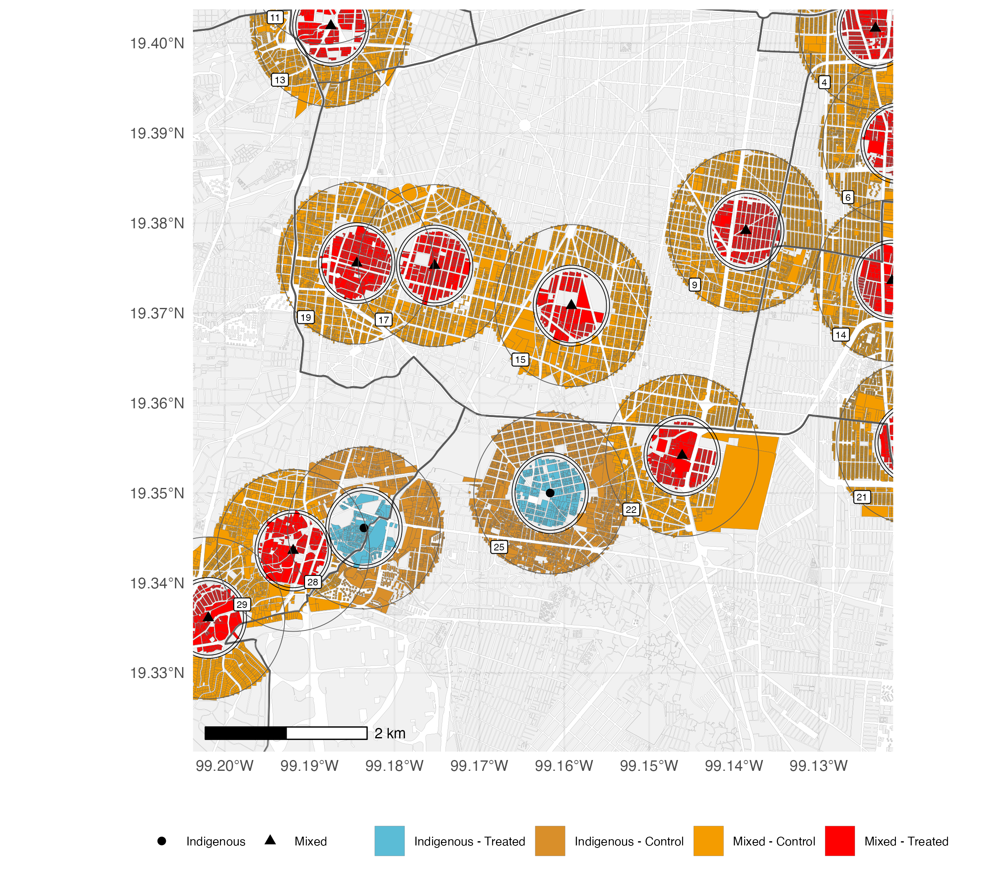
```

]

---
## Presentation: Guillermo (Billy) Woo-Mora 

.left-column[
- Mexican 🇲🇽
- 5th year PhD candidate at PSE
- Research interests:
  - Political economy of development
  - Historical economics
  - Social/Cultural economics
]

.right-column[
**Durable or persistent inequalities**:
Long-term impacts of segregation policies

```{r, out.width="90%"}
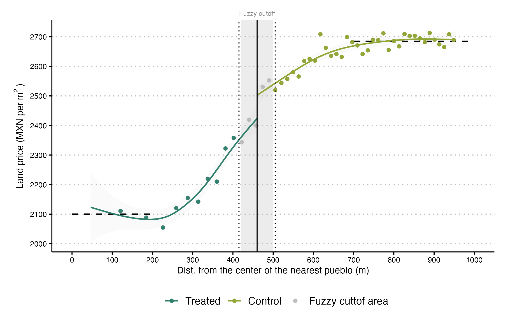
```

]

---
## Presentation: Guillermo (Billy) Woo-Mora 

.left-column[
- Mexican 🇲🇽
- 5th year PhD candidate at PSE
- Research interests:
  - Political economy of development
  - Historical economics
  - Social/Cultural economics
]

.right-column[
**Durable or persistent inequalities**:
Skin tone disparities and discrimination 

```{r, out.width="80%"}
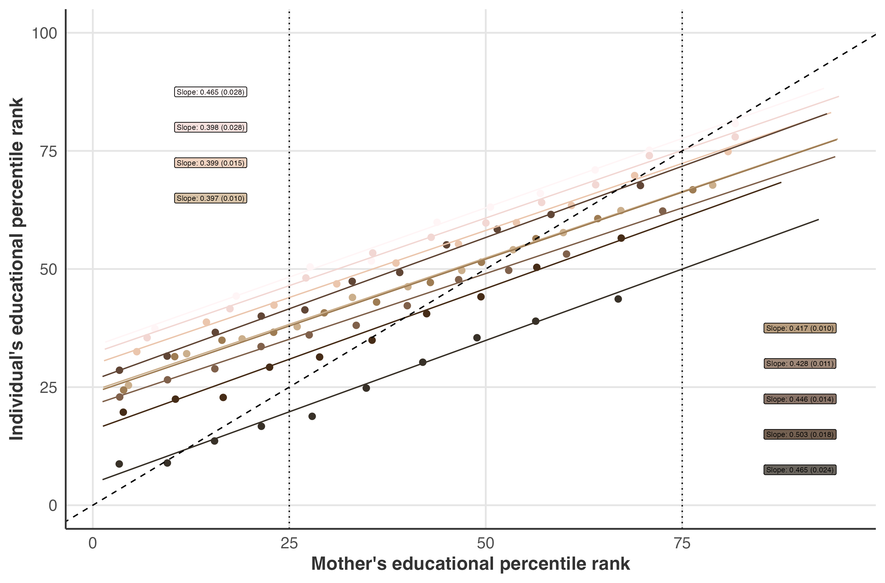
```

]


---
## Presentation: Guillermo (Billy) Woo-Mora 

.left-column[
- Mexican 🇲🇽
- 5th year PhD candidate at PSE
- Research interests:
  - Political economy of development
  - Historical economics
  - Social/Cultural economics
]


.right-column[
**Political economy of populism**: Economic effects of populist policies and leaders

```{r, out.width="90%"}
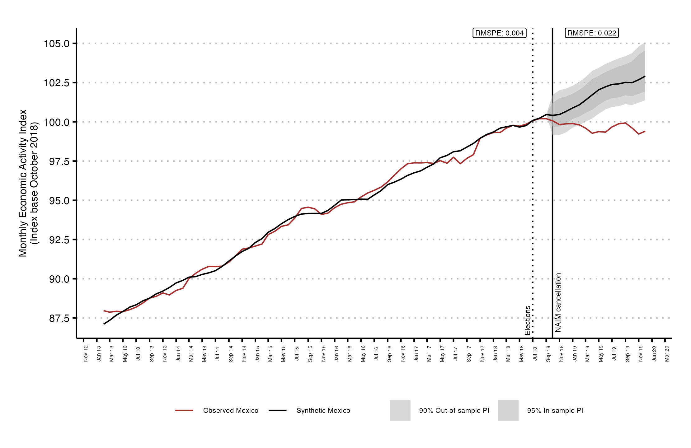
```

]


---

.center2[
## Presentation: Your turn

1) Name (Nickname or how would you like to be called)

2) Where are you from?

3) Why studying SMD? 

]


---
.center2[
# What kind of world are we living in? 
]

---

```{r}
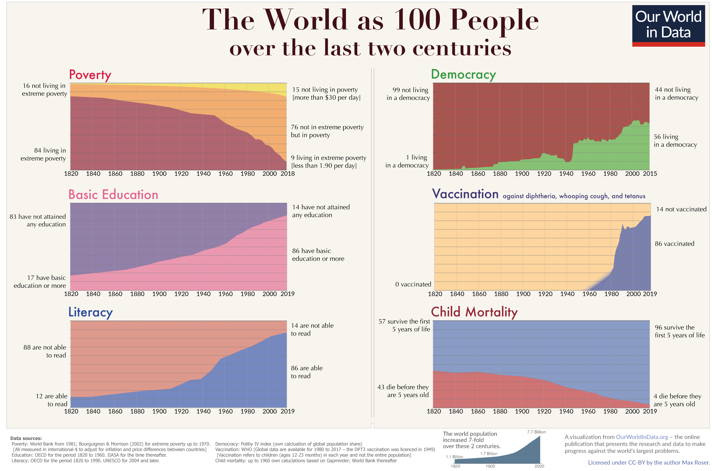
```

---
```{r, out.width="60%"}
knitr::include_graphics("imgs/economix.png")
```

---

```{r, out.width="80%"}
knitr::include_graphics("https://www.simplypsychology.org/wp-content/uploads/Capitalism.jpg")
```

---
.center2[
# What is economics?
]

---
## Economics: 
--
The dismal science

--

Misunderstandings and (really) bad communication:
--

> *"Neoclassical economics has become an unquestioned belief system and treats anybody who challenges the creed of self-righting markets and rational consumers as dangerous heretics"* 

--

> *"Complex mathematics is used to mystify economics, just as congregations in Luther’s time were deliberately left in the dark by services conducted in Latin."*
    
--

> **Responsible of 2008 Great Recession**.
    
--

```{r out.width="20%"}
knitr::include_graphics("https://media.giphy.com/media/l3q2K5jinAlChoCLS/giphy.gif")
```

---

.center[
### Econ 101 textbooks (parenthesis)
]

```{r out.width="40%", fig.align='center'}
knitr::include_graphics("https://m.media-amazon.com/images/I/81UPJjLHp8L.jpg")
```

---

.center[
### Econ 101 textbooks (parenthesis)
]

```{r out.width="80%", fig.align='center'}
knitr::include_graphics("https://cdn.vox-cdn.com/thumbor/ikZAG7js3wyxMZ6CSL2KbwkZcNY=/0x0:775x416/1720x0/filters:focal(0x0:775x416):format(webp):no_upscale()/cdn.vox-cdn.com/uploads/chorus_asset/file/16204569/Screenshot_2019_05_01_11.56.59.png")
```


---
## Defending the dismal science 

--
OK. Economist can be quite arrogant (sometimes we are nice). But...

--

.pull-left[

> *"The economy did not die, and a Great Depression was avoided, in no small part due to the advances of economics over many decades"* (Ricardo Reis)


> *"The London Tube map is not realistic and makes absurd assumptions. [...] is useful precisely because it abstracts from unnecessary details to show you the way. This is what economic models are for, they help us to find our way through complex data in a complex world."* (Oriana Bandiera et al)

]

--

.pull-right[

```{r out.width="100%", fig.align='center'}
knitr::include_graphics("imgs/tube-map.gif")
```

]

---
## Defending the dismal science 

--

> *"Economics' recent empirical bent makes it more difficult to idolize markets because it makes it more difficult to ignore inconvenient facts."* (Dani Rodrik, Suresh Naidu  and Gabriel Zucman)

--

.pull-left[
```{r out.width="100%", fig.align='center'}
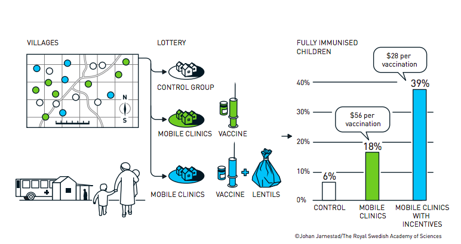
```

2019 Nobel Econ Prize: Abhijit Banerjee, Esther Duflo and Michael Kremer

*“for their experimental approach to alleviating global poverty”*
]

--

.pull-right[
```{r out.width="85%", fig.align='center'}
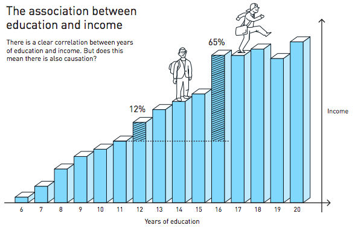
```

2021 Nobel Econ Prize: David Card, Joshua D. Angrist and Guido W. Imbens

*“for their empirical contributions to labour economics/the analysis of causal relationships”*

]


---
## Defending the dismal science 

> *"Economics' recent empirical bent makes it more difficult to idolize markets because it makes it more difficult to ignore inconvenient facts."* (Dani Rodrik, Suresh Naidu  and Gabriel Zucman)

.pull-left[
```{r out.width="100%", fig.align='center'}
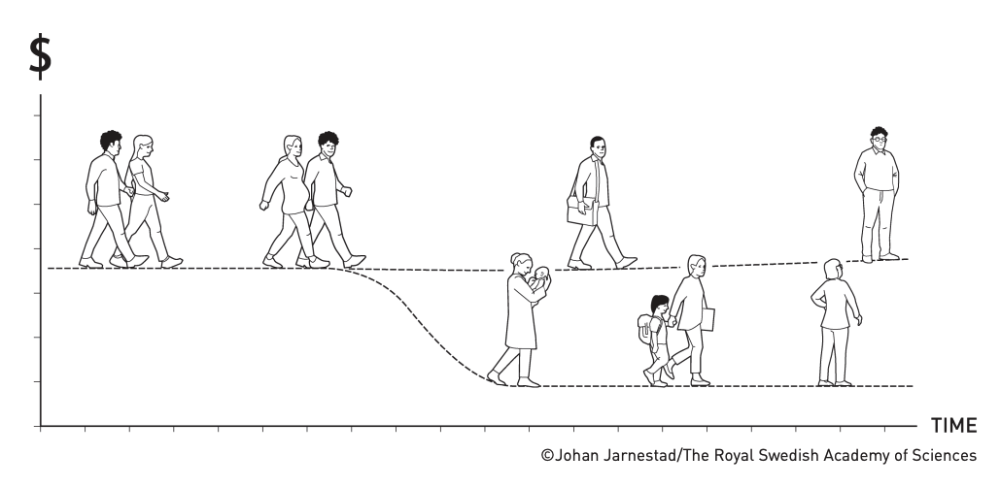
```

2023 Nobel Econ Prize: Claudia Goldin

*“for having advanced our understanding of women’s labour market outcomes”*
]

.pull-right[
```{r out.width="100%", fig.align='center'}
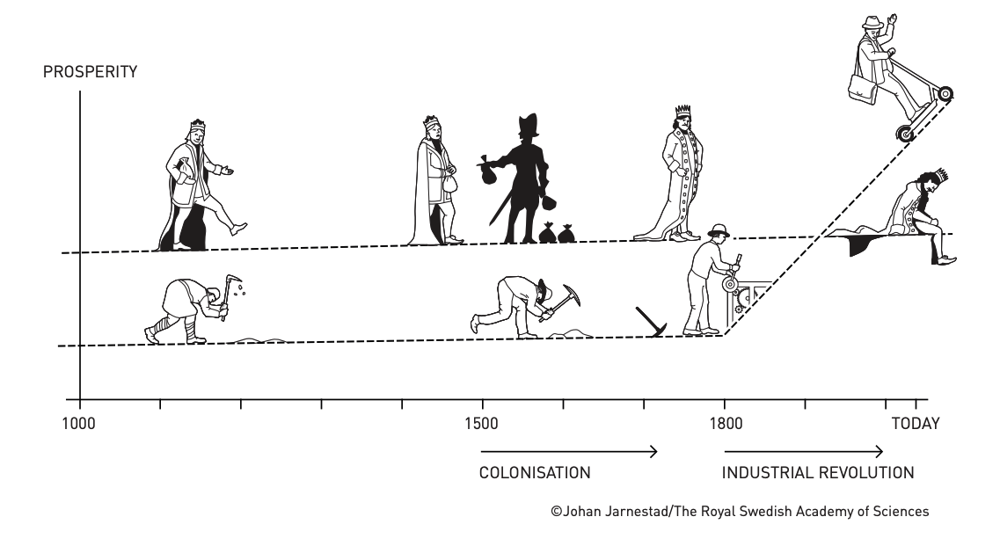
```

2024 Nobel Econ Prize: Daron Acemoglu, Simon Johnson and James A. Robinson

*“for studies of how institutions are formed and affect prosperity”*

]

---
.center[
### Econ 101 textbooks (parenthesis)
]

- [*A new paradigm for the introductory course in economics*](https://cepr.org/voxeu/columns/new-paradigm-introductory-course-economics)
- [*The radical plan to change how Harvard teaches economics*](https://www.vox.com/the-highlight/2019/5/14/18520783/harvard-economics-chetty)

.pull-left[
```{r out.width="100%", fig.align='center'}
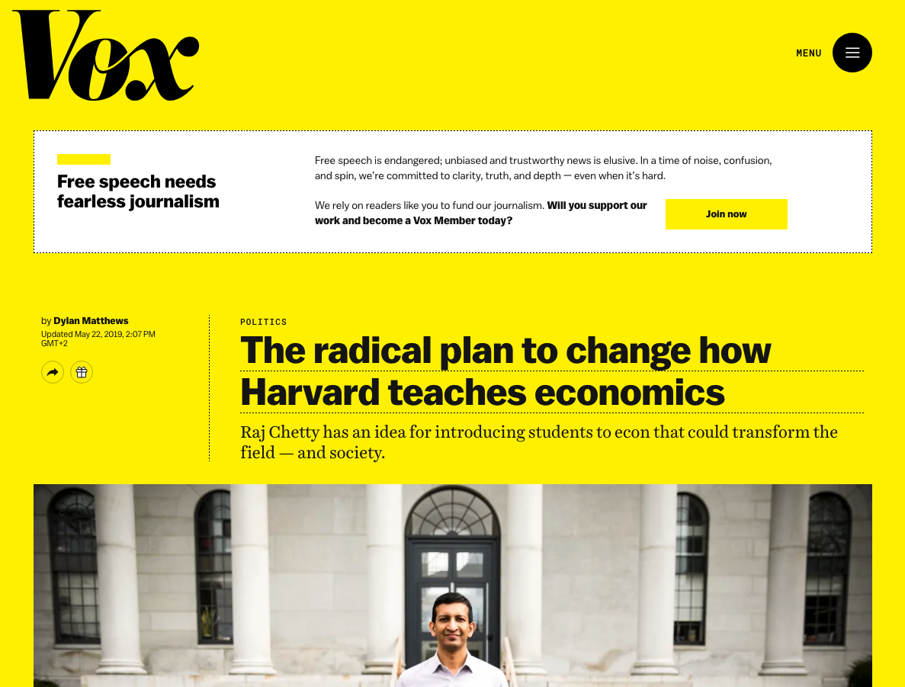
```
]

.pull-right[
<iframe data-testid="embed-iframe" style="border-radius:12px" src="https://open.spotify.com/embed/episode/5nEJzwWTstPOLGsEsjHMsJ?utm_source=generator" width="80%" height="352" frameBorder="0" allowfullscreen="" allow="autoplay; clipboard-write; encrypted-media; fullscreen; picture-in-picture" loading="lazy"></iframe>
]

---
.center[
## What is Economics?
]

--

.center2[

#### Economics:

> *The study of how people interact with each other and with their natural surroundings in producing their livelihoods, and how this changes over time*

]

---
.center[
## What is Economics?
]

- **How we come to acquire the things that make up our livelihood**: Things like food, clothing, shelter, or free time.

- **How we interact with each other**: Either as buyers and sellers, employees or employers, citizens and public officials, parents, children and other family members.

- **How we interact with our natural environment**: From breathing, to extracting raw materials from the earth.

- **How each of these changes over time.**


```{r out.width="60%"}
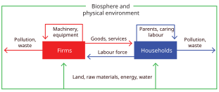
```


---
.center2[
```{r, out.width="150%"}

```
]

---
.center2[
```{r, out.width="150%"}

```
]

---
.center2[
```{r, out.width="150%"}
knitr::include_graphics("imgs/montorgueil3.png")
```
]

---
```{r, out.width="57%"}
knitr::include_graphics("imgs/montorgueil.jpeg")
```

*La Rue Montorgueil, à Paris. Fête du 30 juin 1878*. Claude Monet.

---
.center[
## (Philosophical note)
]

  - Everyone has their political or economic ideals!
    - Even economist. We are humans and social beings.
    - We can agree on a benchmark or minumum of acceptable ideas (i.e. as long as they respect human rights)

.center[
### What is $\neq$ What is ought to be
*John Neville Keynes*
]

--

.center[
### La historia, como la lucha entre el bien y el mal en la que, por definición, los buenos somos nosotros
*Mauricio Tenorio Trillo*
]

--

  - Difficult to argue on *scientific neutrality*. 
  We should advance towards accepting both the rigorous evidence that we like and dislike.

---
.center[
## This class
]

--

  - What we are going to do in this (and the following) classes?
  
--

  - **Learn a toolkit**: Study concepts and models used to understand strategic choices among alternatives and social interactions both within and outside markets.

--

  - Ideally: See how economics is useful to provide answers to real world situations.

--

  - **Spoiler**: We will only have a better understanding. Unfortunately, we would not be able to fully know what happen, is happening, or will happen. But that's because there is uncertainty and we are humans 

--

```{r, out.width="60%"}
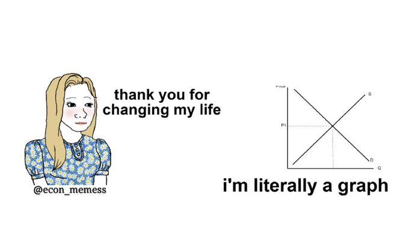

```

---
.center[
## Example: Is degrowth the answer?
]

```{r, out.width="70%"}
knitr::include_graphics("https://caracoldsa.org/wp-content/uploads/2023/07/degrowth-graphic.jpeg?w=1024")
```

.center[
### [The illusion of “degrowth” in a poor and unequal world](https://degrowth.info/library/the-illusion-of-degrowth-in-a-poor-and-unequal-world)
]


---
.center[
## Example: How do we adress inequalities?
]

.center[
<iframe width="850" height="500" src="https://www.youtube.com/embed/hnfHbKUnVk8?si=RFrq1iTH44dcbWdb" title="YouTube video player" frameborder="0" allow="accelerometer; autoplay; clipboard-write; encrypted-media; gyroscope; picture-in-picture; web-share" referrerpolicy="strict-origin-when-cross-origin" allowfullscreen></iframe>
]


---
.center2[
# Course structure
]

---
.center[
## Course structure
]

--

Weekly lectures with **active participation**. The student must **read in advance** each weeks *The Economy 2.0: Microeconomics* weekly unit.

--

📆 [Google calendar with course's dates](https://calendar.google.com/calendar/embed?src=c298fa4658bd9f1d5bc680e5f1fac0607e6d82f7d931814aec904b8a3dfc1fe8%40group.calendar.google.com&ctz=Europe%2FParis)

📄 [Syllabus with content by date](https://www.dropbox.com/scl/fi/f2kcmkimvc5b4gstc0nb8/PSL-2025-CORE-Econ-Micro.pdf?rlkey=m9mpy6wfm0a2hds9g8hvnpkss&dl=0)

💻 Course website: https://github.com/woomora/CORE-econ-micro

The schedule is tentative and subject to change. 
**Please check the most recent version of the syllabus.**

---

.center[
## Teaching economics as if the last three decades had happened
]


```{r out.width="35%"}
knitr::include_graphics("https://www.core-econ.org/wp-content/uploads/2023/10/microeconomics-cover-homepage.jpeg")
```

.center[
The CORE team, *The Economy 2.0: Microeconomics*, 2024. https://www.core-econ.org.
]

---

.center[
## Extra (suggested) material
]

.pull-left[

### Podcasts

  - General:
    - [Freakonomics Radio](https://open.spotify.com/show/6z4NLXyHPga1UmSJsPK7G1?si=2a9641bd109f402b)
    - [Economics Explained](https://open.spotify.com/show/5TFVUEJnYLOCmmfaDNHaM2?si=60f9e8053a024058)
    - [Planet Money](https://open.spotify.com/show/4FYpq3lSeQMAhqNI81O0Cn?si=a09ee5eca2a6436e)
    - [Cautionary Tales](https://open.spotify.com/show/2yPlb6ynbhTJbziSIcykQd?si=7efe7e1fd5ce4a7d)
  - Focus on economics research:
    - [InequaliTalks](https://open.spotify.com/show/7Diyergn3YLhfzpMV0WBlC?si=9c9ac07da6bf434f)
    - [VoxTalks Economics](https://open.spotify.com/show/4Gd9SbiUPhJWazNszp9izA?si=66845c06707548f6)

]

.pull-right[
### Magazines and articles

  - Magazines/Journals:
    - [The Economist](https://www.economist.com/)
    - [Financial Times](https://www.ft.com/)
    - [Project Syndicate](https://www.project-syndicate.org/)
  - Research sites:
    - [VoxEU](https://cepr.org/voxeu)
    - [VoxDev](https://voxdev.org/)
  - Blogs:
    - [Noahpinion](https://noahpinion.substack.com/)
    - [Some Unpleasant Arithmetic](https://someunpleasant.substack.com/p/out-of-control)
  

]

By the end of the semester, I can recommend some books that might interest you.

---
.center[
## Course structure
]


.center[
Need to **read**, **participate**, and **work by your own**
]


--

.pull-left[
- [Unit 1: Prosperity, inequality, and planetary limits](https://books.core-econ.org/the-economy/microeconomics/01-prosperity-inequality-01-ibn-battuta.html) (07/10/2025)
- [Unit 2: Technology and incentives](https://books.core-econ.org/the-economy/microeconomics/02-technology-incentives-01-kutesmart-tailoring.html) (14/10/2025)
- [Unit 3: Scarcity, wellbeing, and working hours](https://books.core-econ.org/the-economy/microeconomics/03-scarcity-wellbeing-01-work-fewer-hours.html) (21/10/2025)
- [Unit 4: Strategic interactions and social dilemmas](https://books.core-econ.org/the-economy/microeconomics/04-strategic-interactions-01-climate-negotiations.html) (04/11/2025)
- [Unit 5: The rules of the game: Who gets what and why](https://books.core-econ.org/the-economy/microeconomics/05-the-rules-of-the-game-01-pirate-economics.html) (14/11/2025)
- **Midterm (18/11/2025)**
- [Unit 6: The firm and its employees](https://books.core-econ.org/the-economy/microeconomics/06-firm-and-employees-01-exploding-tyres.html) (21/11/2025)
- [Unit 7: The firm and its customers](https://books.core-econ.org/the-economy/microeconomics/07-firm-and-customers-01-winning-brands.html) (25/11/2025)
- [Unit 8: Supply and demand: Markets with many buyers and sellers](https://books.core-econ.org/the-economy/microeconomics/08-supply-demand-01-american-civil-war.html) (02/12/2025)
- [Unit 9: Lenders and borrowers and differences in wealth](https://books.core-econ.org/the-economy/microeconomics/09-lenders-borrowers-01-chambar-moneylenders.html) (09/12/2025)
- [Unit 10: Market successes and failures: The societal effects of private decisions](https://books.core-econ.org/the-economy/microeconomics/10-market-successes-failures-01-bananas-fish-cancer.html) (16/12/2025)
- **Final exam (12/01/2026-16/01/2026)**
]

--

.pull-right[
```{r, out.width="65%"}
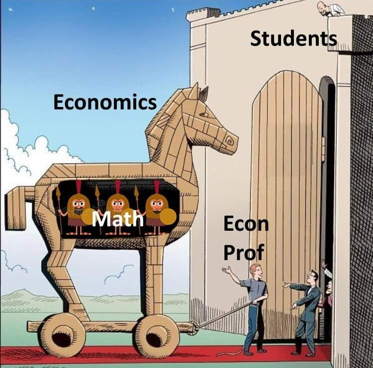
```
]


---
.center[
## Grading
]
--

**40% Midterm exam**: November 17–21, 2025

--

**45% Final exam**: January 12–16, 2026

--

**15% Class participation**

--

.center[
## Course Policies
]

- Respect your classmates and instructor. Harassment of any kind will not be tolerated.
- **No electronic devices (computers, cellphones, tablets) are allowed during lectures.** Want evidence? [Read this](https://www.nytimes.com/2017/11/22/business/laptops-not-during-lecture-or-meeting.html?rref=collection%2Fsectioncollection%2Fbusiness&action=click&contentCollection=business&region=rank&module=package&version=highlights&contentPlacement=12&pgtype=sectionfront).
- Academic integrity is mandatory. Cite all sources properly. **Cheating during exams or using ChatGPT as a substitute rather than a complement will result in strict penalties.**
- If the classroom environment becomes disruptive (e.g., excessive noise), the class will be terminated, and the subject will be considered complete.

---

.center2[
## Any questions?
]

---
## Next class: How did we get here?

.center[
<iframe src="https://ourworldindata.org/grapher/historys-hockey-stick-worldwide-historical-gross-domestic-product-percapita-1990?country=GBR~JPN~ITA~IND~CHN~FRA~MEX~BRA&tab=line" loading="lazy" style="width: 80%; height: 500px; border: 0px none;" allow="web-share; clipboard-write"></iframe>
]
