<style>

.center2 {
  margin: 0;
  position: absolute;
  top: 50%;
  left: 50%;
  -ms-transform: translate(-50%, -50%);
  transform: translate(-50%, -50%);
}

</style>

```{r setup, include = FALSE}
knitr::opts_chunk$set(echo = FALSE)
knitr::opts_chunk$set(out.width = "90%")
knitr::opts_chunk$set(fig.align="center")

options(htmltools.dir.version = FALSE)
library(knitr)
library(tidyverse)
library(xaringanExtra)
# set default options
opts_chunk$set(echo=FALSE,
               collapse = TRUE,
               fig.width = 7.252,
               fig.height = 4,
               dpi = 300)
# set engines
knitr::knit_engines$set("markdown")
xaringanExtra::use_tile_view()
xaringanExtra::use_panelset()
xaringanExtra::use_clipboard()
xaringanExtra::use_webcam()
xaringanExtra::use_broadcast()
xaringanExtra::use_share_again()
xaringanExtra::style_share_again(
  share_buttons = c("twitter", "linkedin", "pocket")
)
# uncomment the following lines if you want to use the NHS-R theme colours by default
# scale_fill_continuous <- partial(scale_fill_nhs, discrete = FALSE)
# scale_fill_discrete <- partial(scale_fill_nhs, discrete = TRUE)
# scale_colour_continuous <- partial(scale_colour_nhs, discrete = FALSE)
# scale_colour_discrete <- partial(scale_colour_nhs, discrete = TRUE)
```

.center2[
# Are we better off?
]

---

.center[
```{r, out.width="90%"}
knitr::include_graphics("imgs/Two-centuries-World-as-100-people.png")
```
]


---
## Countries Better-Off than GB in 1800

--

Koyama and Rubin, 2022

```{r}
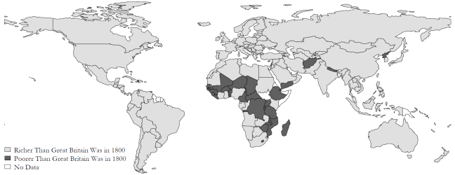
```

---
## Countries Better-Off than US in 1900

--

Koyama and Rubin, 2022

```{r}
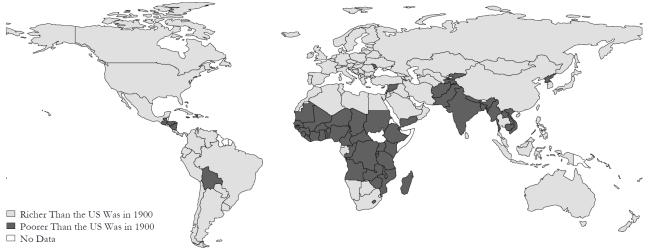
```


---
.center2[
# Why are we better off?
]

---
.center2[
# Unit 1: Prosperity, inequality, and planetary limits
]

---
## Unit 1: Prosperity, inequality, and planetary limits

--

- Economic inequality and divergence

--

- The technological revolution and growth

--

- The role of capitalism in economic growth

--

- Importance of the government in capitalist economies

--

> **The causes of the wealth and poverty of nations [were] the grand object of all enquiries in Political Economy** (Thomas Malthus to David Ricardo)

--

> **An Inquiry into the Nature and Causes of the Wealth of Nations** (Adam Smith)

---
.center2[
# Measuring income and living standards
]

---
## Measuring income and living standards

--

What is a good measure of our well-being?
--
 For practical reasons, economist use (mainly) two:
 
--

**Gross Domestic Product (GDP)**

A measure of the market value of the output of final goods and services in the economy in a given period. 
--
 Output of intermediate goods that are inputs to final production is excluded to prevent double counting.

--

.pull-left[
**GDP per capita**

The average income of people in a country.
]

--

.pull-right[
**Disposable Income**

$\textit{Total income} – taxes + \textit{government transfers}$
]

--

.center[
**GDP per capita** $\neq$ **Disposable Income**
]

--

Other measures of well-being?

--

- Human Development Index (Life expectancy, Education, Income)

--

- Subjective well-being (Life satisfaction, Happiness, Leisure)

--

- Nightlights 

---
## Comparing income at different times, and across different countries

--

- The starting point: **Nominal GDP**

$$\textit{Nominal GDP}_y = \sum_i p_{iy} q_{iy}$$

--

- Taking account of price changes over time: **Real GDP**

$$\textit{Real GDP}_{y,\bar{y}} = \sum_i p_{i\bar{y}} q_{iy}$$

--

- Taking account of price differences among countries: **International prices and purchasing power**

**Purchasing Power Parity (PPP) prices**. Achieve parity (equality) in the real purchasing power.

--


```{r out.width="60%"}
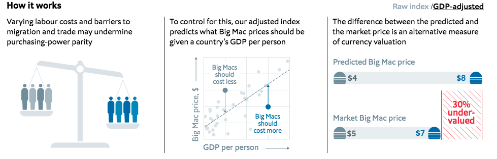
```


---

.center[
<iframe src="https://ourworldindata.org/grapher/gdp-per-capita-worldbank?tab=line&country=USA~DEU~GBR~KOR~JPN~CHN~IND~BRA~ETH~MEX" loading="lazy" style="width: 90%; height: 625px; border: 0px none;" allow="web-share; clipboard-write"></iframe>
]

---
.center2[
# History's hockey stick: Growth in income
]

---
## Growth

Growth take-off occurred at different points in time for different countries:

- Britain was the first country to experience sustained economic growth. It began around 1650.

- In Japan, it occurred around 1870.

- The kink for China and India happened in the second half of the 20th century. 

--

In some economies, substantial improvements in people’s living standards did not occur until they gained independence from colonial rule or interference by European nations.

Hitorical data: The Maddison Project

---
$$ \; $$
.center[
<iframe src="https://ourworldindata.org/grapher/gdp-per-capita-maddison-project-database?tab=line" loading="lazy" style="width: 90%; height: 550px; border: 0px none;" allow="web-share; clipboard-write"></iframe>
]

---

$$\textit{growth rate} = (y_{i1} - y_{i0})/ y_{i0} = \textit{change in y} / \textit{y's original level}$$

.center[
<iframe src="https://ourworldindata.org/grapher/gdp-per-capita-maddison-project-database?tab=line&stackMode=relative" loading="lazy" style="width: 90%; height: 550px; border: 0px none;" allow="web-share; clipboard-write"></iframe>
]

---
### GDP Levels ≠ GDP Growth

.center[
<iframe src="https://ourworldindata.org/grapher/gdp-per-capita-worldbank?tab=line&country=USA~DEU~GBR~KOR~JPN~CHN~IND~BRA~ETH~MEX" loading="lazy" style="width: 85%; height: 520px; border: 0px none;" allow="web-share; clipboard-write"></iframe>
]

---
### GDP Levels ≠ GDP Growth

.center[
<iframe src="https://ourworldindata.org/grapher/gdp-per-capita-worldbank?tab=line&stackMode=relative&country=USA~DEU~GBR~KOR~JPN~CHN~IND~BRA~ETH~MEX" loading="lazy" style="width: 85%; height: 520px; border: 0px none;" allow="web-share; clipboard-write"></iframe>
]


---
## Another Hockey Stick: Climate change

.center[
<iframe src="https://ourworldindata.org/grapher/northern-hemisphere-temperatures-over-the-long-run-deviation-from-1951-1990-mean-temperature-c?tab=chart" loading="lazy" style="width: 85%; height: 525px; border: 0px none;" allow="web-share; clipboard-write"></iframe>
]

---
.center2[
# Income Inequality
]

---
## Global income distribution

```{r, out.width="80%"}
knitr::include_graphics("https://ourworldindata.org/cdn-cgi/imagedelivery/qLq-8BTgXU8yG0N6HnOy8g/ce879cbf-a3f2-4be6-36a6-c420a78fbf00/w=1350")
```

---

```{r, out.width="70%"}
knitr::include_graphics("https://ourworldindata.org/cdn-cgi/imagedelivery/qLq-8BTgXU8yG0N6HnOy8g/cf3631ec-ea77-4e1e-0308-c4e03cfd0000/w=1350")
```

---
## Inequalities

```{r, out.width="80%"}

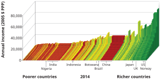

```

--

- Between countries

--

- Within countries


---

```{r}

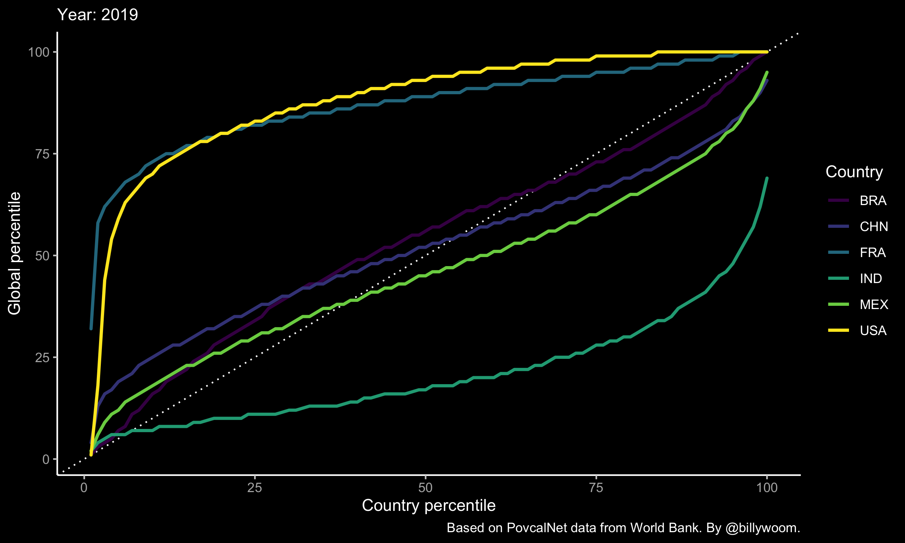

```

---
## Inequality and Growth

Between-country inequalities:

- Countries that took off economically a century or more ago —UK, Japan, Italy— are now rich. 

- The countries that took off only recently, or not at all, are in the flatlands.

--

Within-country inequalities:

- Does growth lift all boats? 

- Inequality hinders economic development?


---

```{r}

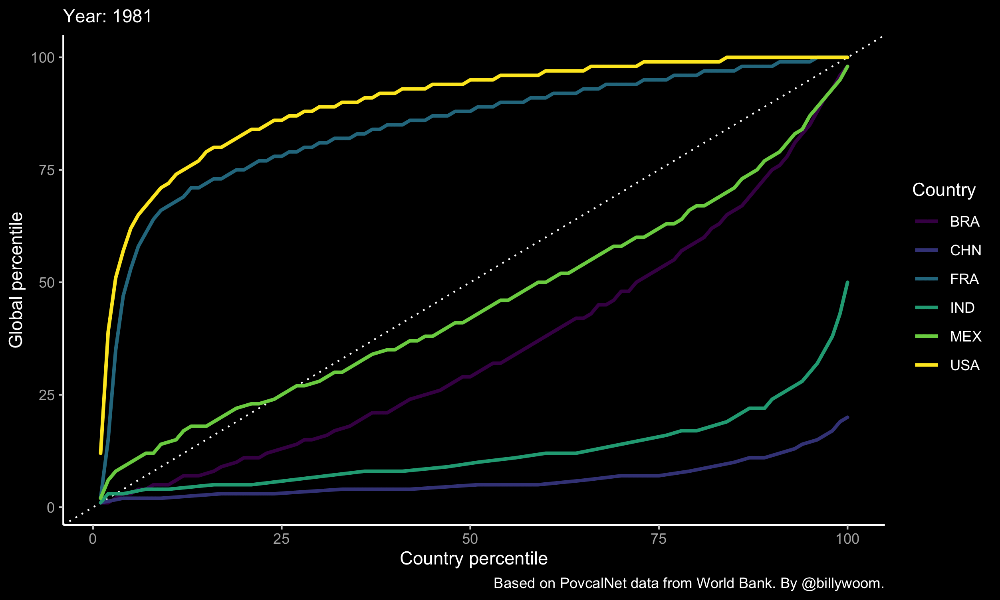

```

---
.center2[
# The continuous technological revolution
]

---
## The Technological Revolution

**Technology**: The description of a process using a set of materials and other inputs, including the work of people and machines, to produce an output.


```{r out.width="50%"}
knitr::include_graphics("imgs/technology_econ.png")
```

By reducing the amount of work-time it takes to produce the things we need, technological changes allowed significant increases in living standards.


---
## The Industrial Revolution

Remarkable scientific and technological advances occurred more or less at the same time as the upward kink in the hockey stick in Britain in the middle of the 18th century. 

--

**Industrial Revolution**: a wave of technological advances starting in Britain in the 18th century, which transformed an agrarian and craft-based economy into a commercial and industrial economy.

```{r out.width = "55%"}
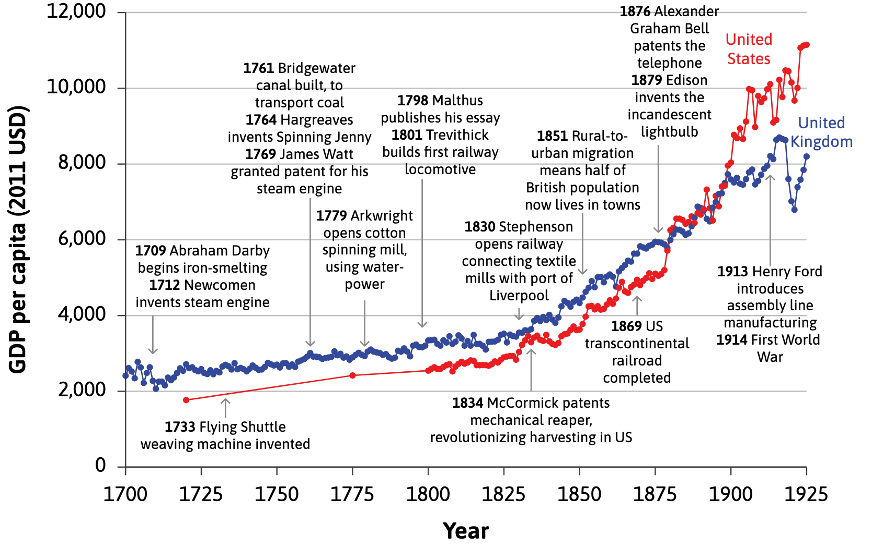
```

---


```{r out.width = "85%"}
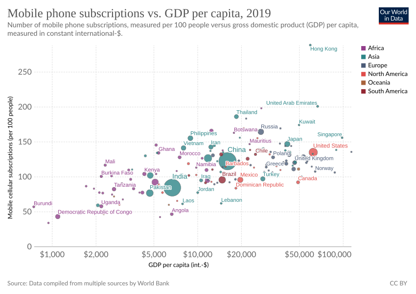
```


---
.center2[
# Explaining the flat part of the hockey stick
]

---
$$ \; $$
.center[
<iframe src="https://ourworldindata.org/grapher/gdp-per-capita-maddison-project-database?tab=line" loading="lazy" style="width: 90%; height: 550px; border: 0px none;" allow="web-share; clipboard-write"></iframe>
]

---
## Diminishing average product of labour

An agricultural economy

--

**Factors of production**: labour and land

--

- production: one good, grain.
- only farm labour, working on the land.

--

**Ceteris paribus** assumption: that the amount of land is fixed and all of the same quality.

--

**Average productivity**

$$ \textit{average productivity of labour} = \frac{\textit{total output}}{\textit{total number of farmers}}  $$

--

**Production function**: relationship between the amount of output produced and the amounts of inputs used to produce it.

$$ Y = f(X) $$

Production function gives maximum output for a given set of inputs.

---
## Diminishing average product of labour

--

If we hold one input (land) fixed, and expand the other input (labour), the average output per worker is going to fall. 

--

```{r out.width="65%"}
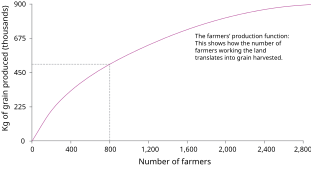
```

The production function shows how the number of farmers working the land translates into grain produced at the end of the growing season.

---
## Diminishing average product of labour

If we hold one input (land) fixed, and expand the other input (labour), the average output per worker is going to fall. 

```{r out.width="65%"}
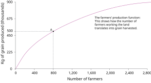
```

Point A on the production function shows the output of grain produced by 800 farmers.

---
## Diminishing average product of labour

If we hold one input (land) fixed, and expand the other input (labour), the average output per worker is going to fall. 

```{r out.width="65%"}
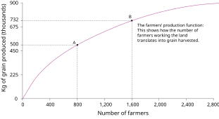
```

Point B on the production function shows the amount of grain produced by 1,600 farmers.

---
## Diminishing average product of labour

If we hold one input (land) fixed, and expand the other input (labour), the average output per worker is going to fall. 

```{r out.width="65%"}
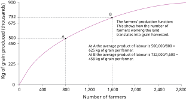
```

At A, the average product of labour is 500,00/800 = 625 kg of grain per farmer. At B, the average product of labour is 732,000/1,600 = 458 kg of grain per farmer.

---
## Diminishing average product of labour

If we hold one input (land) fixed, and expand the other input (labour), the average output per worker is going to fall. 

```{r out.width="65%"}
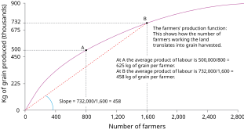
```

The slope of the ray from the origin to point B on the production function shows the average product of labour at point B. The slope is 458, meaning an average product of 458 kg per farmer when 1,600 farmers work the land.

---
## Diminishing average product of labour

If we hold one input (land) fixed, and expand the other input (labour), the average output per worker is going to fall. 

```{r out.width="65%"}
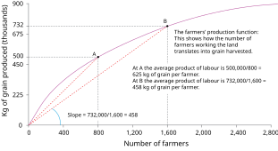
```

The slope of the ray to point A is steeper than to point B. When only 800 farmers work the land there is a higher average product of labour. The slope is 625, the average product of 625 kg per farmer that we calculated previously.


---
.center2[
# The Malthusian trap, population, and the average product of labour
]

---
## Malthus argument

--

1. Population expands if living standards increase

2. Law of diminishing average product of labour implies that as more people work on the land, their income will inevitably fall

--

.pull-left[

In equilibrium, living standards will be forced down to subsistence level. 

Population and income will stay constant. 

Self-correcting response to new technology. In the long run, an increase in productivity will result in increased population but not increased wages. 


]

.pull-right[

```{r out.width="100%"}
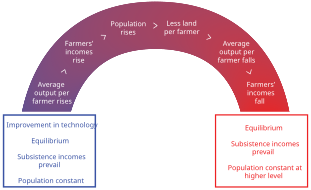
```
]


---
## Modelling Malthus

--

```{r out.width="75%"}

```

At a medium population level, the wage of people who work the land is at subsistence level (point A). The wage is higher at point B, where the population is smaller, because the average product of labour is higher.

---
## Modelling Malthus

```{r out.width="75%"}
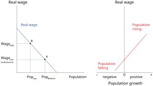
```

When wages (on the vertical axis) are high, population growth (on the horizontal axis) is positive (so the population will rise). When wages are low, population growth is negative (population falls).

---
## Modelling Malthus

```{r out.width="75%"}
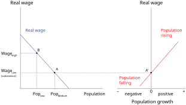
```

At point A, on the left, population is medium-sized and the wage is at subsistence level. So if the economy is at point A, it is in equilibrium: population stays constant and wages remain at subsistence level.


---
## Modelling Malthus

```{r out.width="75%"}
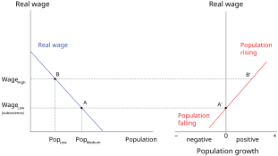
```

Suppose the economy is at B, with a higher wage and lower population. Point B′, on the right, shows that the population will be rising.

---
## Modelling Malthus

```{r out.width="75%"}
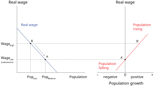
```

As the population rises, the economy moves down the line in the left diagram: wages fall until they reach equilibrium at A.

---
## Modelling Malthus

```{r out.width="75%"}

```

Malthusian population trap: Population will be constant when the wage is at subsistence level, it will rise when the wage is above subsistence level, and it will fall when the wage is below subsistence level.

---
## Modelling Malthus: productivity increases

```{r out.width="75%"}
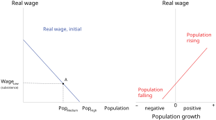
```

The economy starts at point A, with a medium-sized population and wage at subsistence level.

---
## Modelling Malthus: productivity increases

```{r out.width="75%"}
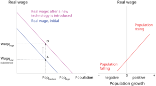
```

Technological improvement (better seeds) raises the average product of labour, and the wage is higher for any level of population. The real wage line shifts upward. At the initial population level, the wage increases and the economy moves to point D.

---
## Modelling Malthus: productivity increases

```{r out.width="75%"}
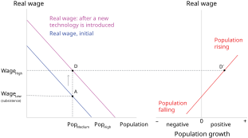
```

At point D, the wage has risen above subsistence level and therefore the population starts to grow (point D′).

---
## Modelling Malthus: productivity increases

```{r out.width="75%"}
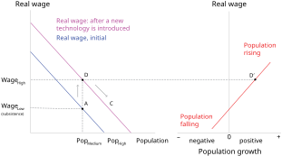
```

As population rises, the wage falls, due to the diminishing average product of labour. The economy moves down the real-wage curve from D.

---
## Modelling Malthus: productivity increases

```{r out.width="75%"}
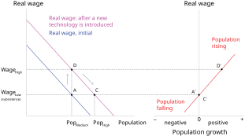
```

At C, the wage has reached subsistence level again. The population remains constant (point C′). The population is higher at equilibrium C than it was at equilibrium A.

---
## Modelling Malthus: productivity increases

```{r out.width="75%"}

```

Malthusian model predicts that even if productivity increases, living standards in the long run do not.

---
.center2[
# The Malthusian trap and long-term economic stagnation
]

---
## Testing Malthus

1) Diminishing average product of labour 

2) Rising population in response to increases in wages

3) **An absence of improvements in technology to offset the diminishing average product of labour**


```{r out.width="70%"}
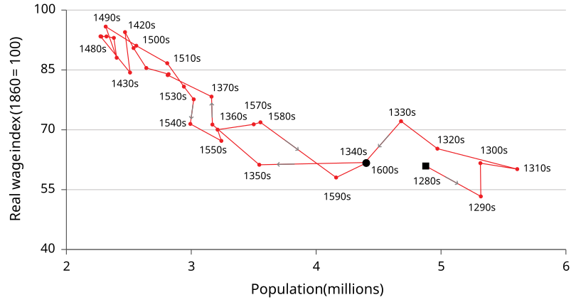
```

---
## Escaping Malthus

.center[
<iframe src="https://ourworldindata.org/grapher/englands-economy-over-the-long-run-gdp-vs-population?time=1270..2016&country=~GBR&tab=chart" loading="lazy" style="width: 90%; height: 550px; border: 0px none;" allow="web-share; clipboard-write"></iframe>
]

---
.center2[
# Capitalist institutions
]

---
## Capitalist institutions

How can we explain the escape from the Malthusian trap? 

--

**Capitalist revolution**: the emergence in the XVIIIth century and eventual global spread of a way of organizing the economy that we now call capitalism

--

**Capitalism**: an **economic system**⁠ characterized by a particular combination of **institutions**


---
## Institutions

**Institutions:** the laws and informal rules that regulate social interactions among people and between people and the biosphere, sometimes also termed the rules of the game.

--

.pull-left[
```{r out.width="75%"}
knitr::include_graphics("https://media.giphy.com/media/xT5LMpwRdyRjlBlOko/giphy.gif")
```
]


--

.pull-right[
```{r out.width="100%"}
knitr::include_graphics("https://media.giphy.com/media/NWGbK3xCYgQVy/giphy.gif")
```

]


---
## Economic systems

**Economic system:** a way of organizing the economy that is distinctive in its basic institutions. 

--

.pull-left[

.center[
**Feudalism**
```{r out.width="50%"}
knitr::include_graphics("https://brewminate.com/wp-content/uploads/2020/08/080320-01-History-Feudalism-Medieval.jpg")
```

]

]

--

.pull-right[


.center[
**Central economic planning**
```{r out.width="50%"}
knitr::include_graphics("https://s3.amazonaws.com/s3.timetoast.com/public/uploads/photo/17837782/image/medium-6f28c696cf14eae4d6aa206cb6b938a8.jpg")
```
]

]

--

.pull-left[

.center[
**Slave economy**
```{r out.width="50%"}
knitr::include_graphics("https://api.time.com/wp-content/uploads/2021/09/Transatlantic-Slave-Trade-brooks.jpg?w=800&quality=85")
```
]

]

--

.pull-right[

.center[
**Capitalism**
```{r out.width="50%"}
knitr::include_graphics("https://thecitizenjack.files.wordpress.com/2014/08/enjoy-capitalism.png")
```
]

]

---
## Capitalism

**Capitalism**: An economic system in which the main form of economic organization is the **firm**,
--
 in which the private owners of **capital goods** hire **labour**
--
 to produce goods and services for sale on **markets** with the intent of making a profit. 
--


The main economic institutions in a capitalist economic system, then, are **private property**, **markets**, and **firms**.

--

```{r out.width="80%"}
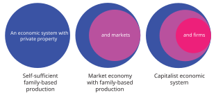
```


---
.center2[
# Structural transformation: From farm to firm
]

---
## Structural transformation: From farm to firm

Capitalist firms harnessed technological innovation to boost productivity, reshaping the economy’s structure.

.center[
<iframe src="https://ourworldindata.org/grapher/employment-by-economic-sector?stackMode=relative&country=~FRA&tab=chart" loading="lazy" style="width: 80%; height: 475px; border: 0px none;" allow="web-share; clipboard-write"></iframe>
]

---
## Structural transformation: From farm to firm

Capitalist firms harnessed technological innovation to boost productivity, reshaping the economy’s structure.

.center[
<iframe src="https://ourworldindata.org/grapher/shares-of-gdp-by-economic-sector?country=~FRA&tab=chart" loading="lazy" style="width: 80%; height: 475px; border: 0px none;" allow="web-share; clipboard-write"></iframe>
]

---
## Structural transformation: From farm to firm

Capitalist firms harnessed technological innovation to boost productivity, reshaping the economy’s structure.

.center[
<iframe src="https://ourworldindata.org/grapher/non-agricultural-share-of-labour-force?tab=line" loading="lazy" style="width: 80%; height: 475px; border: 0px none;" allow="web-share; clipboard-write"></iframe>
]

---
.center2[
# Capitalism, causation, and history’s hockey stick
]

---
## (Detour): Causation

```{r, out.width="45%"}
knitr::include_graphics("https://i0.wp.com/timoelliott.com/blog/wp-content/uploads/2023/10/every-single-person-who-confuses-correlation-and-causation-ends-up-dying.jpg?w=1024&ssl=1")
```

---
## (Detour): Causation

```{r, out.width="80%"}
knitr::include_graphics("https://www.tylervigen.com/spurious/correlation/image/5825_google-searches-for-taylor-swift_correlates-with_fossil-fuel-use-in-british-virgin-islands.png")
```


---
## Did capitalism *cause* the hockey-stick growth?

**Natural experiment**: 
--
 the division of Germany at the end of World War II into two separate economic systems, capitalist in the west and centrally planned in the east.  

--

```{r out.width="55%"}
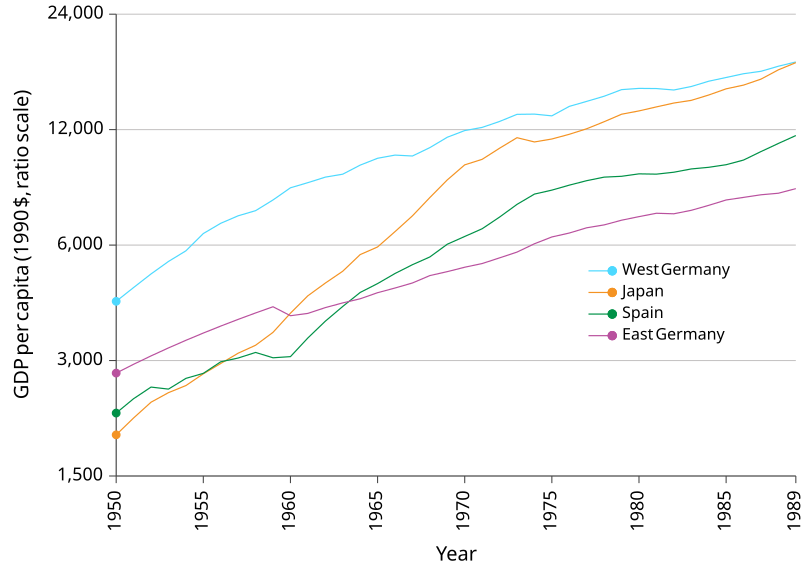
```

---
.center2[
# Why is there a persistent gap in GDP per capita or income between countries?
]

---

```{r out.width="70%"}
knitr::include_graphics("https://www.amse-aixmarseille.fr/sites/default/files/styles/slide_-_760/public/photos/slideshow/prix-nobel-2024.jpg?itok=PzqTFZLq")
```

---

```{r out.width="45%"}
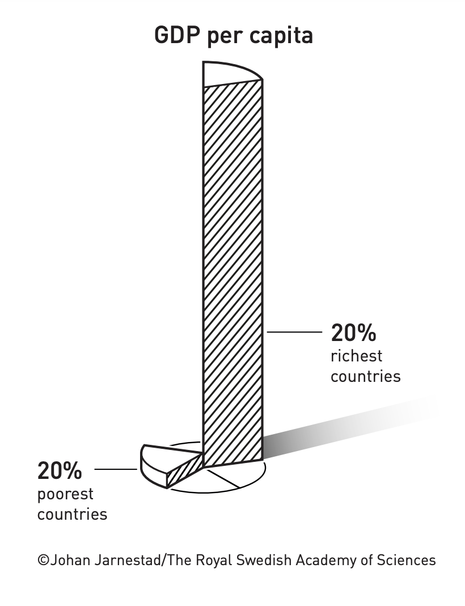
```

---

```{r out.width="90%"}
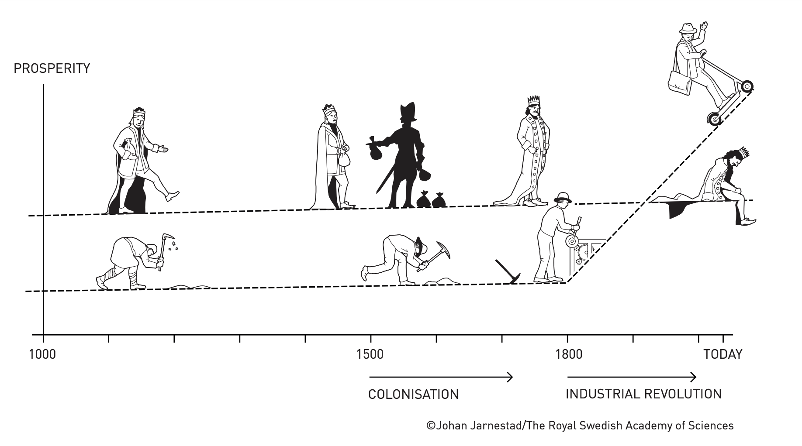
```

---

```{r out.width="85%"}
knitr::include_graphics("https://eoimages.gsfc.nasa.gov/images/imagerecords/83000/83182/ISS038-E-038300_lrg.jpg")
```


---
.center2[
# Varieties of capitalism: Institutions, government, and politics
]

---
## Divergence in growth

Not all capitalist economies are equally successful

- **economic conditions**: firms, private property, or markets may fail

- **political conditions**: capitalist institutions are regulated by the government

- the government also provides essential goods and services (infrastructure, education)

```{r out.width="50%"}
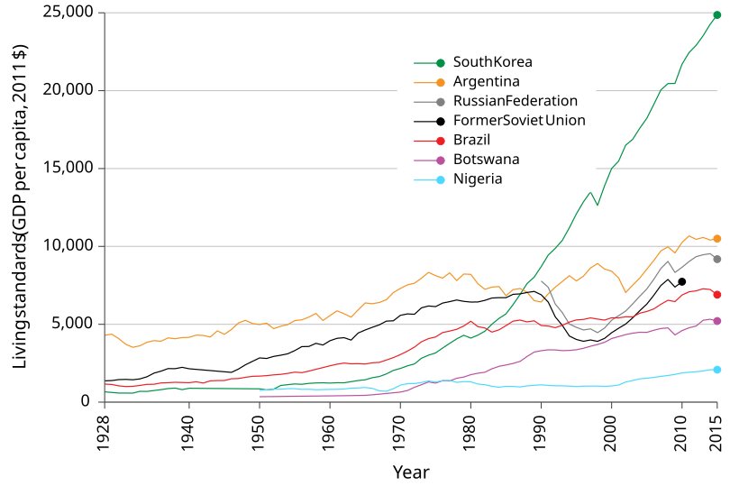
```


---
## Democracy and Economic Development? 

```{r gdp-inst, out.width="80%", echo=FALSE}
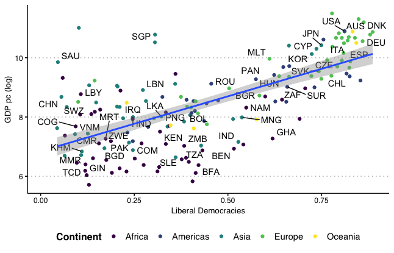
```

---

```{r , out.width="62.5%", echo=FALSE}
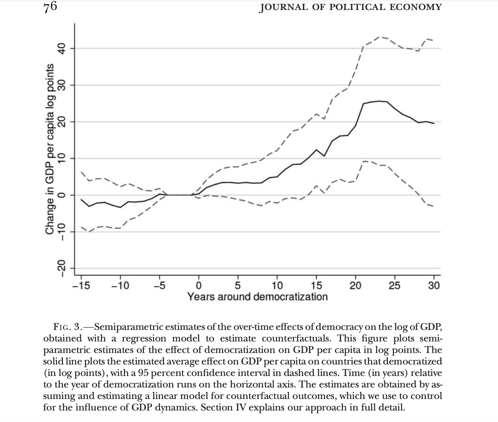
```

.center[
[Democracy Does Cause Growth (Acemoglu, Naidu, Restrepo, and Robinson, 2019)](https://voxdev.org/topic/institutions-political-economy/democracy-and-economic-growth-new-evidence)
]

---
## Political systems

Capitalism coexists with many political systems. 

--

A **political system** determines how governments will be selected, and how those governments will make and implement decisions.

--

In most countries today, capitalism coexists with democracy

- individual rights of citizens (e.g. freedom of speech)
- fair elections 

--

But capitalism has coexisted with non-democratic systems, too. Even democracy is 'not enough': populism.

```{r out.width="75%"}
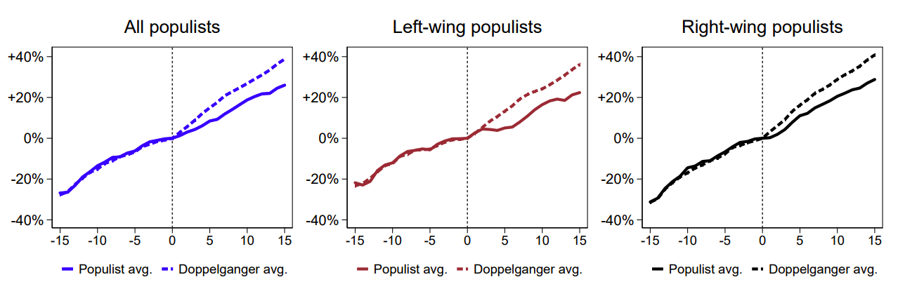
```

---
.center2[
# Is there a silver bullet to explain these patterns?
]

---

.pull-left[
```{r out.width="80%"}
knitr::include_graphics("https://m.media-amazon.com/images/I/81wNl0CEpmL._AC_UF1000,1000_QL80_.jpg")
```
]

**These are causal questions**

.pull-right[

- Geography
- Institutions
- Culture
- Demography
- Colonization and exploitation

1. Why did Europe got rich first?
2. Why did Britain got rich first?
3. Why the patterns expanded to other places?

]

---
## Colonization: Did the British colonization of India reduce Indian living standards?

```{r out.width="60%"}
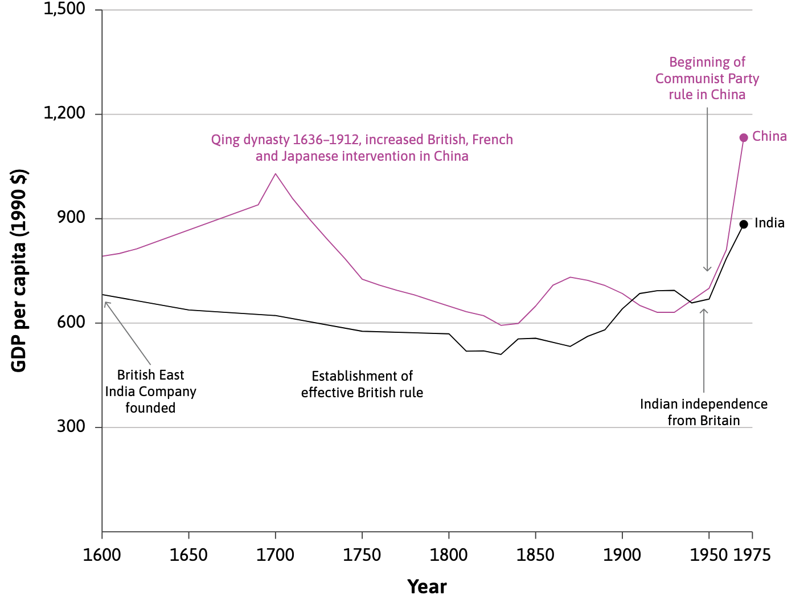
```

---
## Culture: Nexus between trust and economic development.

```{r out.width="60%"}
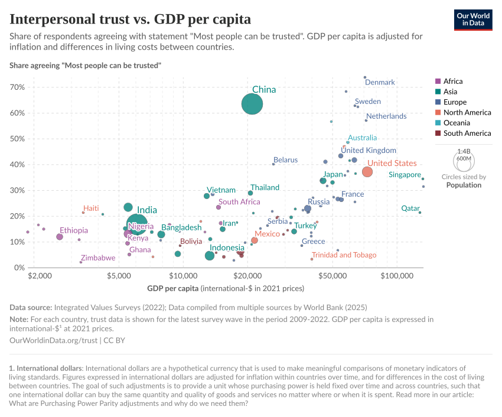
```

.center[
[Does Culture Affect Economic Outcomes? (Guiso, Sapienza, and Zingales, 2006)](https://www.aeaweb.org/articles?id=10.1257/jep.20.2.23)
]

---
## Culture: Italy as a case study

```{r, out.width="35%"}
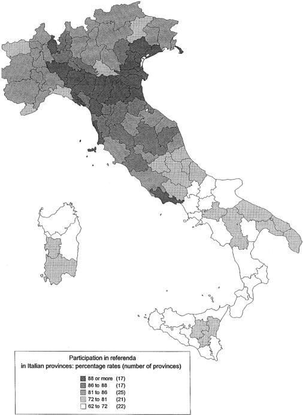
```

.center[
[The Role of Social Capital in Financial Development (Guiso, Sapienza, and Zingales, 2004)](https://www.aeaweb.org/articles?id=10.1257/0002828041464498)
]

---
## Colonization and Exploitation: Britain as a case study

.pull-left[
```{r}
knitr::include_graphics("https://cepr.org/sites/default/files/styles/flexible_wysiwyg/public/2023-02/voth11febfig1.png?itok=HYijHr4i")
```
]

.pull-right[
```{r out.width="120%"}
knitr::include_graphics("https://cepr.org/sites/default/files/styles/flexible_wysiwyg/public/2023-02/voth11febfig2.png?itok=-PFQelk6")
```
]

.center[
[Slavery and the British Industrial Revolution (Heblich, Redding, and Voth, 2023)](https://cepr.org/voxeu/columns/slavery-and-british-industrial-revolution)
]


---
.center2[
# Economics, the economy, and the biosphere
]

---
## Economics, the economy, and the biosphere

**Economics**:
--
⁠  the study of **how people interact with each other** and **with their natural environment** in producing and acquiring their livelihoods, and how this changes over time and differs across societies.


```{r out.width = "50%"}
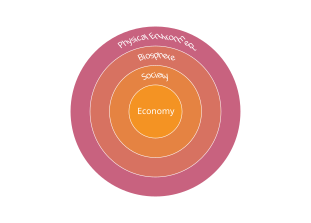
```

---

.center2[

<iframe width="840" height="472.5" src="https://www.youtube.com/embed/HwbhEL-6zCU?si=1FxeQHkufwRgOrsn" title="YouTube video player" frameborder="0" allow="accelerometer; autoplay; clipboard-write; encrypted-media; gyroscope; picture-in-picture; web-share" referrerpolicy="strict-origin-when-cross-origin" allowfullscreen></iframe>

.center[
[How human and ecosystem health are intertwined: Evidence from vulture population collapse in India (Frank and Sudarshan, 2023)](https://voxdev.org/topic/energy-environment/how-human-and-ecosystem-health-are-intertwined-evidence-vulture-population)
]


]

---
.center2[
# Summary
]

---
## Summing up

--

1) Important trends in economic variables over time

- Income inequality across regions has increased a lot over time 

- “Hockey-stick” growth in GDP and its environmental consequences

- Technological progress helped bring about these trends

--

2) The adoption of capitalism was another key factor

- Capitalism = Private property + Markets + Firms

- Failure of these institutions can explain divergence in economic growth across countries

- Political systems and the role of government also determine the type of capitalist society

--
### Next class

- Using economic models to explain the trends in technological growth over time

- The role of firms in technological development

