<style>

.center2 {
  margin: 0;
  position: absolute;
  top: 50%;
  left: 50%;
  -ms-transform: translate(-50%, -50%);
  transform: translate(-50%, -50%);
}

</style>


```{r setup, include = FALSE}
knitr::opts_chunk$set(echo = FALSE)
knitr::opts_chunk$set(out.width = "90%")
knitr::opts_chunk$set(fig.align="center")
options(htmltools.dir.version = FALSE)


options(htmltools.dir.version = FALSE)
library(knitr)
library(tidyverse)
library(xaringanExtra)
# set default options
opts_chunk$set(echo=FALSE,
               collapse = TRUE,
               fig.width = 7.252,
               fig.height = 4,
               dpi = 300)
# set engines
knitr::knit_engines$set("markdown")
xaringanExtra::use_tile_view()
xaringanExtra::use_panelset()
xaringanExtra::use_clipboard()
xaringanExtra::use_webcam()
xaringanExtra::use_broadcast()
xaringanExtra::use_share_again()
xaringanExtra::style_share_again(
  share_buttons = c("twitter", "linkedin", "pocket")
)
# uncomment the following lines if you want to use the NHS-R theme colours by default
# scale_fill_continuous <- partial(scale_fill_nhs, discrete = FALSE)
# scale_fill_discrete <- partial(scale_fill_nhs, discrete = TRUE)
# scale_colour_continuous <- partial(scale_colour_nhs, discrete = FALSE)
# scale_colour_discrete <- partial(scale_colour_nhs, discrete = TRUE)
```


.center2[
# Intro
]

---

```{r out.width="60%"}
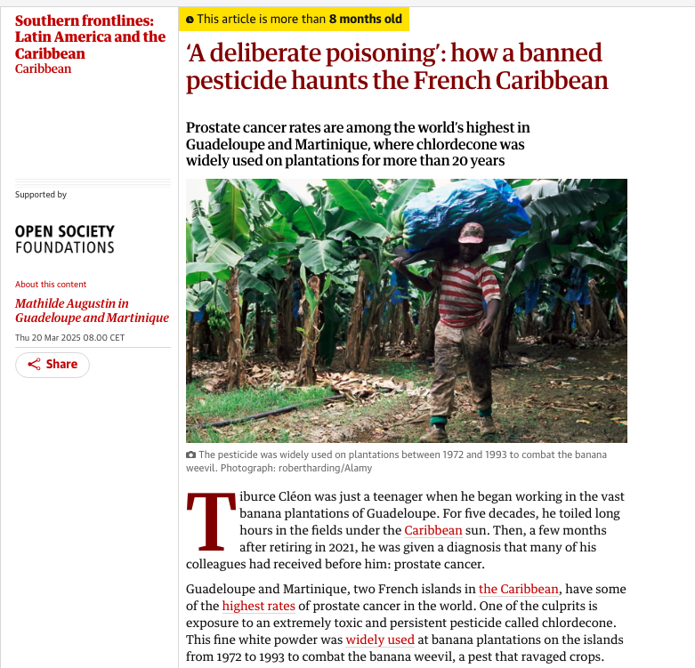
```

---
## Market success and failure

- If the market for a good is perfectly competitive, and affects no one other than the buyers and sellers, the allocation of the good is Pareto efficient. 

- In that case market prices send the right messages to decision-makers about the costs of supplying the good and the benefits of consuming it.

--

- **But if others are affected**, **prices will send the wrong messages**

- **Market failure** occurs when the market produces a Pareto-inefficient outcome, usually because prices fail to reflect true costs or benefits, or because relevant markets are missing altogether.

---
.center2[
#  The external effects of pollution: Private and social costs and benefits
]

---
## Externalities: key concepts

- **Marginal private cost (MPC)** = marginal cost to decision-maker

- **Marginal external cost (MEC)** = costs imposed by decision-maker on society (fishermen)

- **Marginal social cost (MSC)** = MPC + MEC (full cost to society)

---
## Pollution as an externality

Consider an imaginary Caribbean island where a fictional pesticide called Weevokil is used to grow bananas, polluting coastal waters and killing fish. 

In our model there is just one external cost, to the livelihoods of fishermen —Weevokil does not affect the health of the population directly.

---
## Pollution as an externality

```{r, out.width="70%"}
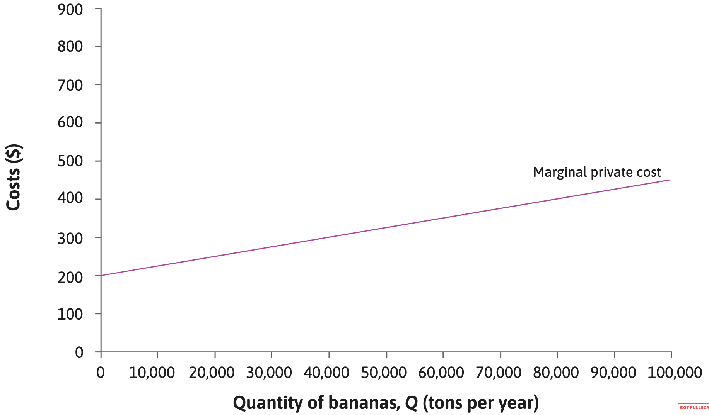
```

The purple line is the marginal cost for the growers: the **marginal private cost (MPC)** of banana production.
It slopes upward because the cost of producing an additional tonne increases as the land is more intensively used, requiring more Weevokil.

---
## Pollution as an externality

```{r, out.width="70%"}
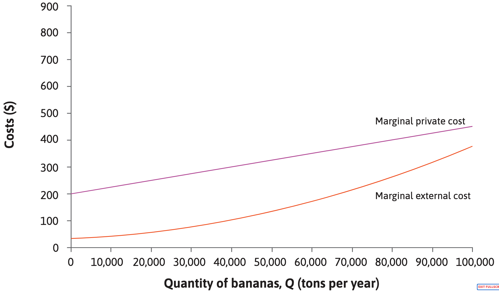
```

The orange line shows the marginal cost imposed by the banana growers on fishermen—the **marginal external cost (MEC)**. This is the cost of the reduction in quantity and quality of fish caused by each additional tonne of bananas.

---
## Pollution as an externality

```{r, out.width="70%"}
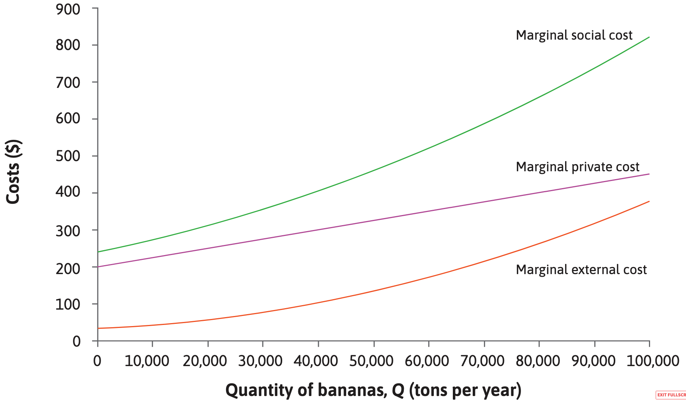
```

**MPC + MEC = MSC**

The green line in the diagram is the **marginal social cost (MSC)**. 


---
## Pollution as an externality

```{r, out.width="70%"}
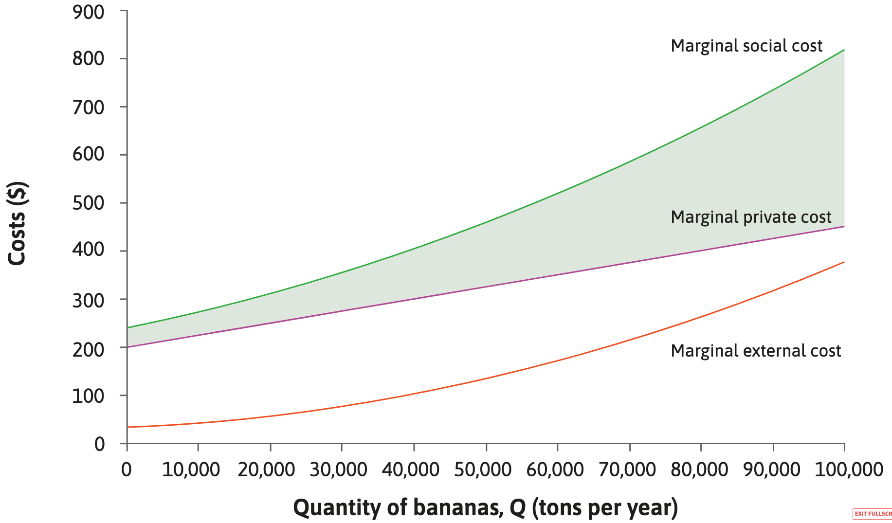
```

Total external cost: the sum of the differences between the marginal social cost and the marginal private cost at each level of production.

---
## Pollution as an externality

Suppose most bananas are exported, the world market for bananas is competitive, and the market price is $400 per ton.

--

```{r, out.width="65%"}
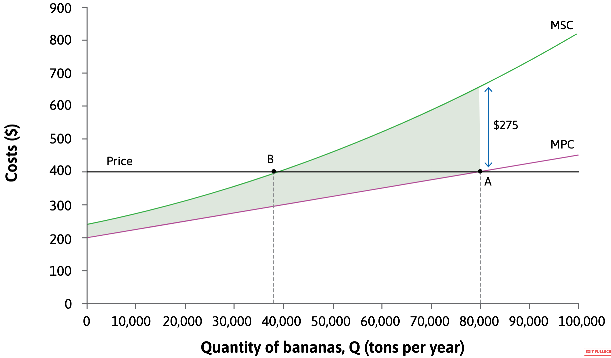
```

$$P = MPC \; \Rightarrow \; Q^* = 80k$$

---
## Pollution as an externality

Suppose most bananas are exported, the world market for bananas is competitive, and the market price is $400 per ton.

```{r, out.width="65%"}

```

Is this Pareto efficient?
--
 No, **this does not include the cost imposed on the fishing industry**


---
## Pollution as an externality

What would happen if the plantations were to produce less? For instance, one tone less.

```{r, out.width="65%"}

```

The plantations would lose hardly anything. Their revenues would fall by 400, but their costs would fall by almost exactly this amount because, when producing 80,000 tonnes, the marginal private cost is equal to the price (400).

---
## Pollution as an externality

What would happen if the plantations were to produce less? For instance, one tone less.

```{r, out.width="65%"}

```

So **both groups could be better off** with 79,999 tons of bananas, **if they could somehow arrange for the fishermen to pay some part of their $275 gain to the plantations**.

---
## Pollution as an externality

How much should production be reduced? 

```{r, out.width="65%"}

```

$$\text{Reduce output if:} \quad P < MEC + MPC = MSC$$

---
## Pollution as an externality

Under certain arrangements, on could achieve Pareto efficiency: 

```{r, out.width="65%"}

```

$$\text{Pareto-efficient level of output:} \quad P = MSC$$

---
.center2[
# Solving the problem: Private bargaining and property rights
]

---
## Solving the problem: Solution #1 *Coasean* Bargaining

```{r, out.width="35%"}
knitr::include_graphics("https://i.imgflip.com/54hjww.jpg")
```


---
## Solving the problem: Solution #1 *Coasean* Bargaining

Initially pesticide is not illegal:

```{r, out.width="65%"}
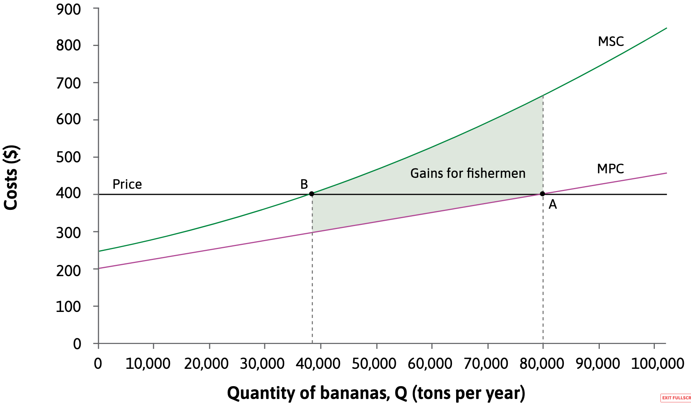
```

the allocation of property rights is such that the plantations have the right to use it, and choose to produce 80,000 tonnes of bananas.

---
## Solving the problem: Solution #1 *Coasean* Bargaining

Initially pesticide is not illegal:

```{r, out.width="65%"}

```

The situation before bargaining is represented by point A, and the Pareto-efficient quantity of bananas is 38,000 tonnes. 

---
## Solving the problem: Solution #1 *Coasean* Bargaining

Initially pesticide is not illegal:

```{r, out.width="65%"}

```

The total shaded area shows the gain for fishermen if output is reduced from 80,000 to 38,000 (that is, the reduction in the fishermen’s costs or **reservation option**).

---
## Solving the problem: Solution #1 *Coasean* Bargaining

Initially pesticide is not illegal:

```{r, out.width="65%"}
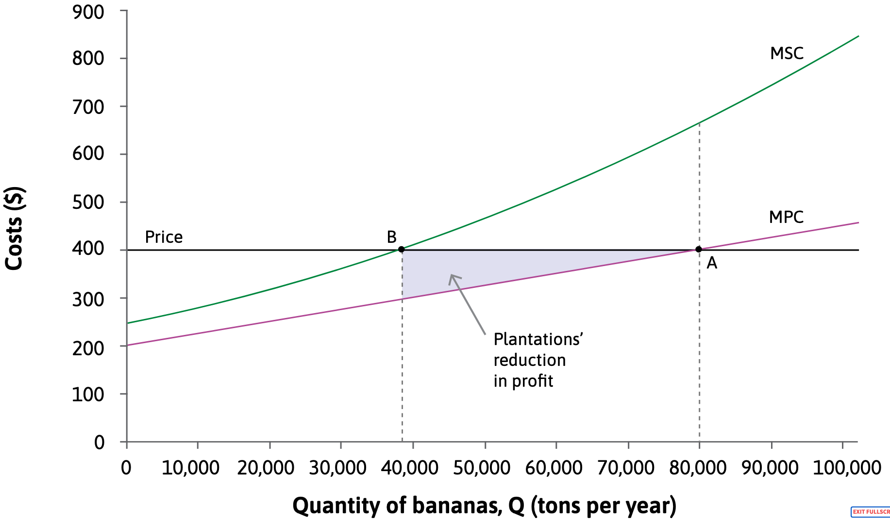
```

Reducing output from 80,000 to 38,000 tons reduces the profits of plantations.

---
## Solving the problem: Solution #1 *Coasean* Bargaining

Initially pesticide is not illegal:

```{r, out.width="65%"}

```

The difference between P and MPC is the surplus on each ton, so the total lost profit is the shaded area below the price line.

---
## Solving the problem: Solution #1 *Coasean* Bargaining

Initially pesticide is not illegal:

```{r, out.width="65%"}
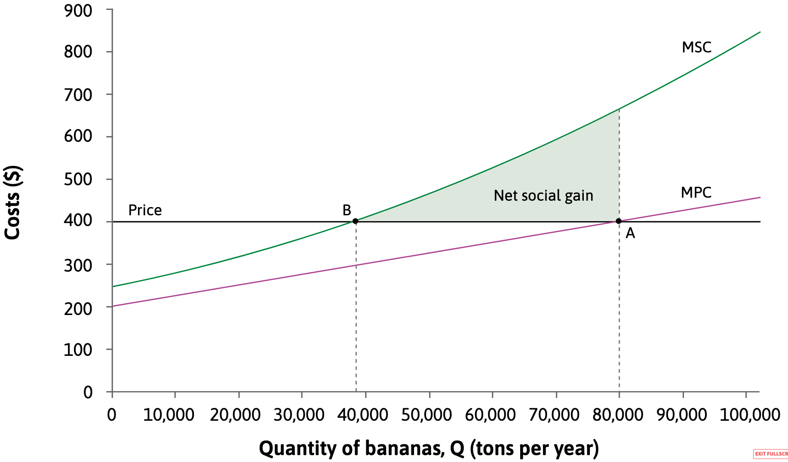
```

The net social gain is the gain for the fishermen minus the loss for the plantations, shown by the remaining green area.

---
## Solving the problem: Solution #1 *Coasean* Bargaining

But **the initial allocation of property rights** is also very important for **determining the distribution of incomes**, because it determines the reservation options of the parties.

---
## Solving the problem: Solution #1 *Coasean* Bargaining

Unfair that the fishermen had to pay for a reduction in pollution: alternative legal framework where the fishermen had a right to clean water. 

```{r, out.width="65%"}

```

For the distribution of benefits and costs among the two parties, who has the property rights makes a big difference


---
## Solving the problem: Solution #1 *Coasean* Bargaining

.pull-left[
```{r, out.width="75%"}
knitr::include_graphics("https://i.imgflip.com/54hjww.jpg")
```
]

- Legally assign property rights to the externality (e.g. the right to pollute, the right to clean air)

- **In abscence of transaction costs**, Private bargaining between parties involved will result in a Pareto-efficient allocation regardless of which party has the property rights.

- In some situations, may be more effective than government intervention because private parties have more of the necessary information.

---
.center2[
# Solving the problem: Regulation, taxation, and compensation
]

---
## Solving the problem: Regulation, taxation, and compensation

```{r, out.width="50%"}
knitr::include_graphics("https://pbs.twimg.com/media/FXRgnimX0AIDFvP.jpg")
```

---
## Solving the problem: Solution #2 Regulation

Cap at socially optimal amount

```{r, out.width="40%"}
knitr::include_graphics("https://i.imgflip.com/42k41q.png?a465216")
```

---
## Solving the problem: Solution #2 Regulation

Cap at socially optimal amount

```{r, out.width="65%"}

```

May be difficult to determine and enforce the right quota for each polluter

---
## Solving the problem: Solution #3 Taxation

Tax or subsidize firms with negative or positive externalities to fix market inefficiency.

```{r, out.width="50%"}
knitr::include_graphics("https://i.imgflip.com/4yo1ob.png")
```

Note that the government is who recieves the payment.

---
## Solving the problem: Solution #3 Taxation

Tax or subsidize firms with negative or positive externalities to fix market inefficiency.

```{r, out.width="65%"}
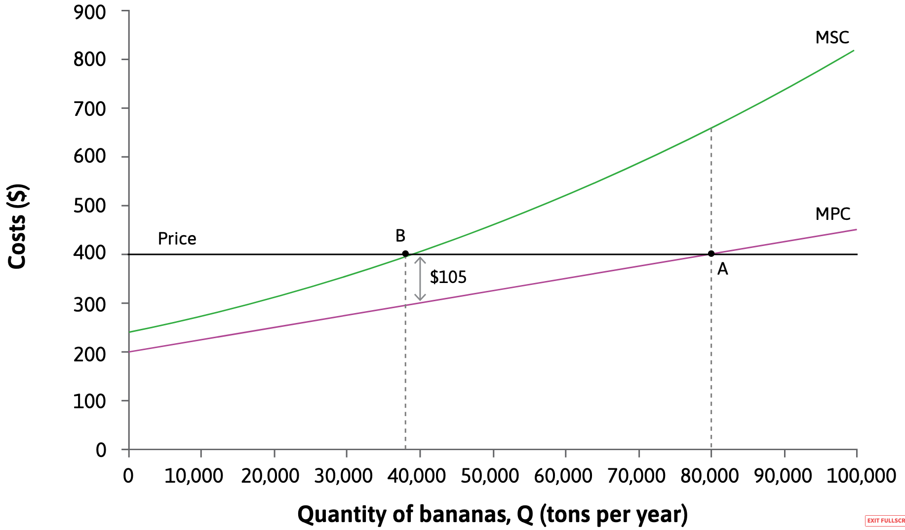
```

At the Pareto-efficient quantity, 38,000 tonnes, the MPC is 295. The MSC is 400. So the marginal external cost is $MSC – MPC = 105$.

---
## Solving the problem: Solution #3 Taxation

Tax or subsidize firms with negative or positive externalities to fix market inefficiency.

```{r, out.width="65%"}
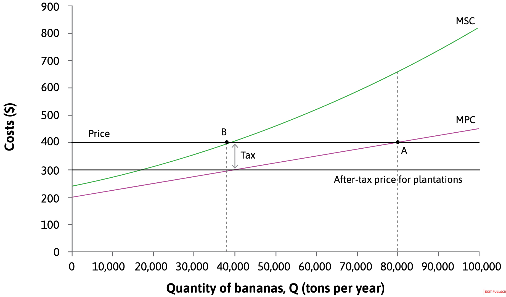
```

If the government puts a tax ($= MSC-MPC$) on each tonne of bananas produced equal to 105, the marginal external cost, then the after-tax price received by plantations will be 295.

---
## Solving the problem: Solution #3 Taxation

Tax or subsidize firms with negative or positive externalities to fix market inefficiency.

```{r, out.width="65%"}
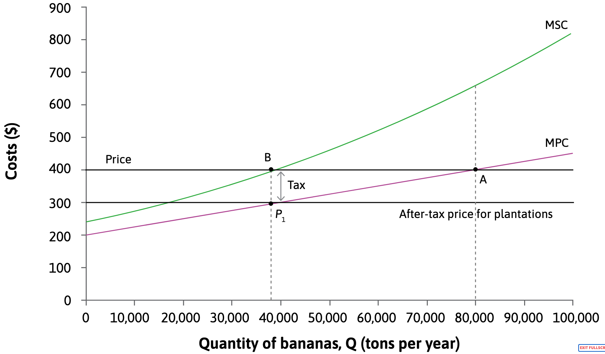
```

To maximize profit, the plantations will choose their output so that the MPC is equal to the after-tax price. They will choose point $P_1$ and produce 38,000 tonnes.

---
## Solving the problem: Solution #4 Compensation

The government could require plantation owners to compensate fishermen for the costs they impose.

```{r, out.width="65%"}
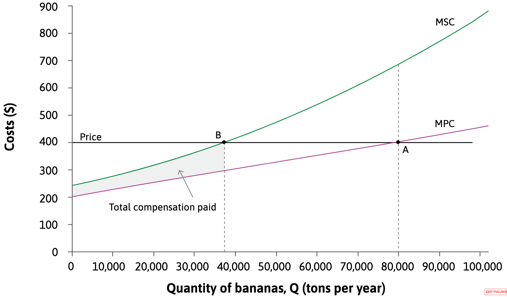
```

The compensation per ton of bananas equals the gap between MSC and MPC (the distance between the curves).


---
## Negative Production Externalities

.pull-left[
- Occur when firms’ production decisions impose **negative external effects** on the well-being or livelihoods of others.

- Firms may ignore the **full social cost** of production because:
  - Some inputs have **missing markets**, so they are treated as having a price of zero.
  - There is a lack of **private property rights** and/or **enforceable contracts**.

- The absence of markets and property rights is often linked to **asymmetric information**.
]

.pull-right[
```{r}
include_graphics("https://i.guim.co.uk/img/media/084c85285b3407059f44a643e44a9204db0cc494/0_171_5244_3148/master/5244.jpg?width=1200&quality=85&auto=format&fit=max&s=a4fb9e044431723169429577cba2d19e")
```
]

---
## Negative Consumption Externalities

.pull-left[
- Occur when **consumption decisions** impose negative external effects on others.

- Consumers often respond to **market prices below social marginal costs**, leading to overconsumption.

- Examples include:
  - Heating homes with fossil fuels without accounting for **climate impacts**.
  - Car travel causing **carbon emissions, air pollution, congestion, and accident risk**.
  - **Noise** from late-night street activity disturbing residents.
  - Use of **plastic bags and packaging** without considering harm to humans, animals, and ocean ecosystems.
]

.pull-right[
```{r, out.width="100%"}
knitr::include_graphics("https://images.ctfassets.net/y5z23yb0t4f0/1vvBN5lM1cyq429LRfu7PL/747f05bb157e6222edbbb094109431e7/GettyImages-8359262462.jpg")
```
]

---
## External Benefits

.pull-left[
- Occur when decisions generate **positive external effects**, so the **social benefit exceeds the private benefit**.

- Example:
  - **Vaccination** benefits the individual and also protects others who might otherwise become infected.

- Despite being socially beneficial, they are underprovided because the person making the decision does not receive full compensation for the benefit they create.
]

.pull-right[
```{r, out.width="100%"}
knitr::include_graphics("https://www.ac-bordeaux.fr/sites/ac_bordeaux/files/styles/banner_1340x730/public/2021-05/visuel-vaccination4-jpg-24614.jpg?h=133bf7b9&itok=kXMdfpqV")
```
]

---
## External Benefits

.pull-left[
- Occur when decisions generate **positive external effects**, so the **social benefit exceeds the private benefit**.

- Example:
  - **Vaccination** benefits the individual and also protects others who might otherwise become infected.

- Despite being socially beneficial, they are underprovided because the person making the decision does not receive full compensation for the benefit they create.
]

.pull-right[
```{r, out.width="100%"}
knitr::include_graphics("https://upload.wikimedia.org/wikipedia/commons/thumb/a/a6/Bike_Panning._%288663144133%29.jpg/1920px-Bike_Panning._%288663144133%29.jpg")
```
]


---
.center2[
# Public goods, non-rivalry, and excludability
]

---
## Public Goods

- Public goods are goods where **one person’s provision benefits many others**.

--

- They are typically characterized by:
  - **High private costs** and **low private benefits**, so individuals lack incentives to provide them.
  - **Free-riding**, where others benefit without contributing.
  
--

- A key feature of public goods is **non-rivalry**:
  - One person’s use does **not reduce availability** to others.


---
## Public Goods

Example: Radio broadcasting is a public good.

Once produced, it can be consumed by additional listeners at no extra cost and without reducing quality, regardless of whether it is publicly or privately provided.

---
## Public Goods

Example: Radio broadcasting is a public good.

```{r out.width="65%"}
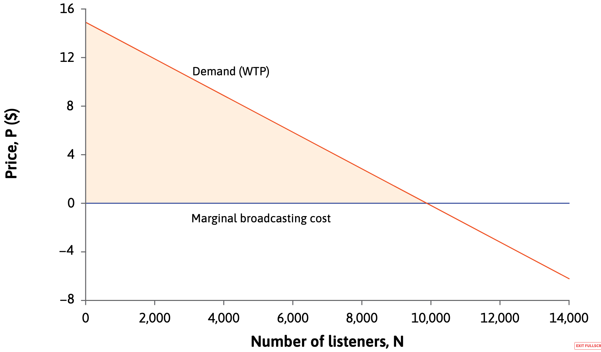
```

Demand: represents the listener’s private benefit, or equivalently their gain in utility (measured in monetary terms) from listening to it.

---
## Public Goods

Example: Radio broadcasting is a public good.

```{r out.width="65%"}

```

The total cost of making and broadcasting the programme is $C$.

Once the programme has been produced, supplying it to another listener is $MC = 0$.

---
## Public Goods

Example: Radio broadcasting is a public good.

```{r out.width="65%"}

```

Setting a price of 0 would maximise social benefits but the broadcaster receives no revenue. 

---
## Excludability

Broadcast programmes are now an excludable⁠ public good: the provider can choose whom to supply and whom to exclude.

--

```{r out.width="65%"}
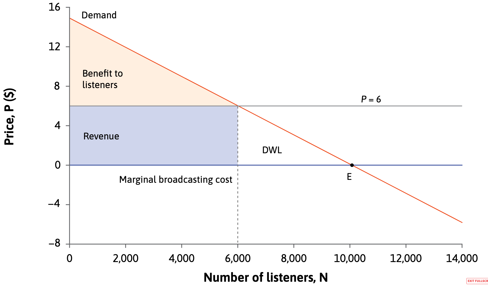
```

The social benefit falls because a higher price reduces listening, creating a deadweight loss despite including both listener benefits and broadcaster revenue.

---
## Public goods, non-rivalry, and excludability

$$\text{Net Social Benifit} = \text{Social Benifit (consumer + producer surplus)} - C $$

---
## Public goods, non-rivalry, and excludability

```{r out.width="60%"}

```

| Price | Number of listeners | Revenue | Benefit to listeners | Social benefit | If C = 40,000: Net social benefit | If C = 40,000: Profit |
|------:|--------------------:|--------:|---------------------:|---------------:|---------------------------------:|----------------------:|
| 0     | 10,000              | 0       | 75,000               | 75,000         | 35,000                           | -40,000               |

---
## Public goods, non-rivalry, and excludability

```{r out.width="60%"}

```

| Price | Number of listeners | Revenue | Benefit to listeners | Social benefit | If C = 40,000: Net social benefit | If C = 40,000: Profit |
|------:|--------------------:|--------:|---------------------:|---------------:|---------------------------------:|----------------------:|
| 0     | 10,000              | 0       | 75,000               | 75,000         | 35,000                           | -40,000               |
| 6     | 6,000               | 36,000  | 27,000               | 27,000         | 23,000                           | -4,000                |


---
## Public goods, non-rivalry, and excludability

$$\uparrow P \; \rightarrow \; \downarrow \ NSB \; \& \; \uparrow \Pi$$

| Price | Number of listeners | Revenue | Benefit to listeners | Social benefit | If C = 40,000: Net social benefit | If C = 40,000: Profit |
|------:|--------------------:|--------:|---------------------:|---------------:|---------------------------------:|----------------------:|
| 0     | 10,000              | 0       | 75,000               | 75,000         | 35,000                           | -40,000               |
| 6     | 6,000               | 36,000  | 27,000               | 27,000         | 23,000                           | -4,000                |
| 7.5   | 5,000               | 37,500  | 18,750               | 18,750         | 16,250                           | -2,500                |
| 10.5  | 3,000               | 31,500  | 6,750                | 6,750          | -1,750                           | -8,500                |

---
## Public goods, non-rivalry, and excludability

$$\uparrow P \; \rightarrow \; \downarrow \ NSB \; \& \; \uparrow \Pi$$

Of course total NSB and profits depend on $C$

| Price | Number of listeners | Revenue | Benefit to listeners | Social benefit | If C = 40,000: Net social benefit | If C = 40,000: Profit | If C = 30,000: Net social benefit | If C = 30,000: Profit |
|------:|--------------------:|--------:|---------------------:|---------------:|---------------------------------:|----------------------:|---------------------------------:|----------------------:|
| 0     | 10,000              | 0       | 75,000               | 75,000         | 35,000                           | -40,000               | 45,000                           | -30,000               |
| 6     | 6,000               | 36,000  | 27,000               | 27,000         | 23,000                           | -4,000                | 33,000                           | 6,000                 |
| 7.5   | 5,000               | 37,500  | 18,750               | 18,750         | 16,250                           | -2,500                | 26,250                           | 7,500                 |
| 10.5  | 3,000               | 31,500  | 6,750                | 6,750          | -1,750                           | -8,500                | 8,250                            | 1,500                 |

---
.center2[
# Public goods and bads, open access, and shared resources
]

---
## Public goods and bads, open access, and shared resources

**excludability**: A good is excludable if (at zero or low cost) a potential user may be denied access to the good.

**non-rivalry**: A good is non-rival if, when it is made available to one person, it can be made available to everyone else at no additional cost.


---
## Public goods and bads, open access, and shared resources

A taxonomy:

|                     | Rival                     | Partially Rival (Congestible) | Non-rival                          |
|---------------------|---------------------------|--------------------------------|-----------------------------------|
|  **Excludable** (in principle)  |   |   |   |
| **Non-excludable**  |       |    |    |
|   |   |   |   |


**excludability**: A good is excludable if (at zero or low cost) a potential user may be denied access to the good.

**non-rivalry**: A good is non-rival if, when it is made available to one person, it can be made available to everyone else at no additional cost.


---
## Public goods and bads, open access, and shared resources

A taxonomy:

|                     | Rival                     | Partially Rival (Congestible) | Non-rival                          |
|---------------------|---------------------------|--------------------------------|-----------------------------------|
|  **Excludable** (in principle)   | **Private goods**    (e.g. food, clothing)      |  |   |
| **Non-excludable**  |       |   |    |
|   |   |   |   |


```{r out.width="40%"}
include_graphics("https://upload.wikimedia.org/wikipedia/commons/thumb/6/6d/Good_Food_Display_-_NCI_Visuals_Online.jpg/1200px-Good_Food_Display_-_NCI_Visuals_Online.jpg")
```


---
## Public goods and bads, open access, and shared resources

A taxonomy:

|                     | Rival                     | Partially Rival (Congestible) | Non-rival                          |
|---------------------|---------------------------|--------------------------------|-----------------------------------|
| **Excludable** (in principle)  | **Private goods**    (e.g. food, clothing)      | **Club / congestible goods** (e.g. parks, roads, cinemas)  |   |
| **Non-excludable**  |       |   |    |
|   |   |   |   |


```{r out.width="40%"}
include_graphics("https://assets.bwbx.io/images/users/iqjWHBFdfxIU/iBCfuQStILwE/v0/-1x-1.webp")
```

---
## Public goods and bads, open access, and shared resources

A taxonomy:

|                     | Rival                     | Partially Rival (Congestible) | Non-rival                          |
|---------------------|---------------------------|--------------------------------|-----------------------------------|
| **Excludable** (in principle)  | **Private goods**    (e.g. food, clothing)      | **Club / congestible goods** (e.g. parks, roads, cinemas) | **Excludable public goods**   (e.g. patents, books, broadcasting)  |
| **Non-excludable**  |       |   |    |
|   |   |   |   |

```{r out.width="40%"}
include_graphics("https://books.core-econ.org/the-economy/assets/images/web/cover.jpg")
```


---
## Public goods and bads, open access, and shared resources

A taxonomy:

|                     | Rival                     | Partially Rival (Congestible) | Non-rival                          |
|---------------------|---------------------------|--------------------------------|-----------------------------------|
| **Excludable** (in principle) | **Private goods**    (e.g. food, clothing)      | **Club / congestible goods** (e.g. parks, roads, cinemas)  | **Excludable public goods**   (e.g. patents, books, broadcasting)   |
| **Non-excludable**  | **Common-pool resources** (e.g. open-access minerals) | **Common resources**   (e.g. fisheries, forests)         |       |
|   |   |   |   |

```{r out.width="40%"}
include_graphics("https://www.kubota.com/sustainability/society/community/images/forest-conservation/img_hero.jpg")
```


---
## Public goods and bads, open access, and shared resources

A taxonomy:

|                     | Rival                     | Partially Rival (Congestible) | Non-rival                          |
|---------------------|---------------------------|--------------------------------|-----------------------------------|
|**Excludable** (in principle) | **Private goods**    (e.g. food, clothing)      | **Club / congestible goods** (e.g. parks, roads, cinemas)  | **Excludable public goods**   (e.g. patents, books, broadcasting)   |
| **Non-excludable**  | **Common-pool resources** (e.g. open-access minerals) | **Common resources**   (e.g. fisheries, forests)         | **Pure public goods**      (e.g. national defence, street lighting)       |
|   |   |   |   |

```{r out.width="40%"}
include_graphics("https://www.leparisien.fr/resizer/vM6LoyupRPg9TDvYFP266Qt_21M=/932x582/cloudfront-eu-central-1.images.arcpublishing.com/leparisien/V2YUKIIMNFBBDGQNC2B6XOOGS4.jpg")
```

---
## Public goods and bads, open access, and shared resources

A taxonomy:

|                     | Rival                     | Partially Rival (Congestible) | Non-rival                          |
|---------------------|---------------------------|--------------------------------|-----------------------------------|
|**Excludable** (in principle) | **Private goods**    (e.g. food, clothing)      | **Club / congestible goods** (e.g. parks, roads, cinemas)  | **Excludable public goods**   (e.g. patents, books, broadcasting)   |
| **Non-excludable**  | **Common-pool resources** (e.g. open-access minerals) | **Common resources**   (e.g. fisheries, forests)         | **Pure public goods**      (e.g. national defence, street lighting)       |
|   |   |   |   |


Analysing goods by rivalry and excludability helps **determine whether markets can allocate them efficiently**.

-	Non-rival or non-excludable goods lead to pricing problems, underprovision, or overuse, so markets are often not Pareto efficient.
	
- As a result, public policy (e.g. government provision, regulation, subsidies, or patents) is often required.

---
.center2[
# Asymmetric information: Principal–agent relationships, hidden actions, and incomplete contracts
]

---
## Hidden Action and Moral Hazard

- When information affecting a transaction is **not observable or verifiable**, it cannot be written into contracts.

- This leads to **asymmetric information** and **incomplete contracts**.

- In **principal–agent problems**, the agent’s action is hidden, creating **moral hazard**.

---

## Hidden Action Problems

| Principal            | Agent                              | Hidden Action                          |
|----------------------|------------------------------------|----------------------------------------|
| Employer             | Employee                           | Quality and quantity of work           |
| Firm owner           | Manager                            | Effort to maximize profits             |
| Bank                 | Borrower                           | Prudent use of loan                    |
| Landlord             | Tenant                             | Care of the apartment                  |
| Insurance company    | Insured person                    | Risk-reducing behaviour                |
| Government           | Unemployed worker                 | Active job search                      |
| Car / house owner    | Mechanic, plumber, electrician    | Quality of repair work                 |

---
## Hidden Attributes and Adverse Selection

- **Hidden attributes** arise when some characteristics of a good or service are unknown to all parties.

- **Adverse selection** occurs when market terms cause high-quality participants to exit the market.
- As a result, average quality falls and markets may collapse.

---
## The Market for Lemons: Setup

- 10 used cars are offered for sale each day.

- True quality ranges from 0 to 9,000 (average 4,500).

- Buyers are willing to pay **up to true value**, but do not observe quality.

- Sellers sell if price $\geq$ **half the true value**.

---
## The Market for Lemons: Distribution of True Car Quality

```{r, echo=FALSE, warning=F}
library(ggplot2)

values <- seq(0, 9000, by = 1000)
df <- data.frame(value = values)

ggplot(df, aes(x = value)) +
  geom_histogram(binwidth = 1000, fill = "steelblue", color = "white") +
  labs(
    title = "True Distribution of Car Quality",
    x = "Car Value ($)",
    y = "Number of Cars"
  ) +
  scale_y_continuous(breaks = seq(0,1), limits = c(0,1.5)) +
  scale_x_continuous(breaks = seq(0,9000, 1000), limits = c(-500,9500)) +
  theme_classic() +
  theme(
    axis.text = element_text(size = 14),
    axis.title = element_text(size = 16),
  )
```

---
## The Market for Lemons: Information Problem

.left-column[
- Buyers cannot observe car quality.

- They only know the **average value of cars sold yesterday**.

- Initially, buyers are willing to pay median value: $9{,}000/2 = 4{,}500$
]

.right-column[
```{r, echo=FALSE, warning=F}
library(ggplot2)

values <- seq(0, 9000, by = 1000)
df <- data.frame(value = values)

ggplot(df, aes(x = value)) +
  geom_histogram(binwidth = 1000, fill = "steelblue", color = "white") +
  labs(
    title = "True Distribution of Car Quality",
    x = "Car Value ($)",
    y = "Number of Cars"
  ) +
  geom_vline(xintercept = 4500, linetype = "dashed") +
  scale_y_continuous(breaks = seq(0,1), limits = c(0,1.5)) +
  scale_x_continuous(breaks = seq(0,9000, 1000), limits = c(-500,9500)) +
  theme_classic() +
  theme(
    legend.position = c(.5, 0.8),
    axis.text = element_text(size = 14),
    axis.title = element_text(size = 16),
  )
```
]


---
## The Market for Lemons: Day 1 - Sellers' Decisions

.left-column[

- All sellers expect a price of 4,500.

- Owners sell if price $\geq$ half the true value.

- The owner of the 9,000 car exits.

- Average quality falls to 4,000.

- Buyers update beliefs.

]

.right-column[
```{r, echo=FALSE}
df$sell_day1 <- df$value <= 8000

ggplot(df, aes(x = value, fill = sell_day1)) +
  geom_histogram(binwidth = 1000, color = "white") +
  scale_fill_manual(
    values = c("grey70", "steelblue"),
    labels = c("Exits market", "Sold")
  ) +
  labs(
    title = "Cars Sold on Day 1",
    x = "Car Value ($)",
    y = "Number of Cars",
    fill = ""
  ) +
  geom_vline(xintercept = 4000, linetype = "dashed") +
  scale_y_continuous(breaks = seq(0,1), limits = c(0,1.5)) +
  scale_x_continuous(breaks = seq(0,9000, 1000), limits = c(-500,9500)) +
  theme_classic() +
  theme(
    legend.position = c(.8, 0.9),
    legend.byrow = T,
    axis.text = element_text(size = 14),
    axis.title = element_text(size = 16),
  )
```
]


---
## The Market for Lemons: Day 2 - Further Unraveling

.left-column[

- Buyers now pay at most 4,000.

- Owners of 8,000 and 9,000 cars exit.

- Average quality falls again.

- Buyers update beliefs.

]


.right-column[
```{r, echo=FALSE}
df$sell_day2 <- df$value <= 7000

ggplot(df, aes(x = value, fill = sell_day2)) +
  geom_histogram(binwidth = 1000, color = "white")+
  scale_fill_manual(
    values = c("grey70", "steelblue"),
    labels = c("Exits market", "Sold")
  ) +
  labs(
    title = "Cars Sold on Day 2",
    x = "Car Value ($)",
    y = "Number of Cars",
    fill = ""
  ) +
  geom_vline(xintercept = 3500, linetype = "dashed") +
  scale_y_continuous(breaks = seq(0,1), limits = c(0,1.5)) +
  scale_x_continuous(breaks = seq(0,9000, 1000), limits = c(-500,9500)) +
  theme_classic() +
  theme(
    legend.position = c(.8, 0.9),
    legend.byrow = T,
    axis.text = element_text(size = 14),
    axis.title = element_text(size = 16),
  )
```
]

---
## The Market for Lemons:  Market Breakdown

.left-column[
- High-quality sellers exit sequentially.

- Buyers lower willingness to pay.

- Eventually, only **lemons** remain.

- Mutually beneficial trade disappears.
]

.right-column[
```{r, echo=FALSE}
df$sell_day3 <- df$value <= 2000

ggplot(df, aes(x = value, fill = sell_day3)) +
  geom_histogram(binwidth = 1000, color = "white")+
  scale_fill_manual(
    values = c("grey70", "steelblue"),
    labels = c("Exits market", "Sold")
  ) +
  labs(
    title = "Cars Sold on Day N",
    x = "Car Value ($)",
    y = "Number of Cars",
    fill = ""
  ) +
  geom_vline(xintercept = 1000, linetype = "dashed") +
  scale_y_continuous(breaks = seq(0,1), limits = c(0,1.5)) +
  scale_x_continuous(breaks = seq(0,9000, 1000), limits = c(-500,9500)) +
  theme_classic() +
  theme(
    legend.position = c(.8, 0.9),
    legend.byrow = T,
    axis.text = element_text(size = 14),
    axis.title = element_text(size = 16),
  )
```
]


---
## The Market for Lemons: Key Takeaways

- Asymmetric information can destroy markets.

- Adverse selection leads to quality unraveling.

- Policies may include warranties, certification, regulation, or disclosure.


---
## Should markets allocate everything?

.center[
<iframe width="800" height="450" src="https://www.youtube.com/embed/3nsoN-LS8RQ?si=9GVQiWVYbwmV09ju" title="YouTube video player" frameborder="0" allow="accelerometer; autoplay; clipboard-write; encrypted-media; gyroscope; picture-in-picture; web-share" referrerpolicy="strict-origin-when-cross-origin" allowfullscreen></iframe>
]

---
## Should markets allocate everything?

Arguments against using markets for everything:

- Repugnant markets: creating a market for certain goods/services would violate ethical/social norms e.g. slavery

- Other institutions may be more effective e.g. governments, families

- Market mechanisms may crowd out norms of social preferences 

- Merit goods: goods that should be available to everyone, independently of their ability to pay (e.g. education)

---
## Should markets allocate everything?

```{r out.width="80%"}
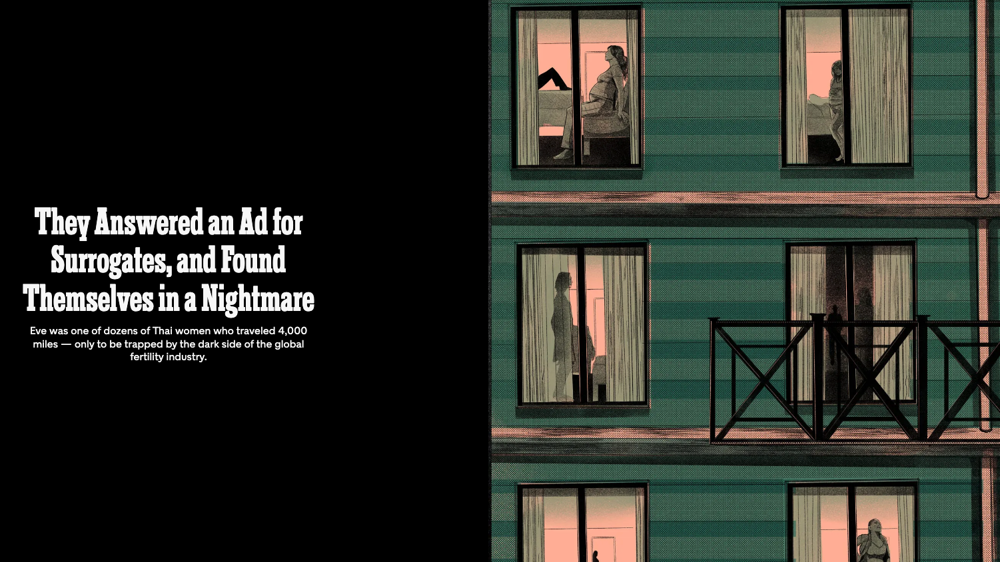
```

[They Answered an Ad for Surrogates, and Found Themselves in a Nightmare](https://www.nytimes.com/2025/12/14/magazine/fertility-surrogates-trafficking.html)

---
.center2[
# Summary
]

---
## Summary

1. **Sources of market failure**
   - External costs or benefits  
   - Asymmetric information (hidden action / hidden attributes)  
   - Limited competition ($P > MC$)
   
--

2. **Possible solutions**
   - Regulation, taxation, compensation
   
--

3. **Markets for other types of goods**
   - Public goods and public “bads”  
   - Limits to markets — not every good should have a market
   
