<style>

.center2 {
  margin: 0;
  position: absolute;
  top: 50%;
  left: 50%;
  -ms-transform: translate(-50%, -50%);
  transform: translate(-50%, -50%);
}

</style>

```{r setup, include = FALSE}
knitr::opts_chunk$set(echo = FALSE)
knitr::opts_chunk$set(out.width = "90%")
knitr::opts_chunk$set(fig.align="center")

options(htmltools.dir.version = FALSE)
library(knitr)
library(tidyverse)
library(xaringanExtra)
# set default options
opts_chunk$set(echo=FALSE,
               collapse = TRUE,
               fig.width = 7.252,
               fig.height = 4,
               dpi = 300)
# set engines
knitr::knit_engines$set("markdown")
xaringanExtra::use_tile_view()
xaringanExtra::use_panelset()
xaringanExtra::use_clipboard()
xaringanExtra::use_webcam()
xaringanExtra::use_broadcast()
xaringanExtra::use_share_again()
xaringanExtra::style_share_again(
  share_buttons = c("twitter", "linkedin", "pocket")
)
# uncomment the following lines if you want to use the NHS-R theme colours by default
# scale_fill_continuous <- partial(scale_fill_nhs, discrete = FALSE)
# scale_fill_discrete <- partial(scale_fill_nhs, discrete = TRUE)
# scale_colour_continuous <- partial(scale_colour_nhs, discrete = FALSE)
# scale_colour_discrete <- partial(scale_colour_nhs, discrete = TRUE)
```


.center[
```{r out.width="55%"}
knitr::include_graphics("https://pbs.twimg.com/media/G3Iau-sWwAAVfnh?format=jpg&name=small")
```
]

---

```{r}
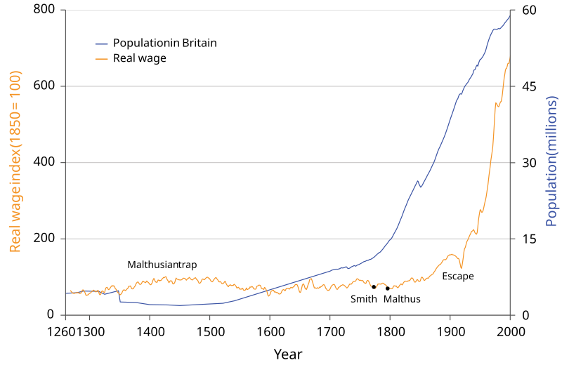
```

---

.center[
```{r out.width="150%"}
knitr::include_graphics("https://www.nobelprize.org/uploads/2025/10/fig3_ek_en_25-scaled.jpg")
```
]

---

.center[
```{r out.width="120%"}
knitr::include_graphics("https://www.nobelprize.org/uploads/2025/10/fig4_ek_en_25-scaled.jpg")
```
]


---
.center2[
# Economic decisions: Opportunity costs, economic rents, and incentives
]

---
## Economic decisions: Opportunity costs, economic rents, and incentives

What happens in the economy is the result of decisions by individuals, firms (or their owners and managers), and governments. 

--

We need to understand how people make decisions, and the factors they take into account when they choose what action to take.

--

#### Example #1: Concert

$$ 
\begin{align*}
\text{net benefit of concert} &= \text{enjoyment from attending} - \text{cost of ticket} \\
&= \$55 - \$25 \\
&= \$30
\end{align*}
$$

#### Example #2: Babysitting

$$
\begin{align*}
\text{net benefit of babysitting} &= \text{payment received} - \text{cost of effort involved} \\
&= \$40 - \$18 \\
&= \$22
\end{align*}
$$

---
## Opportunity and Economic costs

Economic decisions often involve choosing between alternative and mutually exclusive courses of action.

By taking an action (concert) you lose the opportunity of taking the next best action (babysitting). 

--

**Opportunity cost**:
What you lose when you choose one action rather than the next best alternative. Also **reservation option**.

--

Actions have both direct costs and opportunity costs.

The economic cost of an action is the sum of these two components:

$$
\text{economic cost of an action} = \text{direct costs incurred by taking the action} + \text{opportunity cost}
$$

--

For the concert example:

$$
\text{benefit} = \text{enjoyment of concert} = $55
$$

$$
\text{economic cost} = \text{cost of ticket} + \text{opportunity cost} = $25 + $22 = $47
$$

What to do?

---
## Opportunity and Economic costs

Another way to express the decision rule is:
take the action if the net benefit is greater than the opportunity cost.

For the concert example:

$$
\text{net benefit} = \text{enjoyment of concert} - \text{cost of ticket} = $55 - $25 = $30
$$

$$
\text{opportunity cost} = \text{net benefit from babysitting} = $22
$$

Since the net benefit ($30) is greater than the opportunity cost ($22), you should go to the concert.

--

**Economic rent**: the difference between the net benefit (monetary or otherwise) that an individual receives from a chosen action, and the net benefit from the next best alternative

---
## Incentives and Relative Prices

Economic rents exist throughout the economy and serve as incentives for people to take action.

--

For example, potential innovation rents may encourage firms to switch from one technology to another.

--

Economics focuses on alternatives and choices—people are free to select different actions, and their decisions depend on economic incentives such as potential rewards or penalties.

Typically, owners and managers choose the option that provides the highest profit, but other motivations—such as love, duty, ethics, or a desire for approval—can also influence decisions.

--

**Relative prices**: the price of one good or service compared to another (usually expressed as a ratio of the two prices).


A key determinant of economic incentives: they reflect the price of one option relative to another and guide decision-making for both firms and consumers.

--

Example: if goods are significantly cheaper at a supermarket than at a corner shop, and the distance is reasonable, shoppers will likely choose the supermarket.

--

If all prices rise by the same percentage (say 5%), the relative prices remain the same, and decisions are unlikely to change.

---
.center2[
# Comparative advantage, specialization, and markets
]

---
## Comparative advantage, specialization, and markets

People do not typically produce the full range of goods and services that they use or consume in their daily lives.

We **specialize**: 

- People specialize: some producing one good, others producing other goods; some working as welders, others as teachers or architects.

- Firms specialize: particular goods, or in just one part of the production process for a good.

- Countries specialize: Cambodia’s largest exports are gold and knitwear; Singapore specializes in integrated circuits.

--

Why?

- **Learning by doing**: We acquire skills as we produce things.

- **Difference in ability**: Because of skill, or the characteristics of the natural surroundings (such as soil quality, for example), some people are better at producing certain things than others.

- **Economies of scale**: Producing a large number of units of a good is often more cost-effective than producing a smaller number. 

---
## Comparative advantage: Gains from specialization

**Specialization**: each person does just one or a few of the large number of tasks necessary to complete some project or reach some goal.

--

Counter intuitive: all producers can benefit, even when this means that one producer specializes in a good that another could produce at lower cost.

--

|               | Production if 100% of time is spent on one good |
|----------------|-------------------------------------------------|
| **Greta**      | 1,250 apples or 50 tons of wheat                |
| **Carlos**     | 1,000 apples or 20 tons of wheat                |

--

**Absolute advantage**: a situation where a person or country can produce more of a good than another person or country using the same amount of resources or inputs.

--

$$\textit{# Apples}_{Greta} = 1,250 > \textit{# Apples}_{Carlos} = 1000$$

$$\textit{# Tons of wheat}_{Greta} = 50 > \textit{# Tons of wheat}_{Carlos} = 20$$

$\Rightarrow$ Greta has absolute advantage producing both goods

---
## Comparative advantage: Gains from specialization

**Specialization**: each person does just one or a few of the large number of tasks necessary to complete some project or reach some goal.


Counter intuitive: all producers can benefit, even when this means that one producer specializes in a good that another could produce at lower cost.


|               | Production if 100% of time is spent on one good |
|----------------|-------------------------------------------------|
| **Greta**      | 1,250 apples or 50 tons of wheat                |
| **Carlos**     | 1,000 apples or 20 tons of wheat                |

**Comparative advantage**: when a person or country can produce a good at a *lower opportunity cost* than another person or country.

|               | Opportunity cost of 1 ton of wheat | Opportunity cost of 1 apple |
|----------------|------------------------------------|------------------------------|
| **Greta**      | 1,250/50 = 25 apples                         | 50/1,250 = 0.04 tons of wheat           |
| **Carlos**     | 1,000/20 = 50 apples                         | 20/1,000 = 0.02 tons of wheat           |

$\Rightarrow$ Carlos has a comparative advantage⁠ in apples because his relative cost of producing apples (that is, relative to wheat) is lower than Greta’s.


---
## Comparative advantage: Gains from specialization

If Carlos and Greta cannot trade with each other, they must each be self-sufficient, consuming exactly what they produce.

- Suppose that Greta chooses to use 40% of her time in apple production, and the rest producing wheat. 
- Similarly Carlos spends 30% of his time producing apples, and 70% producing wheat.

|              |  | **Self-sufficiency** | **Specialization and trade** |     | |
|---|---|---|---|---|
|  | |  | Production | Consumption | Trade |
|  | | (1) | (2) | (3) | (4) |
|           | | | | | |
| **Greta** | Apples | 500 | | | |
|           | Wheat  | 30 | | | |
| **Carlos** | Apples | 300 | | | |
|           | Wheat  | 14 | | | |
|           | | | | | |
| **Total** | Apples | 800 | | | |
|           | Wheat  | 44 | | | | |

---
## Comparative advantage: Gains from specialization

If they were to specialize, each producing only the crop in which they have a comparative advantage:

- Greta would produce 50 tons of wheat
- Carlos would produce 1,000 apples

Suppose that they reach an agreement that both will specialize, and then Greta will sell 15 tons of wheat to Carlos in return for 600 apples.

|              |  | **Self-sufficiency** | **Specialization and trade** |     | |
|---|---|---|---|---|
|  | |  | Production | Consumption | Trade |
|  | | (1) | (2) | (3) | (4) |
|           | | | | | |
| **Greta** | Apples | 500 | 0 | 600 | Buys 600 apples |
|           | Wheat  | 30  | 50 | 35 | Sells 15t wheat |
| **Carlos** | Apples | 300 | 1,000 | 400 | Sells 600 apples |
|           | Wheat  | 14 | 0 | 15 | Buys 15t wheat |
|           | | | | | |
| **Total** | Apples | 800 | 1,000 | 1,000 | |
|           | Wheat  | 44 | 50 | 50 | | |

---
.center2[
# Firms, technology, and production
]

---
## Firms, technology, and production

**Technology**: The description of a process using a set of materials and other inputs, including the work of people and machines, to produce an output.


```{r out.width="50%"}
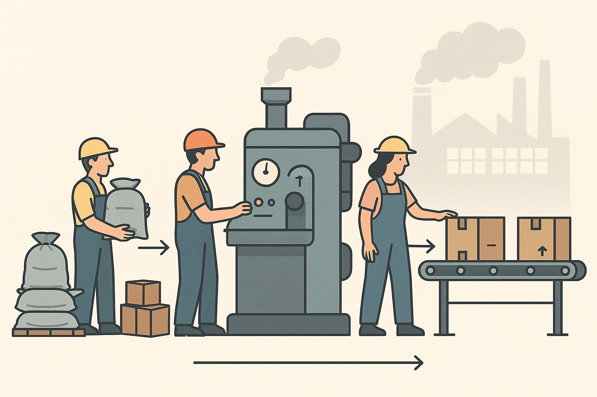
```

Having chosen a technology, need to decide on the amount of inputs to employ, which will determine how much output it can produce.

---
## Firms, technology, and production

```{r out.width="90%"}
knitr::include_graphics("https://d18y50suo8qxjg.cloudfront.net/the-economy/microeconomics/images/web/02-olive-oil-press.jpg")
```

A labour-intensive technology for producing olive oil.

---
## Firms, technology, and production

```{r out.width="75%"}
knitr::include_graphics("https://d18y50suo8qxjg.cloudfront.net/the-economy/microeconomics/images/web/02-olive-oil-extraction-process.jpg")
```

A capital-intensive olive technology.

---
## Firms, technology, and production

A **technology can be represented by a production function**⁠: a relationship that tells us how much output it will produce, given the amounts of inputs used.

$$
Y = f(M, N, E)
$$

$N$ number of workers employed, $M$ number of machines, and $E$ amount of energy used per day.

--

A hypothetical technology for olive oil:

| Number of machines, *M* | Number of workers, *N* | Amount of energy, *E* (kWh) | Output, *Y* (litres) |
|--------------------------|------------------------|------------------------------|----------------------|
| 3                        | 1                      | 80                           | 50                   |
| 6                        | 2                      | 160                          | 100                  |
| 9                        | 3                      | 240                          | 150                  |
| 12                       | 4                      | 320                          | 200                  |

1. **fixed-proportions technology**⁠: for every three machines, one worker, and 80 kWh of energy are needed.
2. **constant returns to scale**⁠:if you double (or halve) the inputs, the amount of output doubles (or halves) accordingly.

---
## Comparing two technologies

```{r out.width="70%"}
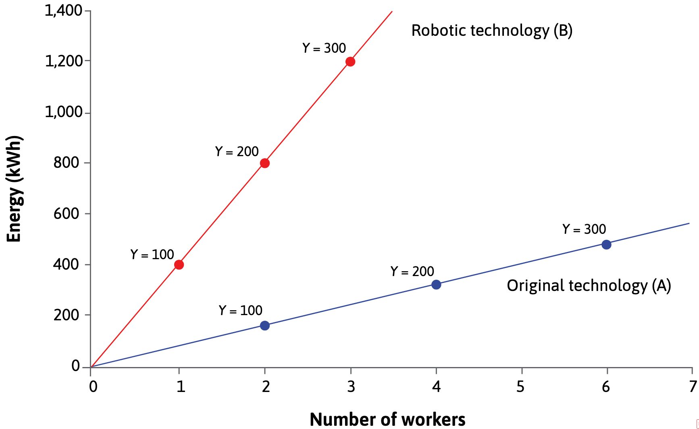
```

$$f_A(N = 2, E =160) = 100$$

---
## Comparing two technologies

```{r out.width="70%"}

```

$$f_A(N = 2, E =160) = 100 \quad \Rightarrow  \textit{Average product of labour}_A = f_A(N = 2, E =160)/2 = 100/2 = 50$$

---
## Comparing two technologies

```{r out.width="70%"}

```

$$f_A(N = 2, E =160) = 100 \quad \Rightarrow  \textit{Energy–labour ratio}_A = 160/2 = 80$$

---
## Comparing two technologies

```{r out.width="70%"}

```

$$f_B(N = 1, E =400) = 100$$

---
## Comparing two technologies

```{r out.width="70%"}

```

$$f_B(N = 1, E =400) = 100 \quad \Rightarrow  \textit{Average product of labour}_B = f_B(N = 1, E =400)/1 = 100/1 = 100$$

---
## Comparing two technologies

```{r out.width="70%"}

```

$$f_B(N = 1, E =400) = 100 \quad \Rightarrow  \textit{Energy–labour ratio}_B = 400/1 = 400$$

---
## Comparing two technologies

```{r out.width="70%"}

```

Which technology should be used?

---
.center2[
# Modelling a dynamic economy: Technology and costs
]

---
## Modelling a dynamic economy: Technology and costs

Five different technologies to produce 100 metres of cloth.

Inputs: labour (number of workers) and energy (tons of coal).

| Technology | Number of workers | Coal required (tons) |
|-------------|-------------------|----------------------|
| A           | 1                 | 6                    |
| B           | 4                 | 2                    |
| C           | 3                 | 7                    |
| D           | 5                 | 5                    |
| E           | 10                | 1                    |


---
## Modelling a dynamic economy: Technology and costs

.left-column[
| Tech. | No. of workers | Coal (tons) |
|-------------|-------------------|----------------------|
| A           | 1                 | 6                    |
| B           | 4                 | 2                    |
| C           | 3                 | 7                    |
| D           | 5                 | 5                    |
| E           | 10                | 1                    |

Technology A is the most energy-intensive, using one worker and six tons of coal.

]

.right-column[
```{r, out.width="85%"}
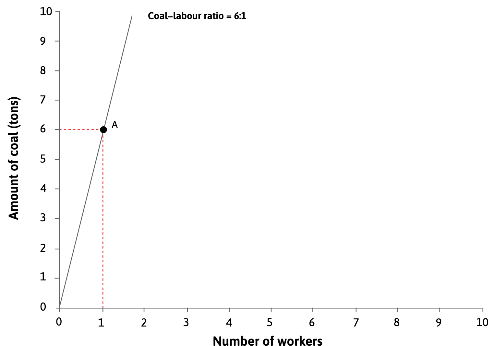
```
]

---
## Modelling a dynamic economy: Technology and costs

.left-column[
| Tech. | No. of workers | Coal (tons) |
|-------------|-------------------|----------------------|
| A           | 1                 | 6                    |
| B           | 4                 | 2                    |
| C           | 3                 | 7                    |
| D           | 5                 | 5                    |
| E           | 10                | 1                    |

Technology B : it is more labour-intensive than technology A, because the ratio of workers to coal required to produce the given output is higher for B than A.
]

.right-column[
```{r, out.width="85%"}
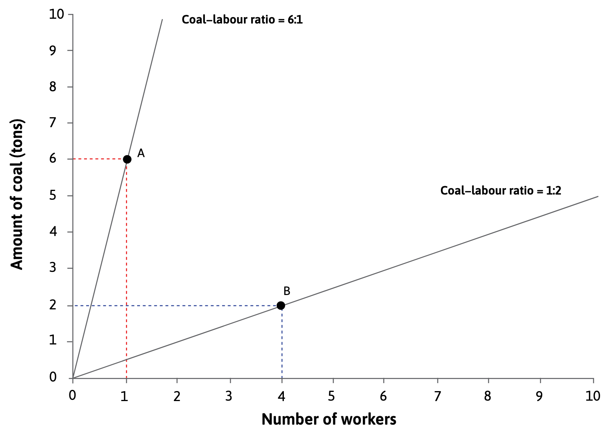
```
]

---
## Modelling a dynamic economy: Technology and costs

.left-column[
| Tech. | No. of workers | Coal (tons) |
|-------------|-------------------|----------------------|
| A           | 1                 | 6                    |
| B           | 4                 | 2                    |
| C           | 3                 | 7                    |
| D           | 5                 | 5                    |
| E           | 10                | 1                    |

Technology E is the most labour-intensive of the five technologies: it uses ten workers and one ton of coal.

]

.right-column[
```{r, out.width="85%"}
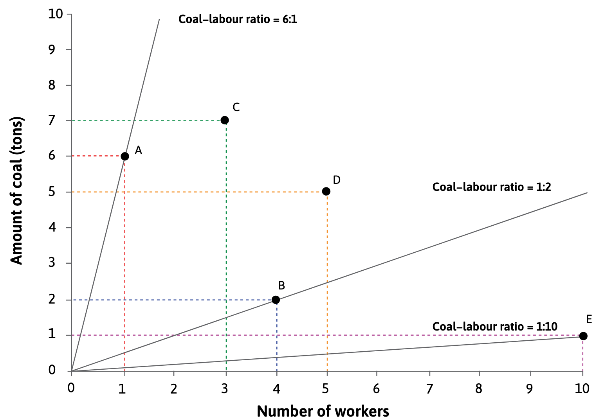
```
]

---
## Modelling a dynamic economy: Technology and costs

Which technology would the firm choose?

```{r out.width="70%"}
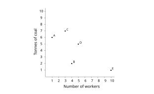
```


---
## Modelling a dynamic economy: Technology and costs

```{r out.width="70%"}
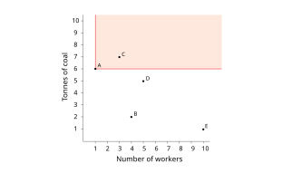
```

Technology A dominates the C-technology: the same amount of cloth can be produced using A with fewer inputs of labour and energy. This means that, whenever A is available, you would never use C.

---
## Modelling a dynamic economy: Technology and costs

```{r out.width="70%"}
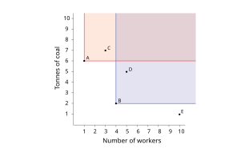
```

Technology B dominates the D-technology: the same amount of cloth can be produced using B with fewer inputs of labour and energy. Note that B would dominate any other technology that is in the shaded area above and to the right of point B.

---
## Modelling a dynamic economy: Technology and costs


```{r out.width="70%"}
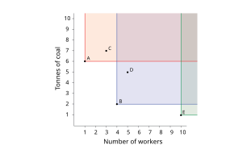
```

Technology E does not dominate any of the available technologies. None of them are in the area above and to the right of E. Technology E is also not dominated by any other available technology.


---
### How does a firm evaluate the cost of production using different technologies?

Firms aim to maximize their profit,
--
 which means producing cloth at the least possible cost.
 
--

This is why the firms’ choice of technology depends on economic information about relative prices of inputs.

--

$$ cost = (wage \times workers ) + (\textit{price of a tonne of coal} \times \textit{number of tonnes of coal}) $$

--

$$ c = (w \times L ) + (p \times R) $$

--

$$ c = w L + p R $$

--
Then
$$ p R = c - w L $$

--

$$ R = \frac{c}{p} - \frac{w}{p} L $$
--

** $R$ =  Isocost lines**: combinations of inputs that give the same cost (slope = relative price of inputs)

--

** $- \frac{w}{p}$ **: slope $\rightarrow$ **relative price of labour**

---

**Suppose that the wage is £10 and the price of coal is £20 per tonne**
--
 $\rightarrow \textit{Relative price}:  \frac{w}{p} = \frac{10}{20} = .5$ 

--

```{r out.width="70%"}
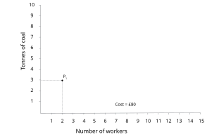
```

--

The total cost of employing 2 workers with 3 tonnes of coal is (2 × 10) + (3 × 20) = £80.

---

**Suppose that the wage is £10 and the price of coal is £20 per tonne** $\rightarrow \textit{Relative price}:  \frac{w}{p} = \frac{10}{20} = .5$ 

```{r out.width="70%"}
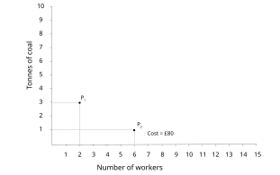
```


If the number of workers is increased to 6, costing £60, and the input of coal is reduced to 1 tonne, the total cost will still be £80.

---

**Suppose that the wage is £10 and the price of coal is £20 per tonne** $\rightarrow \textit{Relative price}:  \frac{w}{p} = \frac{10}{20} = .5$


```{r out.width="70%"}
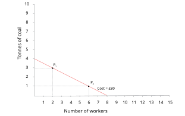
```


The straight line through P1 and P2 joins together all the points where the total cost is £80.

---

**Suppose that the wage is £10 and the price of coal is £20 per tonne** $\rightarrow \textit{Relative price}:  \frac{w}{p} = \frac{10}{20} = .5$


```{r out.width="70%"}
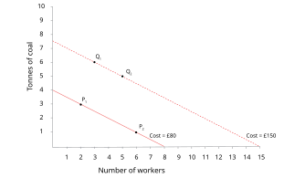
```


At point Q1 (3 workers, 6 tonnes of coal) the total cost is £150. 
In point Q2, if 2 more workers are employed, the input of coal should be reduced by 1 tonne to keep the cost at £150. This is the £150 isocost line.

---

**Suppose that the wage is £10 and the price of coal is £20 per tonne** $\rightarrow \textit{Relative price}:  \frac{w}{p} = \frac{10}{20} = .5$


```{r out.width="70%"}
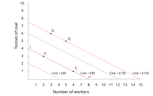
```


If prices of inputs are fixed, the isocost lines are parallel. A simple way to draw any line is to find the end points: for example, the £80 line joins the points J (4 tonnes of coal and no workers) and H (8 workers, no coal).

---

**Suppose that the wage is £10 and the price of coal is £20 per tonne** $\rightarrow \textit{Relative price}:  \frac{w}{p} = \frac{10}{20} = .5$


```{r out.width="70%"}

```


The slope of the isocost lines is negative. In this case the slope is −0.5, because at each point, if you hired one more worker, costing £10, and reduced the amount of coal by 0.5 tonnes, saving £10.

---

**Suppose that the wage is £10 and the price of coal is £20 per tonne** $\rightarrow \textit{Relative price}:  \frac{w}{p} = \frac{10}{20} = .5$


```{r out.width="70%"}
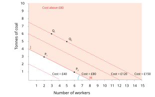
```


Points above an isocost line cost more.

---

**Suppose that the wage is £10 and the price of coal is £20 per tonne** $\rightarrow \textit{Relative price}:  \frac{w}{p} = \frac{10}{20} = .5$


```{r out.width="100%"}
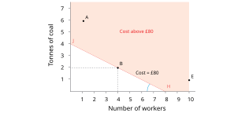
```


Which is the least-cost technology?
--
 **B**

---

**Suppose that the wage is £10 and the price of coal is £20 per tonne** $\rightarrow \textit{Relative price}:  \frac{w}{p} = \frac{10}{20} = .5$


| Technology | Number of workers | Coal required (tonnes) | Total cost (£) |
|------------|------------------|------------------------|---------------|
| B          | 4                | 2                      | 80            |
| A          | 1                | 6                      | 130           |
| E          | 10               | 1                      | 120           |

*Wage £10, cost of coal £20 per tonne*

Which is the least-cost technology? **B**

---
.center2[
# Modelling a dynamic economy: Innovation and profit
]

---
### Modelling a dynamic economy: Innovation and profit

**Suppose that the price of coal falls to £5 while the wage remains at £10**
--
 $\rightarrow \textit{Relative price}:  \frac{w}{p} = \frac{10}{5} = 2$
 
---
### Modelling a dynamic economy: Innovation and profit

**Suppose that the price of coal falls to £5 while the wage remains at £10**
 $\rightarrow \textit{Relative price}:  \frac{w}{p} = \frac{10}{5} = 2$

```{r out.width="62.5%"}
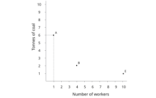
```

--

A-technology, which is more energy-intensive than the others, can produce 100 metres of cloth at a lower cost than B or E.

---
### Modelling a dynamic economy: Innovation and profit

**Suppose that the price of coal falls to £5 while the wage remains at £10** $\rightarrow \textit{Relative price}:  \frac{w}{p} = \frac{10}{5} = 2$
 
```{r out.width="62.5%"}
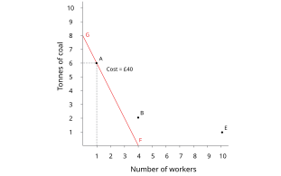
```

The A-technology is on the isocost line FG. At any point on this line, the total cost of inputs is £40. Technologies B and E are above this line, with higher costs.

---
### Modelling a dynamic economy: Innovation and profit

**Suppose that the price of coal falls to £5 while the wage remains at £10** $\rightarrow \textit{Relative price}:  \frac{w}{p} = \frac{10}{5} = 2$
 
```{r out.width="62.5%"}
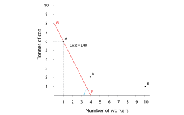
```

The slope of the isocost line is equal to −(10/5) = −2. If you spent £10 on labour by hiring an extra worker, you could reduce coal by 2 tonnes and keep the total cost at £40.

---
### Modelling a dynamic economy: Innovation and profit

At the original relative price, B is the lower cost technology

```{r out.width="60%"}
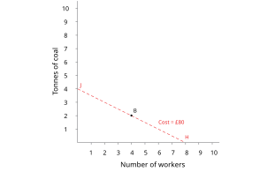
```

When the wage is £10 and the price of coal is relatively high at £20, the cost of producing 100 metres of cloth using technology B is £80: choosing the B-technology puts the firm on the HJ isocost curve.

---
### Modelling a dynamic economy: Innovation and profit

The price of coal falls to £5

```{r out.width="60%"}
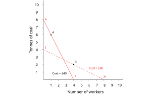
```

If the price of coal falls relative to the wage as shown by the isocost curve FG, then using the A-technology, which is more energy-intensive than B, costs £40. 


---
### Modelling a dynamic economy: Innovation and profit

The price of coal falls to £5

| Technology | Number of workers | Coal required (tonnes) | Total cost (£) |
|------------|------------------|------------------------|---------------|
| B          | 4                | 2                      | 50            |
| A          | 1                | 6                      | 40            |
| E          | 10               | 1                      | 105           |

*Wage £10, cost of coal £5 per tonne*

If the price of coal falls relative to the wage as shown by the isocost curve FG, then using the A-technology, which is more energy-intensive than B, costs £40. 

---
### Modelling a dynamic economy: Innovation and profit

B now costs more than A

```{r out.width="60%"}
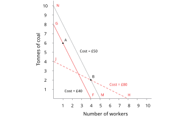
```

At the new relative prices, the B-technology is on the isocost line MN, where the cost is £50. Switching to technology A will be cheaper.

---
### Modelling a dynamic economy: Innovation and profit

$$ profits = revenue - costs $$
--

Switching from A to B:

$$ \Delta profits =  \Delta revenue -  \Delta costs =  0 -  (40 - 50) = 10 $$

--

The economic rent for a firm switching from B to A is £10 per 100 metres of cloth, which is the cost reduction made possible by the new technology 


--

.pull-left[
**Schumpeterian (innovation) rents**

Joseph Schumpeter: the adoption of technological improvements by **entrepreneurs** --first adopters-- a key part of his explanation for the dynamism of capitalism. 

**Creative Destruction**: the process by which old technologies and the firms that do not adapt are swept away by the new, because they cannot compete in the market.
]

.pull-right[
```{r out.width="80%"}
knitr::include_graphics("https://media.giphy.com/media/xT0xeJpnrWC4XWblEk/giphy-downsized-large.gif")
```
]

---

.center[
```{r out.width="120%"}
knitr::include_graphics("https://www.nobelprize.org/uploads/2025/10/fig1_ek_25.jpg")
```
]


---
.center2[
# Cheap coal, expensive labour: The Industrial Revolution in Britain and incentives for new technologies
]

---

```{r out.width="70%"}
knitr::include_graphics("https://cdn.britannica.com/46/239846-050-C825DE1E/Illustration-of-a-woman-using-the-spinning-jenny-invented-by-James-Hargreaves.jpg")
```


*Spinning jenny*: $\rightarrow$ A machine operated by 1 adult replaced 8 spinsters. By late XIXth century, 1,000 spinsters.

---
### The Industrial Revolution in Britain and incentives for new technologies

The model suggests why people invent and adopt new technologies. But what does the evidence show?

.center[
<iframe src="https://ourworldindata.org/grapher/wages-relative-to-the-price-of-energy?tab=chart" loading="lazy" style="width: 80%; height: 500px; border: 0px none;" allow="web-share; clipboard-write"></iframe>
]

---
### The Industrial Revolution in Britain and incentives for new technologies

The incentive to substitute machines for workers was rising in England, but not in France during this period.

.center[
<iframe src="https://ourworldindata.org/grapher/wages-relative-to-the-cost-of-capital?tab=line" loading="lazy" style="width: 80%; height: 500px; border: 0px none;" allow="web-share; clipboard-write"></iframe>

]

---
### The Industrial Revolution in Britain and incentives for new technologies

Technology choose depends on relative input prices

```{r out.width="70%"}
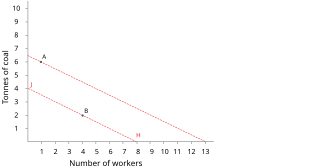
```

--

In the 1600s, the relative prices are shown by isocost line HJ. The B-technology was used. At those relative prices, there was no incentive to develop a technology like A, which is outside the isocost line HJ.

---
### The Industrial Revolution in Britain and incentives for new technologies

The combination of capacity to innovate and changing relative prices of inputs led to a switch to energy-intensive technology.


```{r out.width="70%"}
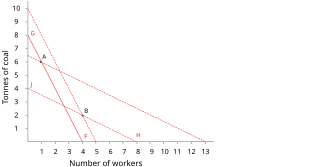
```

In the 1700s, the isocost lines such as FG were much steeper, because the relative price of labour to coal was higher. The relative cost was sufficiently high to make the A-technology lower cost than the B-technology.

---
### The Industrial Revolution in Britain and incentives for new technologies

The combination of capacity to innovate and changing relative prices of inputs led to a switch to energy-intensive technology.


```{r out.width="70%"}
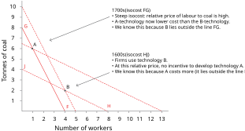
```

We know that when the relative price of labour is high, technology A is lower cost because the B-technology lies outside the isocost line FG.

---
### The Industrial Revolution in Britain and incentives for new technologies

```{r, out.width="70%"}

```

This is part of the explanation of the upward kink in the hockey stick. Explaining the long flat part of the stick is another story, requiring a different model.

---

.center[
```{r out.width="120%"}
knitr::include_graphics("https://www.nobelprize.org/uploads/2025/10/fig2_ek_en_25.jpg")
```
]

---

.center[
```{r out.width="120%"}
knitr::include_graphics("https://www.nobelprize.org/uploads/2025/10/fig6_ek_en_25.jpg")
```
]


---
.center2[
# Economic models: How to see more by looking at less
]

---
.center2[
```{r, out.width="150%"}
knitr::include_graphics("imgs/montorgueil1.png")
```
]

---
.center2[
```{r, out.width="150%"}
knitr::include_graphics("imgs/montorgueil2.png")
```
]

---
.center2[
```{r, out.width="150%"}
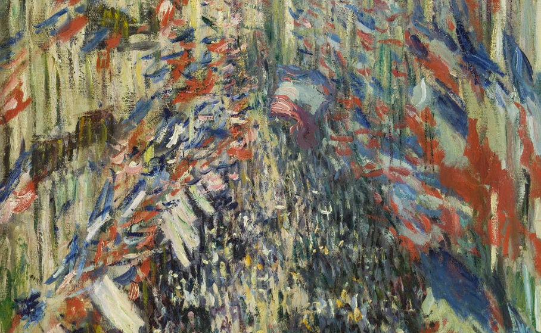
```
]

---
```{r, out.width="57%"}

```

*La Rue Montorgueil, à Paris. Fête du 30 juin 1878*. Claude Monet.

---
## Economic models: How to see more by looking at less

Economic outcomes depend on millions of interactions between economic actors. 

It would be impossible to understand the economy by describing every detail of how they act and interact. 

We need to be able to stand back and look at the big picture. To do this, we use models.

--

Models *ingredients*:

- **Incentives**: economic rewards or punishments, which influence the benefits and costs of alternative courses of action.

- **Equilibrium**: situation that is self-perpetuating. Something of interest does not change unless an external force is introduced that alters the model's description of the situation.

- **endogenous⁠ variables**:  ‘generated by the model’. In an economic model, a variable is endogenous if its value is determined by the workings of the model (rather than being set by the modeller)

- **exogenous⁠ variables**: ‘generated outside the model’. In an economic model, a variable is exogenous if its value is set by the modeller, rather than being determined by the workings of the model itself.

- **Ceteris paribus**: simplification that involves "holding other things (in/outside the model) constant”. 


---
## Economic models: See more by looking at less

We need to be able to stand back and look at the big picture. 
They often use mathematical equations and graphs as well as words and pictures. 

.pull-left[
A good model:

- **Is clear**: it helps us better understand something important

- **Predicts accurately**: its predictions are consistent with evidence 

- **Improves communication**: it helps us to understand what we agree (and disagree) about 

- **It is useful**: We can use it to find ways to improve how the economy works
]

--

.pull-right[
```{r out.width="90%"}
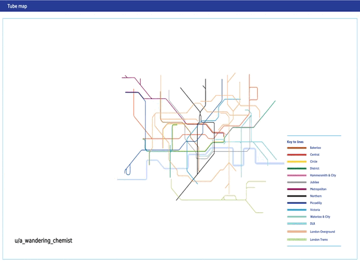
```
]

--

Bad models can result in disastrous policies. To have confidence in a model, we need to see whether it is consistent with evidence.

---
.center2[
#  Markets, cheap calories, and cotton: The colonies, slavery, and the Industrial Revolution in Britain
]

---
.center2[
# Growth: Escaping the Malthusian trap
]

---
## Growth: Escaping the Malthusian trap

.center[
<iframe src="https://ourworldindata.org/grapher/escaping-the-malthusian-trap?tab=chart" loading="lazy" style="width: 80%; height: 500px; border: 0px none;" allow="web-share; clipboard-write"></iframe>
]

---

```{r out.width="50%"}
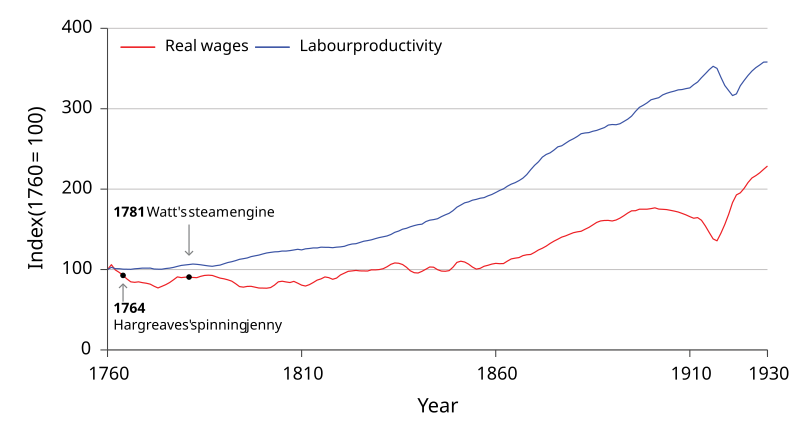
```

```{r out.width="35%"}
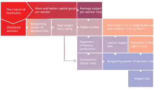
```

The story begins with technological improvements, such as the spinning jenny and the steam engine, that increased output per worker. Innovation continued as the technological revolution became permanent, displacing thousands of spinsters, weavers and farmers.

---

```{r out.width="50%"}

```

```{r out.width="35%"}
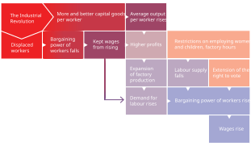
```

The loss of employment reduced workers’ bargaining power, keeping wages low, seen in the flat line between 1750 and 1830. The size of the pie was increasing, but the workers’ slice was not.

---

```{r out.width="50%"}

```

```{r out.width="35%"}
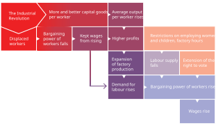
```

In the 1830s, higher productivity and low wages led to a surge in profits. Profits, competition, and technology drove businesses to expand. The demand for labour went up. People left farming for jobs in the new factories.

---
```{r out.width="50%"}
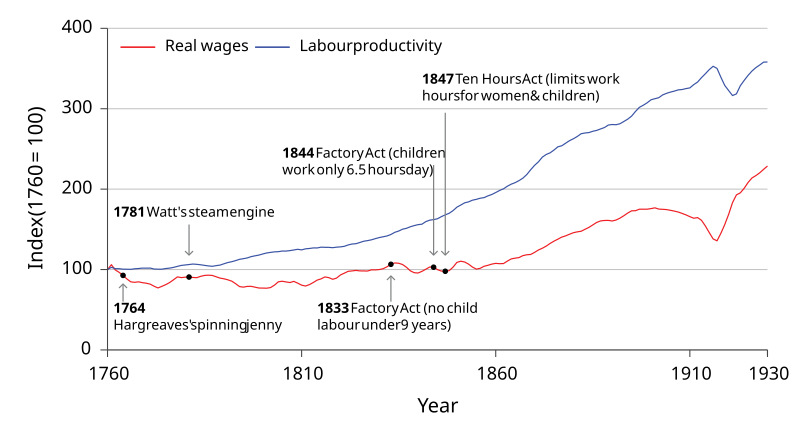
```

```{r out.width="35%"}
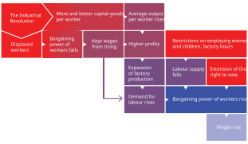
```

The supply of labour fell when business owners were stopped from employing children. The combination of higher labour demand and lower supply enhanced workers’ bargaining power.

---
```{r out.width="50%"}

```

```{r out.width="35%"}
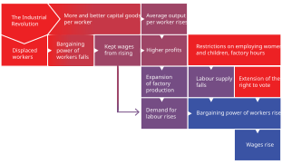
```

The power of working people increased as they gained the right to vote and formed trade unions. These workers were able to claim a constant or rising share of the increases in productivity generated by the permanent technological revolution.

---
.center2[
# Capitalism + carbon = hockey stick growth + climate change
]

---
## Capitalism + carbon = hockey stick growth + climate change

A bathtub model: the stock of atmospheric $CO_2$

```{r out.width="40%"}
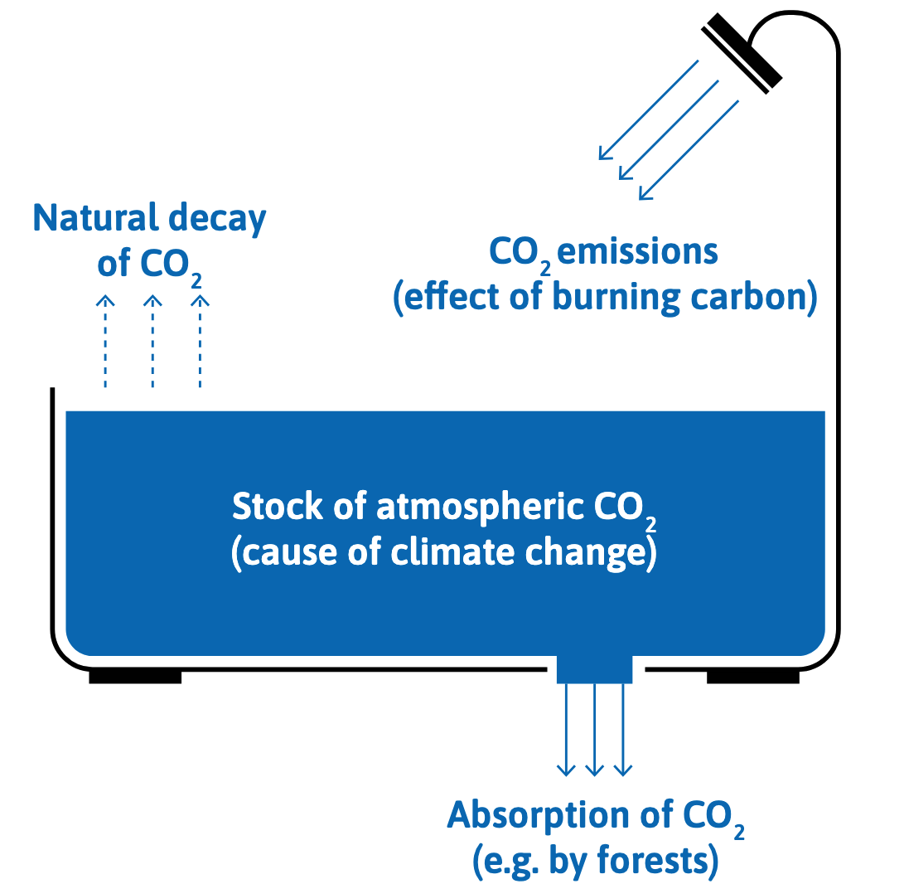
```

- **Stock**: amount of CO2 in the atmosphere
- **Flow**: amount being added per year

---
## Capitalism + carbon = hockey stick growth + climate change

```{r out.width="70%"}
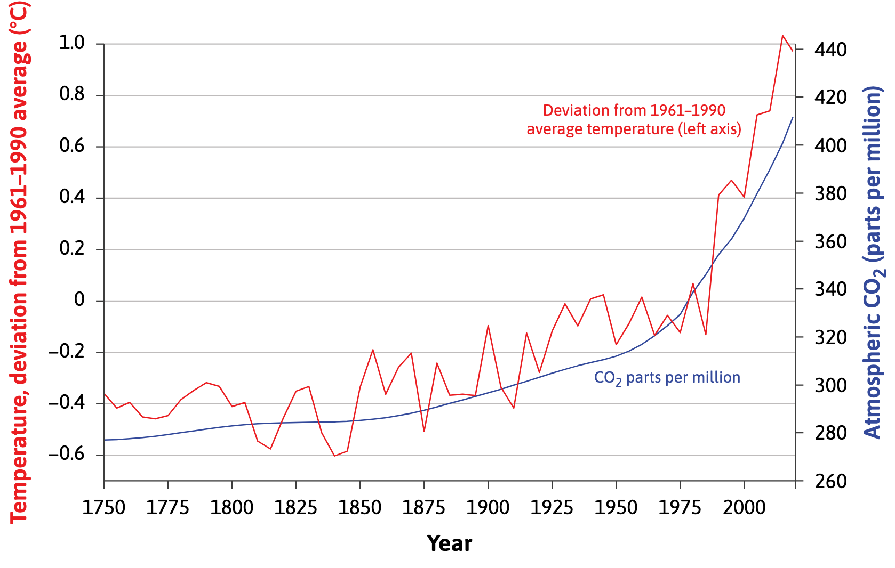
```

Global atmospheric concentration of carbon dioxide and global temperatures

---
## Capitalism + carbon = hockey stick growth + climate change

```{r out.width="80%"}
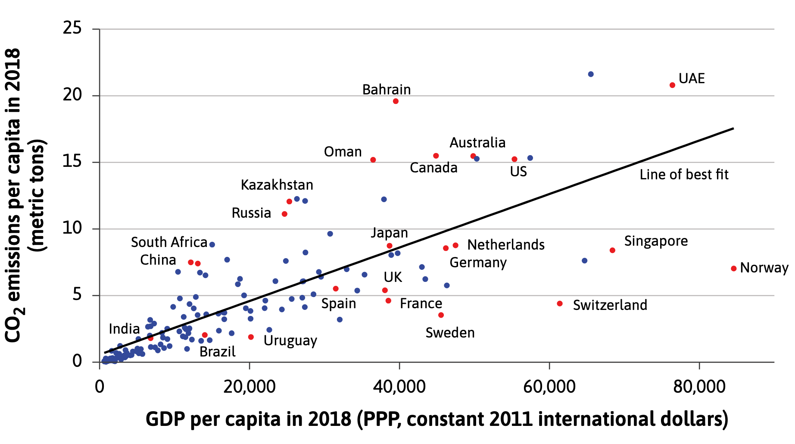
```

Carbon dioxide emissions are higher in richer countries

---
## Capitalism + carbon = hockey stick growth + climate change

Can the technological innovation model help predict or explain aspects of climate change?

```{r out.width="70%"}
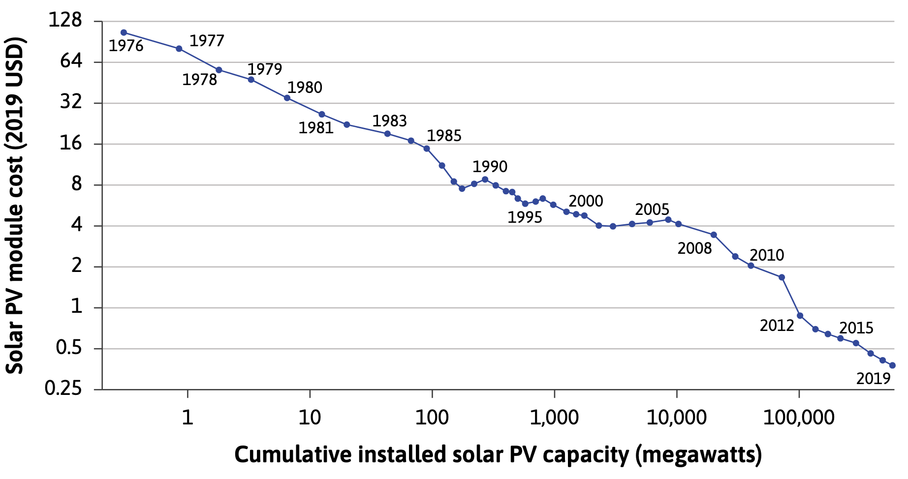
```

---
## Capitalism + carbon = hockey stick growth + climate change

Can the technological innovation model help predict or explain aspects of climate change?

```{r out.width="70%"}
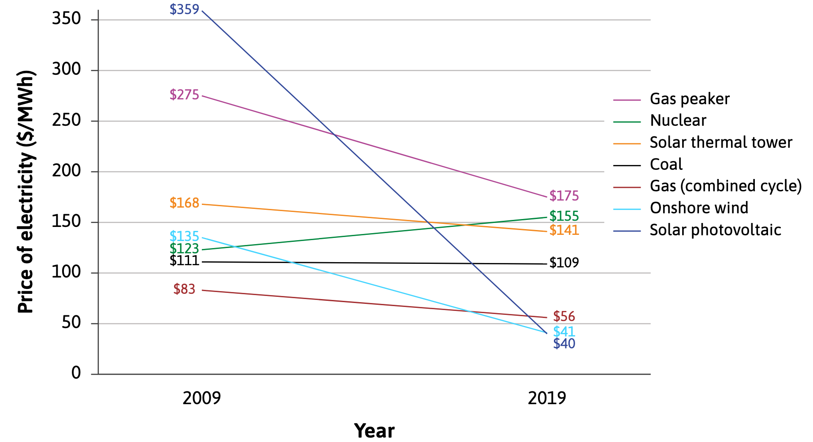
```

---
## Capitalism + carbon = hockey stick growth + climate change

Can the technological innovation model help predict or explain aspects of climate change?

```{r out.width="70%"}
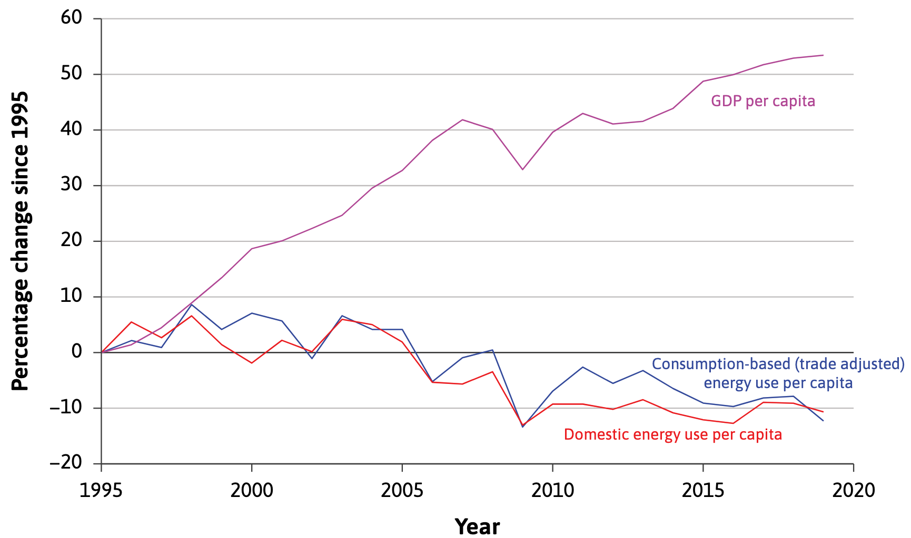
```

Seems like it does.

---
.center2[
# How good is the model? Economists, historians, and the Industrial Revolution
]

---
## How good is the model? Economists, historians, and the Industrial Revolution

Why did the Industrial Revolution happen first in the 18th Century, on an island off the coast of Europe?

Many alternative explanations provided by historians, economic historians, and economists
--

- **Robert Allen**: relatively high cost of labour & cheap local sources of energy

--

- **Joel Mokyr**: Europe’s scientific revolution and Enlightenment

--

- **David Landes**: political and cultural characteristics of nations as a whole

--

- **Gregory Clark**: cultural attributes such as hard work and savings

--

- **Kenneth Pomeranz**: abundance of coal and access to colonies

--

Economists can learn from historians, but historical arguments are often too imprecise for economic models. Conversely, historians may find economic models too simplistic. 

--

(If you're interested in **drama, academic gossip, or debates** between historians and economists, I highly recommend this [post](https://www.noahpinion.blog/p/on-the-wisdom-of-the-historians).)

---

```{r, out.width="80%"}

```


---
.center[
```{r out.width="55%"}
knitr::include_graphics("https://pbs.twimg.com/media/G3Iau-sWwAAVfnh?format=jpg&name=small")
```
]

.center[

[Collège de France: Philippe Aghion
Économie des institutions, de l'innovation et de la croissance](https://www.college-de-france.fr/fr/chaire/philippe-aghion-economie-des-institutions-de-innovation-et-de-la-croissance-chaire-statutaire)

]

---
.center2[
# Summary
]

---
## Summary

-	Rising productivity in 18th-century Britain broke the Malthusian trap, leading to higher wages and improved living standards.

- Firms adopted new technologies to reduce costs and increase profits, driven by incentives from relative prices and opportunity costs.

- Specialization and trade based on comparative advantage boosted productivity, supported by expanding markets and firm-based production.

-Cheap coal and high wages encouraged innovation in labour-saving, energy-intensive technologies, fueling industrial growth.

- Global connections—including access to colonial resources and slavery—underpinned Britain’s industrial expansion, while dependence on fossil fuels set the stage for modern climate challenges.
