<style>

.center2 {
  margin: 0;
  position: absolute;
  top: 50%;
  left: 50%;
  -ms-transform: translate(-50%, -50%);
  transform: translate(-50%, -50%);
}

</style>


```{r meta, echo=FALSE}
library(metathis)
meta() %>%
  meta_general(
    description = "An Introduction to xaringan for Presentations: The Basics",
    generator = "xaringan and remark.js"
  ) %>% 
  meta_name("github-repo" = "spcanelon/xaringan-basics-and-beyond")
  # meta_social(
  #   title = "Sharing Your Work with xaringan &#8212; Day 1",
  #   url = "https://spcanelon.github.io/xaringan-basics-and-beyond/slides/day-01-basics.html#1",
  #   image = "https://raw.githubusercontent.com/spcanelon/xaringan-basics-and-beyond/main/slides/day-01-cover-image.png",
  #   image_alt = "Title slide for the day 1 slides of the Sharing Your Work with xaringan workshop series",
  #   og_type = "website",
  #   og_author = "Silvia Canelon",
  #   twitter_card_type = "summary_large_image",
  #   twitter_creator = "@spcanelon"
  # )
```

```{r setup, include = FALSE}
knitr::opts_chunk$set(echo = FALSE)
knitr::opts_chunk$set(out.width = "85%")
knitr::opts_chunk$set(fig.align="center")

options(htmltools.dir.version = FALSE)
library(knitr)
library(tidyverse)
library(xaringanExtra)
library(tweetrmd)
# set default options
opts_chunk$set(echo=FALSE,
               collapse = TRUE,
               fig.width = 7.252,
               fig.height = 4,
               dpi = 300)
# set engines
knitr::knit_engines$set("markdown")
xaringanExtra::use_tile_view()
xaringanExtra::use_panelset()
xaringanExtra::use_clipboard()
xaringanExtra::use_webcam()
xaringanExtra::use_broadcast()
xaringanExtra::use_share_again()
xaringanExtra::style_share_again(
  share_buttons = c("twitter", "linkedin", "pocket")
)
# uncomment the following lines if you want to use the NHS-R theme colours by default
# scale_fill_continuous <- partial(scale_fill_nhs, discrete = FALSE)
# scale_fill_discrete <- partial(scale_fill_nhs, discrete = TRUE)
# scale_colour_continuous <- partial(scale_colour_nhs, discrete = FALSE)
# scale_colour_discrete <- partial(scale_colour_nhs, discrete = TRUE)
```


.center2[
# Get a life
]

---

```{r, out.width="75%"}
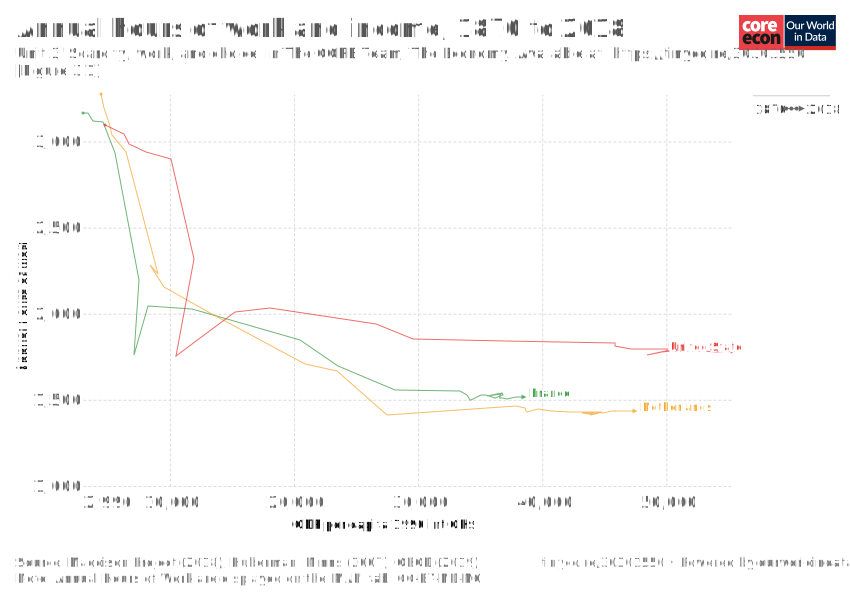
```

--

For most countries, living standards have greatly increased since 1870.
--
 But there are disparities in free time and income across countries.

---

```{r, out.width="80%"}
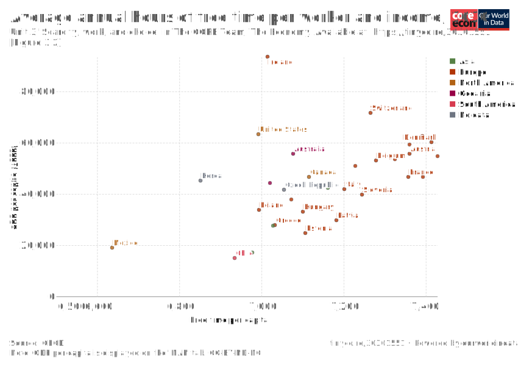
```

---
.center[
# Labour
]

--

.pull-left[

- Work (Unit 1)

- Input in the production of goods and services (Unit 2)

- New technologies raise the productivity of labour (Unit 2)
  - Does that affect living standards?
  - Does that affect the free time and working hours chosen by individuals?

- **Model individual choice** to explain the differences in work hours across countries and over time

]

.pull-right[
```{r, out.width="75%"}
knitr::include_graphics("https://upload.wikimedia.org/wikipedia/commons/thumb/d/df/We_Can_Do_It%21_NARA_535413_-_Restoration_2.jpg/250px-We_Can_Do_It%21_NARA_535413_-_Restoration_2.jpg")
```
]

---

.center2[
# Scarcity and choice: Key concepts
]

---

.center[
# Example: Students
]

--

As a student, you make choice every day:
--
 how many hours to spend studying.

--

There are many factors influencing your decision:

- how much you enjoy studying/working
- how difficult you find it
- how much your friends study

--

Positive relation between grades and number of hours studied, **ceteris paribus**

|     | **High study time (42 students)** | **Low study time (42 students)** |
| --- | --- | --- |
| Average Grades | 3.43 | 3.36 |

---

.center[
### Example: Students
]


As a student, you make choice every day: how many hours to spend studying.


There are many factors influencing your decision:

- how much you enjoy studying/working
- how difficult you find it
- how much your friends study


Positive relation between grades and number of hours studied: **context dependent**

|     | **High study time (42 students)** | **Low study time (42 students)** |
| --- | --- | --- |
| Good environment | 3.63 | 3.43 |
| Poor environment | 3.36 | 3.17 |

--

Alexei **production function**: $y = f(h)$

Translates the number of hours per day spendt studying (input of labor) into a grade (output).

| |	|	| 	| |	|		| 	| 	|  |	 |	 |  |	 |  |  |  |
| --- | ---	| ---	| ---	| --- |	--- |	---	| ---	| ---	| --- |	--- |	--- | --- |	--- | --- | --- | --- |
| Study hours | 0	| 1	| 2	| 3 |	4 |	5	| 6	| 7	| 8 |	9 |	10 | 11 |	12 | 13 | 14 | $\geq$ 15 |
| Grade | 0	| 20	| 33	| 42 | 50 |	57	| 63	| 69 | 74 |	78 | 81 | 84 |	86 | 88 | 89 | 90 |

---

.center[
Alexei **production function**
]

$$y = f(h)$$

--

```{r, out.width="70%"}
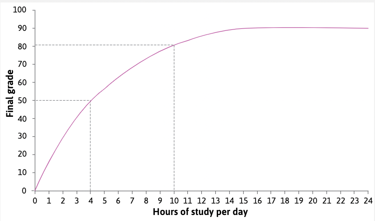
```

The curve is Alexei’s production function. It shows how an input of study hours produces an output, the final grade.

---

.center[
Alexei **production function**
]

$$y = f(h)$$

```{r, out.width="70%"}

```

If Alexei studies for four hours his grade will be 50, and if he studies for 10 hours he will achieve a grade of 81.


---

.center[
Alexei **production function**
]

$$y = f(h)$$

```{r, out.width="70%"}
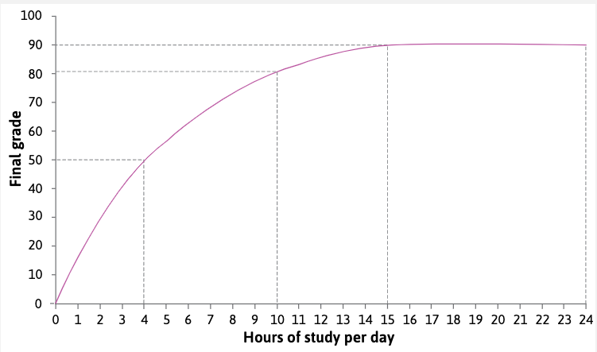
```

At 15 hours of study per day Alexei achieves his maximum possible grade, 90. After that, further hours will make no difference to his result: the curve is flat.

---

.center[
Alexei **production function**
]

$$y = f(h)$$

```{r, out.width="70%"}
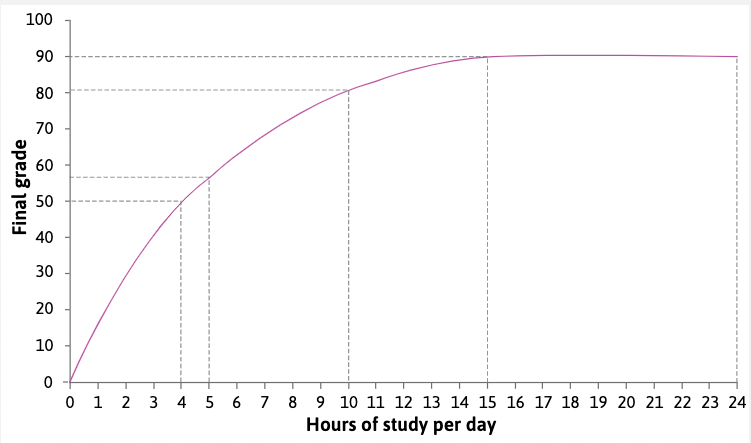
```

Increasing study time from 4 to 5 hours raises Alexei’s grade from 50 to 57. Therefore, at 4 hours of study, the marginal product of an additional hour is 7.

---

.center[
Alexei **production function**
]

$$y = f(h)$$

```{r, out.width="70%"}
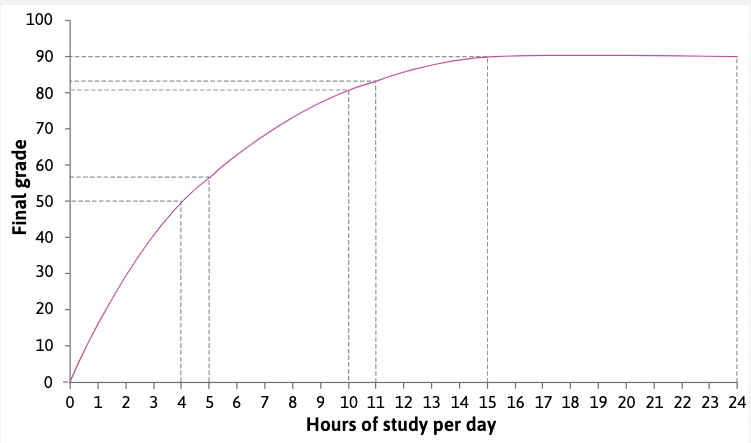
```

Increasing study time from 10 to 11 hours raises Alexei’s grade from 81 to 84. At 10 hours of study, the marginal product of an additional hour is 3.

---

.center[
Alexei **production function**
]

$$y = f(h)$$

```{r, out.width="70%"}

```

As we move along the curve, the slope of the curve falls, so the marginal product of an extra hour falls. The marginal product is diminishing.

---

.center[
Alexei **production function**
]

$$y = f(h)$$

```{r, out.width="70%"}
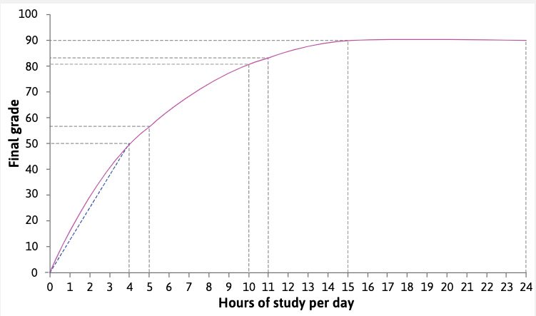
```

When Alexei studies for four hours per day his average product is 50/4 = 12.5 percentage points, which is the slope of the ray from that point to the origin.

---

.center[
Alexei **production function**
]

$$y = f(h)$$

```{r, out.width="70%"}
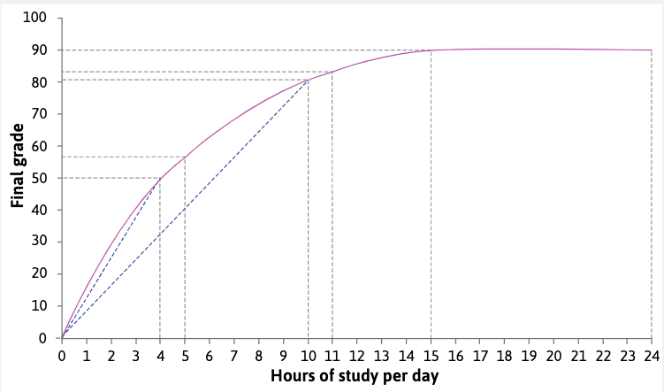
```

At 4 hours per day the average product is 12.5. At 10 hours per day it is lower (81/10 = 8.1). The average product falls as we move along the curve. At each point the marginal product (the slope of the curve) is lower than the average product (the slope of the ray).

---

.center[
Alexei **production function**
]

$$y = f(h)$$

```{r, out.width="70%"}
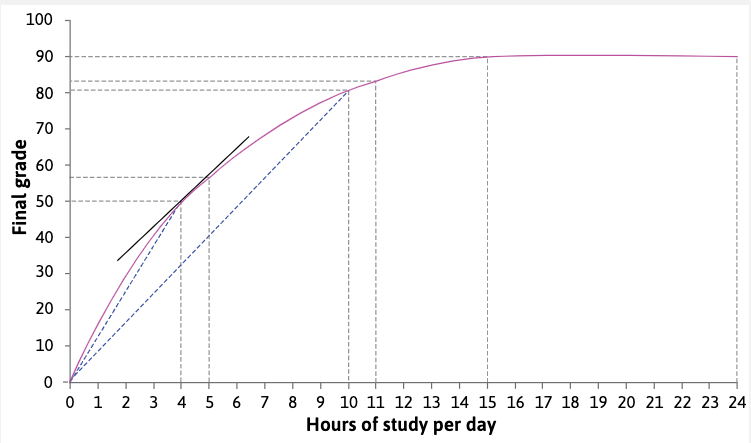
```

The marginal product at four hours of study is approximately 7, which is the increase in the grade from one more hour of study. More precisely, the marginal product is the slope of the tangent at that point, which is slightly higher than 7.

---

.center[
### What can production functions tell us?
]

--

**1. Average product**: Average output per unit of input

$$ \frac{y}{h} = \frac{f(h)}{h} $$

--

**2. Marginal product**: Change in output per unit change in input. (*Evaluated at a given point, holding other inputs constant*
--
, or **slope of the tangent to the curve at a point**)

.pull-left[

$$ \frac{\Delta y}{\Delta h} = \frac{f(h + \Delta h) - f(h)}{\Delta h} $$

]

--

.pull-right[

$$ \Delta h \rightarrow 0 \quad \Rightarrow  \quad  \frac{\Delta y}{\Delta h} = \frac{d y}{d h} = f'(h) $$

]

--

```{r, out.width="45%"}
data <- 
  tibble(
    hours = seq(0,20),
    grade = c(0, 20, 33, 42, 50, 57, 63, 69, 73, 78, 81, 84, 86, 88, 89, rep(90, 6))
  ) %>% 
  mutate(
    av_prod = grade/hours,
    mg_prod = grade - lag(grade)
  )

data %>% 
  filter(hours > 0) %>% 
  select(hours, av_prod, mg_prod) %>% 
  pivot_longer(!hours) %>% 
  mutate(
    name = if_else(name == "av_prod", "Average product", "Marginal product")
  ) %>% 
  ggplot(aes(hours, value, color = name)) +
  geom_line() +
  geom_point() +
  scale_x_continuous(breaks = seq(0,20)) +
  labs(x = "Hours of study",  y = "", color = "") +
  theme_classic() 
```

---

.center[
**Examples of production functions**
]

$$ y = Ah^\alpha $$

--

.pull-left[

- $A > 0$: locates the function
- $0 < \alpha < 1$: curvature of the function
- $f(h = 0) = 0$ and $f(h > 0) > 0$

]

--


.pull-right[
**Average product**: $\frac{y}{h} = \frac{Ah^\alpha}{h} = Ah^{\alpha - 1} > 0$
]

--

.pull-left[

**Marginal product**: $\frac{dy}{dh} = A\alpha h^{\alpha - 1} > 0$

]

--

.pull-right[

**Diminishing Marginal product**: $\frac{d}{dh} ( \frac{dy}{dh} ) = A\alpha (\alpha - 1) h^{\alpha - 2} < 0$

]

--

.center[
```{r, out.width="60%"}
data <- 
  tibble(
    hours = seq(0,20),
    grade = c(0, 20, 33, 42, 50, 57, 63, 69, 73, 78, 81, 84, 86, 88, 89, rep(90, 6))
  ) %>% 
  mutate(
    av_prod = grade/hours,
    mg_prod = grade - lag(grade)
  )
data %>% 
  filter(hours > 0) %>% 
  select(hours, grade, av_prod, mg_prod) %>% 
  pivot_longer(!hours) %>% 
  mutate(
    left = 
      case_when(
        name == "grade" ~ "Production function", 
        TRUE ~ "Average and marginal productivity"),
    name = case_when(
      name == "av_prod" ~ "Average product", 
      name == "mg_prod" ~ "Marginal product",
      TRUE ~ "Grade")
  ) %>% 
  ggplot(aes(hours, value, color = name)) +
  geom_line() +
  geom_point() +
  scale_x_continuous(breaks = seq(0,20)) +
  labs(x = "Hours of study",  y = "", color = "") +
  theme_classic() +
  facet_wrap(~left, scales = "free_y") +
  theme(
    legend.position = "bottom"
  )
```

]


---

.center[
## Preferences
]

--

Choices depend on **preferences**:
--

- a description of the benefit or cost we associate with each possible outcome
--

- things we care about

--

Back to Alexei example: cares about grades but also about his free time. 


|     |	A |	B | F	| G | H	|	D	| 
| --- | ---	| ---	| ---	| --- |	--- |	---	| 
| Hours of free time | 15	| 16	| 17	| 18 | 19 |	20	| 
| Final grade | 84	| 75	| 67	| 60 | 54 |	50	| 

--

**Trade-off**: Choosing between alternatives, leaving at least one.

--

How to represent preferences? 
--
 Mapping them.
--
 Graphically and mathematically.
 
--

**Utility function**: $$U(t,y)$$
 
--

**Indifference curves**: show 
all combinations of goods that give 
the same **utility** (satisfaction) 

---

.center[
**Indiference Curves**
]

$$U(t,y) = c$$

```{r, out.width="70%"}
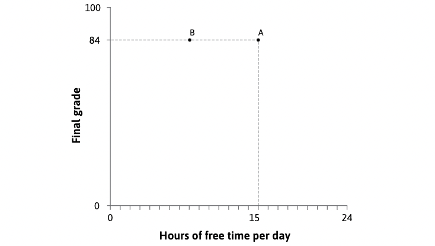
```

--

Combinations A and B both deliver a grade of 84, but Alexei will prefer A because it has more free time.

---

.center[
**Indiference Curves**
]

$$U(t,y) = c$$

```{r, out.width="70%"}

```


At combinations C and D Alexei has 20 hours of free time per day, but he prefers D because it gives him a higher grade.

---

.center[
**Indiference Curves**
]

$$U(t,y) = c$$

```{r, out.width="70%"}

```

We don’t know whether Alexei prefers A or E. So we ask him: he says he is **indifferent**. Meaning he would feel equally satisfied with either outcome. He has the same **utility**.

---

.center[
**Indiference Curves**
]

$$U(t,y) = c$$

```{r, out.width="70%"}
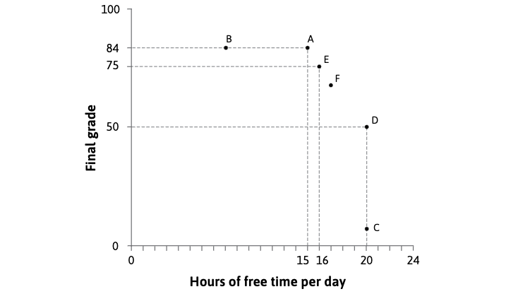
```

Alexei says that F is another combination that would give him the same **utility** as A and E.

---

.center[
**Indiference Curves**
]

$$U(t,y) = c$$

```{r, out.width="70%"}
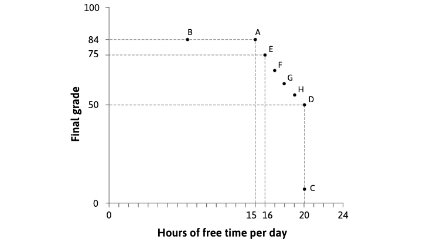
```

By asking more questions, we discover that Alexei is indifferent between all of the combinations between A and D.

---

.center[
**Indiference Curves**
]

$$U(t,y) = c$$

```{r, out.width="70%"}
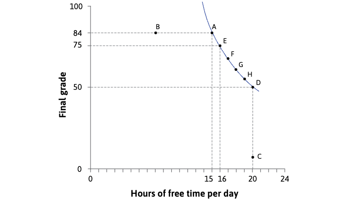
```

These points are joined together to form an **indifference curve**.

---

.center[
**Indiference Curves**
]

$$U(t,y) = c$$

```{r, out.width="70%"}
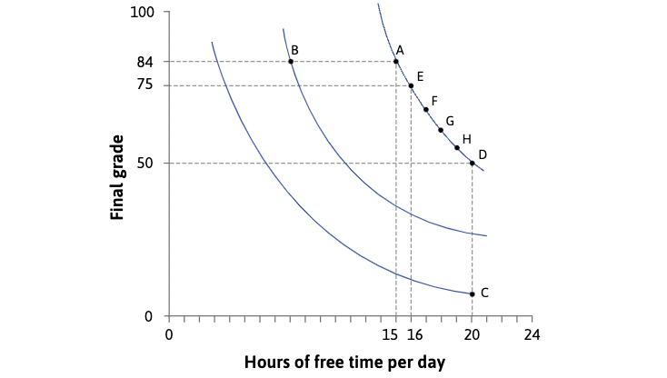
```

Indifference curves can be drawn through any point in the diagram, to show other points giving the **same utility**. We can construct other curves starting from B or C in the same way as before, by finding out which combinations give the **same amount of utility**.

---

.center[
## Indiference Curves
]

- **Indifference curves slope downward due to trade-offs**: If you are indifferent between two combinations, the combination that has more of one good must have less of the other good.

--

- **Higher indifference curves correspond to higher utility levels**: As we move up and to the right in the diagram, further away from the origin, we move to combinations with more of both goods.

--

- **Indifference curves are usually smooth**: Small changes in the amounts of goods don’t cause big jumps in utility.

--

- **As you move to the right along an indifference curve, it becomes flatter.**

--

- **Indifference curves do not cross** 

---

.pull-left[
```{r, out.width="100%"}
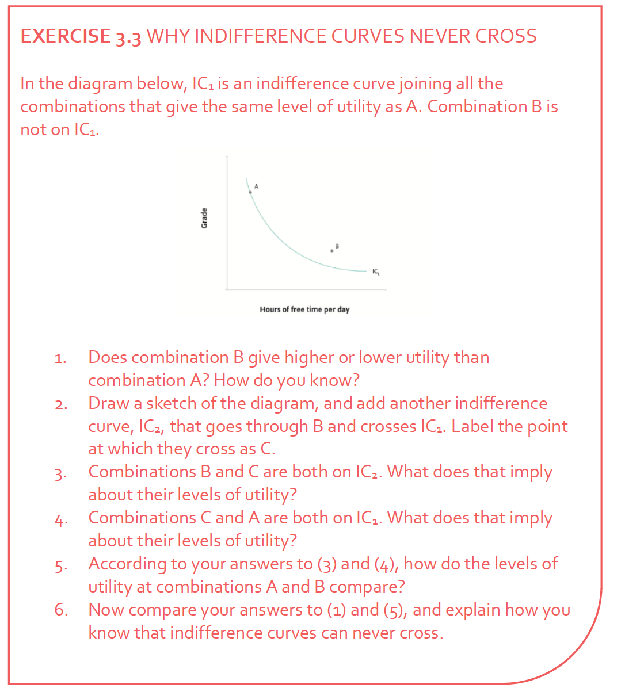
```

]

--

.pull-right[

```{r, out.width="100%"}
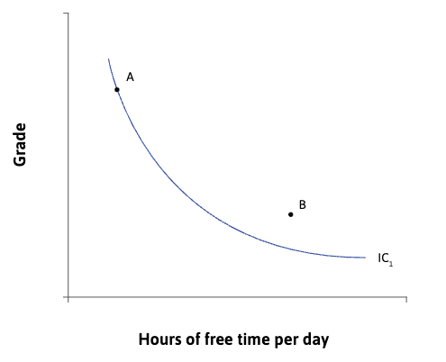
```

1. Higher utilit
2. Draw graph
3. Same utility
4. Same utility
5. **Same utility (!!!)** 
6. $\rightarrow$ **Answer 5 contradicts answer 1**

]


---

.center[
### Marginal Rate of Substitution (MRS)
]
.center[
Slope of the indifference curve: represents the tradeoffs that an individual faces.
]

--

```{r, out.width="70%"}
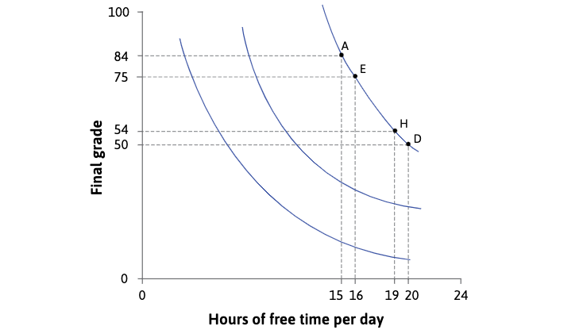
```

The diagram shows three indifference curves for Alexei. The curve furthest to the left offers the lowest satisfaction.

---

.center[
### Marginal Rate of Substitution (MRS)
]
.center[
Slope of the indifference curve: represents the tradeoffs that an individual faces.
]

```{r, out.width="70%"}
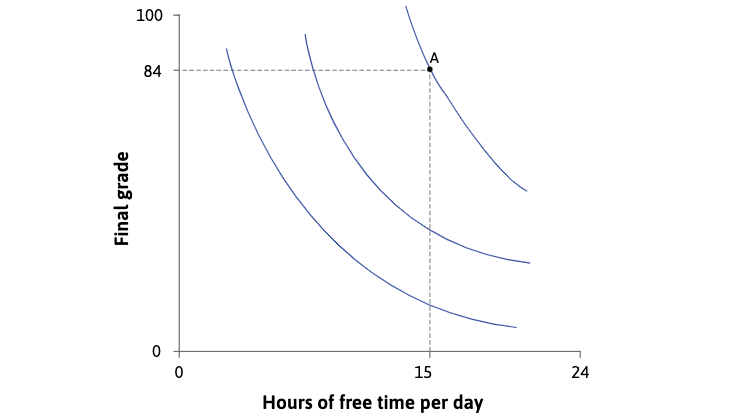
```

At A, he has 15 hours of free time and his grade is 84.

---

.center[
### Marginal Rate of Substitution (MRS)
]
.center[
Slope of the indifference curve: represents the tradeoffs that an individual faces.
]

```{r, out.width="70%"}
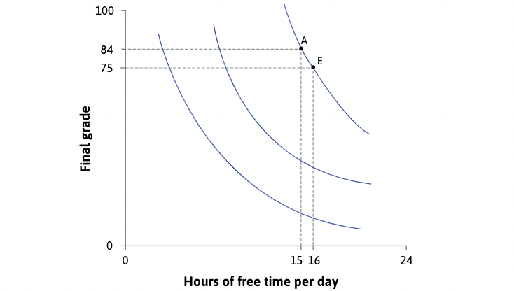
```

He would be willing to move from A to E, giving up 9 percentage points for an extra hour of free time. His marginal rate of substitution is 9. The indifference curve is steep at A.

---

.center[
### Marginal Rate of Substitution (MRS)
]
.center[
Slope of the indifference curve: represents the tradeoffs that an individual faces.
]

```{r, out.width="70%"}
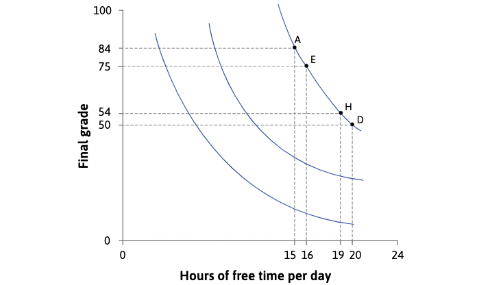
```

At H he is only willing to give up 4 points for an extra hour of free time. His MRS is 4. As we move down the indifference curve, the MRS diminishes, because points become scarce relative to free time. The indifference curve becomes flatter.

---

.center[
### Marginal Rate of Substitution (MRS)
]
.center[
Slope of the indifference curve: represents the tradeoffs that an individual faces.
]

```{r, out.width="70%"}
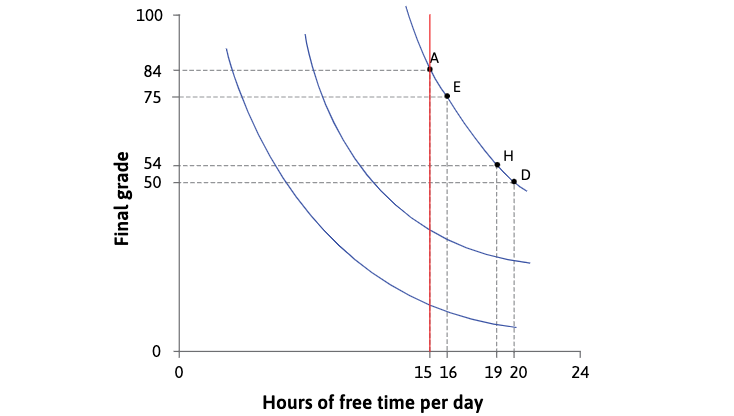
```

**All combinations with 15 hours of free time**:
On the lowest curve the grade is low, and the MRS is small. Alexei would be willing to give up only a few points for an hour of free time. As we move up the vertical line the indifference curves are steeper: the MRS increases.

---

.center[
### Marginal Rate of Substitution (MRS)
]
.center[
Slope of the indifference curve: represents the tradeoffs that an individual faces.
]

```{r, out.width="70%"}
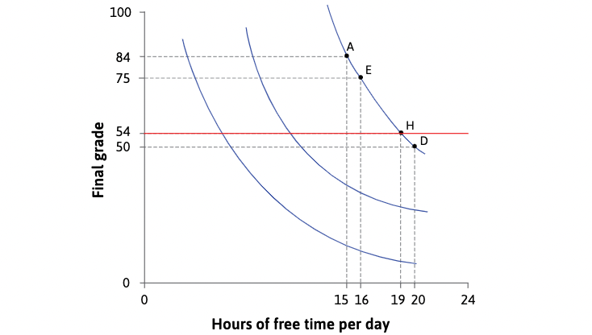
```

**All combinations with a grade of 54**:
On the curve furthest to the left, free time is scarce, and the MRS is high. As we move to the right along the red line he is less willing to give up points for free time. The MRS decreases–the indifference curves get flatter.


---

.center[
### Marginal Rate of Substitution (MRS)
]

.center[
Slope of the indifference curve: represents the tradeoffs that an individual faces.
]

$$U(t,y) = c$$
--

Suppose both $t$ and $y$ change by small amounts $\Delta t$ and $\Delta y$. 
--
 The small increments formula for functions of two variables gives an approximation to the change in utility:

$$ \Delta U \approx \frac{\delta U}{\delta t} \Delta t + \frac{\delta U}{\delta y} \Delta y$$
--

If the changes $\Delta t$ and $\Delta y$ are such that 1) $\Delta  \rightarrow 0$ and Alexei stays in the same indifference curve,
--
 then his utility does not change:
 
$$ \frac{\delta U}{\delta t} \Delta t + \frac{\delta U}{\delta y} \Delta y \approx 0 \iff  \frac{d y}{d t} = - \frac{\delta U}{\delta t} / \frac{\delta U}{\delta y}  $$
--

Then, **marginal rate of substitution (MRS)** is the absolute value of the slope:

$$ MRS = | \frac{\delta U}{\delta t} / \frac{\delta U}{\delta y} |  $$

---

.center[
**Examples of utility functions**
]

--

.center[
**Cobb-Douglas function**
]

$$ U(t,y) = t^\alpha \cdot y^\beta $$

--

$$ \alpha, \beta > 0 $$
--

.pull-left[
**Marginal utility of free time**: 

$$ \frac{\delta U}{\delta t} = \alpha \cdot  t^{\alpha -1}  \cdot y^\beta  = \alpha \cdot \frac{U}{t}$$

]

--

.pull-right[
**Marginal utility of the exam grade**: 

$$ \frac{\delta U}{\delta y} = \beta \cdot  t^\alpha \cdot y^{\beta -1}   = \beta \cdot \frac{U}{y}$$

]

--

.center[
**Marginal rate of substitition**:

$$ MRS = | \frac{\delta U}{\delta t} / \frac{\delta U}{\delta y} | = \alpha \cdot \frac{U}{t} / \beta \cdot \frac{U}{y} = \frac{\alpha y}{\beta t} $$

]


--

As $t \uparrow$ and $y \downarrow$ 
--

- $\Rightarrow$ $y/t \downarrow$

--

- $\Rightarrow$ $MRS \downarrow$

---

.center[
# Opportunity costs
]

--

Choices are limited by **constraints** and involve **tradeoffs**
--
 (Studying example: higher grades vs. more free time).

--

The **opportunity cost** of an action is the net benefit of the next best alternative action.

--

Relevant whenever we study individuals choosing between alternative and mutually exclusive courses of action.

--

Example: 


> Imagine that an accountant and an economist have been asked to report the cost of going to a concert, **A**, in a theatre, which has a $25 admission cost. In a nearby park there is concert **B**, which is free but happens at the same time

--

.pull-left[
**Accountant**
The cost of concert A is your ‘out-of-pocket’ cost: you paid 25 for a ticket, so the cost is 25.
]

--

.pull-right[
**Economist**
But what do you have to give up to go to concert A? You give up 25, plus the enjoyment of the free concert in the park. So the cost of concert A for you is the out-of-pocket cost plus the opportunity cost.

]


$$ \textbf{Accountants} \neq  \textbf{Economist} $$

---

.center[
# Opportunity costs
]

Suppose that the most you would have been willing to pay to attend the free concert in the park (if it wasn’t free) was 15.

--

**Economic costs**: The out-of-pocket cost of an action

$$ \textbf{economic costs} = 25 + 15 = 40 $$

--

**Economic rent**: A payment or other benefit received above and beyond what the individual would have received in his or her next best alternative (or *reservation option*)

--

|   | **High value on A**  | **Low value on A**  |
| --- | --- | --- |
| Out-of-pocket cost A | 25 | 25 |
| Opportunity cost of leaving B | 15 | 15 |
| **Economic cost** | 40 | 40 |


---

.center[
# Opportunity costs
]

Suppose that the most you would have been willing to pay to attend the free concert in the park (if it wasn’t free) was 15.

**Economic costs**: The out-of-pocket cost of an action

$$ \textbf{economic costs} = 25 + 15 = 40 $$

**Economic rent**: A payment or other benefit received above and beyond what the individual would have received in his or her next best alternative (or *reservation option*)

|   | **High value on A**  | **Low value on A**  |
| --- | --- | --- |
| Out-of-pocket cost A | 25 | 25 |
| Opportunity cost of leaving B | 15 | 15 |
| **Economic cost** | 40 | 40 |
| Enjoyment of A | 50 | 35 |
| **Economic rent** | 10 | -5 |
| Decision | **A** | **B** |

---

.center2[
# Decision-making under scarcity
]

---

.center[
### Feasible Frontier
]

--

.center[
Maximum output that can be achieved with a given amount of input.
]

--

```{r, out.width="70%"}

```

The figure shows the highest final grade Alexei can achieve given the amount of free time he takes. With 24 hours of free time, his grade would be zero. By having less free time, Alexei can achieve a higher grade.

---

.center[
### Feasible Frontier
]

.center[
Maximum output that can be achieved with a given amount of input.
]

```{r, out.width="70%"}
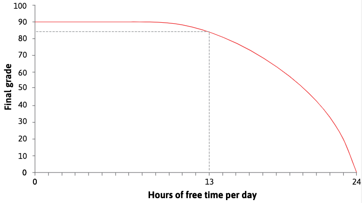
```

If Alexei chooses 13 hours of free time per day, he can achieve a grade of 84.

---

.center[
### Feasible Frontier
]

.center[
Maximum output that can be achieved with a given amount of input.
]

```{r, out.width="70%"}
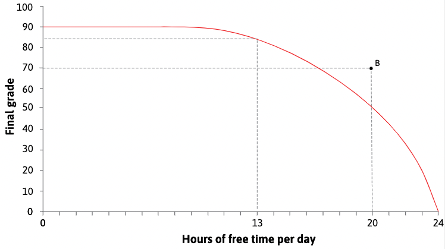
```

Under normal conditions he cannot take 20 hours of free time and expect to get a grade of 70. Therefore B is an infeasible combination of hours of free time and final grade.

---

.center[
### Feasible Frontier
]

.center[
Maximum output that can be achieved with a given amount of input.
]

```{r, out.width="70%"}
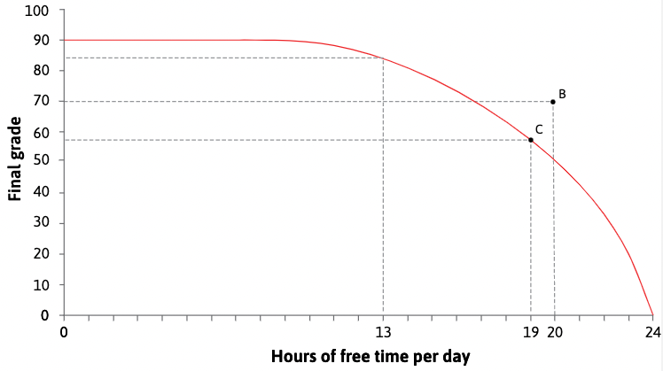
```

The maximum grade Alexei can achieve with 19 hours of free time per day is 57.


---

.center[
### Feasible Frontier
]

.center[
Maximum output that can be achieved with a given amount of input.
]

```{r, out.width="70%"}
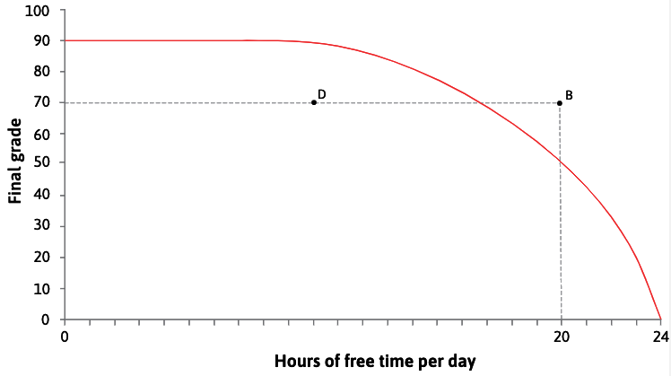
```

Combination D is feasible, but Alexei is wasting time or points in the exam. He could get a higher grade with the same hours of study per day, or have more free time and still get a grade of 70.

---

.center[
### Feasible Frontier
]

.center[
Maximum output that can be achieved with a given amount of input.
]

```{r, out.width="70%"}
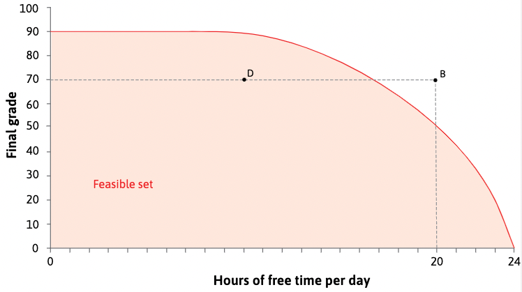
```

The area inside the frontier, together with the frontier itself, is called the **feasible set**.

---

.center[
### Feasible Frontier
]

.center[
Maximum output that can be achieved with a given amount of input.
]

```{r, out.width="70%"}
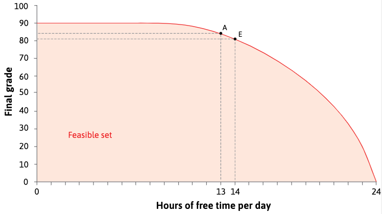
```

At combination A Alexei could get an extra hour of free time by giving up 3 points in the exam. The opportunity cost of an hour of free time at A is 3 points.

---

.center[
### Feasible Frontier
]

.center[
Maximum output that can be achieved with a given amount of input.
]

```{r, out.width="70%"}
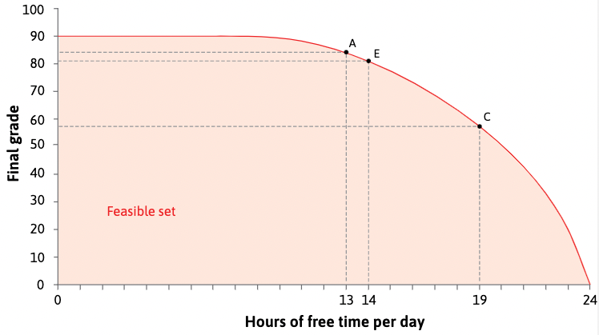
```

The more free time he takes, the higher the marginal product of studying, so the opportunity cost of free time increases.


---

.center[
### Feasible Frontier
]

.center[
Maximum output that can be achieved with a given amount of input.
]

```{r, out.width="70%"}

```

At C the opportunity cost of an hour of free time is higher than at A: Alexei would have to give up 7 percentage points (the vertical change is −7) to increase his free time by 1 hour (the horizontal change is 1). The slope is −7.

---

.center[
### Feasible Frontier
]

.center[
Maximum output that can be achieved with a given amount of input.
]

```{r, out.width="70%"}
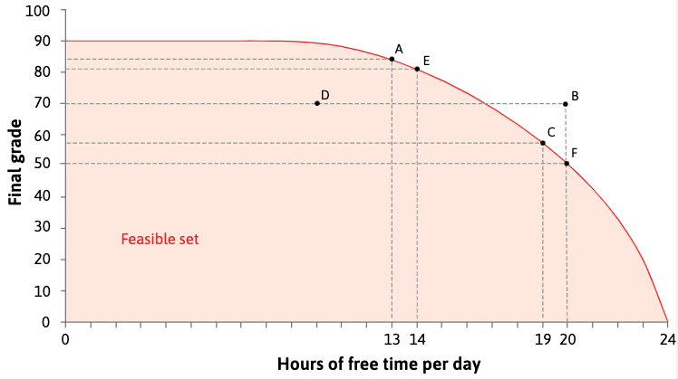
```

The opportunity cost of free time at C is 7 points, corresponding to the **slope of the feasible frontier**. Or the **marginal rate of transformation**.

---
.center[
## Marginal Rate of Transformation (MRT)
]

--

Example:

.center[
Production function:
$y = 20.4 \cdot h^{0.5}$
]
--
.pull-left[
Feasible frontier:
$y = 20.4 \cdot (24-t)^{0.5}$
]
--
.pull-left[
Marginal rate of transformation:
$y =\frac{10.2}{ (24-t)^{0.5}}$
]

--

```{r, out.width="70%"}
data <- 
  tibble(
    hours = seq(0,24, 0.05),
  ) %>% 
  mutate(
    grade = 20.4*(24-hours)^(0.5),
    mrt = 10.2/((24-hours)^(0.5))
  )

data %>% 
  pivot_longer(!hours) %>% 
  mutate(
    name = if_else(name == "grade", "Feasible frontier", "Marginal rate of transformation")
  ) %>% 
  ggplot(aes(hours, value, color = name)) +
  geom_line() +
  scale_x_continuous(breaks = seq(0,24, 2)) +
  labs(x = "Hours of study",  y = "", color = "") +
  theme_classic() +
  facet_wrap(~name, scales = "free_y") +
  theme(
    legend.position = "bottom"
  )
```


---
.center[
# Constrained choice problem
]

--

When things people value are scarce, individuals choose given their **preferences** and the **constraints** they face.

--
.center[
**Two trade-offs**
]


.pull-left[
### Marginal Rate of Substitution (MRS)

**Willingness** trade-off between final grade and free time.

The slope of the **indifference curve**.

]

.pull-right[
### Marginal Rate of Transformation (MRT)

**Constrained** trade-off between final grade and free time.

The slope of the **feasible frontier**.

The marginal product of labour.
]

--

.center[
The utility-maximising choice is where the amount of one food the individual is **willing to trade off** for the other good (**MRS**) equals the **actual tradeoff** between the two goods (**MRT**)
]

$$ MRS = MRT$$

---

.center[
## Optimal Decision Making
]

```{r, out.width="55%"}
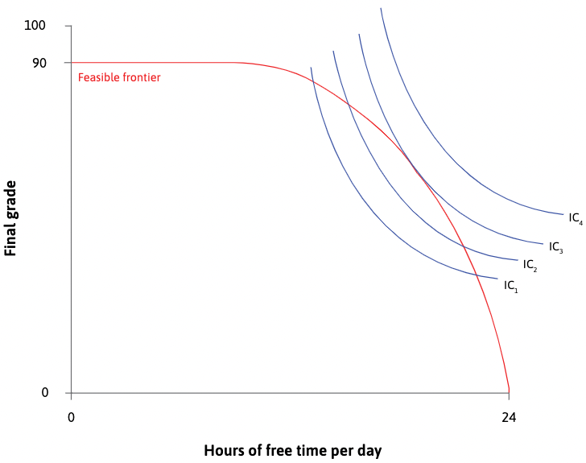
```

The diagram brings together Alexei’s indifference curves and his feasible frontier.

---

.center[
## Optimal Decision Making
]

```{r, out.width="55%"}

```

On the indifference curve IC1, all combinations between A and B are feasible because they lie in the feasible set. Suppose Alexei chooses one of these points.

---

.center[
## Optimal Decision Making
]

```{r, out.width="55%"}

```

All combinations in the lens-shaped area between IC1 and the feasible frontier are feasible, and give higher utility than combinations on IC1. For example, a movement to C would increase Alexei’s utility.

---

.center[
## Optimal Decision Making
]

```{r, out.width="55%"}
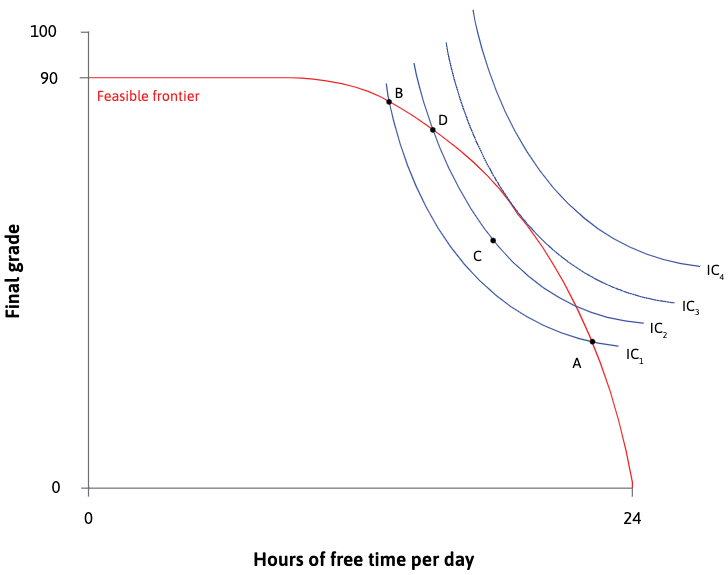
```

Moving from IC1 to point C on IC2 increases Alexei’s utility. Switching from B to D would raise his utility by an equivalent amount.

---

.center[
## Optimal Decision Making
]

```{r, out.width="55%"}

```

But again, Alexei can raise his utility by moving into the lens-shaped area above IC2. He can continue to find feasible combinations on higher indifference curves, until he reaches E.

---

.center[
## Optimal Decision Making
]

```{r, out.width="55%"}
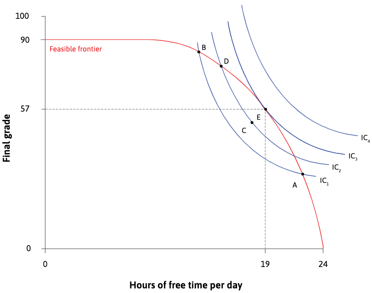
```

At E, he has 19 hours of free time per day and a grade of 57. Alexei maximizes his utility: he is on the highest indifference curve obtainable, given the feasible frontier.

---

.center[
## Optimal Decision Making
]

```{r, out.width="55%"}
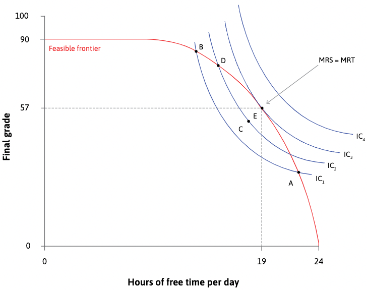
```

At E the indifference curve is tangent to the feasible frontier. The marginal rate of substitution (the slope of the indifference curve) is equal to the marginal rate of transformation (the slope of the frontier).

---
.center[
### Optimal Decision Making: Mathematicaly
]

.center[
Maximize utility given the constraint imposed by the feasible set $\rightarrow$ **Constrained optimization**
]
$$max \; U(t,y)  \; s.t. \quad y \leq f(24-t) $$
--

If  $y = f(24-t)$, substitute the constraint for $y$ in terms of $t$ in the utility function:
$$ U(t,y)  =  U(t, f(24-t)) $$
--

Then, maximize $U$ with respect to $t$:
$$\frac{dU}{dt} =  \frac{\delta U}{\delta t} + \frac{\delta U}{\delta y} \cdot  \frac{\delta y}{\delta t} = 0$$

--

We know that $\frac{\delta y}{\delta t} = -f'(24-t)$. Thus:
$$\frac{dU}{dt} =  \frac{\delta U}{\delta t} - \frac{\delta U}{\delta y} \cdot  f'(24-t)  = 0$$
--

Then:
$$  f'(24-t) = \frac{\delta U}{\delta t} / \frac{\delta U}{\delta y} \iff MRT = MRS $$

---
.center[
### Another example: Grain production
]

```{r, out.width="55%"}
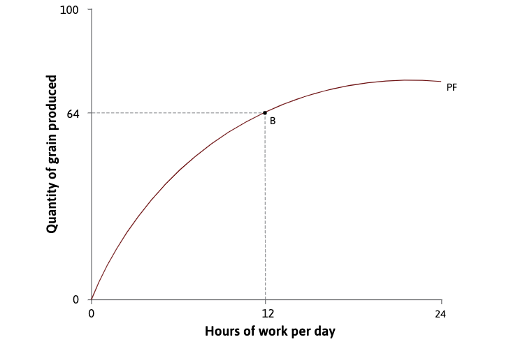
```

Angela's production function.

---
.center[
### Another example: Grain production
]

```{r, out.width="55%"}
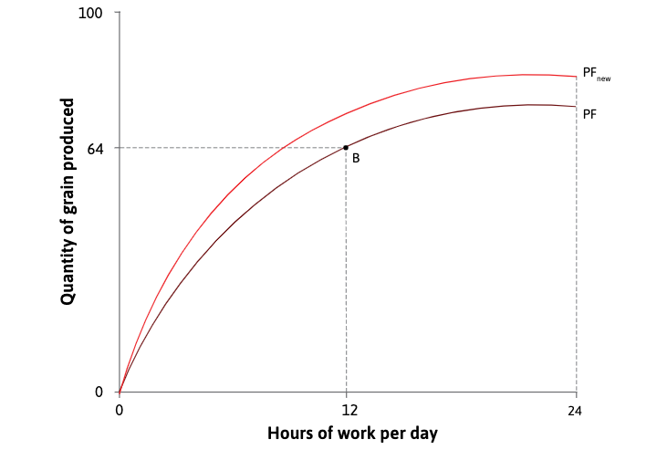
```

An improvement in technology means that more grain is produced for a given number of working hours. The production function shifts upward, from $PF$ to $PF_{new}$.

---
.center[
### Another example: Grain production
]

```{r, out.width="55%"}
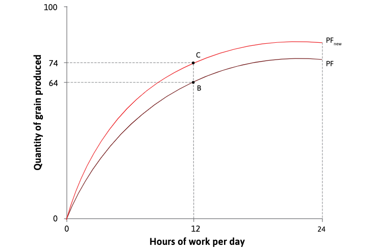
```

Now if Angela works for 12 hours per day, she can produce 74 units of grain (point C).

---
.center[
### Another example: Grain production
]

```{r, out.width="55%"}

```

Alternatively, by working 8 hours a day she can produce 64 units of grain (point D), which previously took 12 hours.


---
.center[
### Technological change shifts the production function upwards and expands the feasible frontier
]

.pull-left[
```{r, out.width="110%"}

```
]

.pull-right[
```{r, out.width="110%"}
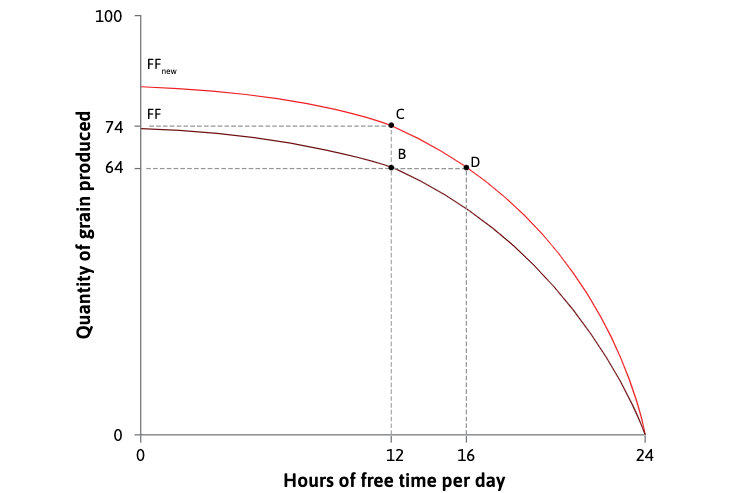
```
]

---
.center[
### Optimal decision making when feasible frontier changes
]

```{r, out.width="55%"}
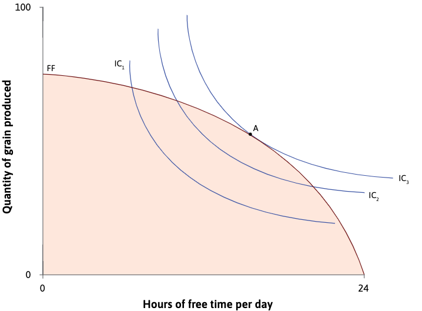
```

Feasible set with the original production function, and Angela’s indifference curves for combinations of grain and free time. The highest indifference curve she can attain is IC3, at point A.

---
.center[
### Optimal decision making when feasible frontier changes
]

```{r, out.width="55%"}
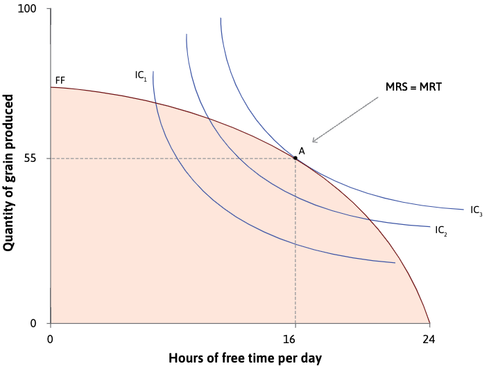
```

Her optimal choice is point A on the feasible frontier. She enjoys 16 hours of free time per day and consumes 55 units of grain. At A, her MRS is equal to the MRT.

---
.center[
### Optimal decision making when feasible frontier changes
]

```{r, out.width="55%"}
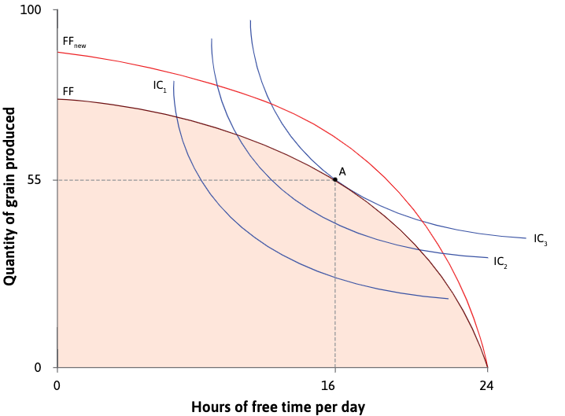
```

An improvement in technology expands the feasible set. Now she can do better than at A.

---
.center[
### Optimal decision making when feasible frontier changes
]

```{r, out.width="55%"}
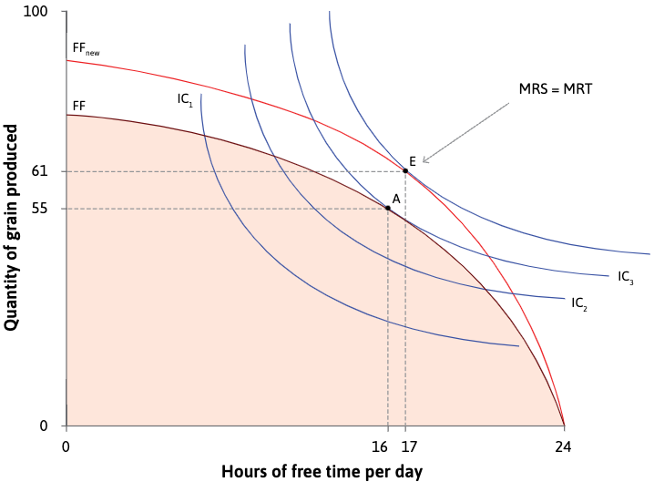
```

When the technology of farming has improved, Angela’s optimal choice is point E, where $FF_{new}$ is tangent to indifference curve $IC_{4}$ . She has more free time and more grain than before.


---
.center[
### Optimal decision making when feasible frontier changes
]

```{r, out.width="55%"}

```

Technological change raises Angela’s standard of living: it enables her to achieve higher utility.

---
.center2[
# Quiz 2 
]

---

```{r, out.width="90%"}
knitr::include_graphics("https://media.giphy.com/media/kGweWfIbaezO8/giphy.gif")
```

---
.center2[
# (Take-away) Quiz 2 
]

---
.center[
### Quiz: Optimal decision making 
]

$y$: grades, $h$: working hours, $t$: free hours

.pull-left[
**Utility function**:

$$U(t,y) = t^{\alpha} \cdot y^{\beta}$$

Such that $0 < \alpha,\beta < 1$, and $\alpha + \beta = 1$
]

.pull-right[
**Production function**:

$$y = A \cdot h^\alpha$$

Such that $A = 1$ and $0 < \alpha < 1$
]


1. **Solution using the substitution method**

2. **Solution using formulas**

---

.center2[
# Income and Substitution Effects
]

---
.center[
# Example: Working hours
]

--

Imagine that you are looking for a job after you leave university.
--
 You expect to be able to earn a wage of $15 per hour. 
--
 Jobs differ according to the number of hours you have to work.
 
--

We will assume that your spending —-that is, your average consumption of food, accommodation, and other goods and services-- cannot exceed your earnings.

--

.center[
**Budget constrain**:
]
$$ c = w(24-t) $$

```{r, out.width="27.5%"}
knitr::include_graphics("https://media.giphy.com/media/U3mcTVPpBeaRsAcDH6/giphy.gif")
```

---

.center[
$$w = 15 \; \Rightarrow c = 15(24-t)$$ 
]

--

```{r, out.width="65%"}
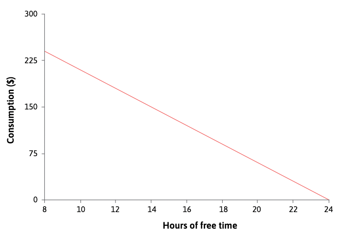
```

| |	|	| 	| |	|		| 	| 	|  |
| --- | ---	| ---	| ---	| --- |	--- |	---	| ---	| ---	| --- |
| Working hours, $h$ | 0	| 2	| 4	| 6 |	8 |	10	| 12	| 14	| 16 |
| Free time, $t$ | 24	| 22	| 20	| 18 | 16 |	14	| 12	| 10	| 8 |
| Consumption, $c$ | 0	| 30	| 60	| 90 | 120 |	150	| 180	| 210	| 240 |


---

.center[
$$w = 15 \; \Rightarrow c = 15(24-t)$$ 
]

```{r, out.width="65%"}

```

The straight line is your budget constraint: it shows the maximum amount of consumption you can have for each level of free time.

---

.center[
$$w = 15 \; \Rightarrow c = 15(24-t)$$ 
]

```{r, out.width="65%"}

```

The slope of the budget constraint is equal to the wage, $15 (in absolute value). This is your MRT (the rate at which you can transform time into consumption), and it is also the opportunity cost of free time.

---

.center[
$$w = 15 \; \Rightarrow c = 15(24-t)$$ 
]

```{r, out.width="65%"}
knitr::include_graphics("imgs/f3-15c.png")
```

The budget constraint is your feasible frontier, and the area below it is the feasible set.

---

.center[
$$w = 15 \; \Rightarrow c = 15(24-t)$$ 
]

```{r, out.width="65%"}
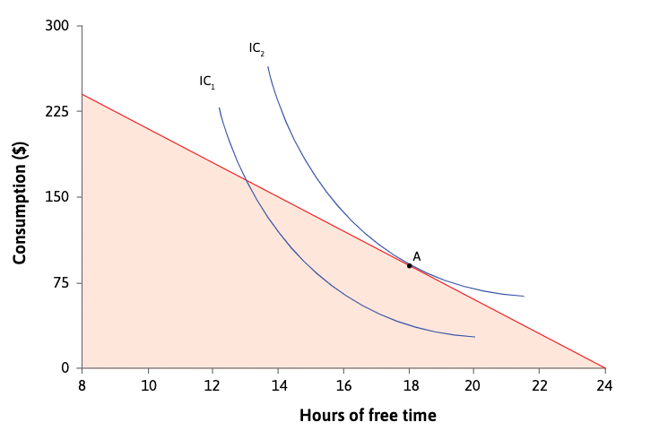
```

Your indifference curves show that your ideal job would be at point A, with 18 hours of free time and daily earnings of 90. At this point your MRS is equal to the slope of the budget constraint, which is the wage (15).
$$MRS = MRT=w$$

---
.center[
## Income effect
]

$$c = 15(24-t) + 50$$ 

--
```{r, out.width="60%"}
knitr::include_graphics("imgs/f3-17.png")
```

Total earnings increase, holding working hours fixed.  Opportunity cost of time does not change.


---
.center[
## Income effect
]

$$c = 15(24-t) + 50$$ 

```{r, out.width="60%"}
knitr::include_graphics("imgs/f3-17.png")
```

More income per hour worked $\rightarrow$ incentive to decrease working hours

---
.center[
## Income effect
]

$$c = 15(24-t) + 50$$ 

```{r, out.width="60%"}
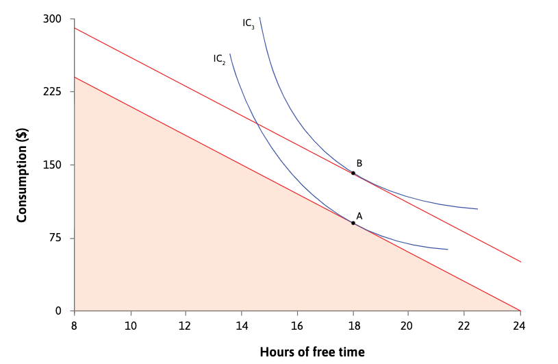
```

Different preferences might not choose to increase their free time.

---
.center[
## Substitution effect
]

$$c = 25(24-t)$$ 

--
```{r, out.width="60%"}
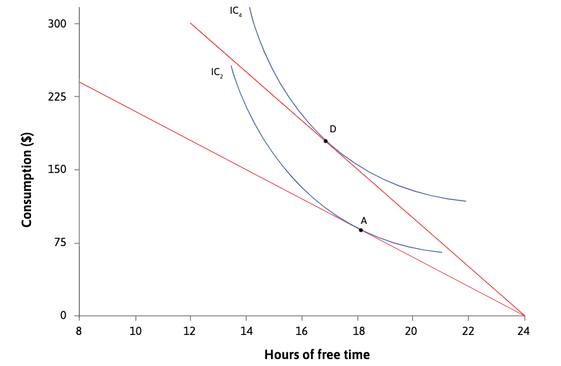
```

Opportunity costs of free time increases $\rightarrow$ incentive to increase working hours.

---

.center[
## Overall effect on labour choice
]

```{r, out.width="60%"}
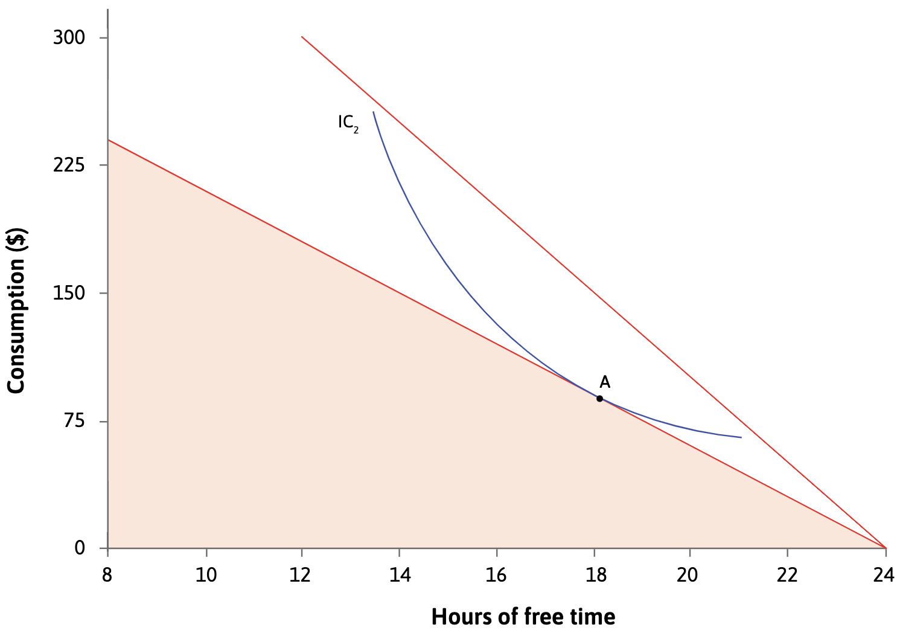
```

When the wage is 15 your best choice of hours and consumption is at point A. The steeper line shows your new budget constraint when the wage rises to 25. Your feasible set has expanded.

---

.center[
## Overall effect on labour choice
]

```{r, out.width="60%"}

```

Point D on $IC_4$ gives you the highest utility. At point D, your MRS is equal to the new wage, 25. You have only 17 hours of free time, but your consumption has risen to 175.


---

.center[
## Overall effect on labour choice
]

```{r, out.width="60%"}
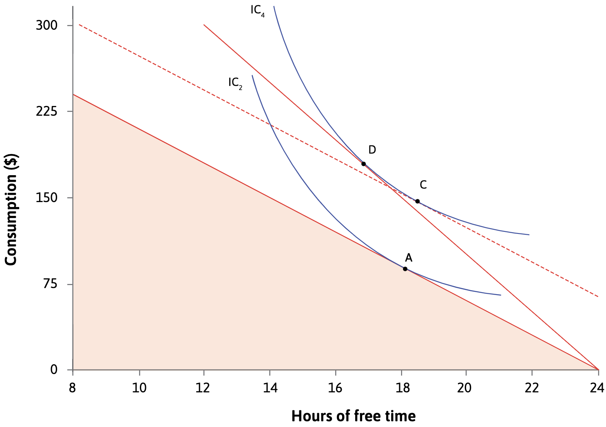
```

The dotted line shows what would happen if you had enough income to reach $IC_4$ without a change in the opportunity cost of free time. You would choose C, with more free time.

---

.center[
## Overall effect on labour choice
]

```{r, out.width="60%"}
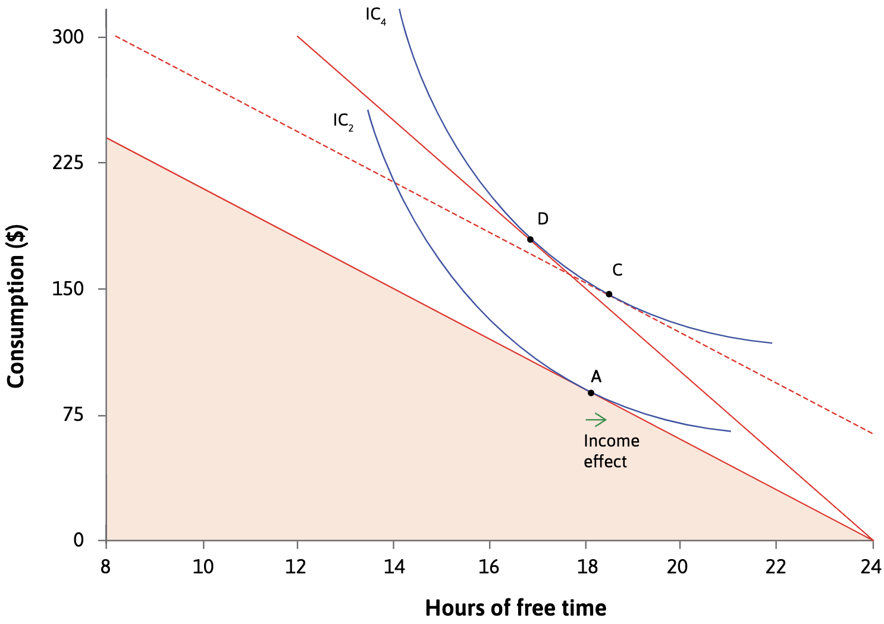
```

The shift from A to C is called the income effect of the wage rise; on its own it would cause you to take more free time.

---

.center[
## Overall effect on labour choice
]

```{r, out.width="60%"}
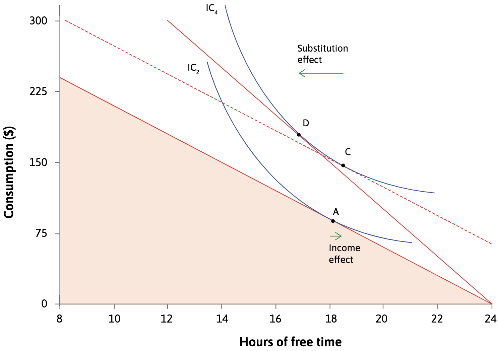
```

The rise in the opportunity cost of free time makes the budget constraint steeper. This causes you to choose D rather than C, with less free time. This is called the substitution effect of the wage rise.

---

.center[
## Overall effect on labour choice
]

```{r, out.width="60%"}
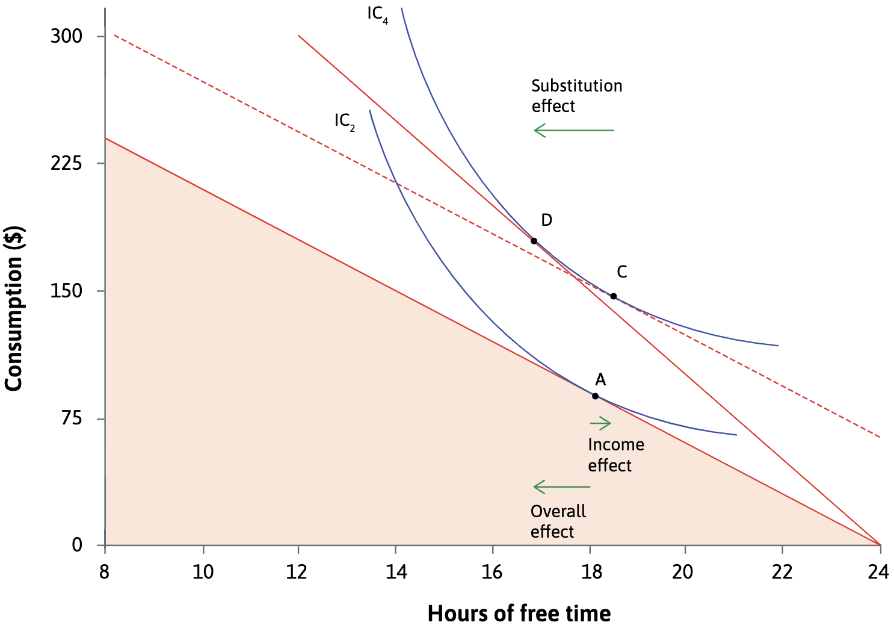
```

The overall effect of the wage rise depends on the sum of the income and substitution effects. In this case the substitution effect is bigger, so with the higher wage you take less free time.

---
.center[
## Mathematics of Income and Substitution Effects
]

$$ max \;U(t,c) = tc \quad s.t. \; c = w(24-t) + I $$
--

.pull-left[
$$ MRT = | \frac{dc}{dt} | = w $$
]

.pull-right[
$$ MRS = | \frac{\delta U}{\delta t} / \frac{\delta U}{\delta c} | = \frac{c}{t} $$
]

--

$$ MRT = MRS \iff  w = \frac{c}{t} $$
--
Given: $c=w(24-t) + I$:

$$w = \frac{w(24-t) + I}{t} \iff t = 12 + \frac{I}{2w} \quad \Rightarrow c = 12w + \frac{1}{2} $$

--

$$ \frac{\delta t}{\delta w} = - \frac{I}{2w^2} < 0, \; \frac{\delta t}{\delta I} = \frac{1}{2w} > 0 $$

---

.center2[
# Application to technological change
]

---

.center[
## Working hours: Differences over time
]


```{r, out.width="60%"}

```

.center[Applying the model to history: Increased goods and free time in the US (1900–2020).]

---
.center[
## Working hours: Differences over time
]

```{r, out.width="70%"}
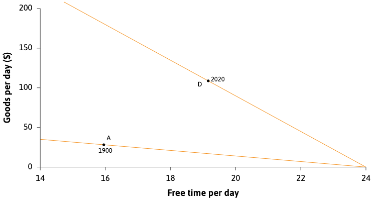
```

We can interpret the change between 1900 and 2020 in daily free time and goods per day for employees in the US using our model. The solid lines show the feasible sets for free time and goods in 1900 and 2020, where the slope of each budget constraint is the real wage.

---
.center[
## Working hours: Differences over time
]

```{r, out.width="70%"}
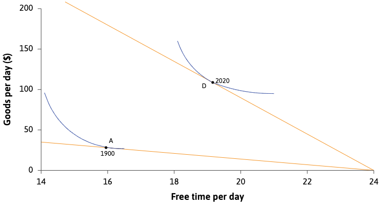
```

Assuming that workers chose the hours they worked, we can infer the approximate shape of their indifference curves.

---
.center[
## Working hours: Differences over time
]

```{r, out.width="70%"}
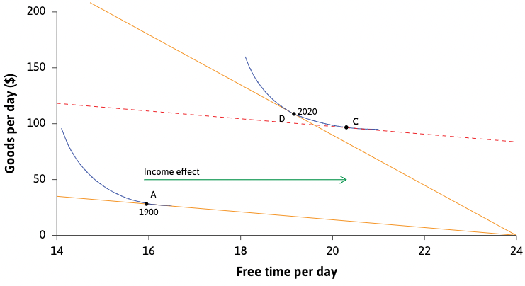
```

The shift from A to C is the income effect of the wage rise, which on its own would cause US workers to take more free time.

---
.center[
## Working hours: Differences over time
]

```{r, out.width="70%"}
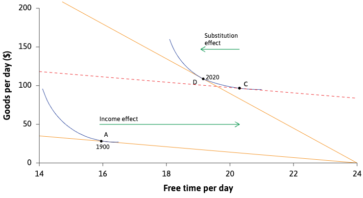
```

The rise in the opportunity cost of free time caused US workers to choose D rather than C, with less free time.

---
.center[
## Working hours: Differences over time
]

```{r, out.width="70%"}
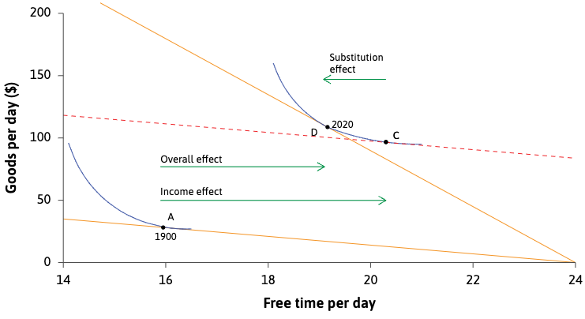
```

The overall effect of the wage rise depends on the sum of the income and substitution effects. In this case the income effect is bigger, so with the higher wage US workers took more free time as well as more goods.

---
.center[
## Working hours: Cross-country differences
]

```{r, out.width="60%"}

```

.center[
Using the model to explain free time and consumption per day across countries (2020).
]

---
.center[
## Working hours: Cross-country differences
]

```{r, out.width="70%"}
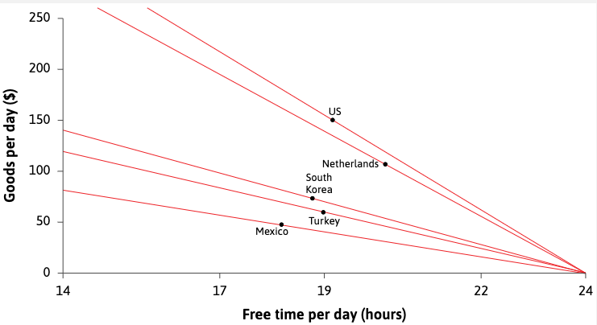
```

We can use our model and data from Figure 3.22 to understand the differences between the countries. The solid lines show the feasible sets of free time and goods for the five countries in Figure 3.22.

---
.center[
## Working hours: Cross-country differences
]

```{r, out.width="70%"}
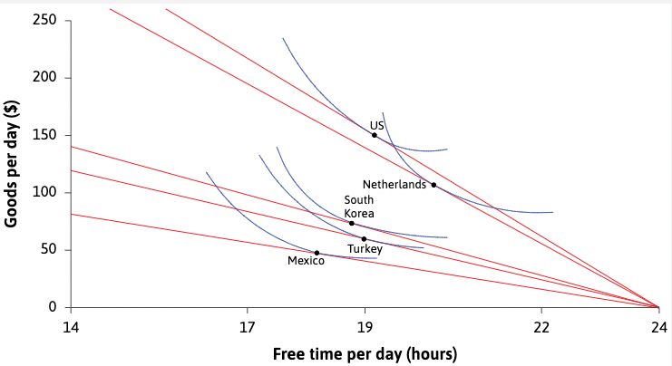
```

We have drawn indifference curves that would explain why workers chose these points.

---
.center[
## Working hours: Cross-country differences
]

```{r, out.width="70%"}

```

Point Q is at the intersection of the indifference curves for the US and the Netherlands. At this point Americans are willing to give up fewer units of daily goods for an hour of free time than the Dutch.


---
.center[
## Is this a good model?
]

--

.pull-left[
- Not realistic:
  - People don't calculate $MRS = MRT$
  - Most people don't choose their exact amount of working hours.
  
- Still a good approximation:
  - Over time, people learn how to balance working hours and free time.
  - Working hours can change due to culture and politics 

- Helps us to understand real-world phenomena:
  - Preferences and income/subsitution effects can explain differences in working hours across-countries and over time
  
]

--

.pull-right[
```{r, out.width="85%"}
knitr::include_graphics("https://ih1.redbubble.net/image.2216802514.4492/pp,840x830-pad,1000x1000,f8f8f8.jpg")
```
]

---

```{r, out.width="55%"}
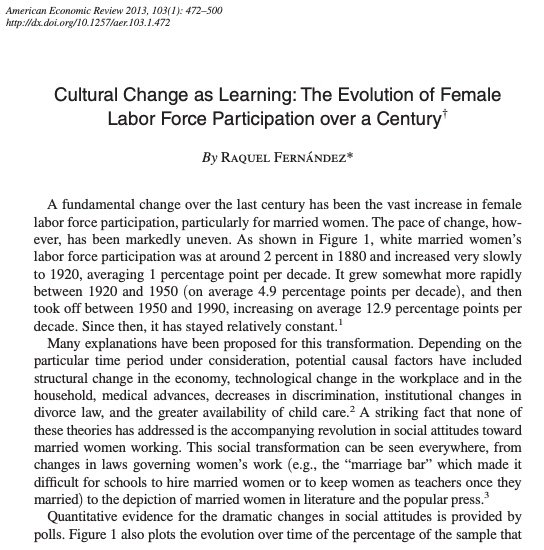
```

---

```{r, out.width="70%"}
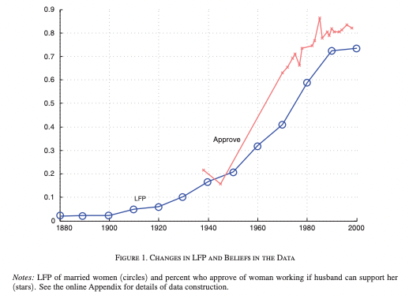
```

---
.center[
## Summary
]

--

1. Simple model of **decision-making under scarcity**

  - **Indifference curves** represent **preferences**
  - **Feasible frontier** represents **choice constraints**
  - **Utility-maximising** choice where **MRS = MRT**
  
--

2. Used model to explain effect of technological change on labour choices

  - Overall effect = **Income effect** + **Substitution effect**
  - Limitations of model – omits important factors 

--
.center[
## In the next unit
]

- Models of individual choice including other important factors
- The role of **social interactions** in individual choice
- The effect of individual choice on **social outcomes**

