<style>

.center2 {
  margin: 0;
  position: absolute;
  top: 50%;
  left: 50%;
  -ms-transform: translate(-50%, -50%);
  transform: translate(-50%, -50%);
}

</style>

```{r setup, include = FALSE}
knitr::opts_chunk$set(echo = FALSE)
knitr::opts_chunk$set(out.width = "85%")
knitr::opts_chunk$set(fig.align="center")

options(htmltools.dir.version = FALSE)
library(knitr)
library(tidyverse)
library(xaringanExtra)
# set default options
opts_chunk$set(echo=FALSE,
               collapse = TRUE,
               fig.width = 7.252,
               fig.height = 4,
               dpi = 300)
# set engines
knitr::knit_engines$set("markdown")
xaringanExtra::use_tile_view()
xaringanExtra::use_panelset()
xaringanExtra::use_clipboard()
xaringanExtra::use_webcam()
xaringanExtra::use_broadcast()
xaringanExtra::use_share_again()
xaringanExtra::style_share_again(
  share_buttons = c("twitter", "linkedin", "pocket")
)
# uncomment the following lines if you want to use the NHS-R theme colours by default
# scale_fill_continuous <- partial(scale_fill_nhs, discrete = FALSE)
# scale_fill_discrete <- partial(scale_fill_nhs, discrete = TRUE)
# scale_colour_continuous <- partial(scale_colour_nhs, discrete = FALSE)
# scale_colour_discrete <- partial(scale_colour_nhs, discrete = TRUE)
```

.center[
```{r out.width="100%"}

```

[Europeans have more time, Americans more money. Which is better?](https://www.ft.com/content/4e319ddd-cfbd-447a-b872-3fb66856bb65)
]


---

.center[
<iframe src="https://ourworldindata.org/grapher/annual-hours-of-work-and-income-18702016?tab=chart" loading="lazy" style="width: 90%; height: 550px; border: 0px none;" allow="web-share; clipboard-write"></iframe>
]

For most countries, living standards have greatly increased since 1870.

---

.center[
<iframe src="https://ourworldindata.org/grapher/annual-hours-of-free-time-per-worker-and-income?tab=chart" loading="lazy" style="width: 90%; height: 550px; border: 0px none;" allow="web-share; clipboard-write"></iframe>
]


For most countries, living standards have greatly increased since 1870.

But there are disparities in free time and income across countries.

---

.center[
<iframe src="https://ourworldindata.org/grapher/annual-hours-of-free-time-per-worker-and-income?tab=chart" loading="lazy" style="width: 90%; height: 550px; border: 0px none;" allow="web-share; clipboard-write"></iframe>
]

Why has this happened? Model of choice: people choose the hours they would like to work.

---
.center2[
# A problem of choice and scarcity
]

---
## A problem of choice and scarcity

**Scarcity**: A good is scarce if it is valued, and there is an opportunity cost of acquiring more of it.

### A model of constrained choice

- Individuals want to consume as much as possible and have as
much free time as possible.

- However, their consumption relies on working, and so
sacrificing free time.

- How can we model how an individual chooses the combination
of free time and consumption that is best for them?

---

Karim can earn €30 an hour and can work a maximum of 16
hours a day.

.left-column[
$$
\begin{align}
\underbrace{y}_{\text{income}} 
&= 
\underbrace{w}_{\text{wage}} 
\underbrace{h}_{\text{hours worked}}
\end{align}
$$

| Hours worked | Income (€) |
|----------------|------------|
| 0              | 0          |
| 2              | 60         |
| 4              | 120        |
| 6              | 180        |
| 8              | 240        |
| 10             | 300        |
| 12             | 360        |
| 14             | 420        |
| 16             | 480        |

]

.right-column[
```{r, out.width="100%"}
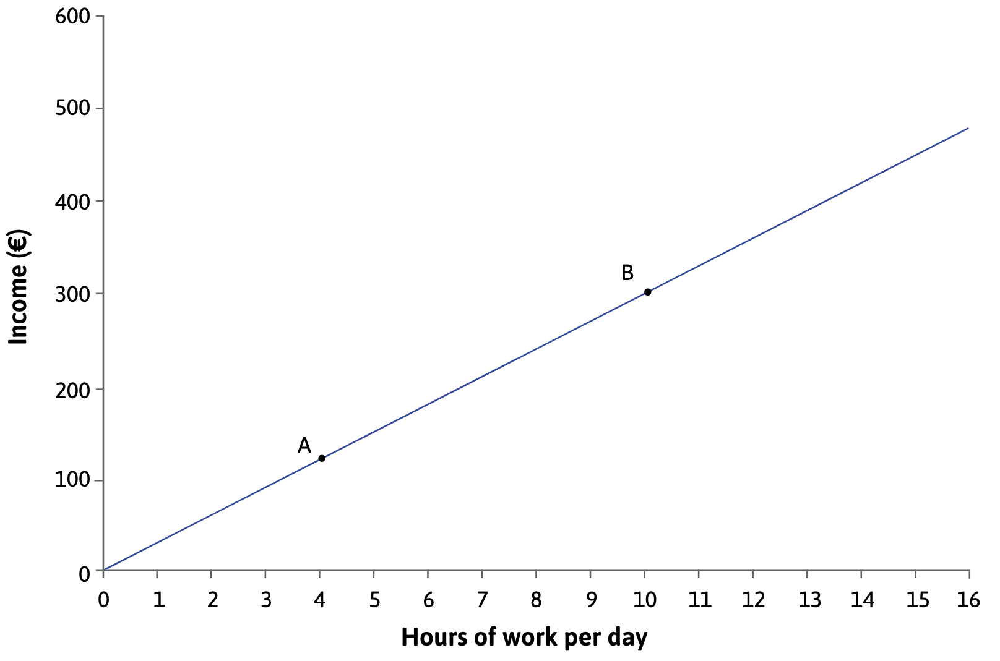
```
]

---

Karim faces a scarcity problem: he wants both high consumption and ample leisure, but his choice is limited by the link between hours worked and income.

.left-column[
$$
\begin{align}
\underbrace{y}_{\text{income}} 
&= 
\underbrace{w}_{\text{wage}} 
\underbrace{h}_{\text{hours worked}}
\end{align}
$$

| Hours worked | Income (€) |
|----------------|------------|
| 0              | 0          |
| 2              | 60         |
| 4              | 120        |
| 6              | 180        |
| 8              | 240        |
| 10             | 300        |
| 12             | 360        |
| 14             | 420        |
| 16             | 480        |

]

.right-column[
```{r, out.width="100%"}

```
]

---
.center2[
# Goods and preferences
]

---
## Goods and preferences

**goods**: anything an individual cares about and would like to have more of. It can include (for example) ‘free time’ or ‘clean air’.

--

Assumptions:

- Karim doesn’t care about the future, so does not save any of
his earnings.

- Karim can not borrow so his average spending can not exceed
his earnings.

---
#### Mapping Karim’s preferences

.left-column[

|  | Free time (t) | c |
|--------|--------------------|----------------|
| A      | 15                 | 540            |
| E      | 16                 | 446            |
| F      | 17                 | 376            |
| G      | 18                 | 323            |
| H      | 19                 | 282            |
| D      | 20                 | 250            |

]

--

.right-column[
```{r, out.width="75%"}
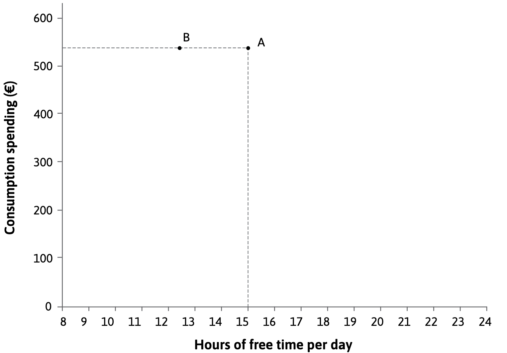
```

Combinations A and B both deliver €540 of consumption, but Karim will prefer A because it has more free time.

]

---
#### Mapping Karim’s preferences

.left-column[

|  | Free time (t) | c |
|--------|--------------------|----------------|
| A      | 15                 | 540            |
| E      | 16                 | 446            |
| F      | 17                 | 376            |
| G      | 18                 | 323            |
| H      | 19                 | 282            |
| D      | 20                 | 250            |

]

.right-column[
```{r, out.width="75%"}
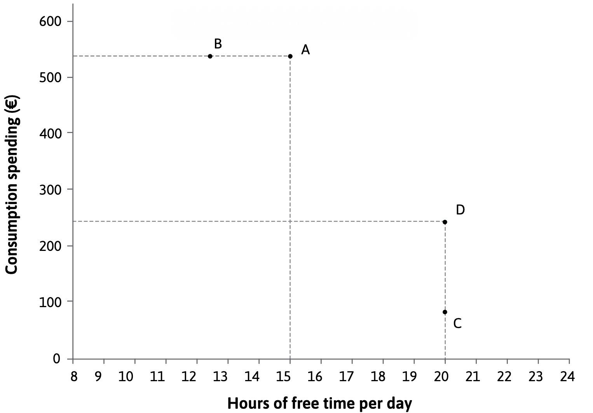
```

At combinations C and D, Karim has 20 hours of free time per day, but he prefers D because it gives him more consumption.
]

---
#### Mapping Karim’s preferences

.left-column[

|  | Free time (t) | c |
|--------|--------------------|----------------|
| A      | 15                 | 540            |
| E      | 16                 | 446            |
| F      | 17                 | 376            |
| G      | 18                 | 323            |
| H      | 19                 | 282            |
| D      | 20                 | 250            |

]

.right-column[
```{r, out.width="75%"}
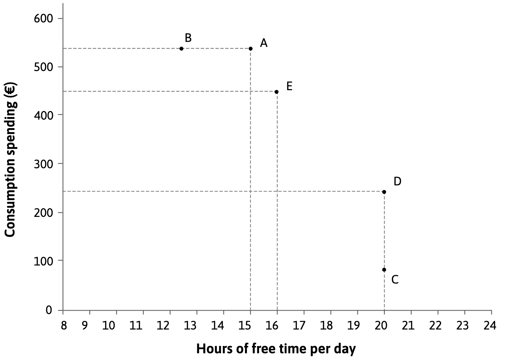
```

We don’t know whether Karim prefers A (with higher consumption) or E (more free time). He says he is **indifferent**.

]

---
#### Mapping Karim’s preferences

.left-column[

|  | Free time (t) | c |
|--------|--------------------|----------------|
| A      | 15                 | 540            |
| E      | 16                 | 446            |
| F      | 17                 | 376            |
| G      | 18                 | 323            |
| H      | 19                 | 282            |
| D      | 20                 | 250            |

]

.right-column[
```{r, out.width="75%"}

```

Karim says that F is another combination that would give him the same utility as A and E.

]

---
#### Mapping Karim’s preferences

.left-column[

|  | Free time (t) | c |
|--------|--------------------|----------------|
| A      | 15                 | 540            |
| E      | 16                 | 446            |
| F      | 17                 | 376            |
| G      | 18                 | 323            |
| H      | 19                 | 282            |
| D      | 20                 | 250            |

]

.right-column[
```{r, out.width="75%"}
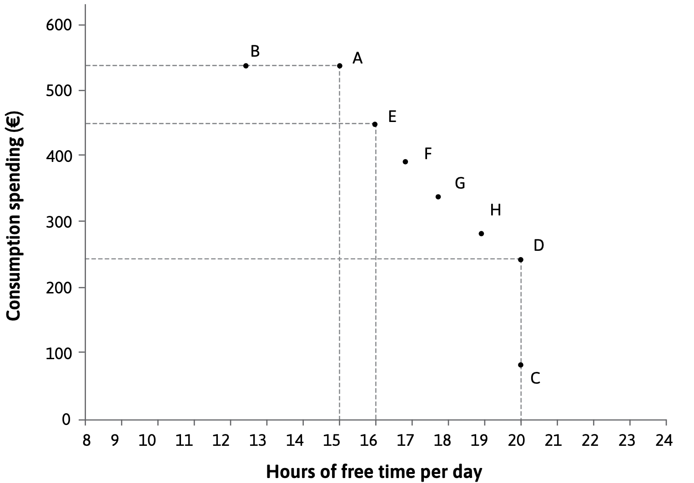
```

We discover that Karim is indifferent between all of these combinations between A and D.

]

---
#### Mapping Karim’s preferences

.left-column[

|  | Free time (t) | c |
|--------|--------------------|----------------|
| A      | 15                 | 540            |
| E      | 16                 | 446            |
| F      | 17                 | 376            |
| G      | 18                 | 323            |
| H      | 19                 | 282            |
| D      | 20                 | 250            |


**utility**: Numeric measure of the value placed on an outcome.

$$U(t,c) = \bar{u}$$
Outcomes with higher utility are preferred when both are feasible.

]

.right-column[
```{r, out.width="75%"}
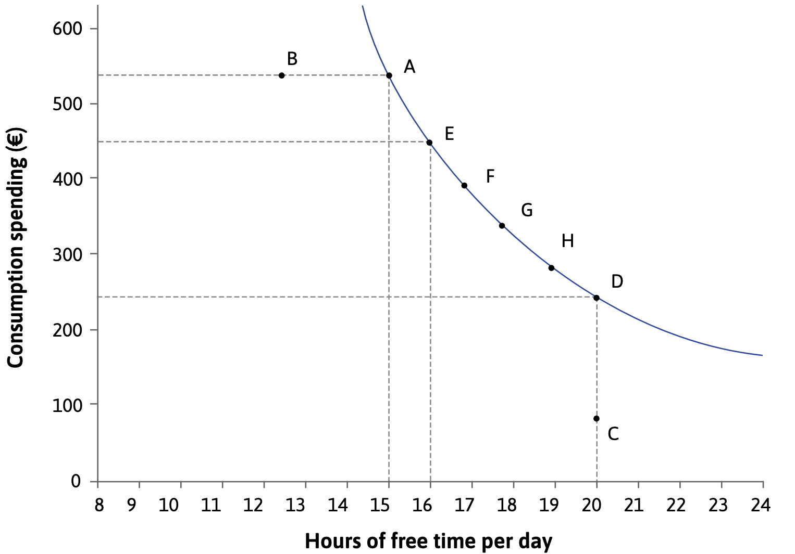
```

**indifference curve**: curve that joins together all the combinations of goods that provide a given level of utility to the individual.

]

---
#### Mapping Karim’s preferences

.left-column[

|  | Free time (t) | c |
|--------|--------------------|----------------|
| A      | 15                 | 540            |
| E      | 16                 | 446            |
| F      | 17                 | 376            |
| G      | 18                 | 323            |
| H      | 19                 | 282            |
| D      | 20                 | 250            |

**utility**: Numeric measure of the value placed on an outcome.

$$U(t,c) = \bar{u}$$
Outcomes with higher utility are preferred when both are feasible.

]

.right-column[
```{r, out.width="75%"}
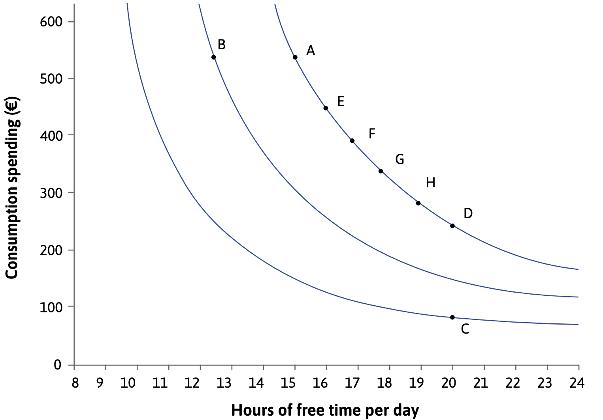
```

Indifference curves can be drawn through any point in the diagram, to show other points giving the same utility.

]

---
### Indifference curves

.pull-left[
- *Indifference curves slope downward due to trade-offs*: If you are indifferent between two combinations, the combination that has more of one good must have less of the other good.

- *Higher indifference curves correspond to higher utility levels*: As we move up and to the right in the diagram, further away from the origin, we move to combinations with more of both goods.

- *Indifference curves are usually smooth*: Small changes in the amounts of goods don’t cause big jumps in utility.

- *Indifference curves do not cross*

- *As you move to the right along an indifference curve, it becomes flatter.*

]


.pull-right[
```{r, out.width="100%"}

```

**marginal rate of substitution (MRS)**: The trade-off that a person is willing to make between two goods. 

At any point, the MRS is the absolute value of the slope of the indifference curve.

]
 
 
---
### Indifference curves

**marginal rate of substitution (MRS)**: The trade-off that a person is willing to make between two goods. 

```{r out.width="55%"}
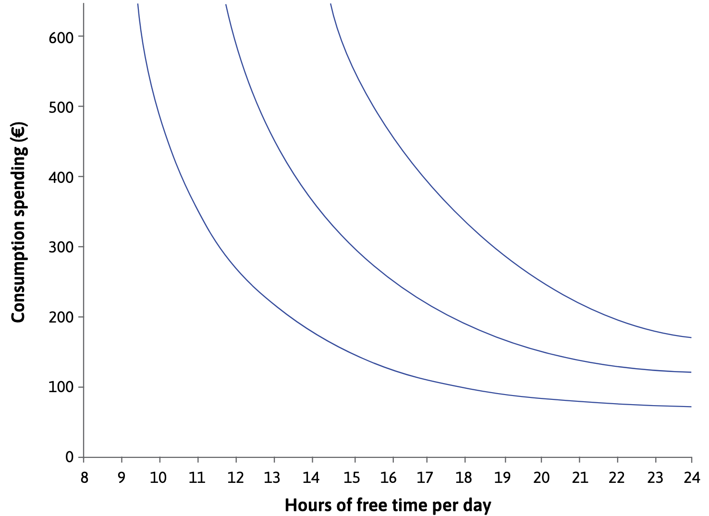
```

Three indifference curves for Karim. The curve furthest to the left offers the lowest utility.

---
### Indifference curves

**marginal rate of substitution (MRS)**: The trade-off that a person is willing to make between two goods. 

```{r out.width="55%"}
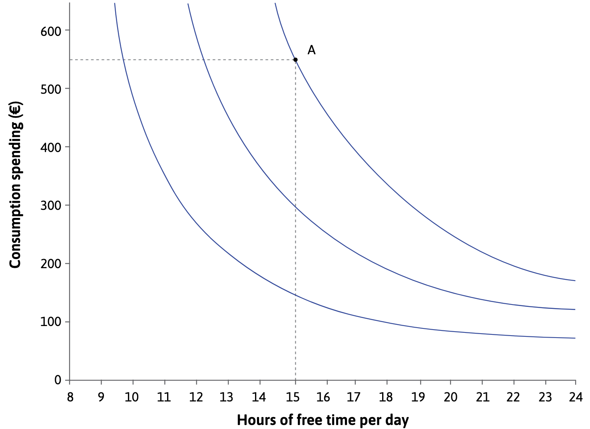
```

At A, he has 15 hours of free time and €540 to spend.

---
### Indifference curves

**marginal rate of substitution (MRS)**: The trade-off that a person is willing to make between two goods. 

```{r out.width="55%"}
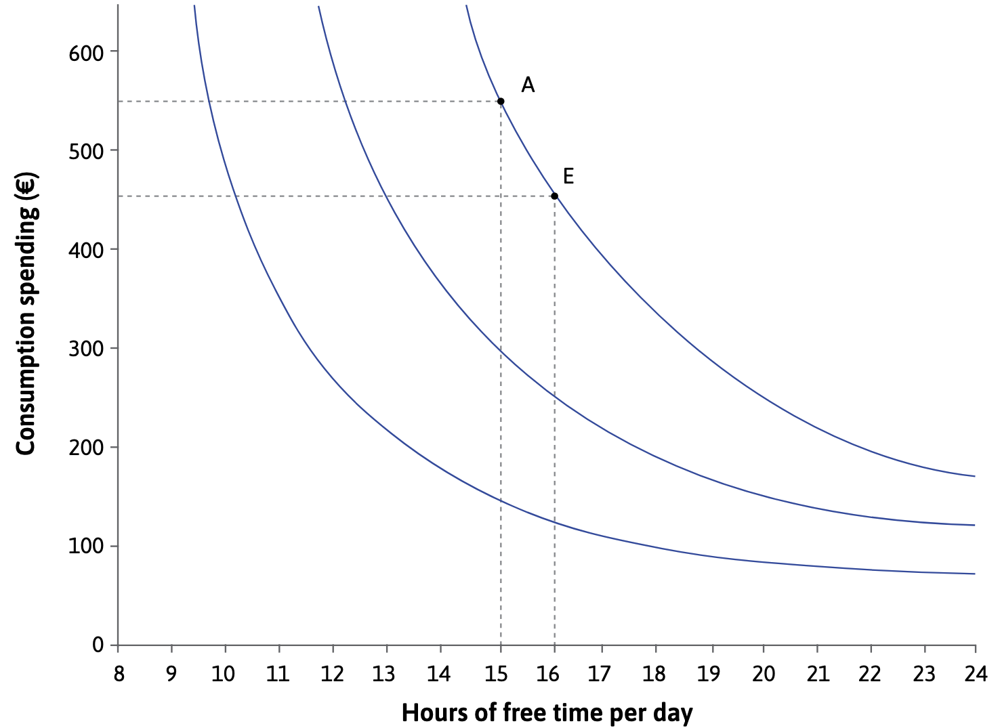
```

Willing to move from A to E, giving up €94 for an extra hour of free time. His **MRS** is 94. The indifference curve is steep at A.

---
### Indifference curves

**marginal rate of substitution (MRS)**: The trade-off that a person is willing to make between two goods. 

```{r out.width="55%"}
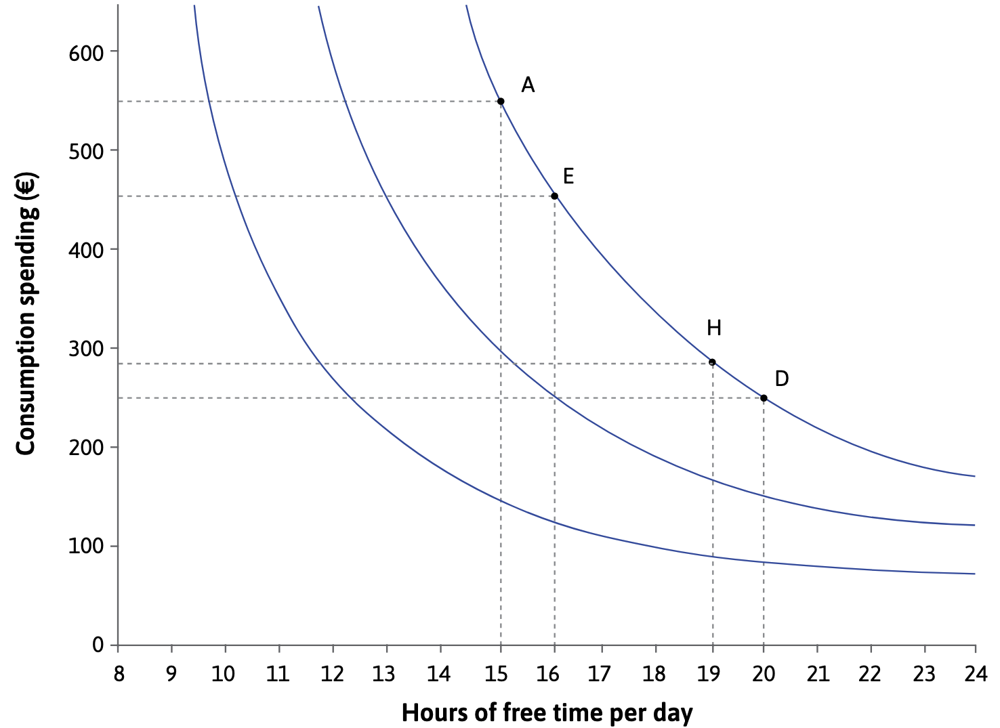
```

At H, he is willing to give up only €32 for one more hour of free time: **MRS** is 32. As we move down the curve, the MRS falls as consumption becomes scarcer, flattening the curve.

---
### Indifference curves

**marginal rate of substitution (MRS)**: The trade-off that a person is willing to make between two goods. 

```{r out.width="55%"}
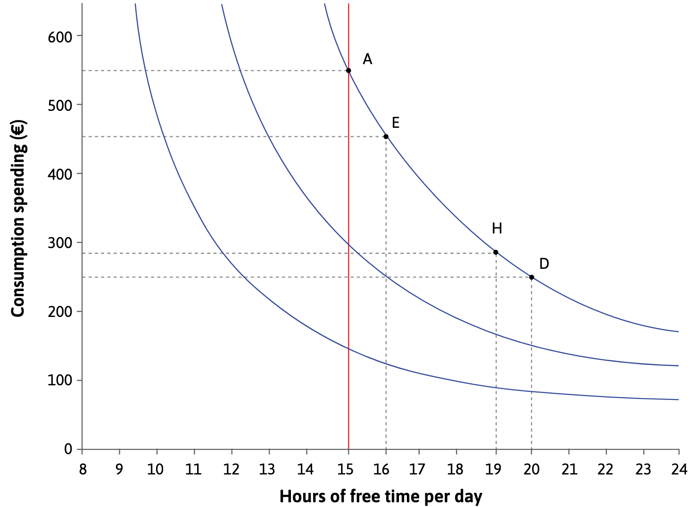
```

At 15 hours of free time, low consumption gives a flat curve and low **MRS**. Moving up, curves steepen and MRS rises.

---
### Indifference curves

**marginal rate of substitution (MRS)**: The trade-off that a person is willing to make between two goods. 

```{r out.width="55%"}
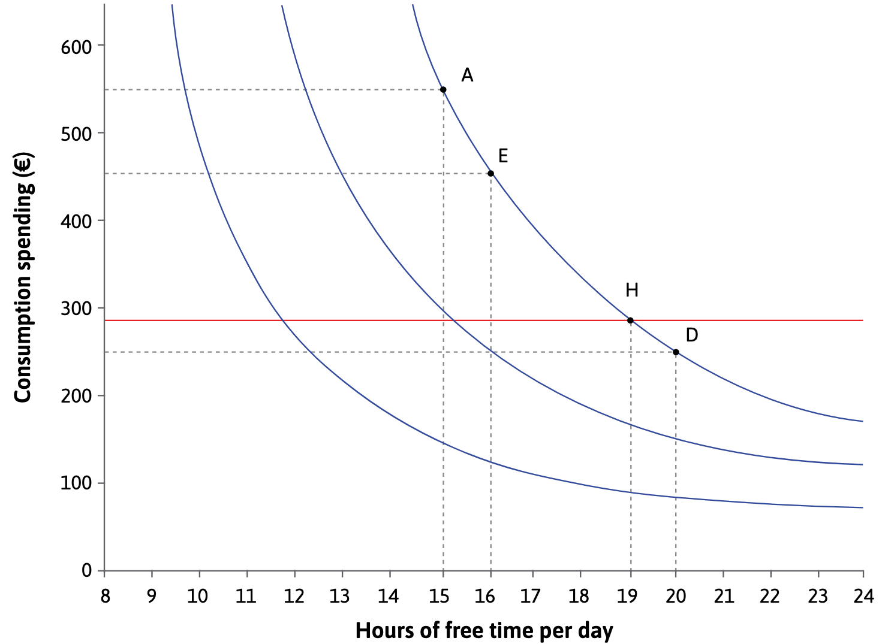
```

At €282 of consumption, free time is scarce and **MRS** is high. Moving right, he’s less willing to trade consumption for free time, so MRS falls and curves flatten.


---
### Indifference curves, marginal changes, and the marginal rate of substitution

.left-column[

|  | Free time (t) | c |
|--------|--------------------|----------------|
| A      | 15                 | 540            |
| E      | 16                 | 446            |
| F      | 17                 | 376            |
| G      | 18                 | 323            |
| H      | 19                 | 282            |
| D      | 20                 | 250            |

**utility**: Numeric measure of the value placed on an outcome.

$$U(t,c) = \bar{u}$$
]

.right-column[

Karim’s utility function: 

$$U(t,c)=(𝑡−6)^2 (𝑐−45) \quad for \quad t>6,\;c>45$$

]

---
### Indifference curves, marginal changes, and the marginal rate of substitution

.left-column[

|  | Free time (t) | c |
|--------|--------------------|----------------|
| A      | 15                 | 540            |
| E      | 16                 | 446            |
| F      | 17                 | 376            |
| G      | 18                 | 323            |
| H      | 19                 | 282            |
| D      | 20                 | 250            |

**utility**: Numeric measure of the value placed on an outcome.

$$U(t,c) = \bar{u}$$
]

.right-column[

Karim’s utility function: 

$$U(t,c)=(𝑡−6)^2 (𝑐−45) \quad for \quad t>6,\;c>45$$

*Calculate utility levels*:

At point $E(t = 16, c = 446)$:

$$U(16,446)=(16−6)^2 (446−45)= 40,100$$

(other points have approximately, but not exactly because the consumption values in the table have been rounded to show whole numbers)

]

---
### Indifference curves, marginal changes, and the marginal rate of substitution

.left-column[

|  | Free time (t) | c |
|--------|--------------------|----------------|
| A      | 15                 | 540            |
| E      | 16                 | 446            |
| F      | 17                 | 376            |
| G      | 18                 | 323            |
| H      | 19                 | 282            |
| D      | 20                 | 250            |

**utility**: Numeric measure of the value placed on an outcome.

$$U(t,c) = \bar{u}$$
]

.right-column[

Karim’s utility function: 

$$U(t,c)=(𝑡−6)^2 (𝑐−45) \quad for \quad t>6,\;c>45$$

*Plot indifference curves*:

With Karim’s utility function, the equation of an indifference curve is:

$$(t−6)^2 (c−45) = u_0$$

which can be rearranged to obtain the indifference curves:

$$c = \frac{u_0}{(t−6)^2}  + 45$$

To draw an indifference curve, we can choose a value for $u_0$ and plot the graph of this relationship, with $t$ on the horizontal axis and $c$ on the vertical axis. 

]


---
### Indifference curves, marginal changes, and the marginal rate of substitution

.left-column[

|  | Free time (t) | c |
|--------|--------------------|----------------|
| A      | 15                 | 540            |
| E      | 16                 | 446            |
| F      | 17                 | 376            |
| G      | 18                 | 323            |
| H      | 19                 | 282            |
| D      | 20                 | 250            |

**utility**: Numeric measure of the value placed on an outcome.

$$U(t,c) = \bar{u}$$
]

.right-column[

Karim’s utility function: 

$$U(t,c)=(𝑡−6)^2 (𝑐−45) \quad for \quad t>6,\;c>45$$

*Calculate the marginal rate of substitution*:

indifference curve:

$$c = \frac{u_0}{(t−6)^2}  + 45$$

Then we differentiate to find the slope of the curve:

$$\frac{dc}{dt} = \frac{-2u_0}{(t−6)^3} \quad \iff \quad \frac{dc}{dt} = \frac{-2 (t−6)^2 (c−45)}{(t−6)^3} =  \frac{-2 (c−45)}{(t−6)}$$


The MRS is the absolute value of the slope:

$$MRS = \frac{2 (c−45)}{(t−6)}$$

]

---
### The marginal rate of substitution: A general formula (Extension 3.3)

Suppose both $t$ and $c$ change by small amounts $\partial t$ and $\partial c$. 

--

The small increments formula for functions of two variables gives an approximation to the change in utility:

$$\partial U \approx \frac{\partial U}{\partial t} \partial t + \frac{\partial U}{\partial c} \partial c$$
--

If the small changes, $\partial t$ and $\partial y$, are so that we move to a point on the same indifference curve, utility does not change $\partial U = 0$

 
$$ \frac{\partial U}{\partial t} \partial t + \frac{\partial U}{\partial c} \partial c \approx 0 \iff  \frac{d c}{d t} = - \frac{\partial U}{\partial t} / \frac{\partial U}{\partial c}  $$
--

If we take the limit as $\partial t \rightarrow 0$, the left-hand side approaches the slope of the curve and the approximation becomes an equation.

--

Then, **marginal rate of substitution (MRS)** is the absolute value of the slope:

$$MRS = | \frac{\partial U}{\partial t} / \frac{\partial U}{\partial c} |$$
$$ \textit{marginal rate of substitution} = \frac{\textit{marginal utility of free time}}{\textit{marginal utility of consumption}}$$

---
.center2[
# The feasible set
]

---
### The feasible set

Not all combinations of consumption and free time are available.

The more free time Karim takes, the less consumption he can have. Free time has an **opportunity cost**.

---
### The feasible set

**budget constraint**: All combinations of goods and services one could acquire that would exactly exhaust one’s budgetary resources.

.left-column[

$$c = w(24-t)$$

| h | t | c |
|----------------|----------------|----------------|
| 0              | 24             | 0              |
| 2              | 22             | 60             |
| 4              | 20             | 120            |
| 6              | 18             | 180            |
| 8              | 16             | 240            |
| 10             | 14             | 300            |
| 12             | 12             | 360            |
| 14             | 10             | 420            |
| 16             | 8              | 480            |
]

.right-column[
```{r out.width="70%"}
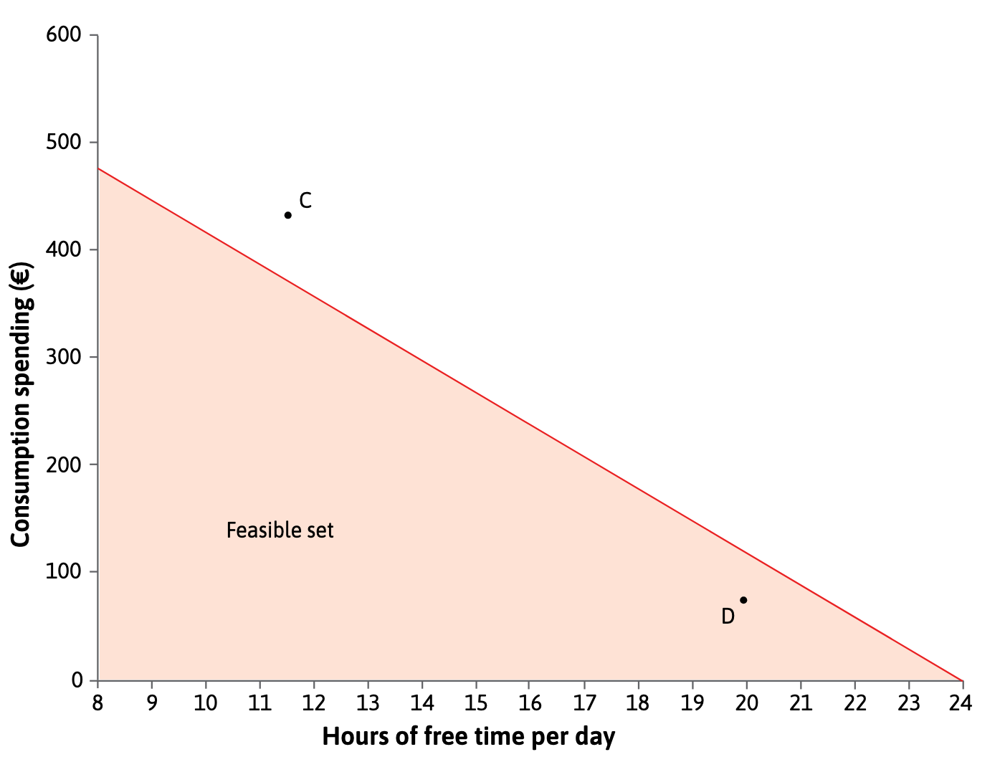
```
]

---
### Marginal rate of transformation (MRT)⁠

**marginal rate of transformation (MRT)⁠** :The quantity of a good that must be sacrificed to acquire one additional unit of another good.  At any point, it is the absolute value of the slope of the feasible frontier. 

.left-column[

$$c = w(24-t)$$

| h | t | c |
|----------------|----------------|----------------|
| 0              | 24             | 0              |
| 2              | 22             | 60             |
| 4              | 20             | 120            |
| 6              | 18             | 180            |
| 8              | 16             | 240            |
| 10             | 14             | 300            |
| 12             | 12             | 360            |
| 14             | 10             | 420            |
| 16             | 8              | 480            |
]

.right-column[
```{r out.width="70%"}

```
]

---
## Two trade-offs

### **marginal rate of substitution (MRS)**

The trade-off on **willingness to choose** between consumption and free time.

### **marginal rate of transformation (MRT)**

The trade-off that one is **constrained** to make by the feasible frontier

---
.center2[
# Decision-making and scarcity
]

---
## Decision-making and scarcity

- Identify preferences over combinations of consumption and free time.

- Determine which combinations are feasible given constraints.

- $\Rightarrow$ Combine preferences and the feasible set to find the chosen option.

---
## Decision-making and scarcity

```{r out.width="55%"}

```

Karim’s indifference curves and his feasible frontier.

---
## Decision-making and scarcity

```{r out.width="55%"}
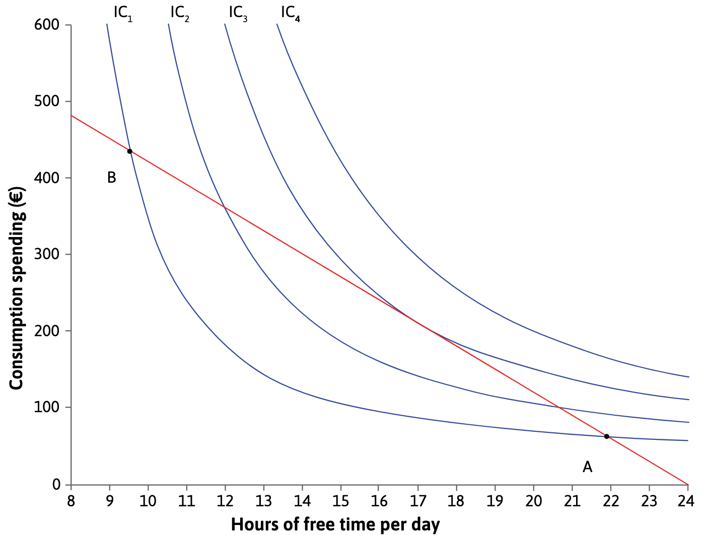
```

On $IC_1$, all combinations between A and B are feasible because they lie in the feasible set. Suppose Karim chooses one of these combinations.

---
## Decision-making and scarcity

```{r out.width="55%"}

```

All combinations in the area between $IC_1$ and the feasible frontier are feasible, and give higher utility than combinations on $IC_1$.

---
## Decision-making and scarcity

```{r out.width="55%"}

```

For example, a movement to C would increase Karim’s utility.

---
## Decision-making and scarcity

```{r out.width="55%"}
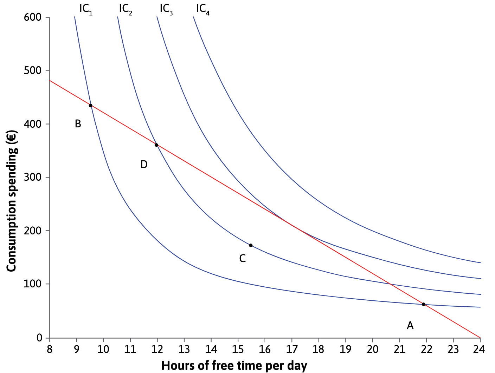
```

Moving from $IC_1$ to point C on $IC_2$ increases Karim’s utility. Switching from B to D would raise his utility by an equivalent amount.


---
## Decision-making and scarcity

```{r out.width="55%"}
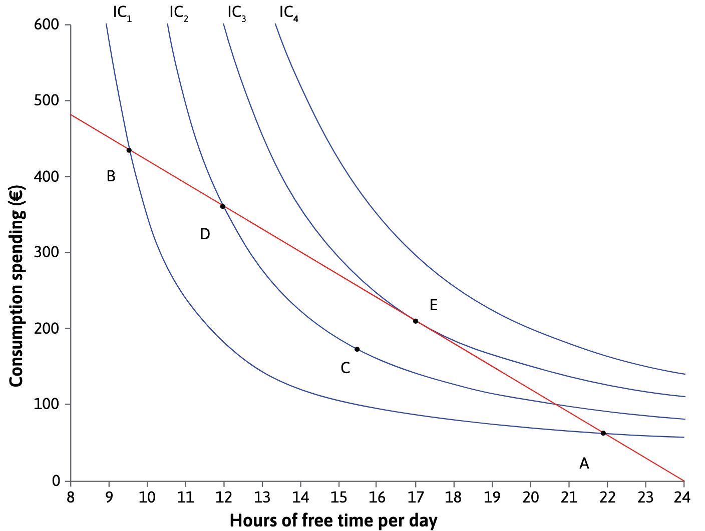
```

But again, Karim can raise his utility by moving into the area between $IC_2$ and the frontier. 

---
## Decision-making and scarcity

```{r out.width="55%"}

```

He can continue to find feasible combinations on higher indifference curves, until he reaches E.

---
## Decision-making and scarcity

```{r out.width="55%"}

```

At E, he has 17 hours of free time per day and €210 for consumption. Karim maximizes his utility: he is on the highest indifference curve obtainable, given the feasible frontier.

---
## Decision-making and scarcity

```{r out.width="55%"}

```

At E, the indifference curve is tangent to the feasible frontier.

**MRS** (slope of the indifference curve) = **MRT** (slope of the frontier)


---
## Decision-making and scarcity

We have modelled a **constrained choice problem**⁠:

a decision-maker (Karim) pursues an objective (utility maximization, in this case) subject to a constraint (his feasible frontier).

--

In our example, both free time and consumption are scarce for Karim because:

- Free time and consumption are goods: Karim values both of them.
- Each has an opportunity cost: More of one good means less of the other.

--

In constrained choice problems, the solution is the choice that best satisfies the individual’s objectives. 

If we assume that utility maximization is Karim’s goal, then the best combination of consumption and free time is a point on the feasible frontier at which:

$$MRS = MRT$$

---
## Decision-making and scarcity

We have modelled a **constrained choice problem**⁠:

$$max \; U(t,c)  \quad s.t. \quad c \leq w(24-t) $$
--

If  $c = w(24-t)$, substitute the constraint for $c$ in terms of $t$ in the utility function:
$$ U(t,c)  =  U(t, w(24-t)) $$
--

Then, maximize $U$ with respect to $t$:
$$\frac{dU}{dt} =  \frac{\partial U}{\partial t} + \frac{\partial U}{\partial c} \cdot  \frac{\partial c}{\partial t} = 0$$

--

We know that $\frac{\partial c}{\partial t} = -w$. Thus:
$$\frac{dU}{dt} =  \frac{\partial U}{\partial t} - \frac{\partial U}{\partial c} \cdot  -w = 0$$
--

Then:
$$  -w = \frac{\partial U}{\partial t} / \frac{\partial U}{\partial c} \iff MRT = MRS $$

---
.center2[
# Hours of work and technological progress
]

---
## Hours of work and technological progress

New technologies raise the productivity of labour.

If workers have sufficient bargaining power to share the benefits with their employers, their wages will rise. 

Suppose wage increases from €30 to €45.

---
### Hours of work and technological progress

Suppose wage increases from €30 to €45.

```{r out.width = "55%"}
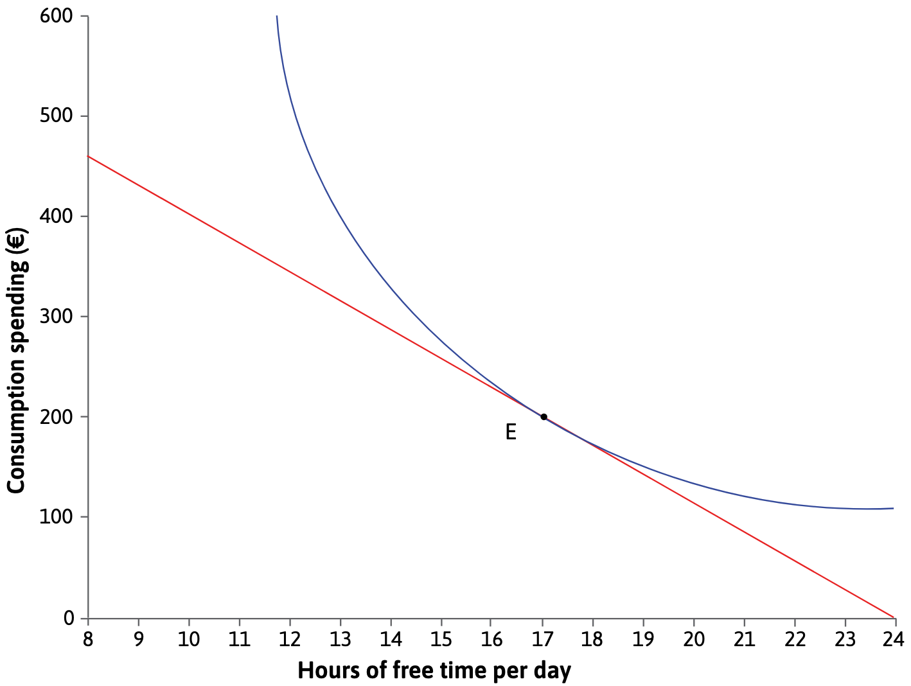
```

With a wage of €30 per hour, Karim chooses point E, with 17 hours of free time and consumption of €210 per day.

---
### Hours of work and technological progress

Suppose wage increases from €30 to €45.

```{r out.width = "55%"}
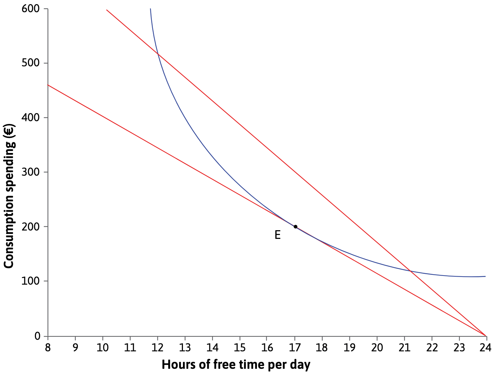
```

When the wage rises, the budget constraint changes. For every hour of free time he gives up to work, his income and consumption will now be higher than before.

---
### Hours of work and technological progress

Suppose wage increases from €30 to €45.

```{r out.width = "55%"}

```

A rise in the wage from €30 to €45 per hour makes the budget constraint steeper. The slope changes from –30 to –45.

---
### Hours of work and technological progress

Suppose wage increases from €30 to €45.

```{r out.width = "55%"}
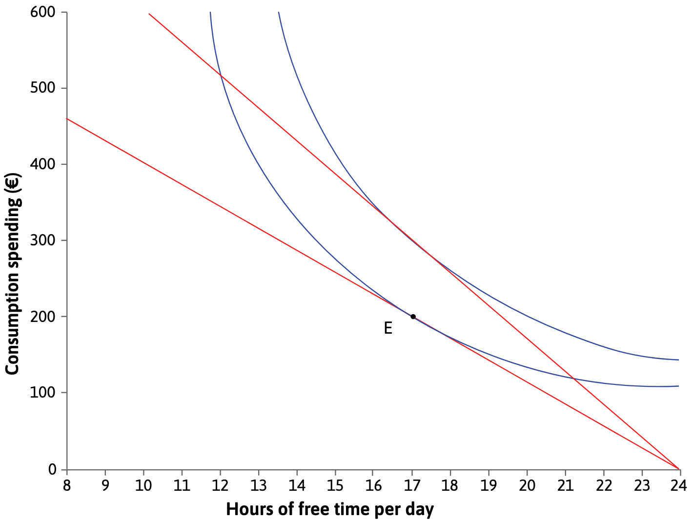
```

Karim’s feasible set has expanded. Now he has a wider choice of combinations of consumption and free time, and he can reach a higher indifference curve.

---
### Hours of work and technological progress

Suppose wage increases from €30 to €45.

```{r out.width = "55%"}

```

He will choose the point on the new budget constraint that reaches the highest possible indifference curve.

---
### Hours of work and technological progress

Suppose wage increases from €30 to €45.

```{r out.width = "55%"}

```

Karim will choose point F, increasing his utility (living standards). Here he will have more free time (17 hours and 20 minutes per day) and higher consumption (€300).

---
### Hours of work and technological progress

Suppose wage increases from €30 to €45.

```{r out.width = "55%"}

```

As a result of the wage rise, he wants to reduce his work hours by 20 minutes per day.

---
.center2[
# Income and substitution effects
]

---
## Income and substitution effects

A higher wage definitely makes it **feasible** to have both more consumption and more free time, 

But how one will choose to have more of both depends on the **preferences** between the two goods.
 
--

$$\text{Overall effect} = \text{Income Effect} + \text{Substitution Effect}$$

.pull-left[
### Income Effect

The effect that an increase in income has on an individual’s demand for a good (the amount that the person chooses to buy) because it expands the feasible set of purchases.

]

.pull-right[
### Substitution Effect

When the price of a good changes, the substitution effect is the change in the consumption of the good that occurs because of the change in the good’s relative price.

]

---
### Income and substitution effects: example

Imagine that you are planning how to spend the 70 days
summer break before your next year at college. 

You have the opportunity to work in a local shop, where you would be paid $90 per day.

But you also want to have time to meet friends,
take a holiday, and study for next year’s courses. 

How many days should you work during the break?

--

.pull-left[
| Days of work | Free days | Consumption ($) |
|---------------|------------|----------------|
| 0             | 70         | 0              |
| 10            | 60         | 900            |
| 20            | 50         | 1,800          |
| 30            | 40         | 2,700          |
| 40            | 30         | 3,600          |
| 50            | 20         | 4,500          |
| 60            | 10         | 5,400          |
| 70            | 0          | 6,300          |
]

.pull-right[
$$c=90(70-d)$$
]

---
### Income and substitution effects: example

```{r out.width="65%"}
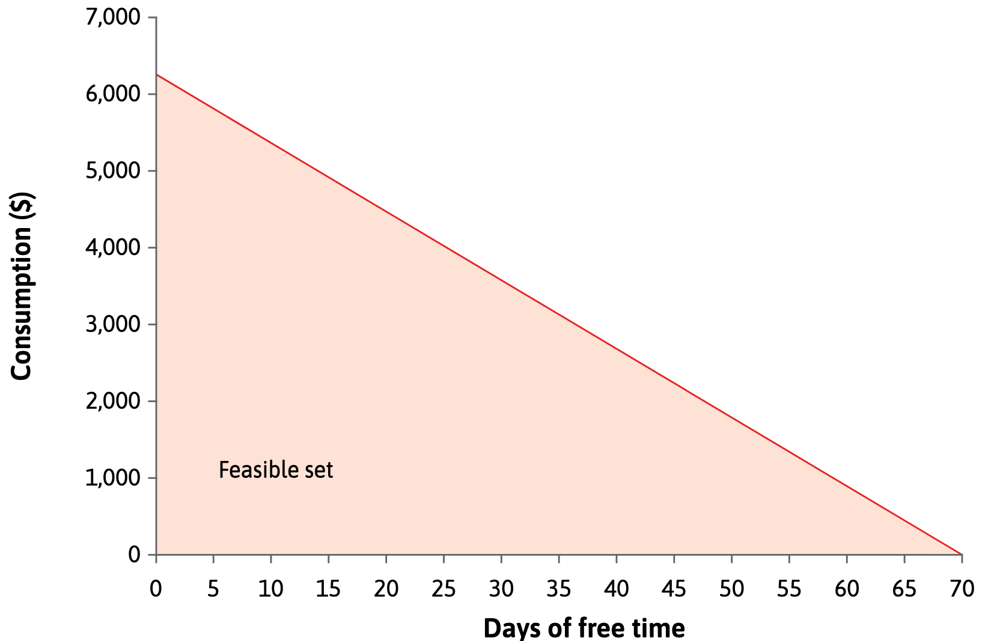
```

The budget constraint, $c = 90(70 − d)$, shows the maximum amount of consumption you can have for each number of free days. 

It is your feasible frontier, and the area below it is the feasible set.

---
### Income and substitution effects: example

```{r out.width="65%"}
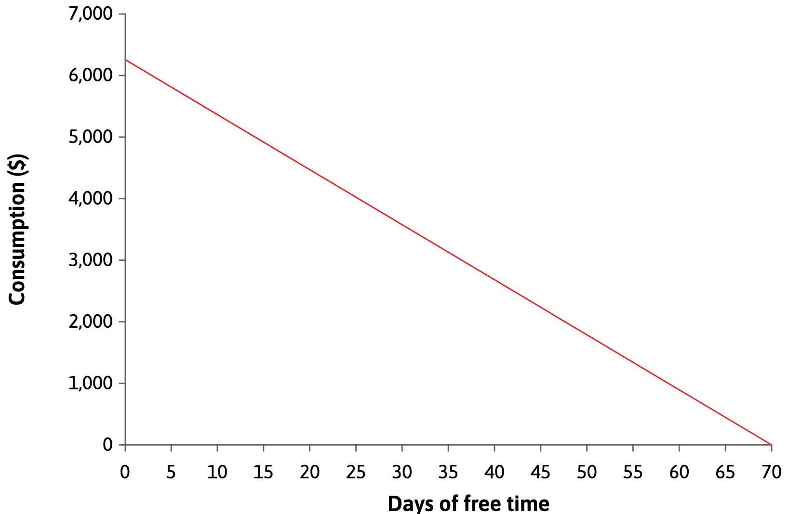
```

The wage is 90, so the slope of the budget constraint is –90. 

90 is your MRT (the rate at which you can transform free days into consumption), and it is also the opportunity cost of a free day.

---
### Income and substitution effects: example

```{r out.width="65%"}
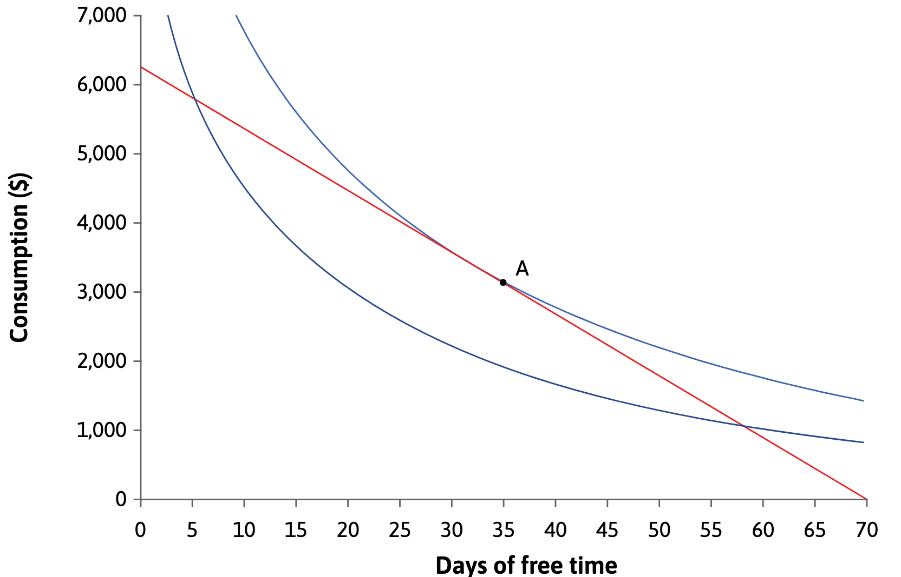
```

With these indifference curves, the ideal plan for the break would be at point A, with 34 free days, and earnings of 3,240. 

At this point, the MRS is equal to the absolute value of the slope of the budget constraint, which is the wage 90.

---
### Income and substitution effects: example

```{r out.width="65%"}

```

$$MRS=MRT=w$$


---
### Income and substitution effects: example

Extra income 1,000 to spend as you like (unrelated to the wage).

--

$$c=90(70-d) + 1000 $$

- the feasible set expands
- no change in the opportunity cost of time: each hour of free time still reduces consumption by 90 (the wage)

---
### Income and substitution effects: example

Extra income 1,000 to spend as you like (unrelated to the wage).

$$c=90(70-d) + 1000 $$

```{r out.width="55%"}
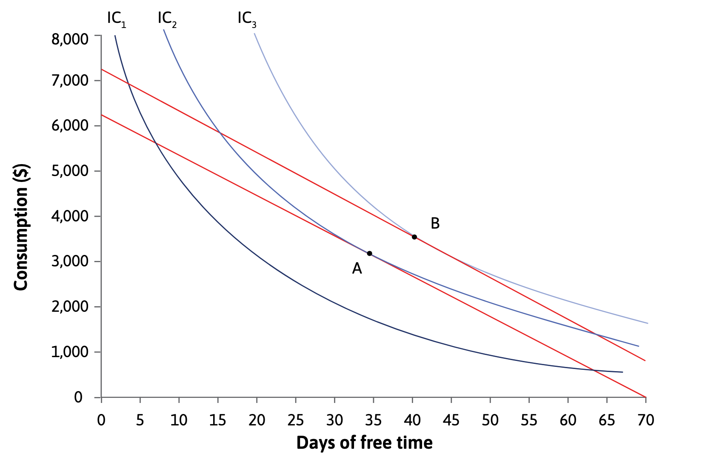
```

With the preferences as the ones before, new optimal choice at B.

---
### Income and substitution effects: example

Extra income 1,000 to spend as you like (unrelated to the wage).

$$c=90(70-d) + 1000 $$

```{r out.width="55%"}
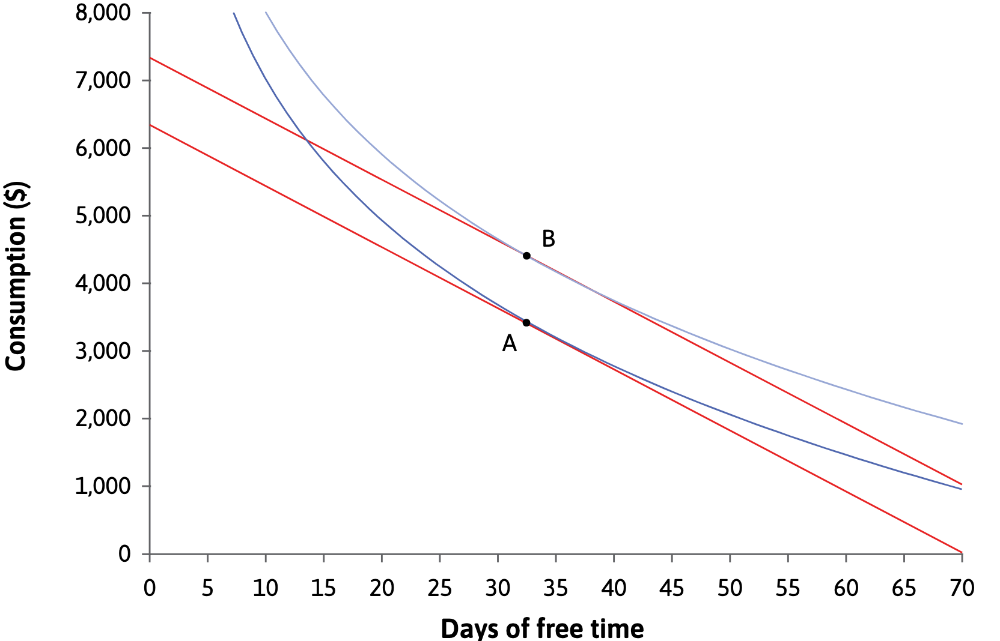
```

With other preferences, optimal choice might be different.

---
### Income and substitution effects: example

Extra income 1,000 to spend as you like (unrelated to the wage).

$$c=90(70-d) + 1000$$

```{r out.width="55%"}

```

**Income effect**: either positive or zero, but not negative: if your income increased, you would not choose to have less of something that you valued.

---
### Income and substitution effects: example

Extra income 1,000 to spend as you like (unrelated to the wage).

$$c=90(70-d) + 1000$$

```{r out.width="55%"}

```

Only **Income effect**: the opportunity cost of a free day is still $90, and you have no reason to substitute consumption for free time (no **substitution effect**).

---
### Income and substitution effects: example

Another potential job wit a 130 wage

$$c=130(70−d)$$

- the feasible set expands
- change in the opportunity cost of time: now each hour of free time still reduces consumption by 130 (the new wage)

---
### Income and substitution effects: example

Another potential job wit a 130 wage

$$c=130(70−d)$$

```{r out.width="55%"}
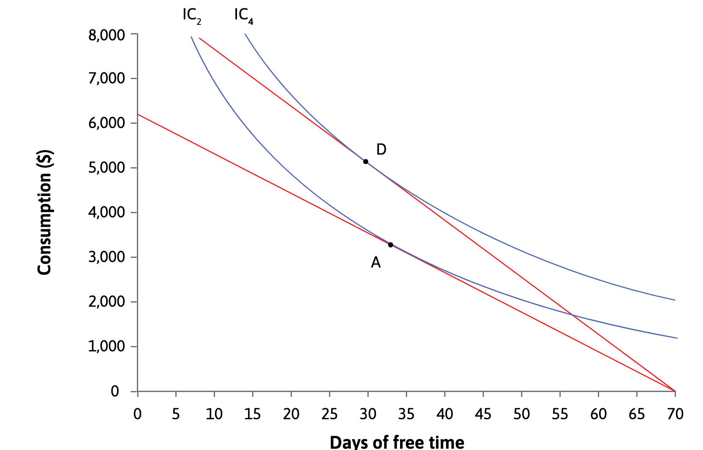
```

Why one would increase the days of work?

---
### Income and substitution effects: example

$$c=130(70−d)$$


```{r out.width="55%"}
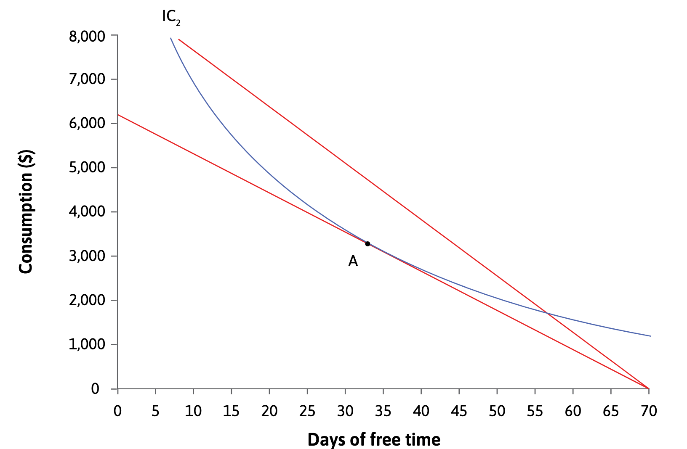
```

When the wage is 90, your best choice of free days and consumption is at point A. 

---
### Income and substitution effects: example

$$c=130(70−d)$$

```{r out.width="55%"}

```

The steeper line shows your new budget constraint when the wage rises to 130 per day. Your feasible set has expanded.

---
### Income and substitution effects: example

$$c=130(70−d)$$

```{r out.width="55%"}
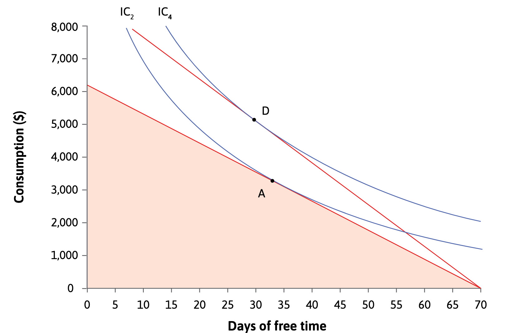
```

Point D on $IC_4$ gives you the highest utility, where MRS = 130. 

You have only 30 free days, but your consumption has risen to 5,200.

---
### Income and substitution effects: example

$$c=130(70−d)$$

```{r out.width="55%"}
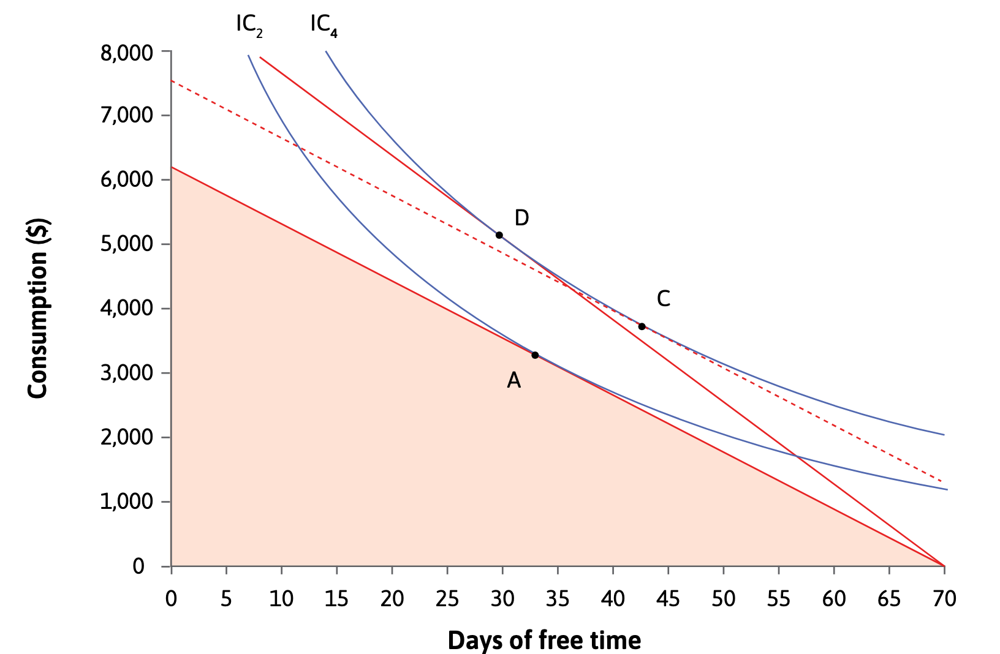
```

What would have happen if you had enough income to reach $IC_4$ without a change in the opportunity cost of free time? Point C.

---
### Income and substitution effects: example

$$c=130(70−d)$$

```{r out.width="55%"}
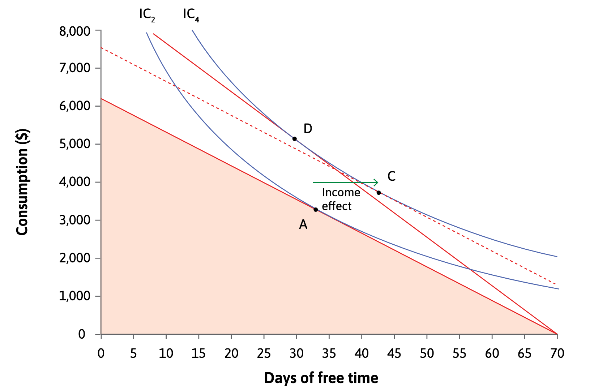
```

The shift $A \rightarrow C$ is the **income effect** of the wage rise; on its own it would cause you to take more free time.

---
### Income and substitution effects: example

$$c=130(70−d)$$

```{r out.width="55%"}
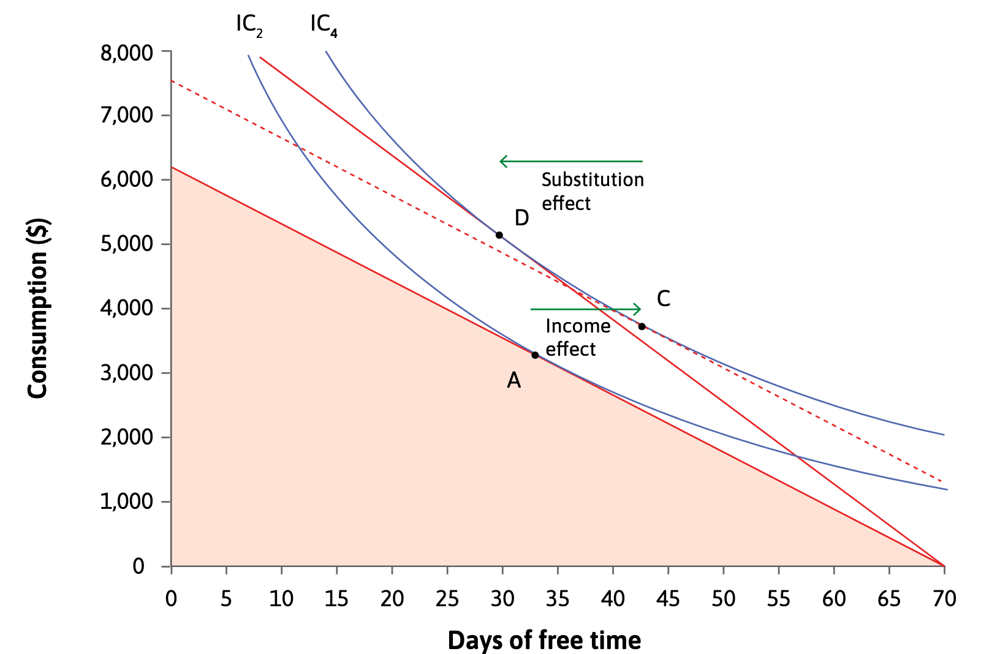
```

The shift $C \rightarrow D$ is the **substitution effect** of the wage rise; the rise in the opportunity cost of free time makes the budget constraint steeper.

---
### Income and substitution effects: example

$$c=130(70−d)$$

```{r out.width="55%"}
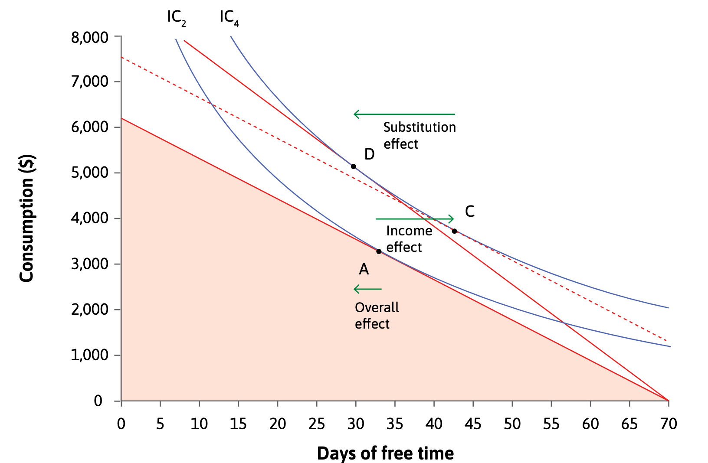
```

The overall effect of the wage rise depends on the sum of the income and substitution effects. 

In this case, the negative substitution effect is bigger, so with the higher wage you take less free time.


---
### Income and substitution effects: example

A wage rise has two effects on your choice of free time.

```{r out.width="55%"}

```

**Income effect**: (because the budget constraint shifts outwards): the effect that the additional income would have if there were no change in the opportunity cost.

---
### Income and substitution effects: example

A wage rise has two effects on your choice of free time:

```{r out.width="55%"}

```

**Substitution effect**: (because the slope of the budget constraint, the MRT, rises): the effect of the change in the opportunity cost, given the new level of utility.


---
### Income and substitution effects: maths

$$U(t,c) = t \cdot (c+600) \quad \Rightarrow \; MRS = | \frac{\partial u/\partial t}{\partial u/\partial c} | = \frac{c+600}{t}$$

--

If $MRS = MRT \; \iff \; (c+600)/t = w$
--
 , and the budget constrain is: $c = w(70-t) + I$

--

We can substitute and solve for $t$:

$$
\frac{w(70 - t) + I + 600}{t} = w 
\; \iff \; 
w(70 - t) + I + 600 = wt 
\; \iff \; 
70w + I + 600 = 2wt 
$$
$$
\; \iff \; 
t^* = \frac{70w + I + 600}{2w} = 35 + \frac{I + 600}{2w}
$$

--

And then solve for $c$:

$$
c = w(70 - t) + I 
\; \iff \; 
c = w \cdot \left(70 - \frac{70w + I + 600}{2w}\right) + I 
\; \iff \; 
c = 35w - \frac{I + 600}{2} + I
$$
$$
\; \iff \; 
c^* = 35w + \frac{I}{2} - 300
$$

---
### Income and substitution effects: maths

The equations show that the solution $(t^∗, c^∗)$ are the utility-maximizing choice of $c$ and $t$ as a function of the wage ($w$) and unearned income ($I$).

--
.pull-left[
$$
t^*(w,I)=35+\frac{I+600}{2w}
$$

]

.pull-right[
$$
c^*(w,I)=35w+\frac{I-600}{2}
$$

]

--

*What happens with an increase in $w$?*

.pull-left[
*Effect on free time*

$$
\Rightarrow \frac{\partial t^*}{\partial w}
= - \frac{I+600}{2w^{2}} < 0
$$

]

.pull-right[
*Effect on consumption*

$$
\Rightarrow \quad
\frac{\partial c^*}{\partial w}=35 > 0
$$
]

--

*What happens with an increase in $I$?*

.pull-left[
*Effect on free time*

$$
\Rightarrow \frac{\partial t^*}{\partial I}
= \frac{1}{2w} > 0
$$

]

.pull-right[
*Effect on consumption*

$$
\Rightarrow \quad
\frac{\partial c^*}{\partial I}= 1/2 > 0
$$
]


---
### Income and substitution effects: maths

*How free time changes when $I = 0$ and the wage rises from 96 to 150?*

```{r out.width="70%"}
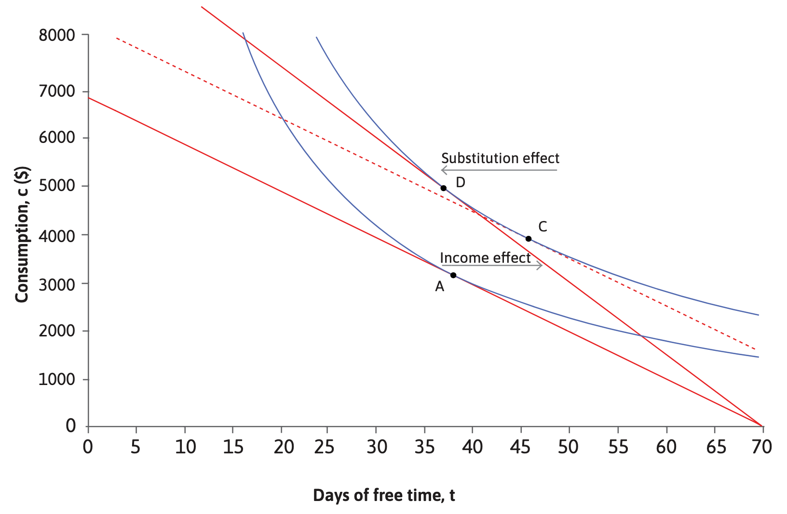
```


---
### Income and substitution effects: maths

*How free time changes when $I = 0$ and the wage rises from 96 to 150?*

.pull-left[
$$
t^*(w,I)=35+\frac{I+600}{2w}
$$

]

.pull-right[
$$
c^*(w,I)=35w+\frac{I-600}{2}
$$

]

--

.pull-left[
- $t_A = 35 +600/192=38.125$ 
- $c_A = 35 \times 96−300=3,060$ 

]

.pull-right[
- $t_D = 35+600/300=37$ 
- $c_D = 35 \times 150−300=4,950$ 

]

---
### Income and substitution effects: maths

*How free time changes when $I = 0$ and the wage rises from 96 to 150?*

```{r out.width="60%"}

```


.pull-left[
$$t_A = 38.125 \quad c_A = 3,060$$
]

.pull-right[
$$t_D =37 \quad c_D = 4,950$$
]

---
### Income and substitution effects: maths

*Decomposing the overall effect of the wage rise on free time*. 

Read [Extension 3.7](https://books.core-econ.org/the-economy/microeconomics/03-scarcity-wellbeing-07-income-substitution-effects.html#extension-37-mathematics-of-income-and-substitution-effects).

--

**Overall effect:**  Free time decreases:  

$$t_D - t_A = 37 - 38.125 = -1.125$$  

--

**Income effect:**  Equivalent rise in unearned income $J = 1,560$ gives  

$$t_C = 35 + \frac{600 + J}{192} = 46.25 \quad \Rightarrow \quad t_C - t_A = +8.125$$  

--

**Substitution effect:**  

$$t_D - t_C = -1.125 - 8.125 = -9.25$$  

--
 
$\rightarrow$ **Overall:** wage rise increases consumption but reduces chosen free time.


---
.center2[
# Is this a good model? Applications
]

---
## Is this a good model?

- This is not what people do!

- What about other factors?

- What about large groups of workers?

- What about the influence of culture and politics?


---
## Explaining our working hours: Changes over time

.center[
<iframe src="https://ourworldindata.org/grapher/annual-working-hours-per-worker?tab=line" loading="lazy" style="width: 85%; height: 525px; border: 0px none;" allow="web-share; clipboard-write"></iframe>

]

---
## Explaining our working hours: Changes over time

Could the decline in working hours be a response to rising wages?

```{r out.width="70%"}
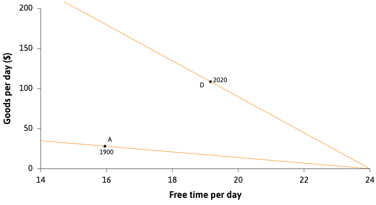
```

The straight lines show the feasible sets for free time and goods in the US in 1900 and 2020, where the slope of each budget constraint is given by the real wage.
 
---
## Explaining our working hours: Changes over time

Could the decline in working hours be a response to rising wages?

```{r out.width="70%"}
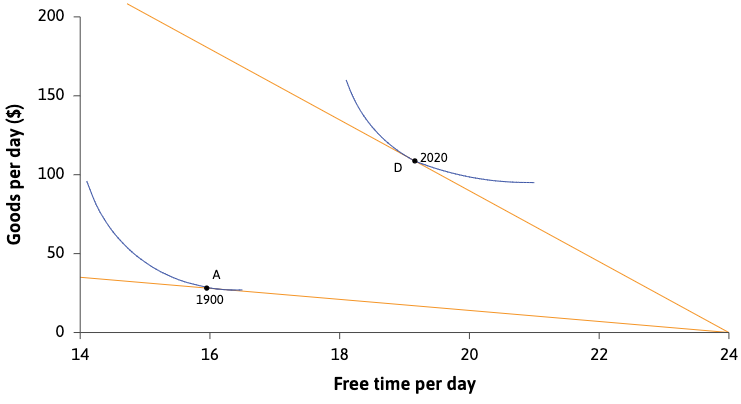
```

Assuming that workers chose the hours they worked, we can infer the approximate shape of their indifference curves.

---
## Explaining our working hours: Changes over time

Could the decline in working hours be a response to rising wages?

```{r out.width="70%"}
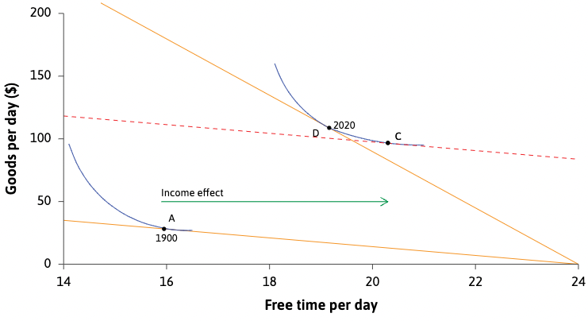
```

The shift from A to C is the income effect of the wage rise, which on its own would cause US workers to take more free time.

---
## Explaining our working hours: Changes over time

Could the decline in working hours be a response to rising wages?

```{r out.width="70%"}
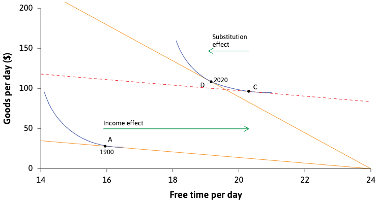
```

The rise in the opportunity cost of free time caused US workers to choose D rather than C, with less free time.

---
## Explaining our working hours: Changes over time

Could the decline in working hours be a response to rising wages?

```{r out.width="70%"}
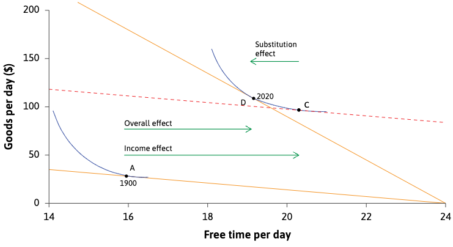
```

The overall effect of the wage rise depends on the sum of the income and substitution effects. In this case, the income effect is bigger, so with the higher wage US workers took more free time as well as more goods.

---
## How more inequality may lead us to value goods more and free time less

.left-column[

**conspicuous consumption** The purchase of goods and services to publicly display one’s social and economic status.

The **Veblen effect**

[What explains the demand for status goods?](https://blogs.worldbank.org/en/developmenttalk/spending-bling-what-explains-demand-status-goods)
]

.right-column[
```{r out.width="60%"}
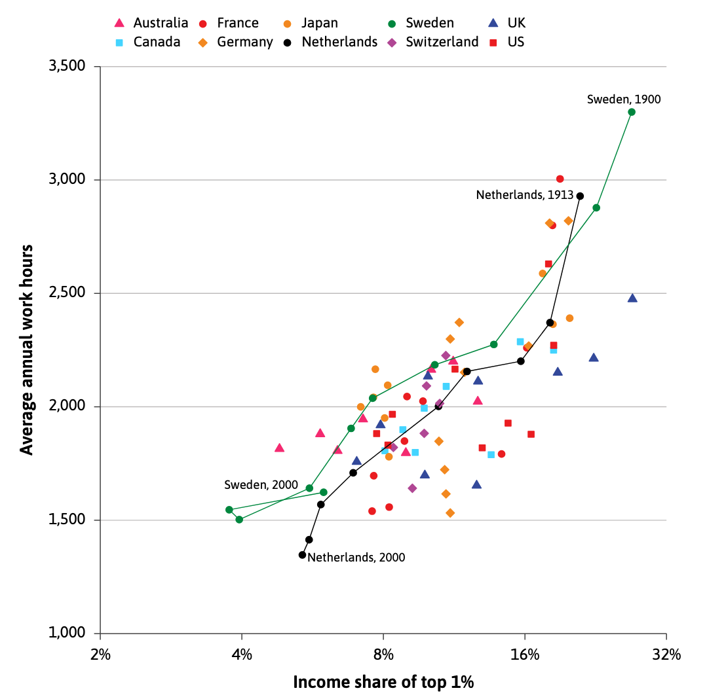
```
]

---
## Explaining our working hours: Differences between countries

Can differences between countries can be explained by differences in wages?

| Country          | Average annual hours worked per employee | Average annual disposable income (single person, no children) | Average annual free time | Wage (disposable income per hour worked) | Free time per day | Consumption per day ($) |
|------------------|------------------------------------------|------------------------------------------------------------------|---------------------------|---------------------------------------------|-------------------|--------------------------|
| US               | 1,767                                   | 54,854                                                           | 6,993                     | 31.04                                       | 19.16             | 150.28                   |
| Netherlands      | 1,399                                   | 39,001                                                           | 7,361                     | 27.88                                       | 20.17             | 106.85                   |
| Australia        | 1,683                                   | 42,554                                                           | 7,077                     | 25.28                                       | 19.39             | 116.59                   |
| South Korea      | 1,908                                   | 26,799                                                           | 6,852                     | 14.05                                       | 18.77             | 73.42                    |
| Slovak Republic  | 1,572                                   | 21,765                                                           | 7,188                     | 13.85                                       | 19.69             | 59.63                    |
| Mexico           | 2,124                                   | 17,384                                                           | 6,636                     | 8.18                                        | 18.18             | 47.63                    |


---
## Explaining our working hours: Differences between countries

Can differences between countries can be explained by differences in wages?

```{r out.width="60%"}
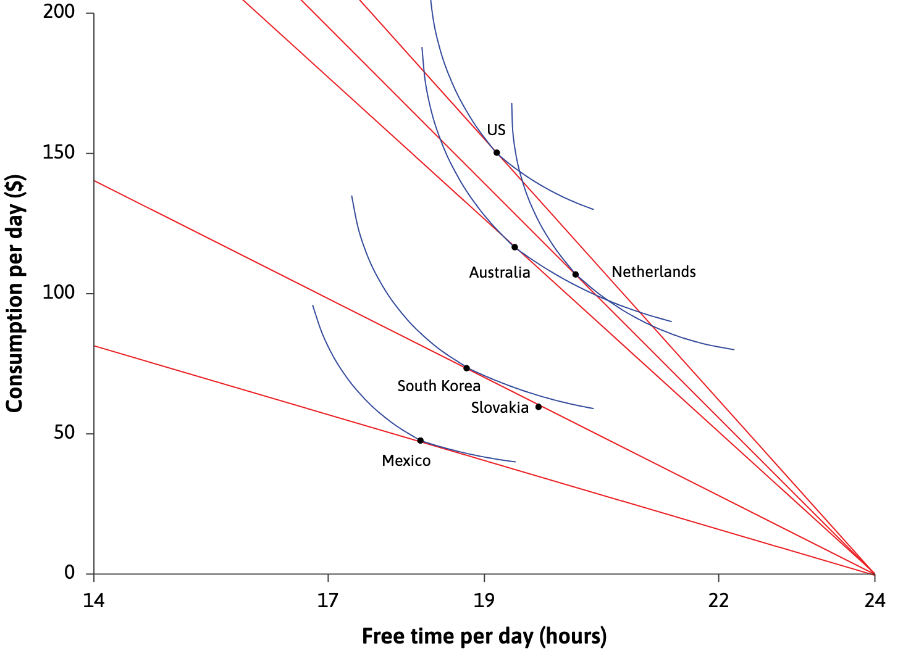
```


---
## Explaining our working hours: Gender and working time

What about gender gaps?

```{r out.width="75%"}
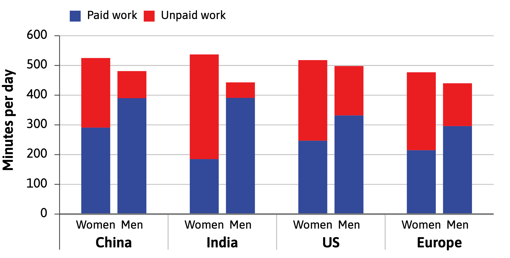
```

---
## Explaining our working hours: Gender and working time

Could the gender wage gap explain why women do less paid work?

---

```{r, out.width="55%"}
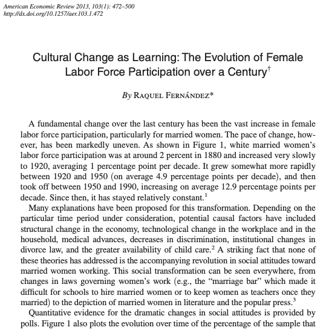
```

---

```{r, out.width="70%"}
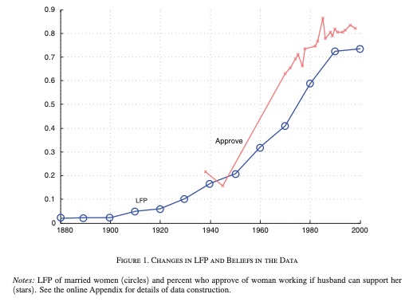
```


---
.center2[
# Summary
]

---
## Summary

1) Simple model of decision-making under scarcity

- Indifference curves represent preferences
- Feasible frontier/budget constraint represents choice
constraints
-  Utility-maximising choice where MRS = MRT


2) Used model to explain effect of technological change on labour
choices

- Overall effect = Income effect + Substitution effect
- Limitations of model – omits important factors

--

### Next unit

- Models of individual choice that include other important
factors

- The role of social interactions in individual choice

- The effect of individual choice on social outcomes


