<style>

.center2 {
  margin: 0;
  position: absolute;
  top: 50%;
  left: 50%;
  -ms-transform: translate(-50%, -50%);
  transform: translate(-50%, -50%);
}

</style>


```{r meta, echo=FALSE}
library(metathis)
meta() %>%
  meta_general(
    description = "An Introduction to xaringan for Presentations: The Basics",
    generator = "xaringan and remark.js"
  ) %>% 
  meta_name("github-repo" = "spcanelon/xaringan-basics-and-beyond")
  # meta_social(
  #   title = "Sharing Your Work with xaringan &#8212; Day 1",
  #   url = "https://spcanelon.github.io/xaringan-basics-and-beyond/slides/day-01-basics.html#1",
  #   image = "https://raw.githubusercontent.com/spcanelon/xaringan-basics-and-beyond/main/slides/day-01-cover-image.png",
  #   image_alt = "Title slide for the day 1 slides of the Sharing Your Work with xaringan workshop series",
  #   og_type = "website",
  #   og_author = "Silvia Canelon",
  #   twitter_card_type = "summary_large_image",
  #   twitter_creator = "@spcanelon"
  # )
```

```{r setup, include = FALSE}
knitr::opts_chunk$set(echo = FALSE)
knitr::opts_chunk$set(out.width = "85%")
knitr::opts_chunk$set(fig.align="center")

options(htmltools.dir.version = FALSE)
library(knitr)
library(tidyverse)
library(xaringanExtra)
library(tweetrmd)
# set default options
opts_chunk$set(echo=FALSE,
               collapse = TRUE,
               fig.width = 7.252,
               fig.height = 4,
               dpi = 300)
# set engines
knitr::knit_engines$set("markdown")
xaringanExtra::use_tile_view()
xaringanExtra::use_panelset()
xaringanExtra::use_clipboard()
xaringanExtra::use_webcam()
xaringanExtra::use_broadcast()
xaringanExtra::use_share_again()
xaringanExtra::style_share_again(
  share_buttons = c("twitter", "linkedin", "pocket")
)
# uncomment the following lines if you want to use the NHS-R theme colours by default
# scale_fill_continuous <- partial(scale_fill_nhs, discrete = FALSE)
# scale_fill_discrete <- partial(scale_fill_nhs, discrete = TRUE)
# scale_colour_continuous <- partial(scale_colour_nhs, discrete = FALSE)
# scale_colour_discrete <- partial(scale_colour_nhs, discrete = TRUE)
```


.center2[
### It is not from the benevolence of the butcher, the brewer, or the baker, that we expect our dinner, but from their regard to their own interest.
]

---
.center2[
# Time for an experiment
]

---


```{r, out.width="100%"}
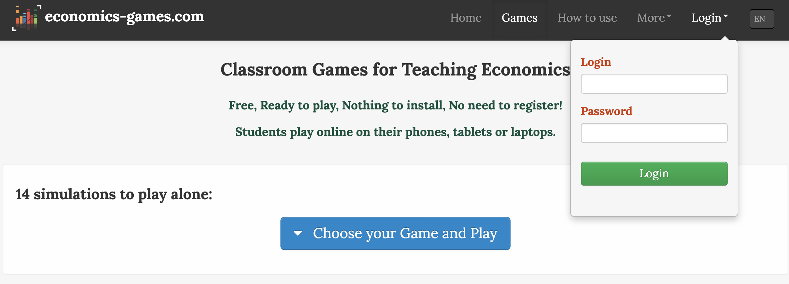
```

.center[
https://economics-games.com/games
]


---

.center[
# The Context for This Unit
]

--

- Previous models of choice did not depend on others’ decisions. (Unit 3)

--

- Individuals motivated by self-interest can produce outcomes that are beneficial for society e.g. entrepreneurship, innovation. (Unit 1)

--

- However, self-interest can also be harmful to society.
  - Why do these problems arise?
  - What can we do about it?

--

.center[
# This Unit
]

Use the tools of **game theory** to model **social interactions** and explain **social dilemmas**


---

```{r, out.width="75%"}
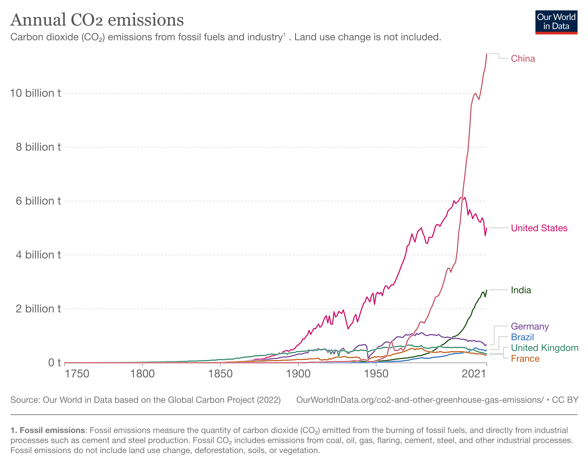
```

---

.center[
## Social dilemma 
]

A situation in which actions taken independently by self-interested individuals result in a  socially suboptimal outcome e.g. traffic jams, climate change

--

Occur when people do not fully account for the effects of their actions on others.

--

**Tragedy of the Commons**: Common property or common resources are often overexploited

```{r, out.width="35%"}
knitr::include_graphics("https://media.giphy.com/media/7kJ926qjkxFx6/giphy.gif")
```

--

**Free riding**: One person/party bears all the costs while everyone enjoys the benefits

--

How can **altruism** and **government policy** resolve social dilemmas?

---

.center2[
# Game theory: Key concepts
]

---

Could be cyclist and tourists in Paris...

```{r, out.width="50%"}
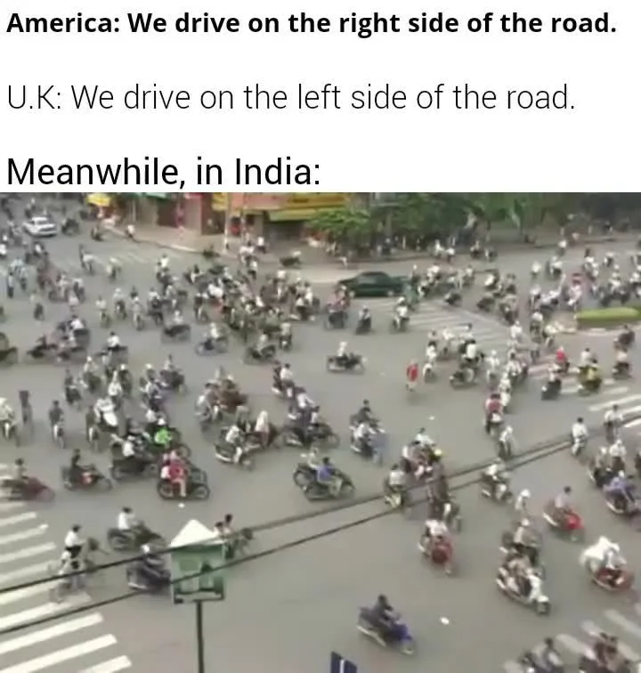
```

---
.center[
## Social and Strategic Interactions
]

--

- **Social interaction**: A situation involving more than one person/party, where one’s actions affect both their own and other people’s outcomes.

--

- **Strategic interaction**: A social interaction where people are aware of the ways that their actions affect others.

--

- **Strategy**: Action(s) that people can take when engaging in a social interaction. 

--

- **Game**: Models or description of strategic interactions 

--

.pull-left[

1. **Players** – who is involved in the interaction
2. **Feasible strategies** – actions each player can take
3. **Information** – what each player knows when choosing their action
4. **Payoffs** – outcomes for every possible combination of actions

]

--

.pull-right[

```{r, out.width="90%"}
knitr::include_graphics("https://cdn.mos.cms.futurecdn.net/TEjMA863BFMGPJ4ErB3wGf.jpg")
```

]


---
.center[
## Example: Crop choice
]

.pull-left[

- Two farmers decide which crop to specialize
- They interact only once (**once shot game**)

1. **Players** – Anil and Bala
2. **Feasible strategies** – Rice or Cassava
3. **Information** – Each farmer does not know what the other chose
4. **Payoffs** – depend on market prices and quality of land

- Anil is better at producing cassava; Bala is better producing rice
- They both sell whatever crop they produce in a nearby village market
- If they bring less of one crop, the price of such crop increases

]

--

.pull-right[
```{r, out.width="100%"}
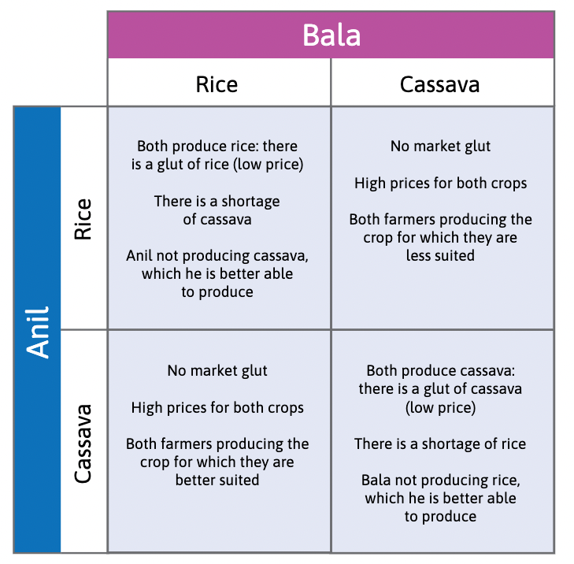
```
]

---
.center[
## Optimal decision-making
]

.pull-left[

- **Best response**: Strategy that yields the highest payoff, **given the other player’s strategy**

- **Dominant strategy**: A best response to all possible strategies of the other player (does not always exist!)

- **Dominant strategy equilibrium**: An outcome of a game in which everyone plays their dominant strategy

]

.pull-right[
```{r, out.width="100%"}
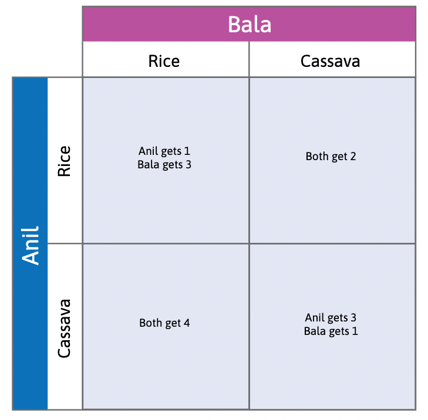
```
]

---

```{r, out.width="50%"}
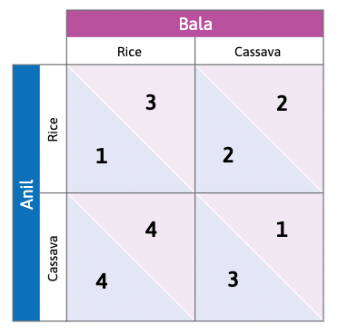
```

Begin with the row player (Anil) and ask: ‘What would be his best response to the column player’s (Bala’s) decision to play Rice?’

---

```{r, out.width="50%"}
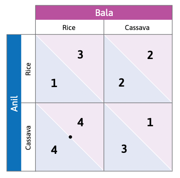
```

If Bala chooses Rice, Anil’s best response is to choose Cassava—that gives him 4, rather than 1. Place a dot in the bottom left-hand cell. A dot in a cell means that this is the row player’s best response.

---

```{r, out.width="50%"}

```

If Bala chooses Cassava, Anil’s best response is to choose Cassava too—giving him 3, rather than 2. Place a dot in the bottom right-hand cell.

---

```{r, out.width="50%"}

```

Both dots are on the bottom row. Whatever Bala’s choice, Anil’s best response is to choose Cassava. Cassava is a dominant strategy for Anil.

---

```{r, out.width="50%"}

```

If Anil chooses Rice, Bala’s best response is to choose Rice (3 rather than 2). Circles represent the column player’s best responses. Place a circle in the upper left-hand cell.

---

```{r, out.width="50%"}

```

If Anil chooses Cassava, Bala’s best response is again to choose Rice (he gets 4 rather than 1). Place a circle in the lower left-hand cell. Rice is Bala’s dominant strategy (both circles are in the same column).

---

```{r, out.width="50%"}

```

We predict that Anil will choose Cassava and Bala will choose Rice because that is their dominant strategy. Where the dot and circle coincide, the players are both playing best responses to each other.

---

.pull-left[

- **Best response**: If Bala grows rice, Anil’s best response is to grow cassava. If Bala grows cassava, Anil’s best response is to grow cassava.

- **Dominant strategy**: Anil’s dominant strategy is to grow cassava. Bala’s dominant strategy is to grow rice.

- **Dominant strategy equilibrium**: When Anil and Bala each play their dominant strategy, the outcome is (Cassava, Rice).

]

.pull-right[
```{r, out.width="100%"}

```
]

---

.pull-left[

.center[
### Nash equilibrium
]

- A set of strategies (one per player), such that each player’s strategy is the best response to the strategies chosen by everyone else.

- In a Nash equilibrium, no player has an incentive to deviate unilaterally.

NOTE: There may be more than one Nash equilibrium in a game. 

]

.pull-right[
```{r, out.width="100%"}

```
]

---

.center2[
# Resolving social dilemmas
]

---
.center[
## The Prisoners’ Dilemma
]

.pull-left[

- Different problem
- Decide how to deal with pest insects destroying the crops

1. **Players** – Anil and Bala
2. **Feasible strategies** – Terminator or Integrated Pest Control (IPC)
3. **Information** – Each farmer does not know what the other chose
4. **Payoffs** – depend on effectiveness and water contamination

]

--

.pull-right[
```{r, out.width="100%"}
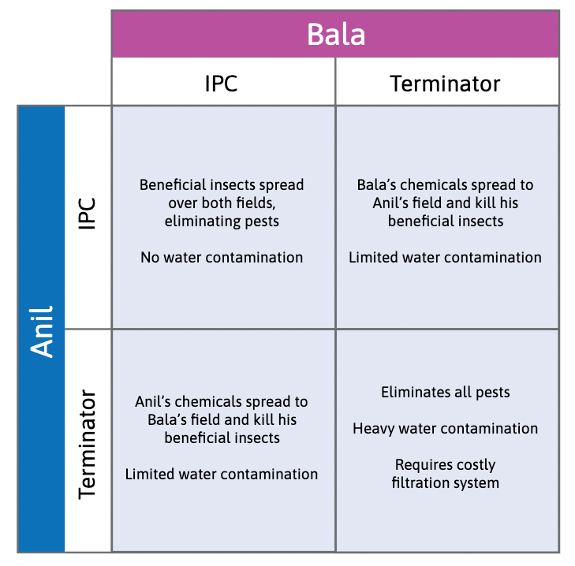
```
]

---
.center[
## The Prisoners’ Dilemma
]

```{r, out.width="50%"}
knitr::include_graphics("imgs/f4-3b.png")
```

---
.center[
## The Prisoners’ Dilemma
]

.pull-left[

**Prisioners' Dilemma**: A game with a dominant strategy equilibrium, in which playing the dominant strategy yields lower individual and total payoffs compared to other strategies

**Socially optimal outcome is not achieved**

Result: Both farmers choose to use the more harmful pest control (T). Why?

1. Players only care about their own payoffs.
  - Introduce social preferences
2. Nobody could make players pay for the consequences of their actions on others.
  - Introduce repeated games, social norms, and peer punishment
3. Players could not coordinate their actions beforehand
  - Change the rules of the game (institutions and policies)

]

.pull-right[
```{r, out.width="100%"}
knitr::include_graphics("imgs/f4-3b.png")
```
]

---
.center[
## Social preferences: Altruism
]

```{r, out.width="75%"}
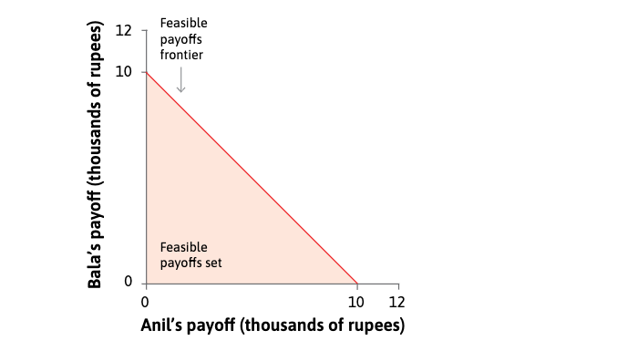
```

Each point $(x, y)$ in the figure represents a combination of amounts of money for Anil $(x)$ and Bala $(y)$, in thousands of rupees. The shaded triangle depicts the feasible choices for Anil.


---
.center[
## Social preferences: Altruism
]

```{r, out.width="75%"}
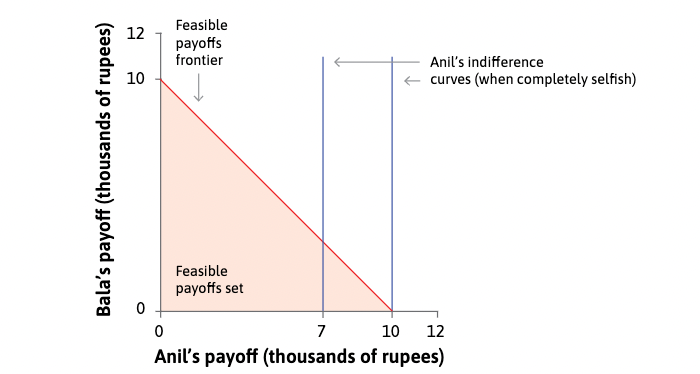
```

If Anil does not care at all about what Bala gets, his indifference curves are straight vertical lines. He is indifferent to whether Bala gets a lot or nothing. He prefers curves further to the right, since he gets more money.

---
.center[
## Social preferences: Altruism
]

```{r, out.width="75%"}
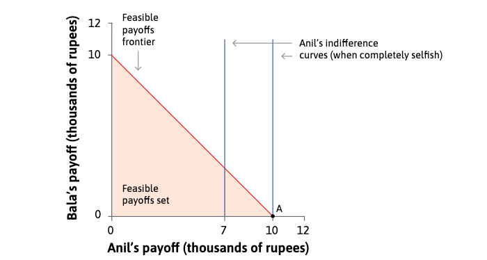
```

Given his feasible set, Anil’s best option is A, where he keeps all the money.

---
.center[
## Social preferences: Altruism
]

```{r, out.width="75%"}
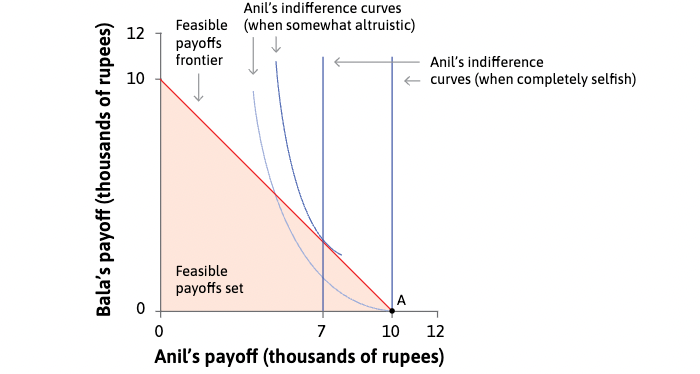
```

But Anil may care about his neighbour Bala, in which case he is happier if Bala is richer: that is, he derives utility from Bala’s consumption. In this case he has downward-sloping indifference curves.

---
.center[
## Social preferences: Altruism
]

```{r, out.width="75%"}
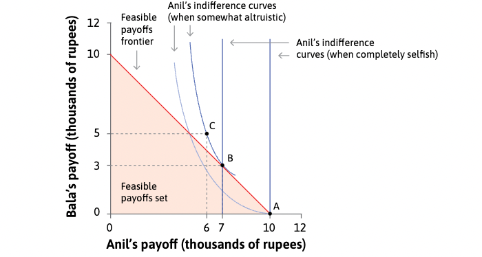
```

Points B and C are equally preferred by Anil, so Anil keeping 7 and Bala getting 3 is just as good in Anil’s eyes as Anil getting 6 and Bala getting 5. His best feasible option is point B.

---
.center[
## Social preferences: Altruism
]

```{r, out.width="75%"}

```

The choice among points on the feasible frontier is called a **zero sum game** because, when choosing point B rather than point A, the sum of Anil’s losses and Bala’s gains is zero.


---
.center[
## Resolving the Prisoners’ Dilemma
]

```{r, out.width="75%"}
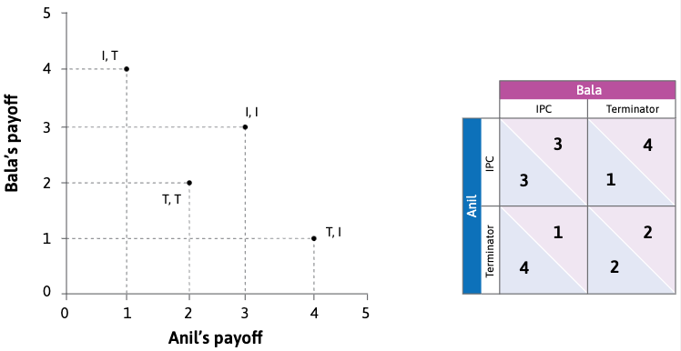
```

The two axes in the figure represent Anil and Bala’s payoffs. The four points are the feasible outcomes associated to the strategies.

---
.center[
## Resolving the Prisoners’ Dilemma
]

```{r, out.width="75%"}
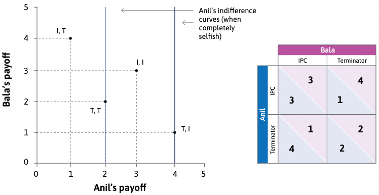
```

If Anil does not care about Bala’s wellbeing, his indifference curves are vertical, so (T, I) is his most preferred outcome. He prefers (T, I) to (I, I), so should choose T if Bala chooses I. If Anil is completely selfish, T is unambiguously his best choice.

---
.center[
## Resolving the Prisoners’ Dilemma
]

```{r, out.width="75%"}
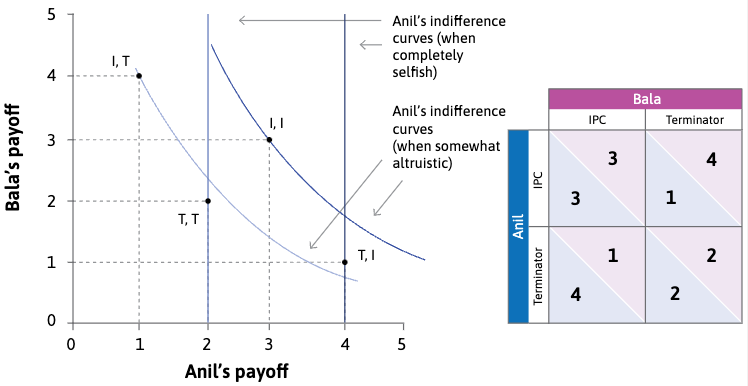
```

When Anil cares about Bala’s wellbeing, indifference curves are downward-sloping and (I, I) is his most preferred outcome. If Bala chooses I, Anil should choose I. Anil should also choose I if Bala chooses T, since he prefers (I, T) to (T, T).

---
.pull-left[

### Repeated Games

- We have so far looked at **one-shot games**.

- Better outcomes can arise in **repeated interactions** due to social norms, reciprocity, and peer punishment.

- Behaving selfishly in one period has consequences in future periods, so it may no longer be a dominant strategy.

```{r, out.width="70%"}
knitr::include_graphics("https://www.peacocktv.com/dam/growth/assets/Library/ModernFamily/modern-family-og-min.png")
```

]

--

.pull-right[

### Other social preferences

- **Inequality aversion**: Disliking outcomes in which some individuals receive more than others

- **Reciprocity**: Being kind/helpful to others who are kind/helpful, and vice versa.

- We evaluate whether others have been ‘kind’ or ‘helpful’ according to **social norms** (common understanding of how to act in situations when one’s actions affect others). 

```{r, out.width="70%"}
knitr::include_graphics("https://media.giphy.com/media/Ssm289P1JYEgcXWqCZ/giphy.gif")
```

]

--

These motives affect outcomes in the **public goods game** and the **ultimatum game**.

---
.center[
## Public Goods game
]

.pull-left[

- Group of farmers
- Decide to contribute to a public good (i.e. irrigation project)
- Contributing has a personal cost, but everyone benefits.

]

.pull-right[

1. **Players** – Four farmers
2. **Feasible strategies** – Contribute (-10) / Not contribute (0)
3. **Information** – Each farmer does not know what the other chose
4. **Payoffs** – For each contribution, 8 minus contribution. Withouth public good, 0.

]

--

.pull-left[

|       |  |
| ----------- | ----------- |
| Benefit from contributions      | +16       |
| Benefit from own contribution   | +8        |
| Cost of contributions  | -10       |
| **Total**  | **14**        |

]

.pull-right[

```{r, out.width="100%"}
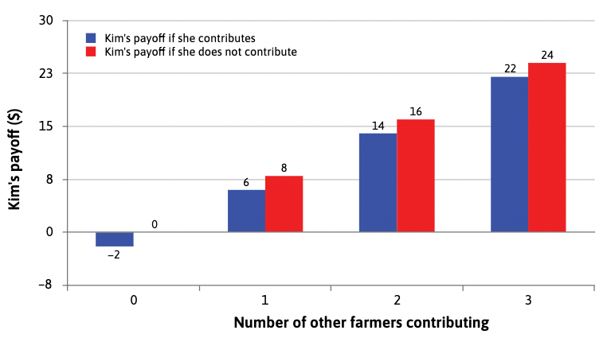
```

]

---

```{r, out.width="75%"}
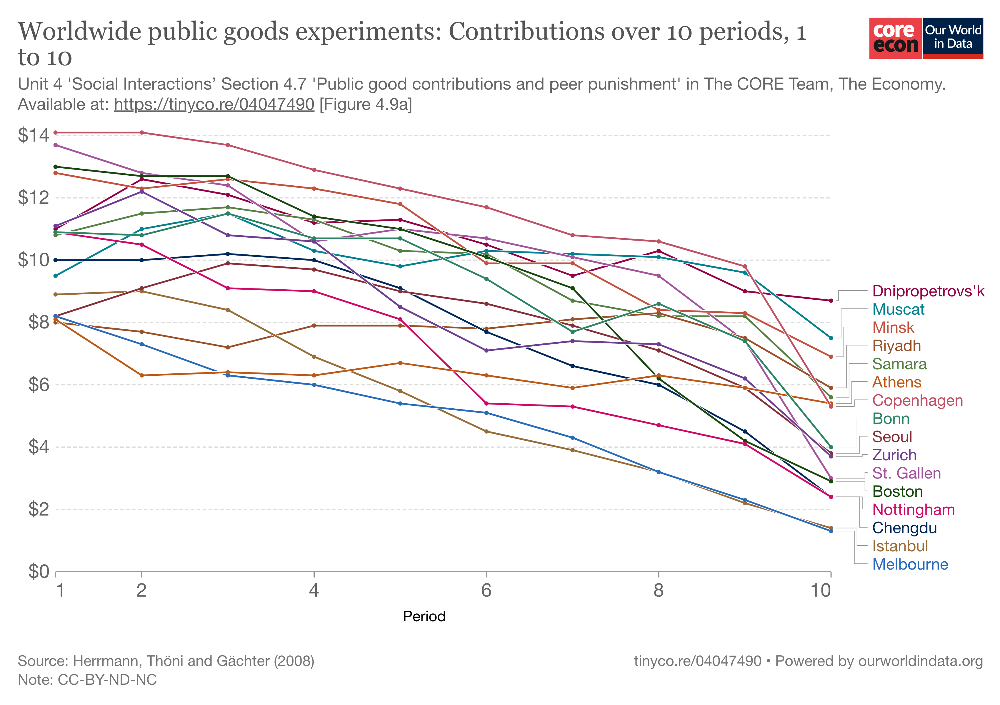
```

--

**Reciprocity and Social Norms**
In public goods experiments, people were happy to contribute as long as others reciprocate. Contributions differ according to social norms.

---

```{r, out.width="75%"}
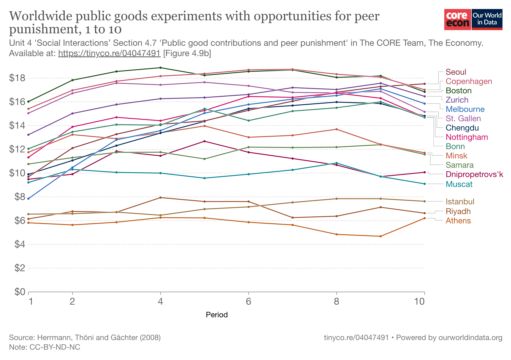
```

--

**Peer punishment**
The ability to identify and punish free-riders 
also increases individual contributions.

---
.center[
### Learning about preferences
]
--

.pull-left[
**Survey questions**

Dermine political preferences, brand loyalty, degree of trust of others, or religious orientation.

```{r, out.width="65%"}
knitr::include_graphics("https://www.worldvaluessurvey.org/photos/EV000428.JPG")
```

**Statistical studies of economic behavior**

For instance, purchases of one or more goods when the relative price varies—to determine preferences for the goods in question. Or **revealed preference** approach.
]

--

.pull-right[

1) **Lab experiments**:
- Control participants’ decisions and outcomes
- Create a control/treatment group
- Results can be replicated
- Can control for other variables

2) **Field experiments**:
- Real-world decision making
- More realistic contexts

```{r, out.width="80%"}
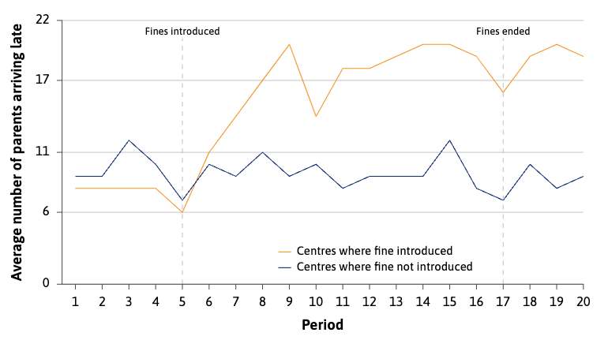
```

]

---
.center2[
# What about your preferences?
]

---

.center[
## The Ultimatum Game
]

--

```{r, out.width="60%"}
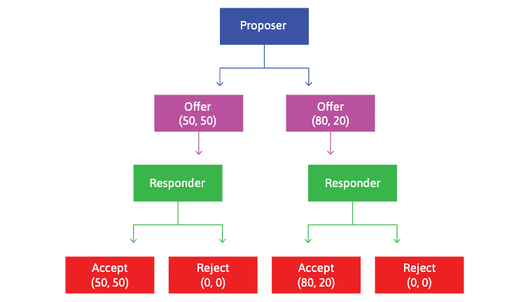
```

Sequential game where players choose how to divide up 
economic rents e.g. cash prize

--

The proposer’s offer may be motivated by altruism, fairness (50-50 split), inequality aversion,  social norms, or reciprocity.

---

.center[
### Acceptable offers in the ultimatum game
]

```{r, out.width="80%"}
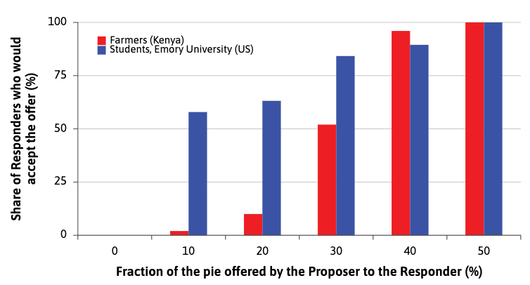
```

The height of each bar indicates the fraction of Responders who **were willing** to accept the offer indicated on the horizontal axis.

---

.center[
### Actual offers and expected rejections in the ultimatum game
]

```{r, out.width="75%"}
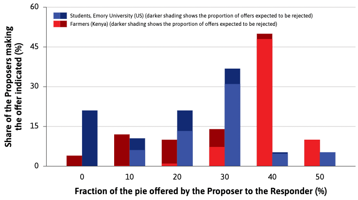
```

The full height of each bar in the figure indicates the percentage of the Kenyan and American Proposers **who made the offer** shown on the horizontal axis.

---

.center[
### Actual offers and expected rejections in the ultimatum game
]

```{r, out.width="75%"}
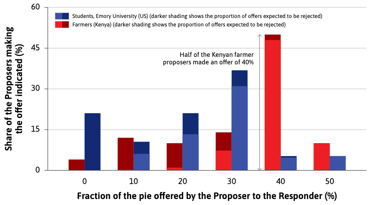
```

For example: for Kenyan farmers, 50% on the vertical axis and 40% on the horizontal axis means half of the Kenyan Proposers made an offer of 40%.

---

.center[
### Actual offers and expected rejections in the ultimatum game
]

```{r, out.width="75%"}

```

If Kenyan farmers made an offer of 30%, almost half of Responders would reject it. (The dark part of the bar is almost as big as the light part.)

---

.center[
### Actual offers and expected rejections in the ultimatum game
]

```{r, out.width="75%"}
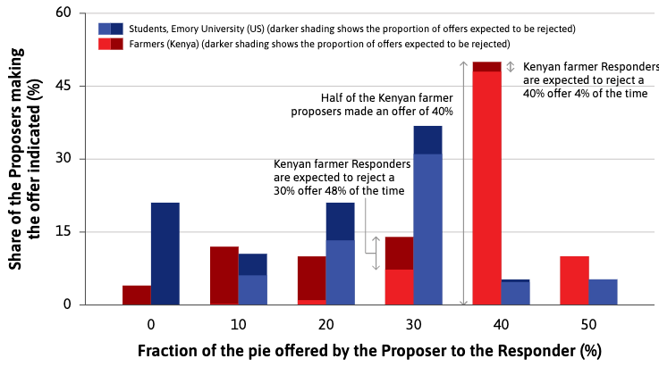
```

The relative size of the dark area is smaller for better offers: for example Kenyan farmer Responders rejected a 40% offer only 4% of the time.

---
.center[
### The rules of the game matter
]

- Proposer offers a two-way split of $100 to two respondents, instead of just one.
- If either of the Responders accepts but not the other, that Responder and the Proposer get the split, and the other Responder gets nothing. 
- If no one accepts, no one gets anything, including the Proposer. 
- If both Responders accept, one is chosen at random to receive the split.

--


```{r, out.width="65%"}
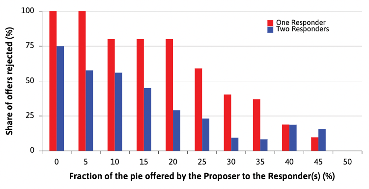
```

Responders are less likely to reject low offers

---
.center[
# Coordination issues
]

```{r, out.width="40%"}

```

--
If Bala is going to choose Rice, Anil’s best response is to choose Cassava. We place a dot in the bottom left-hand cell.

---
.center[
# Coordination issues
]

```{r, out.width="40%"}

```

--

If Bala is going to choose Rice, Anil’s best response is to choose Cassava. We place a dot in the bottom left-hand cell.

---
.center[
# Coordination issues
]

```{r, out.width="40%"}
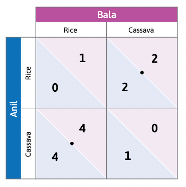
```

If Bala is going to choose Cassava, Anil’s best response is to choose Rice. Place a dot in the top right-hand cell. Notice that Anil does not have a dominant strategy.

---
.center[
# Coordination issues
]

```{r, out.width="40%"}

```

If Anil chooses Rice, Bala’s best response is to choose Cassava, and if Anil chooses Cassava he should choose Rice. The circles show Bala’s best responses. He doesn’t have a dominant strategy either.

---
.center[
# Coordination issues
]

```{r, out.width="40%"}
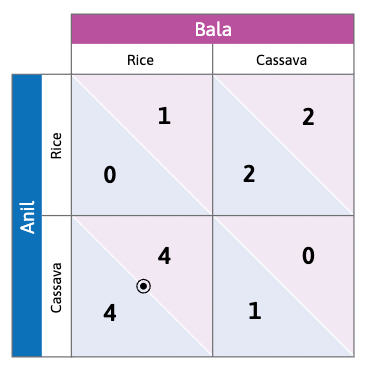
```

If Anil chooses Cassava and Bala chooses Rice, both of them are playing best responses (a dot and a circle coincide). So this is a Nash equilibrium.

---
.center[
# Coordination issues
]

```{r, out.width="40%"}
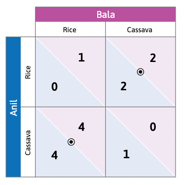
```

If Anil chooses Rice and Bala chooses Cassava then both of them are playing best responses, so this is also a Nash equilibrium, but the payoffs are higher in the other equilibrium.

---
.center[
# Coordination issues
]

```{r, out.width="40%"}

```

.center[
### Multiple Nash equilibria
]

---
.center[
## Climate change
]

```{r, out.width="40%"}
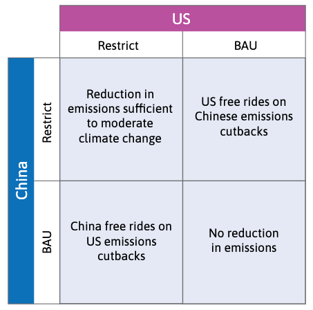
```

.center[
### Prisioners' dilemma
]

---
.center[
## Climate change
]

```{r, out.width="40%"}
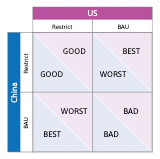
```

.center[
### Prisioners' dilemma
]

---
.center[
## Climate change
]

```{r, out.width="40%"}

```

.center[
### Inequality aversion and reciprocity
]

---
.center[
# Summary
]

--

1) Social interactions can be modeled as games

- Players choose best responses to others’ strategies 

--

2) Social dilemmas e.g. prisoners dilemma can be resolved by social preferences, peer punishment, or binding agreements

- The rules of the game also matter for outcomes

--

3) Multiple Nash equilibria can cause coordination problems

- Economic and political institutions can help achieve socially optimal outcomes