<style>

.center2 {
  margin: 0;
  position: absolute;
  top: 50%;
  left: 50%;
  -ms-transform: translate(-50%, -50%);
  transform: translate(-50%, -50%);
}

</style>

```{r setup, include = FALSE}
knitr::opts_chunk$set(echo = FALSE)
knitr::opts_chunk$set(out.width = "85%")
knitr::opts_chunk$set(fig.align="center")

options(htmltools.dir.version = FALSE)
library(knitr)
library(tidyverse)
library(xaringanExtra)
# set default options
opts_chunk$set(echo=FALSE,
               collapse = TRUE,
               fig.width = 7.252,
               fig.height = 4,
               dpi = 300)
# set engines
knitr::knit_engines$set("markdown")
xaringanExtra::use_tile_view()
xaringanExtra::use_panelset()
xaringanExtra::use_clipboard()
xaringanExtra::use_webcam()
xaringanExtra::use_broadcast()
xaringanExtra::use_share_again()
xaringanExtra::style_share_again(
  share_buttons = c("twitter", "linkedin", "pocket")
)
# uncomment the following lines if you want to use the NHS-R theme colours by default
# scale_fill_continuous <- partial(scale_fill_nhs, discrete = FALSE)
# scale_fill_discrete <- partial(scale_fill_nhs, discrete = TRUE)
# scale_colour_continuous <- partial(scale_colour_nhs, discrete = FALSE)
# scale_colour_discrete <- partial(scale_colour_nhs, discrete = TRUE)
```

.center[
<iframe width="1000" height="600" src="https://www.youtube.com/embed/LHhbdXCzt_A?si=byBbKVcNWNCghBoY" title="YouTube video player" frameborder="0" allow="accelerometer; autoplay; clipboard-write; encrypted-media; gyroscope; picture-in-picture; web-share" referrerpolicy="strict-origin-when-cross-origin" allowfullscreen></iframe>
]

---

**Social interactions**: the decisions of individuals affect other people as well as themselves

--

```{r, out.width="45%"}
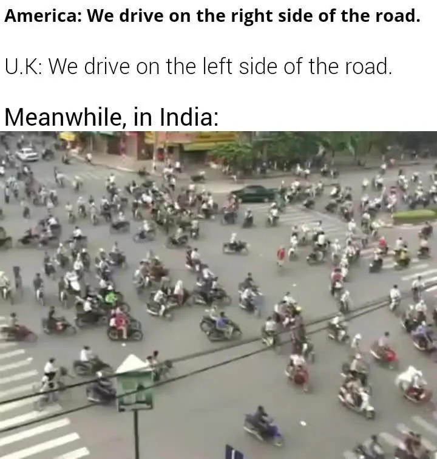
```

(Could be cyclist and tourists in Paris...)

---

The biggest social dilemma faced by humanity right now is the problem of climate change:
.center[
<iframe src="https://ourworldindata.org/grapher/annual-co2-emissions-per-country?tab=line" loading="lazy" style="width: 90%; height: 600px; border: 0px none;" allow="web-share; clipboard-write"></iframe>
]

---
.center2[
# Social interactions: Game theory
]

---
## Social interactions: Game theory

- **Social interaction**: A situation involving more than one person/party, where one’s actions affect both their own and other people’s outcomes.
- **Strategic interaction**: A social interaction where people are aware of the ways that their actions affect others.
- **Strategy**: Action(s) that people can take when engaging in a social interaction. 
- **Game**: Models or description of strategic interactions 
- **Game theory**:  a set of models of strategic interactions. Widely used in economics and elsewhere in the social sciences.

--

.pull-left[

1. **Players** – who is involved in the interaction
2. **Feasible strategies** – actions each player can take
3. **Information** – what each player knows when choosing their action
4. **Payoffs** – outcomes for every possible combination of actions

]

.pull-right[

```{r, out.width="90%"}
knitr::include_graphics("https://cdn.mos.cms.futurecdn.net/TEjMA863BFMGPJ4ErB3wGf.jpg")
```

]

---
## Example: Crop choice

.pull-left[

- Two farmers decide which crop to specialize
- They interact only once (**once shot game**)
- They choose simultaneously 

1. **Players** – Anil and Bala
2. **Feasible strategies** – Rice or Cassava
3. **Information** – Each farmer does not know what the other chose
4. **Payoffs** – depend on market prices and quality of land

- Anil is better at producing cassava; Bala is better producing rice
- They both sell whatever crop they produce in a nearby village market
- If they bring less of one crop, the price of such crop increases

]


--
.pull-right[
```{r, out.width="100%"}
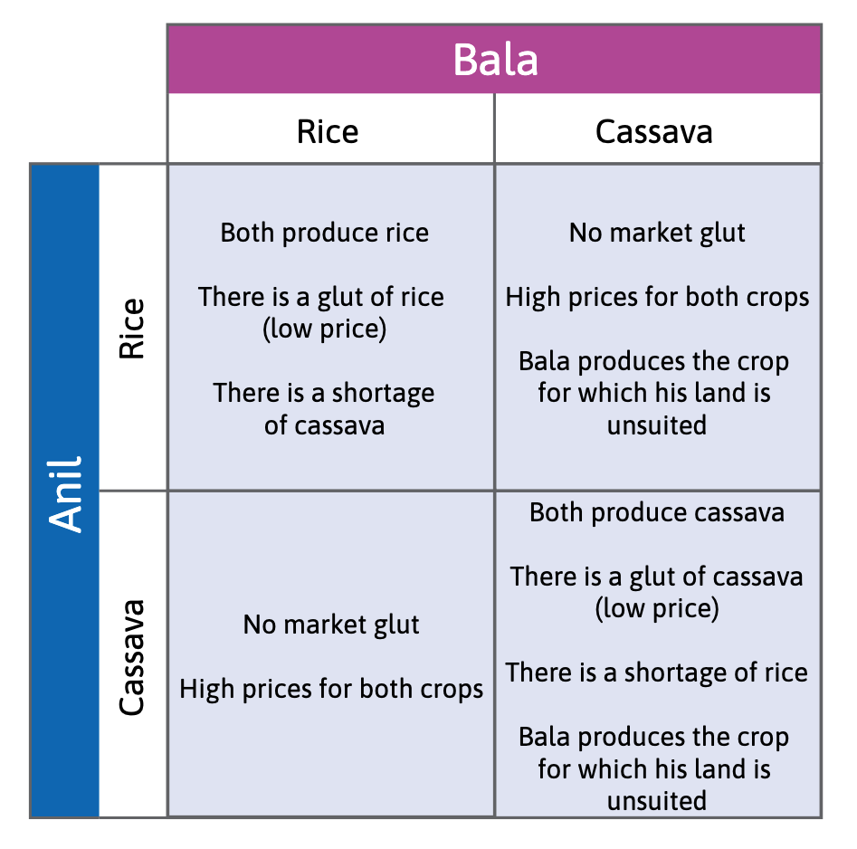
```
]


---
## Example: Crop choice

.pull-left[

- Two farmers decide which crop to specialize
- They interact only once (**once shot game**)
- They choose simultaneously 

1. **Players** – Anil and Bala
2. **Feasible strategies** – Rice or Cassava
3. **Information** – Each farmer does not know what the other chose
4. **Payoffs** – depend on market prices and quality of land

- Anil is better at producing cassava; Bala is better producing rice
- They both sell whatever crop they produce in a nearby village market
- If they bring less of one crop, the price of such crop increases

]

.pull-right[

```{r, out.width="100%"}
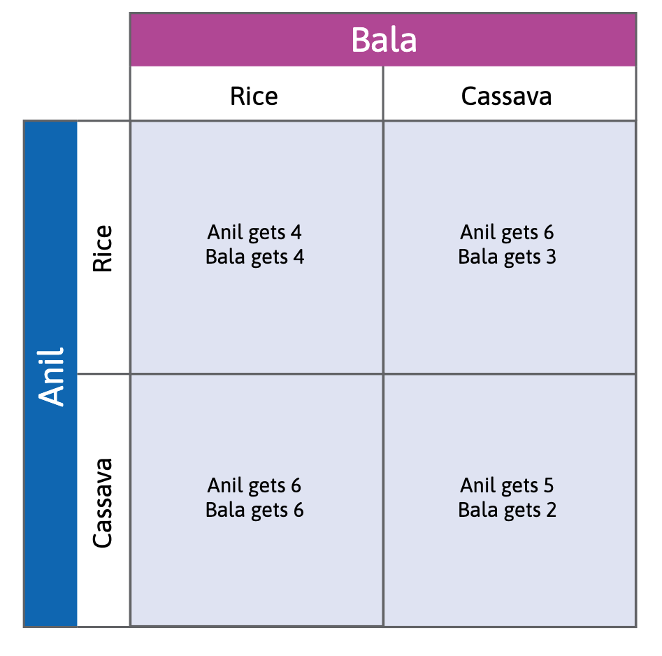
```
**Pay-offs matrix**
]

---
.center2[
# Best responses: Nash equilibrium
]


---
## Best responses: Nash equilibrium

Game theory describes social interactions; it can also help to predict what will happen. 

--

**Best response**⁠: the strategy that will lead to a player’s most preferred outcome, given the strategies that the other players select

---

```{r, out.width="50%"}

```

Begin with the row player (Anil) and ask: ‘What would be his best response if the column player (Bala) decided to play Rice?’

---

```{r, out.width="50%"}
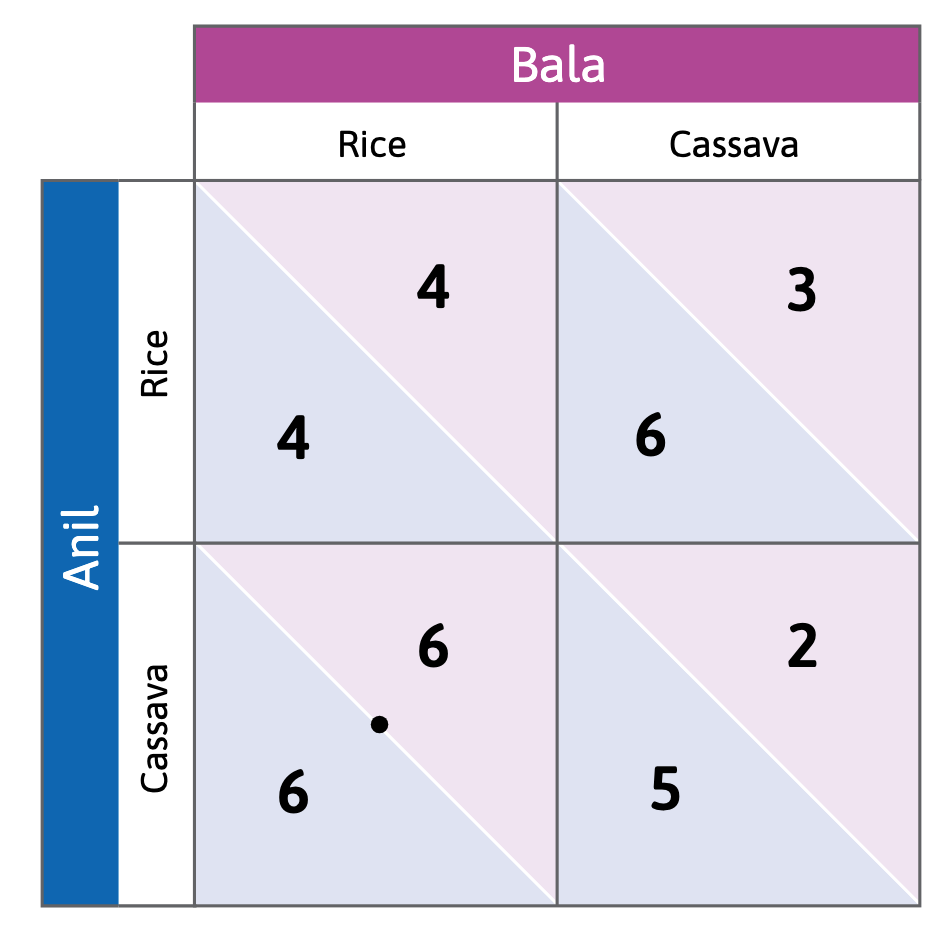
```

If Bala chooses Rice, Anil’s best response is Cassava—that gives him 6, rather than 4. Place a dot in the bottom left-hand cell. A dot in a cell means that this is the row player’s best response.

---

```{r, out.width="50%"}
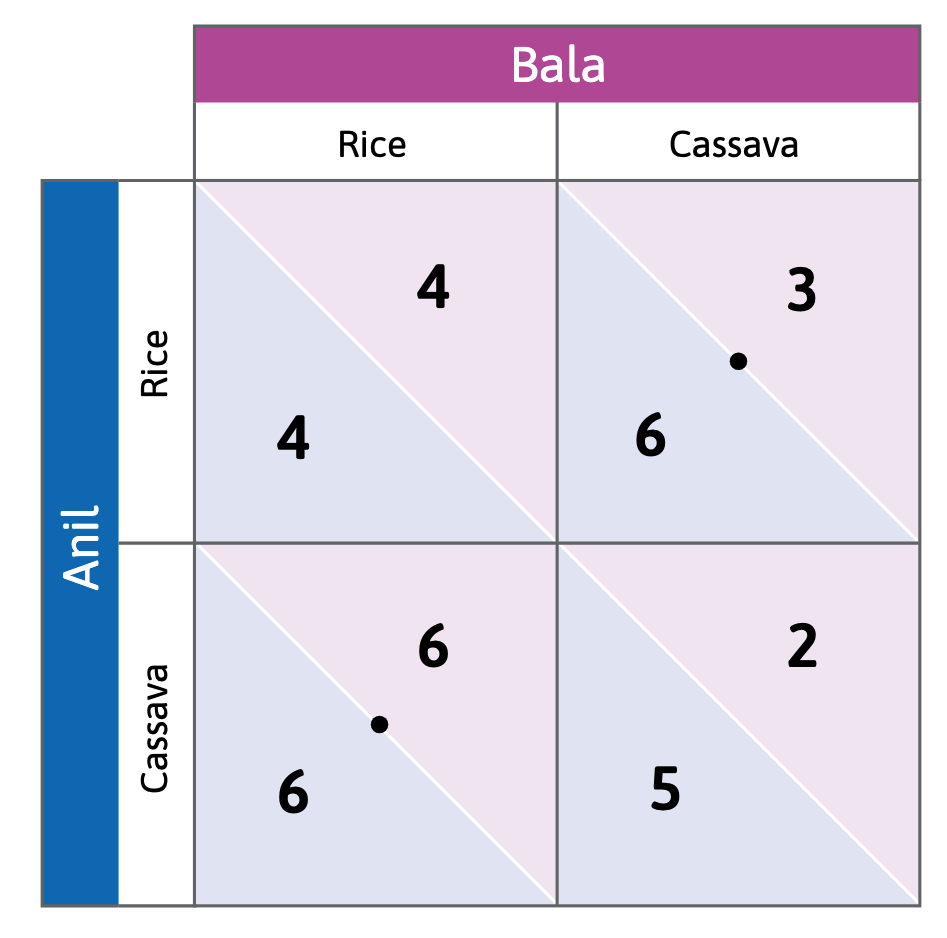
```

If Bala chooses Cassava, Anil’s best response is Rice—giving him 6, rather than 5. Place a dot in the top right-hand cell.

---

```{r, out.width="50%"}
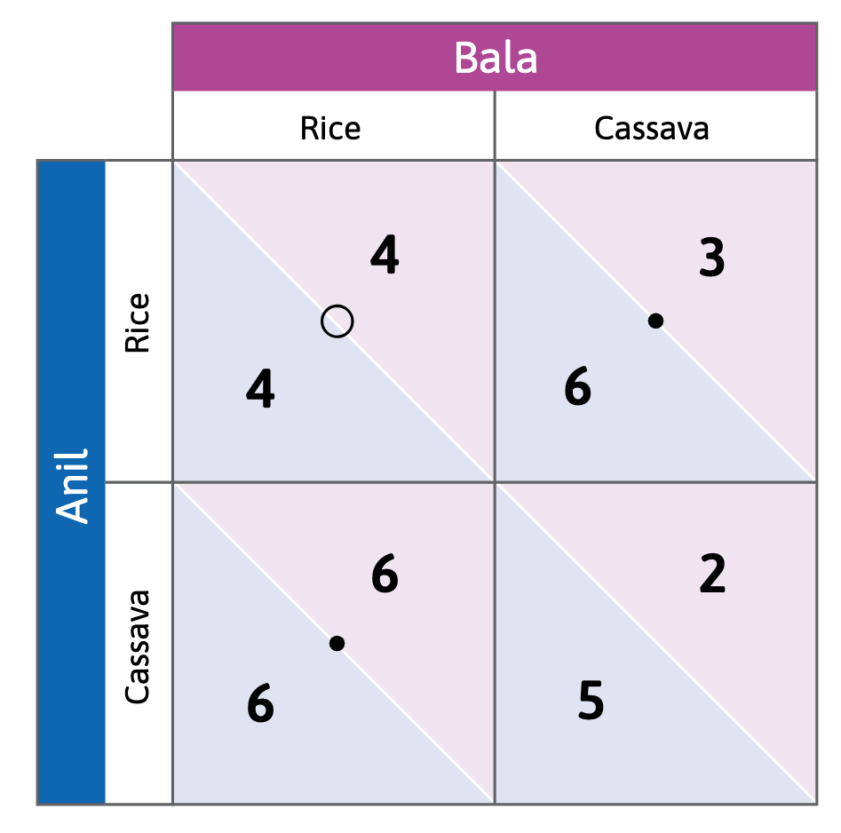
```

If Anil chooses Rice, Bala’s best response is to choose Rice too (4 rather than 3). Circles represent the column player’s best responses. Place a circle in the upper left-hand cell.

---

```{r, out.width="50%"}
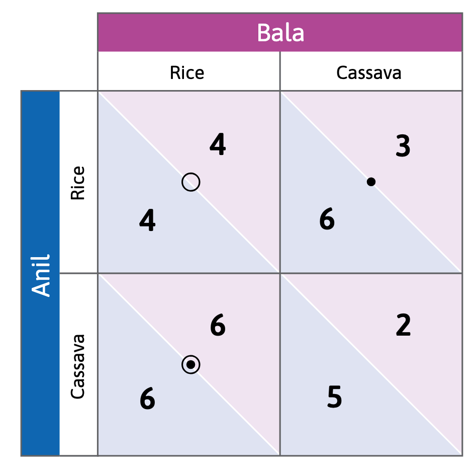
```

Lastly, if Anil chooses Cassava, Bala’s best response is Rice again (he gets 6 rather than 2). Place a circle in the lower left-hand cell.

---

```{r, out.width="50%"}

```

**Mutual best responses**: The dot and circle coincide in the lower left-hand cell. If Anil chooses Cassava and Bala chooses Rice, the players are playing best responses to each other.

---

```{r, out.width="50%"}

```

We call this pair of strategies an **equilibrium**: a situation or model outcome that is self-perpetuating: if the outcome is reached it does not change, unless an external force disturbs it. ⁠ 

---

```{r, out.width="50%"}

```

In game theory, a **Nash equilibrium** is a set of strategies where each player’s choice is the best response to the others — no one can get a better outcome by changing their action alone.

---
.center2[
# Dominant strategy equilibrium and the prisoners’ dilemma
]

---
## Dominant strategy equilibrium and the prisoners’ dilemma

```{r, out.width="40%"}

```

Note that, regardless of what Anil chooses, Bala is always better off choosing rice.

$\rightarrow$ **Rice is a dominant strategy for Bala**

---

Another rice–cassava game:

```{r, out.width="50%"}
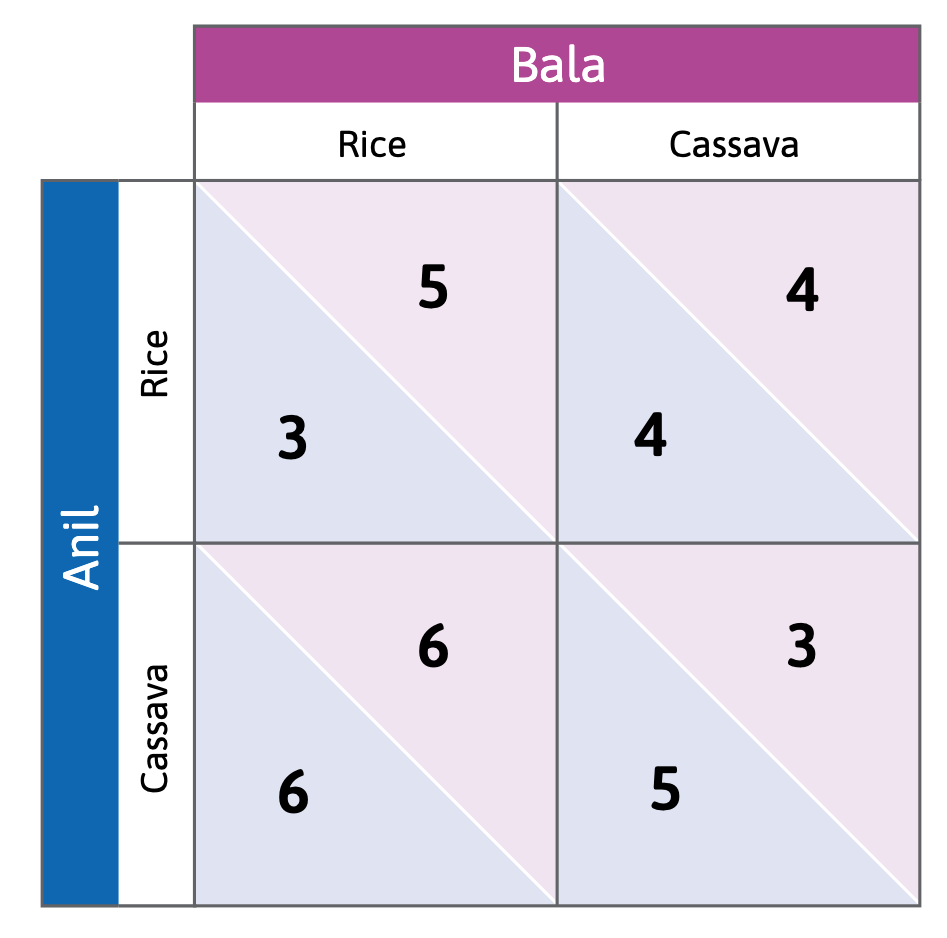
```

Find the NE. Are there dominant strategies?
--
 **Yes: Anil's dominant strategy is Casssava, while Bala's dominant strategy is Rice**

---

Another rice–cassava game:

```{r, out.width="50%"}

```

$$\textit{Nash Equilbrium}  = (Cassava, Rice) = \textit{Dominant strategy Equilbrium}$$

---

### The prisoners’ dilemma

Imagine that Anil and Bala are now facing another problem. 

Each is deciding how to deal with pest insects that destroy the crops they cultivate in their adjacent fields.

--

.pull-left[
- The first is to use an inexpensive chemical called Toxic Tide. It kills every insect for miles around. 

Toxic Tide also leaks into the water supply that they both use.

- The alternative is to use integrated pest control (IPC), in which beneficial insects are introduced to the farm. 

The beneficial insects eat the pest insects.
]

.pull-right[
```{r}
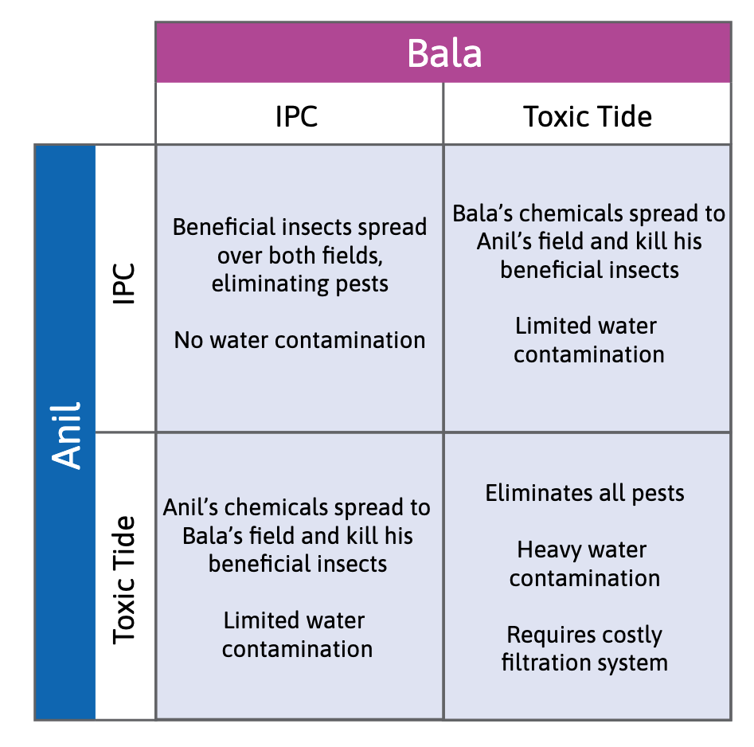
```

]

---
### The prisoners’ dilemma

Imagine that Anil and Bala are now facing another problem. 

Each is deciding how to deal with pest insects that destroy the crops they cultivate in their adjacent fields.

.pull-left[
- The first is to use an inexpensive chemical called Toxic Tide. It kills every insect for miles around. 

Toxic Tide also leaks into the water supply that they both use.

- The alternative is to use integrated pest control (IPC), in which beneficial insects are introduced to the farm. 

The beneficial insects eat the pest insects.
]

.pull-right[
```{r}
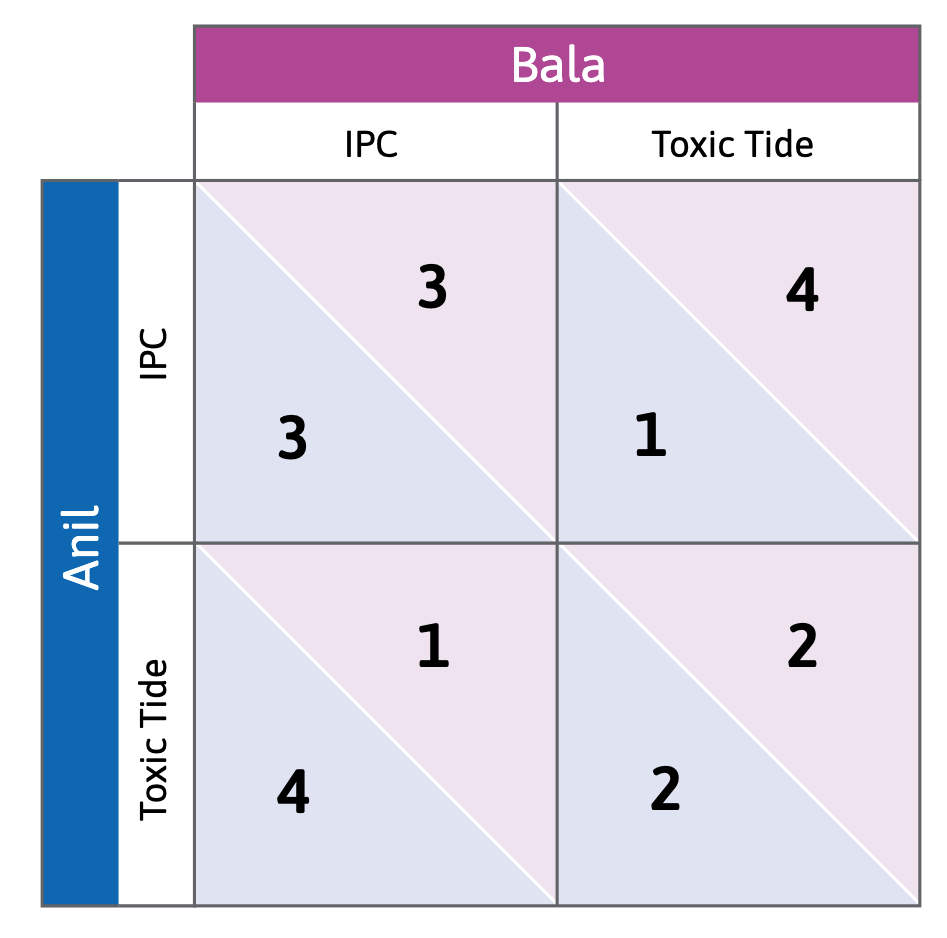
```

]

---
### The prisoners’ dilemma

```{r out.width="45%"}

```

- Are there dominant strategies?
- Is there a NE?

---
.center2[
# Evaluating outcomes: The Pareto criterion
]

---
## Evaluating outcomes: The Pareto criterion

What if we want to evaluate the outcome of an economic interaction (**allocation**)?
Can we say an allocation is better or worse than alternative outcomes? 

--

**The Pareto criterion**

Allocation A is better than allocation B if **at least one party would be strictly better off with A than B, and nobody would be worse off**.

We say that A Pareto-dominates⁠ B, or that A would be a Pareto improvement⁠ over B.

When we say an allocation makes someone ‘better off’ we mean that they prefer it, which does not necessarily mean they get more money.

---
### Evaluating outcomes: The Pareto criterion

```{r out.width="80%"}
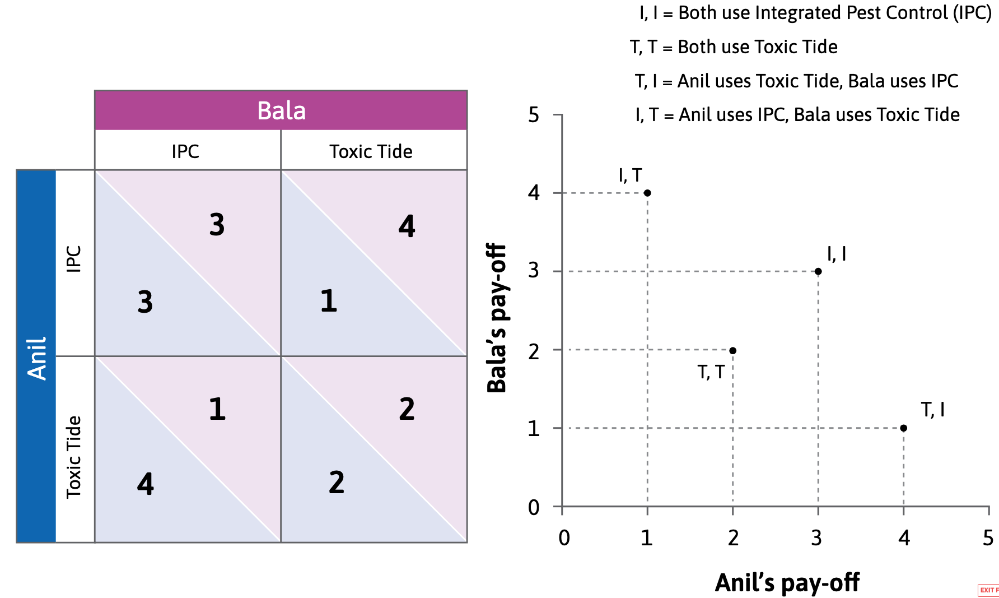
```

---
### Evaluating outcomes: The Pareto criterion

```{r out.width="80%"}
knitr::include_graphics("imgs/figure4-7-a.png")
```

**Comparing (T, T) and (I, I)**: The allocation at (I, I) lies in the rectangle north-east of (T, T), so an outcome where both players use IPC Pareto-dominates one where both use Toxic Tide: they both prefer (I, I).

---
### Evaluating outcomes: The Pareto criterion

```{r out.width="80%"}
knitr::include_graphics("imgs/figure4-7-b.png")
```

**Comparing (T, T) and (T, I)**: If Anil uses Toxic Tide and Bala IPC, then Anil is better off but Bala is worse off than when both use Toxic Tide. The Pareto criterion cannot say which of these allocations is better.

---
### Evaluating outcomes: The Pareto criterion

```{r out.width="80%"}
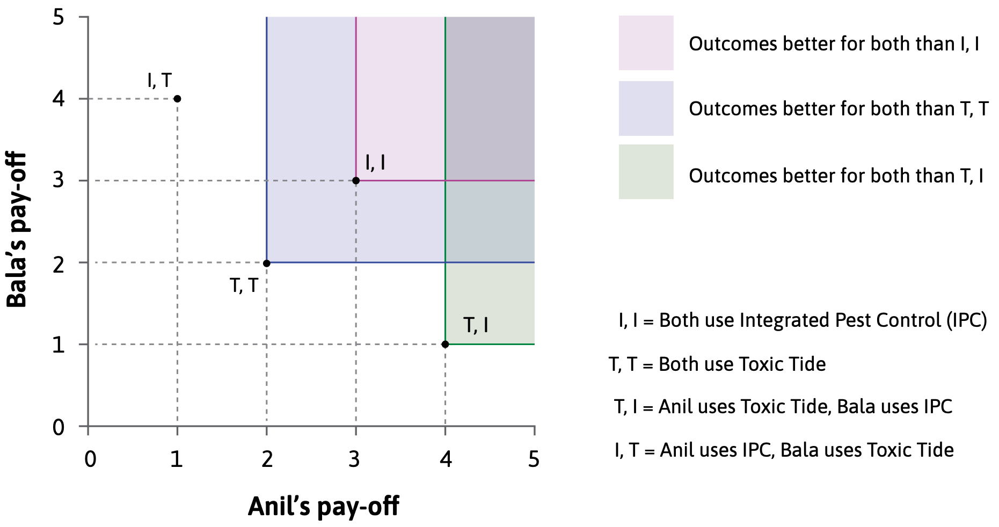
```

**No allocation Pareto-dominates (I, I)**: None of the other allocations lie to the north-east of (I, I), so it is not Pareto-dominated.

---
### Evaluating outcomes: The Pareto criterion

```{r out.width="80%"}
knitr::include_graphics("imgs/figure4-7-d.png")
```

**What can we say about (I, T) and (T, I)?**: Neither of these allocations are Pareto-dominated, but they do not dominate any other allocations either.


---
### Evaluating outcomes: The Pareto criterion

An allocation that is not Pareto-dominated by any other allocation is **Pareto efficient**⁠. 

```{r out.width="75%"}
knitr::include_graphics("imgs/figure4-7-d.png")
```

(I, T), (I, I), and (T, I).

---
### Evaluating outcomes: The Pareto criterion

**Caution:**

- Pareto efficiency means no one can be made better off without making someone else worse off, but **it doesn’t imply fairness or desirability**.

- There can be **many Pareto-efficient outcomes**, and **the concept doesn’t tell us which one is best**.

- A Pareto-efficient allocation may still seem **unfair or socially undesirable**.

- When evaluating outcomes, we should **consider fairness** as well as Pareto efficiency.

---
.center2[
# Public good games and cooperation
]

---
## Public good games and cooperation

Many farmers in south-east Asia rely on shared irrigation facilities that require constant maintenance and new investment. 

Each farmer faces the decision of how much to contribute to these activities, which benefit the entire community. 

But a farmer who does not contribute will still benefit from the contribution of others.

---
## Public good games and cooperation

Imagine there are four farmers who are deciding whether to contribute to an irrigation project.

For each farmer, the cost of contributing to the project is 10. 

Every contribution of 10 increases the crop yield on each of the four farms by 8. 

This is a strategic interaction: the action of one farmer affects the pay-offs of the others.

---
## Public good games and cooperation

Now consider the decision facing Kim, one of the four farmers.

Suppose two other farmers contribute.

If she doesn’t contribute, she will receive a benefit of 8 from each of the two contributions and incur no costs herself. Her total pay-off is 16. 


|                                   | Kim does not contribute | Kim does contribute |
|-----------------------------------|--------------------------|---------------------|
| Benefit from the contribution of others | 16                       |                     |
| Plus benefit from her own contribution  | +0                       |                     |
| Minus cost of her contribution          | −0                       |                     |
| **Total**                              | **$16**                  |                     |

---
## Public good games and cooperation

Now consider the decision facing Kim, one of the four farmers.

Suppose two other farmers contribute.

If she contributes too, she receives an additional benefit of 8 (and so do the other three farmers). But it will cost her 10, reducing the pay-off to 14.

|                                   | Kim does not contribute | Kim does contribute |
|-----------------------------------|--------------------------|---------------------|
| Benefit from the contribution of others | 16                       | 16                  |
| Plus benefit from her own contribution  | +0                       | +8                  |
| Minus cost of her contribution          | −0                       | −10                 |
| **Total**                              | **$16**                  | **$14**             |


---
## Public good games and cooperation

```{r out.width="70%"}
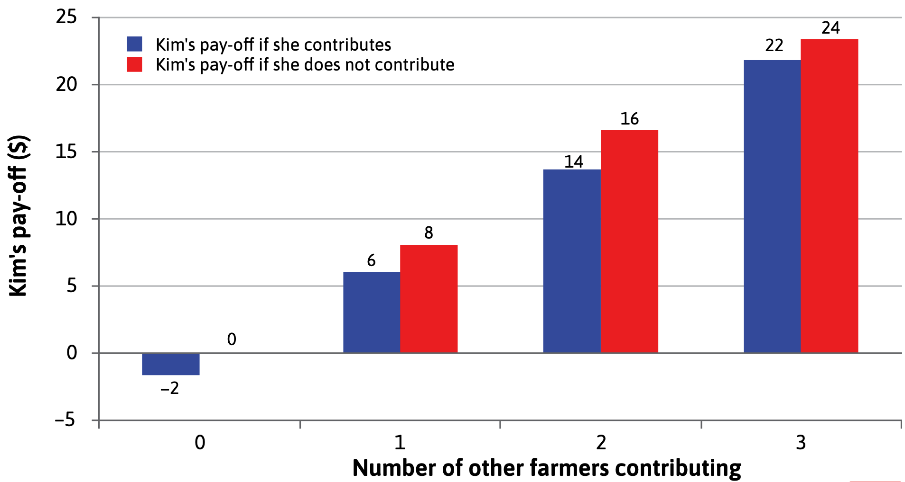
```

**Public good game**⁠: when one individual bears a cost to provide a good, everyone receives a benefit. This creates a **social dilemma**.

---
## Public good games and cooperation

```{r out.width="70%"}

```

A case of the prisoners’ dilemma with more than two players:

Everyone would benefit if everyone cooperated, but cooperation cannot be an equilibrium because each farmer would do better by free-riding on the others.

---
.center2[
# Social preferences: Altruism
]

---
## Social preferences: Altruism

In real-world examples and experiments, people often play the cooperative strategy in prisoners’ dilemma games. Why?

--

People generally do care about what happens to others. 

When people have **social preferences**⁠, their utility depends not only on what they obtain for themselves, but also on things that affect the wellbeing of other people.

**Altruism** is a social preference in which an individual’s utility is increased by benefits to others. 

Other social preferences are **inequality aversion** (a preference for more equal outcomes); and **spite** and **envy**—in which cases, benefits to others may reduce the individual’s utility.

---
## Modelling altruistic preferences

Zoë is given some tickets for the national lottery, and one of them wins a prize of 200.

Will she decide to keep all the money for herself, or share some of it with her flatmate, Yvonne? 

---
## Modelling altruistic preferences

```{r out.width="45%"}
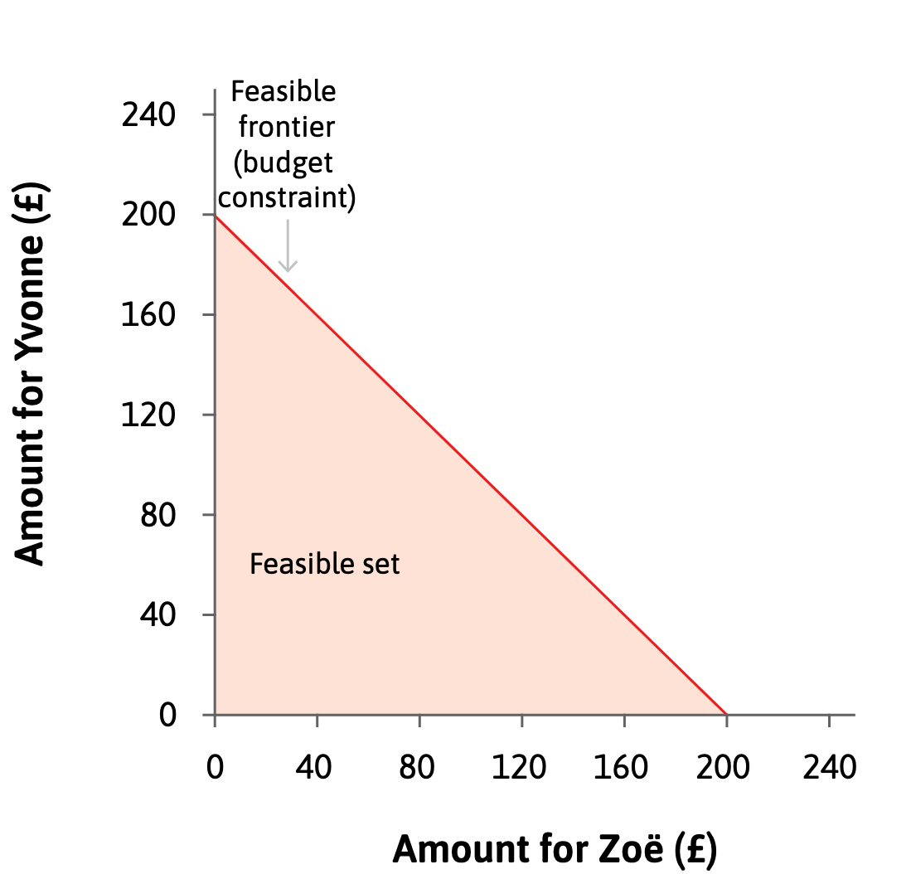
```

The shaded area shows the feasible ways of sharing the prize. Zoë will choose a point on the budget constraint, sharing all of the 200 between them.

---
## Modelling altruistic preferences

```{r out.width="45%"}
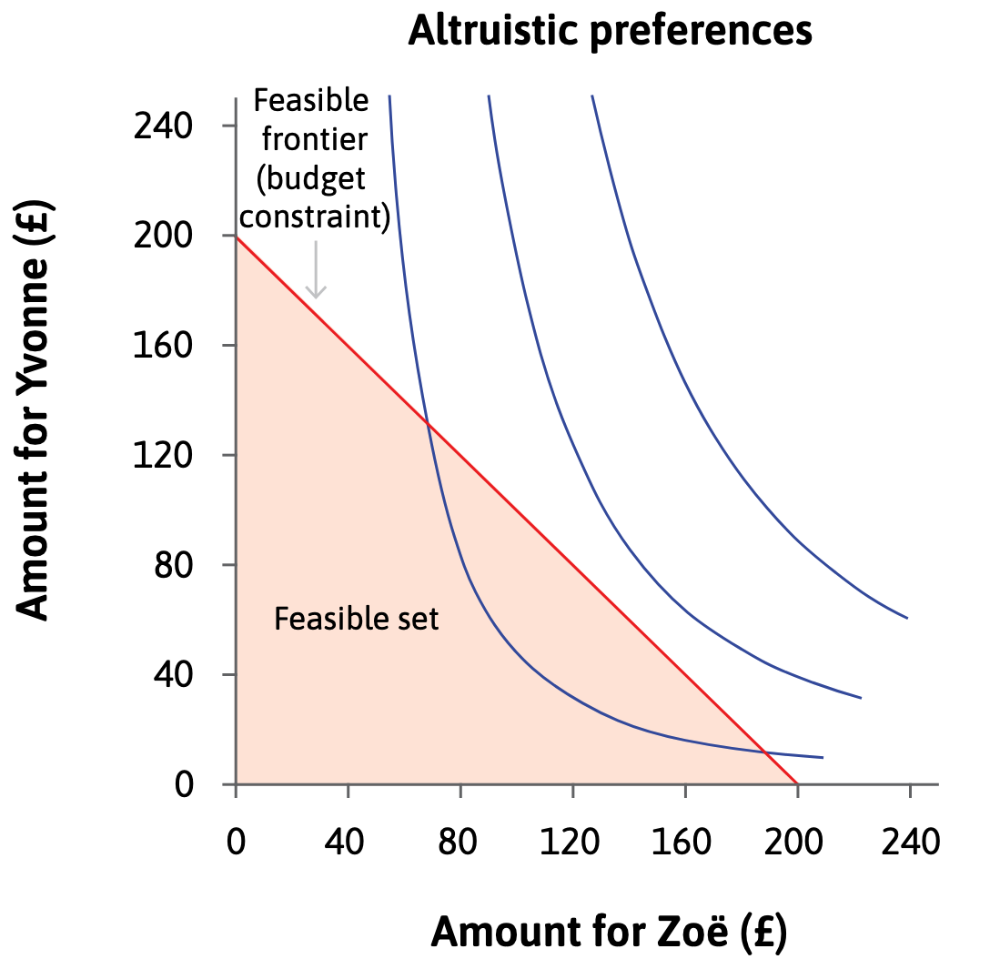
```

Zoë ’s utility depends on Yvonne’s share of the prize as well as her own. She will choose the point on the feasible frontier that gives her the highest utility.

---
## Modelling altruistic preferences

```{r out.width="45%"}
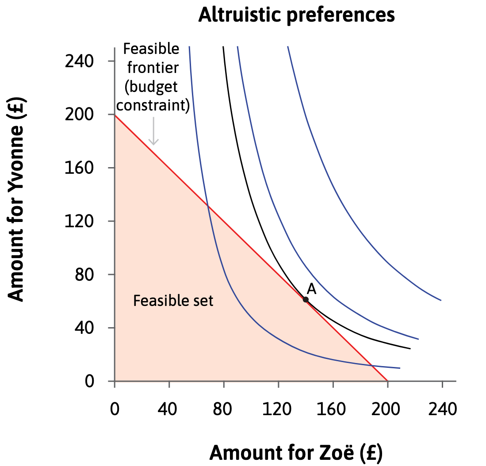
```

She achieves the highest level of utility at A, where an indifference curve just touches the feasible frontier. She keeps 140 for herself, and gives 60 to Yvonne.


---
## Modelling altruistic preferences

```{r out.width="45%"}
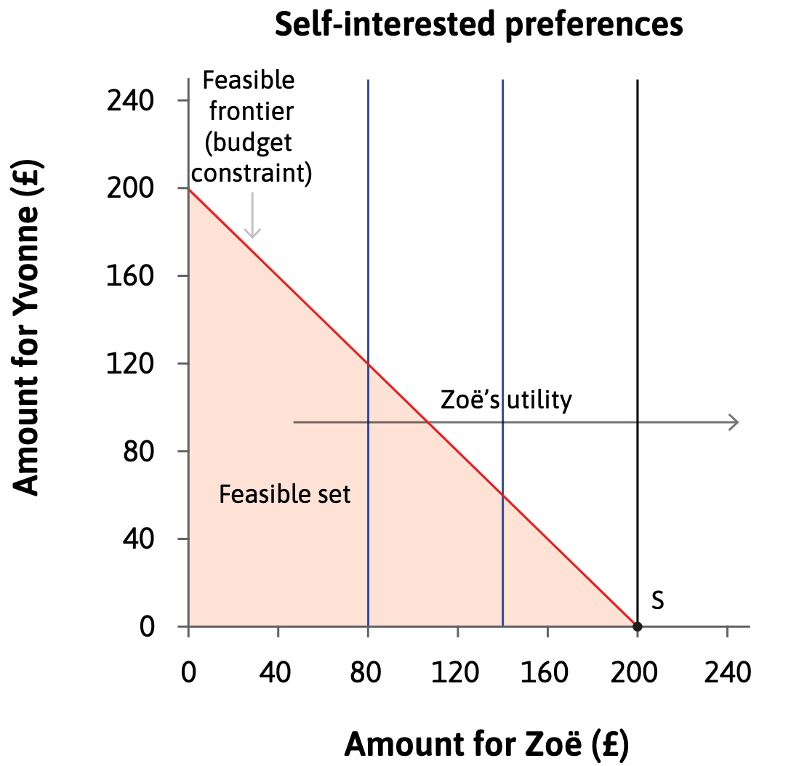
```

If Zoë cared only about money for herself, her utility would be highest at point S. She would keep the whole prize and give Yvonne nothing.

---
## How altruism can change behaviour in the prisoners’ dilemma

What would happen in the pest control game if the farmers were altruistic? Would their strategies be different?

---
## How altruism can change behaviour in the prisoners’ dilemma

The left-hand panel shows the allocations of income for Anil (horizontal axis) and Bala (vertical axis) in each of the four possible outcomes of the game. We have drawn Anil’s indifference curves through each point.

```{r out.width="80%"}
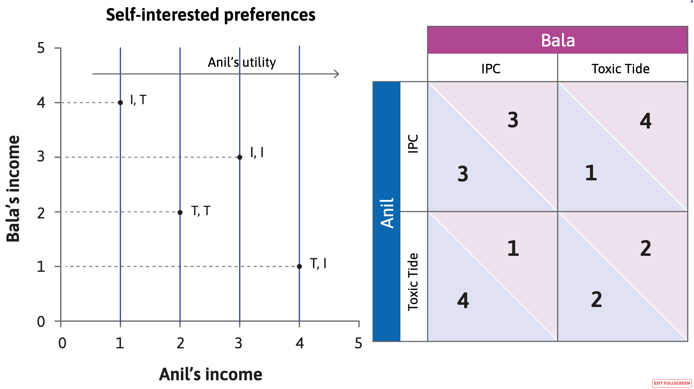
```

---
## How altruism can change behaviour in the prisoners’ dilemma

Which allocations are feasible for Anil depends on what Bala does. If Bala chooses T, Anil’s choice is between (I, T) and (T, T). He will choose T, because (T, T) gives him higher utility.

```{r out.width="80%"}
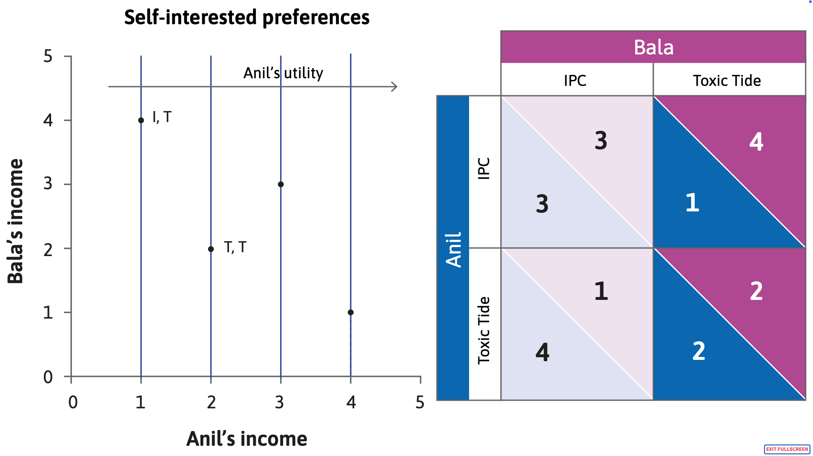
```

---
## How altruism can change behaviour in the prisoners’ dilemma

If Bala chooses I, Anil again has a choice between two allocations. He will choose T again, because (T, I) gives him higher utility than (I, I). So Anil’s dominant strategy is T.

```{r out.width="80%"}
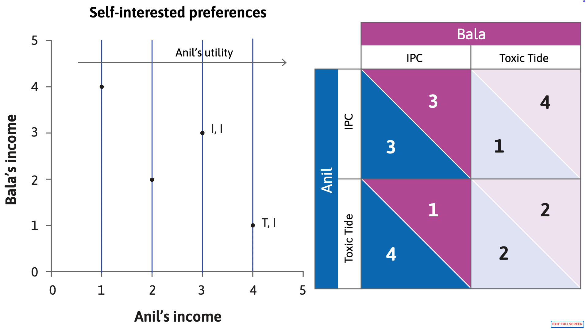
```

---
## How altruism can change behaviour in the prisoners’ dilemma

Now, suppose that Anil has altruistic preferences towards Bala: then, his utility depends not only on his own monetary pay-off, but also on that of Bala.

---
## How altruism can change behaviour in the prisoners’ dilemma

If Anil cares about Bala’s income as well as own income, his indifference curves slope downward. His utility rises if his own income increases; it also rises if Bala’s income increases.

```{r out.width="80%"}
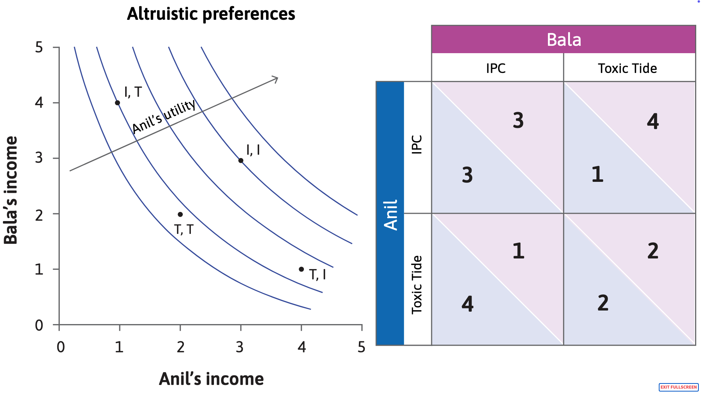
```

---
## How altruism can change behaviour in the prisoners’ dilemma

If Bala chooses T, Anil will choose I because (I, T) gives him more utility than (T, T). Although Anil’s own monetary pay-off is lower at (I, T), he values the additional benefit to Bala (higher indifference curve).

```{r out.width="80%"}
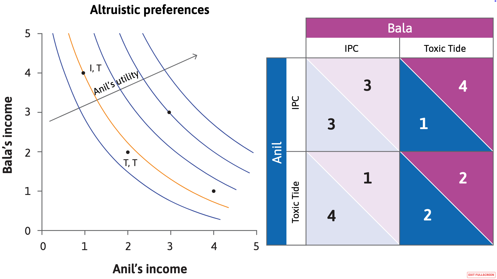
```

---
## How altruism can change behaviour in the prisoners’ dilemma

If Bala chooses I, Anil will also choose I because (I, I) is on a higher indifference curve than (T, I). Although (I, I) gives him lower income, he prefers it because it doesn’t inflict damage on Bala. 

```{r out.width="80%"}
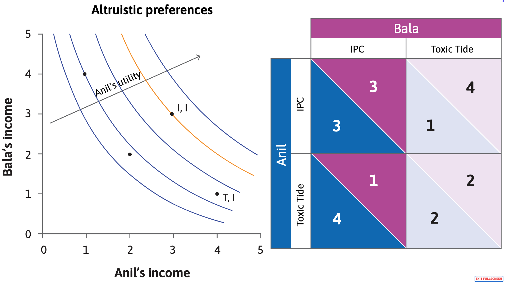
```

---
## How altruism can change behaviour in the prisoners’ dilemma

With altruistic preferences: I is Anil’s dominant strategy.

```{r out.width="80%"}

```

---
.center2[
# Repeated interaction: Social norms, reciprocity, and peer punishment in public good games
]

---
### Repeated interaction: Social norms, reciprocity, and peer punishment in public good games

Life is not a one-shot game. 

Best responses may be different in a repeated game. 

---
### A public good experiment

- An experiment tested the costs and benefits of contributing to a public good in cities worldwide.

- Participants played ten rounds of a public good game similar to the irrigation game.

- They were placed in small groups of four strangers, each receiving $20 per round.

- Each dollar contributed to a common pool gave every group member, including the contributor, $0.40.

--

| Three other players contribute $10 | I contribute nothing | I contribute $10 |
|------------------------------------|----------------------|------------------|
| My return from their contributions | 12 (= 30 × 0.4)      | 12 (= 30 × 0.4)  |
| Plus benefit from my own contribution | 0                   | 4 (= 10 × 0.4)   |
| Plus the money that I keep         | 20                   | 10               |
| **Total**                          | **$32**              | **$26**          |

---
### A public good experiment

.center[
<iframe src="https://archive.ourworldindata.org/20250903-083611/grapher/worldwide-public-goods-experiments-contributions-over-10-periods.html?time=earliest..10&tab=line" loading="lazy" style="width: 75%; height: 450px; border: 0px none;" allow="web-share; clipboard-write"></iframe>
]

In every round, players contribute more than $0, although the amount contributed declines over time and varies across places.

---
### A public good experiment

.center[
<iframe src="https://archive.ourworldindata.org/20250903-083611/grapher/worldwide-public-goods-experiments-contributions-over-10-periods.html?time=earliest..10&tab=line" loading="lazy" style="width: 75%; height: 450px; border: 0px none;" allow="web-share; clipboard-write"></iframe>
]

Altruism is unlikely to explain these results, since truly altruistic players would keep contributing over time to benefit everyone, regardless of others’ actions.

---
### A public good experiment

.center[
<iframe src="https://archive.ourworldindata.org/20250903-083611/grapher/worldwide-public-goods-experiments-contributions-over-10-periods.html?time=earliest..10&tab=line" loading="lazy" style="width: 75%; height: 450px; border: 0px none;" allow="web-share; clipboard-write"></iframe>
]

Contributors decreased their level of cooperation if they observed that others were free-riding: they cared about how others behaved.

---
### The role of social norms

People make decisions according to their own individual preferences—the likes, dislikes, attitudes, feelings, and beliefs that motivate them (including social preferences, such as altruism). 

But their preferences may be influenced by **social norms**: 

An understanding that is shared among most members of a community about how people should behave towards each other in particular circumstances.

--


---
### The role of social norms

In the experiment:

Many people contribute to public goods when they see others doing the same, guided by social norms of fairness and cooperation.

Contributions often fall when generous players see others fail to reciprocate.

People who value these norms may even punish non-cooperators, despite personal costs.

--

To test what would happen if players could punish each other directly, the experimenters introduced a **punishment option**.

After observing the contributions of their group, individual players could punish other players by making them pay a $3 fine. 

The punisher remained anonymous, but had to pay $1 per player punished.

---
### The role of social norms

.center[
<iframe src="https://archive.ourworldindata.org/20250903-083611/grapher/worldwide-public-goods-experiments-with-opportunities-for-peer-punishment.html?tab=line" loading="lazy" style="width: 75%; height: 450px; border: 0px none;" allow="web-share; clipboard-write"></iframe>
]

When people engage in a common project everyone has something to gain if they cooperate, but also something to lose when others free-ride. 

---
### The role of social norms

.center[
<iframe src="https://archive.ourworldindata.org/20250903-083611/grapher/worldwide-public-goods-experiments-with-opportunities-for-peer-punishment.html?tab=line" loading="lazy" style="width: 75%; height: 450px; border: 0px none;" allow="web-share; clipboard-write"></iframe>
]

Even in large groups of people, repeated interactions, social norms, and social preferences (with or without penalty mechanisms) can support high levels of contribution to the public good.

---
### Learning about preferences and economic behaviour


.pull-left[
**Survey questions**

Dermine political preferences, brand loyalty, degree of trust of others, or religious orientation.

```{r, out.width="95%"}
knitr::include_graphics("https://www.worldvaluessurvey.org/photos/EV000428.JPG")
```

]

--

.pull-right[

**Statistical studies of economic behavior**

For instance, purchases of one or more goods when the relative price varies—to determine preferences for the goods in question. 

**Revealed preference** approach.
]

---
### Using experiments to study economic behaviour

.pull-left[

1) **Lab experiments**:
- Control participants’ decisions and outcomes
- Create a control/treatment group
- Results can be replicated
]

.pull-right[

2) **Field experiments**:
- Real-world decision making
- More realistic contexts

]

```{r, out.width="70%"}
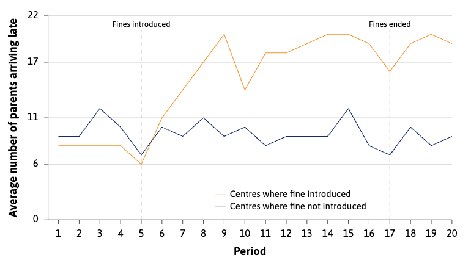
```

---
.center2[
# The ultimatum game: Dividing a pie (or leaving it on the table)
]

---
## The ultimatum game: Dividing a pie (or leaving it on the table)

If you and your friend find 100 lying in the street, there are potential benefits for both of you. 

--

How those are shared will depend on your **preferences**, and on **social norms**.

--

The same question arises in many economic interactions, 

- whether social (sharing the gains from a community project) 
- or private (determining the price of a second-hand car). 

There are potential **economic rents**⁠ for both parties.

How much each party receives depends on preferences; it also depends on the rules of the game—the process that determines the outcome.

---
## The ultimatum game

How people share mutual benefits has been studied experimentally using a two-person one-shot game known as the **ultimatum game**:

--

- A *Proposer* is provisionally given $100.  
- The *Proposer* decides how much money, *y*, to offer to the *Responder*; *y* can be anything from 0 to $100.  
- The *Responder* can either accept or reject the offer.  
- If the offer is rejected, both players get nothing.  
- Otherwise, the *Responder* receives *y* and the *Proposer* gets *100 − y*.

--

A sequential game: one player, the *Proposer*, chooses an action first, followed by the *Responder*.

---
## The ultimatum game

Example: 

```{r out.width="50%"}
knitr::include_graphics("imgs/figure4-16.png")
```

What would be the NE prediction? Do you think this actually happens?

---
### Fair farmers, self-interested students? Experimental results of the ultimatum game

Ultimatum game: 1) a group of farmers in Kenya, and 2) a group of students in the US. 

Proposers could offer 0, 10, 20, 30, 40, or 50% of the pie to Responders. 

--

**Willingness to accept by Responders**:

```{r out.width="65%"}
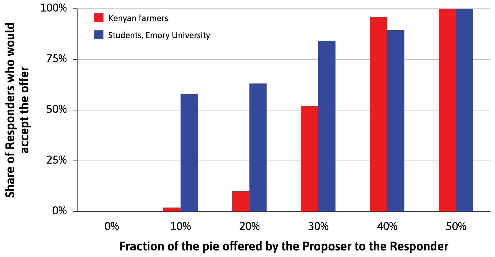
```

Many Responders were not motivated purely by self-interest.

---
### Fair farmers, self-interested students? Experimental results of the ultimatum game

Ultimatum game: 1) a group of farmers in Kenya, and 2) a group of students in the US. 

Proposers could offer 0, 10, 20, 30, 40, or 50% of the pie to Responders. 

**Proposers offers**:

```{r out.width="65%"}
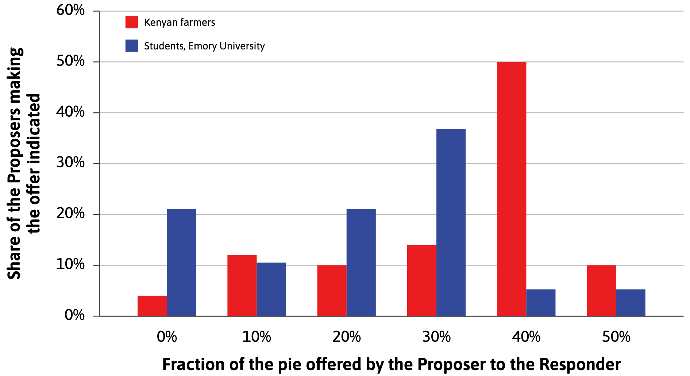
```

The farmers made more generous offers.

---
### Fair farmers, self-interested students? Experimental results of the ultimatum game

Proposers could use their knowledge of the preferences and norms of their own community to estimate the likelihood of Responders rejecting different offers

```{r out.width="75%"}
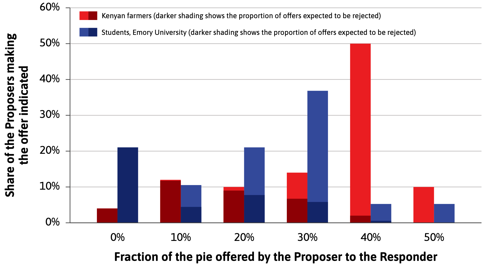
```

Their expectations are similar to actual rejection decisions.

---
### Fair farmers, self-interested students? Experimental results of the ultimatum game

When pay-offs are uncertain, we can compare them by calculating the expected pay-off of each one. 

| Offer        | Probability of acceptance | Pay-off if accepted | Expected pay-off      |
|---------------|----------------------------|----------------------|-----------------------|
| 50% of pie    | 1                          | 50%                  | = 1 × 50 = **50%**    |
| 40% of pie    | 0.96                       | 60%                  | = 0.96 × 60 = **58%** |
| 30% of pie    | 0.52                       | 70%                  | = 0.52 × 70 = **36%** |

---
### The effect of competition

Different ultimatum game: a *Proposer* offers a two-way split of $100 to two *Responders*, rather than one.

- If only one R accepts, that R and the P get the split, and the other R gets nothing.
- If no one accepts, all three players get nothing.  
- If both R accept, one is chosen at random to receive the split.  

--

**Fraction of Rs who rejected offers**

```{r out.width="50%"}
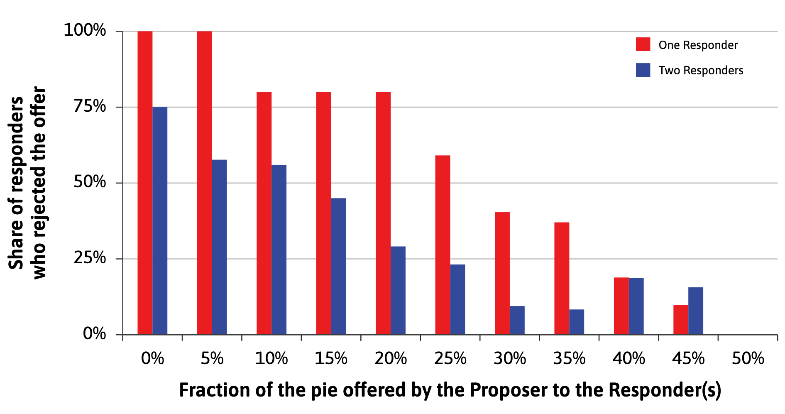
```

The Rs’ behaviour when there is competition seems more similar to what we would expect of self-interested individuals concerned mostly about their own monetary pay-offs.


---
.center2[
# Coordination games and conflicts of interest
]

---
## Coordination games and conflicts of interest

What happens if there is more than one Nash equilibrium?

--

- driving on the right or on the left
- one or two kisses when saying hello
- go out or stay at home during a lockdown

---
## Coordination games and conflicts of interest

```{r out.width="45%"}
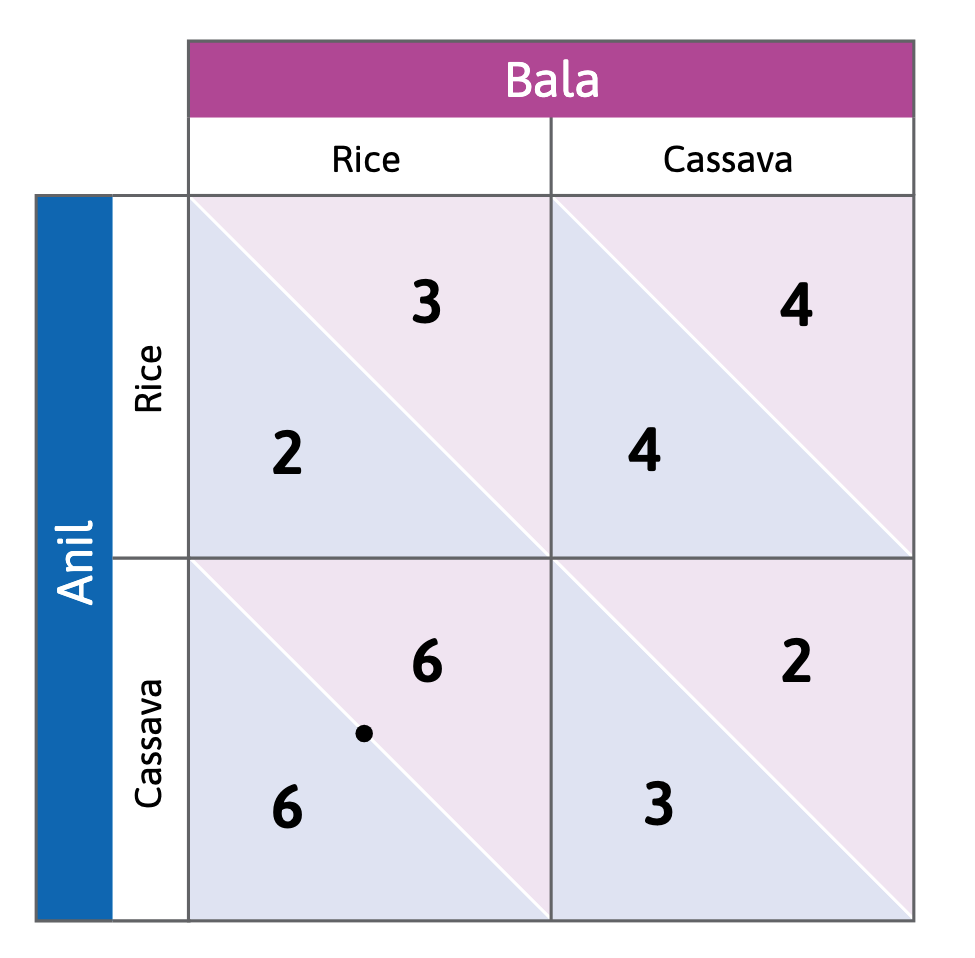
```

If Bala is going to choose Rice, Anil’s best response is to choose Cassava. We place a dot in the bottom left-hand cell.

---
## Coordination games and conflicts of interest

```{r out.width="45%"}

```

If Bala is going to choose Cassava, Anil’s best response is to choose Rice. Place a dot in the top right-hand cell. Anil does not have a dominant strategy.

---
## Coordination games and conflicts of interest

```{r out.width="45%"}

```

If Anil chooses Rice, Bala’s best response is to choose Cassava, and if Anil chooses Cassava, Bala should choose Rice. The circles show Bala’s best responses.

---
## Coordination games and conflicts of interest

```{r out.width="45%"}

```

He doesn’t have a dominant strategy either.

---
## Coordination games and conflicts of interest

```{r out.width="45%"}
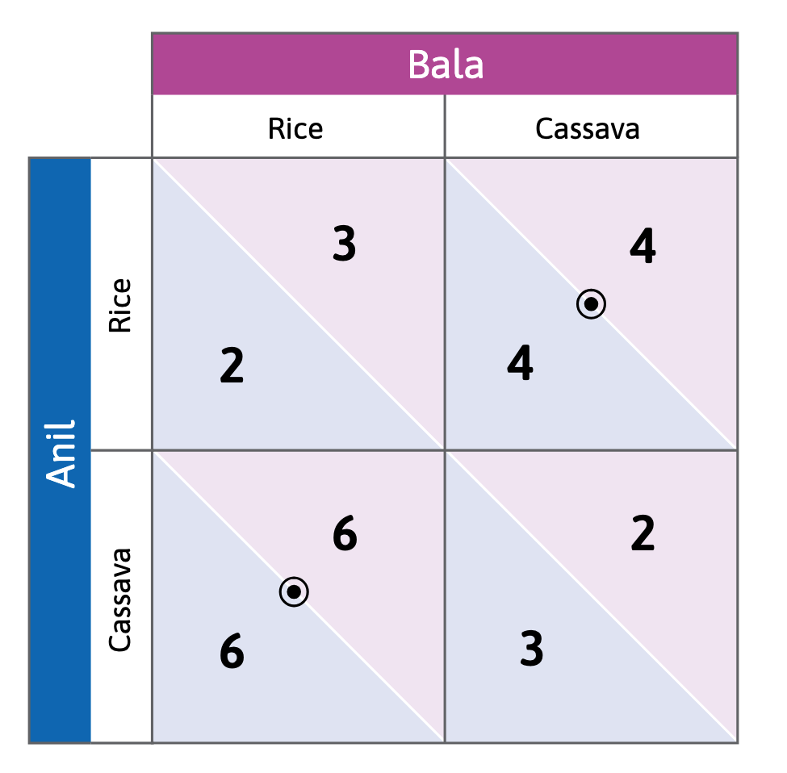
```

If Anil chooses Cassava and Bala chooses Rice, both of them are playing best responses (a dot and a circle coincide). So (Cassava, Rice) is a NE. But so is (Rice, Cassava).

---
.center2[
# Modelling the global climate change problem
]

---
## Modelling the global climate change problem

One of the obstacles for climate change negotiations is the disagreement over how to share the costs and benefits of limiting emissions between countries.

We can model these using the tools of this Unit.

--

To explore the possible situations facing climate negotiators, we will model them as a game between two large countries: **China** and **USA.**

Two alternative strategies: 

- **Restrict** (taking measures to reduce emissions, for example by regulating or taxing the use of fossil fuels) 
- **BAU** (continuing with ‘business as usual’)

---
## Modelling the global climate change problem

```{r out.width="60%"}
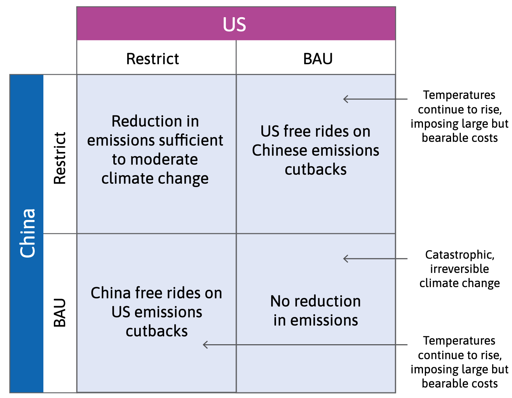
```

---
## Modelling the global climate change problem

Two different climate policy games

```{r out.width="80%"}
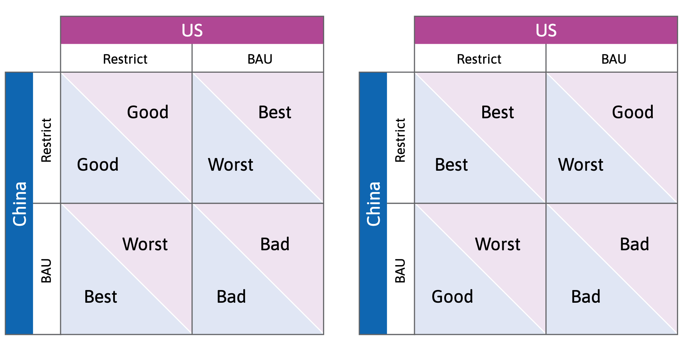
```

Find the NE and whether there are dominant strategies for each game.

---
### Modelling the global climate change problem

3° option: Players’ best responses, and hypothetical numerical pay-offs indicating the value of each possible outcome to the citizens of each country
 
```{r out.width="70%"}
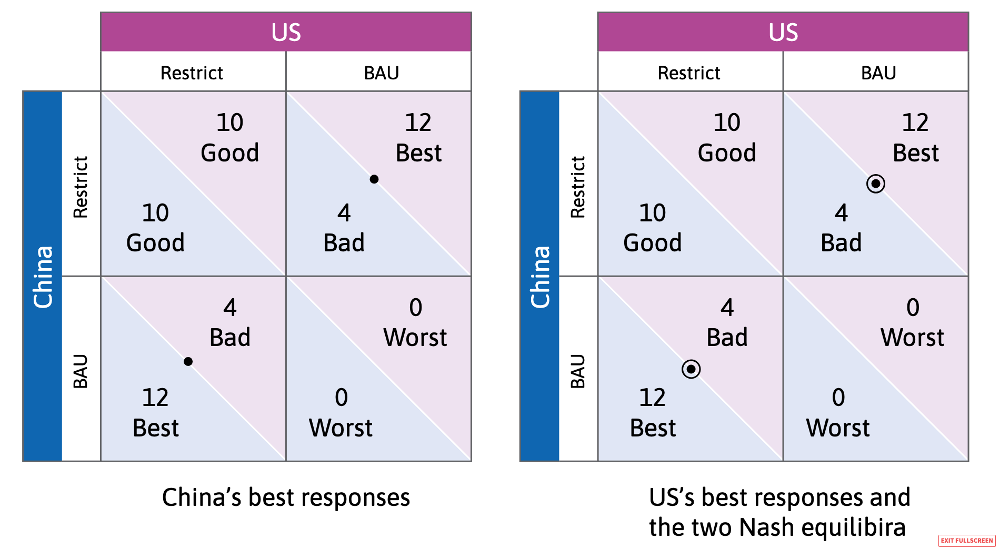
```

**Hawk–dove game**⁠: players can act like an aggressive and selfish Hawk, or a peaceful and sharing Dove.

---
### Modelling the global climate change problem

Need to use formal and non-formal mechanisms to change the payoffs

```{r out.width="70%"}

```

**Sustainable consumer lifestyles**, **Governments policies** (stimulate innovation and the diffusion of cleaner technologies), **Change in norms**, **Countries can share the costs of Restrict more evenly**, among others

---
.center2[
# Summary
]

---
## Summary

1) Social interactions can be modeled as games

- Players choose best responses to others’ strategies 

--

2) Social dilemmas e.g. prisoners dilemma can be resolved by social preferences, peer punishment, or binding agreements

- The rules of the game also matter for outcomes

--

3) Multiple Nash equilibria can cause coordination problems

- Economic and political institutions can help achieve socially optimal outcomes
