<style>

.center2 {
  margin: 0;
  position: absolute;
  top: 50%;
  left: 50%;
  -ms-transform: translate(-50%, -50%);
  transform: translate(-50%, -50%);
}

</style>


```{r meta, echo=FALSE}
library(metathis)
meta() %>%
  meta_general(
    description = "An Introduction to xaringan for Presentations: The Basics",
    generator = "xaringan and remark.js"
  ) %>% 
  meta_name("github-repo" = "spcanelon/xaringan-basics-and-beyond")
  # meta_social(
  #   title = "Sharing Your Work with xaringan &#8212; Day 1",
  #   url = "https://spcanelon.github.io/xaringan-basics-and-beyond/slides/day-01-basics.html#1",
  #   image = "https://raw.githubusercontent.com/spcanelon/xaringan-basics-and-beyond/main/slides/day-01-cover-image.png",
  #   image_alt = "Title slide for the day 1 slides of the Sharing Your Work with xaringan workshop series",
  #   og_type = "website",
  #   og_author = "Silvia Canelon",
  #   twitter_card_type = "summary_large_image",
  #   twitter_creator = "@spcanelon"
  # )
```

```{r setup, include = FALSE}
knitr::opts_chunk$set(echo = FALSE)
knitr::opts_chunk$set(out.width = "85%")
knitr::opts_chunk$set(fig.align="center")

options(htmltools.dir.version = FALSE)
library(knitr)
library(tidyverse)
library(xaringanExtra)
library(tweetrmd)
# set default options
opts_chunk$set(echo=FALSE,
               collapse = TRUE,
               fig.width = 7.252,
               fig.height = 4,
               dpi = 300)
# set engines
knitr::knit_engines$set("markdown")
xaringanExtra::use_tile_view()
xaringanExtra::use_panelset()
xaringanExtra::use_clipboard()
xaringanExtra::use_webcam()
xaringanExtra::use_broadcast()
xaringanExtra::use_share_again()
xaringanExtra::style_share_again(
  share_buttons = c("twitter", "linkedin", "pocket")
)
# uncomment the following lines if you want to use the NHS-R theme colours by default
# scale_fill_continuous <- partial(scale_fill_nhs, discrete = FALSE)
# scale_fill_discrete <- partial(scale_fill_nhs, discrete = TRUE)
# scale_colour_continuous <- partial(scale_colour_nhs, discrete = FALSE)
# scale_colour_discrete <- partial(scale_colour_nhs, discrete = TRUE)
```


```{r, out.width="90%"}
knitr::include_graphics("imgs/global_ineq_percentile_2019.png")
```


---

.center[
# Institutions
]

**Institutions**: written and unwritten rules that govern

--

- What people do when they interact
- The distribution of the products of their joint effort
- Provide **incentives** and **constraints**

--

**Power**: The ability to do and get the things we want in opposition to the intentions of others.

--

- Set the terms of an exchange
- Impose or threaten to impose heavy costs

---

.center[
# The Context for This Unit
]

--

- **Institutions** (the rules of the game) matter for social outcomes (Unit 4)

- Institutions can affect the income that people recieve for their work (Unit 2)

--

  - What other factors determine final outcomes?
  - What other criteria can we use to evaluate outcomes?
  - How con we improve final outcomes?

---

.center[
# This Unit
]

- Consider how institutions and power determine outcomes or **allocations**

- Evaluate these allocations using the **Pareto-efficiency condition** and **fairness** criteria

- Show how policies can improve outcomes


```{r, out.width="70%"}
knitr::include_graphics("imgs/f5-11.png")
```


---
.center2[
# Evaluating outcomes
]

---

.center[
# Pareto criterion
]

- **Allocation**: outcome of an economic interaction. Describes who does what, and who gets what
- We want to compare allocations.

--

.center[
## Pareto dominant

### If at least one party would be better off with one allocation than the other, and nobody would be worse off.

]


---

.center[
**Anil and Bala’s prisoners’ dilemma**
]

```{r, out.width="50%"}
knitr::include_graphics("imgs/f4-3b.png")
```

---

.center[
**Anil and Bala’s prisoners’ dilemma**
]

```{r, out.width="90%"}
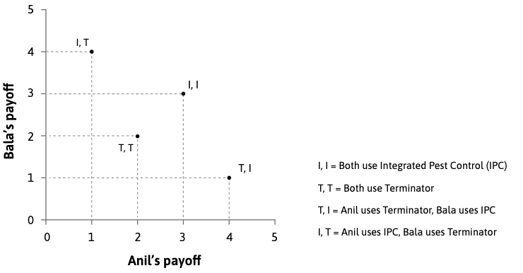
```

---

.center[
**A Pareto comparison**
]

```{r, out.width="90%"}
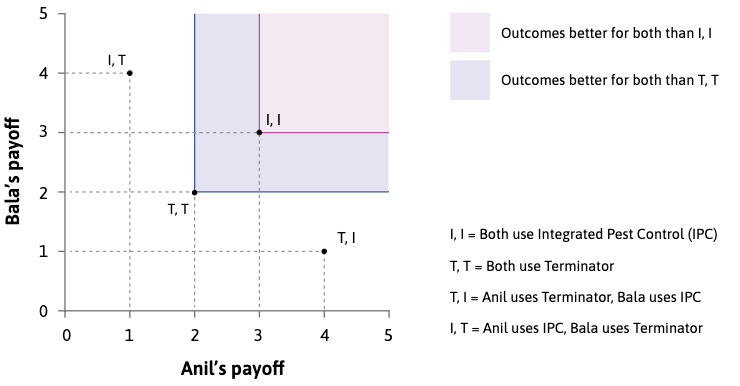
```

(I, I) lies in the rectangle to the north-east of (T, T), so an outcome where both Anil and Bala use IPC Pareto dominates one where both use Terminator.

---

.center[
**Compare (T, T) and (T, I)**
]

```{r, out.width="90%"}
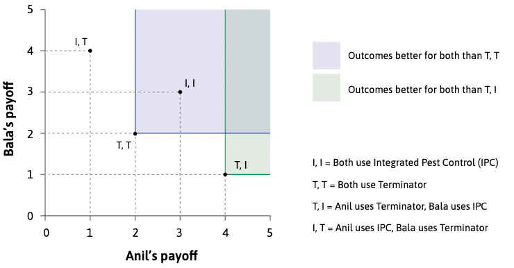
```

If Anil uses Terminator and Bala IPC, then he is better off but Bala is worse off than when both use Terminator. The Pareto criterion cannot say which of these allocations is better.

---

.center[
**No allocation Pareto dominates (I, I)**
]

```{r, out.width="90%"}
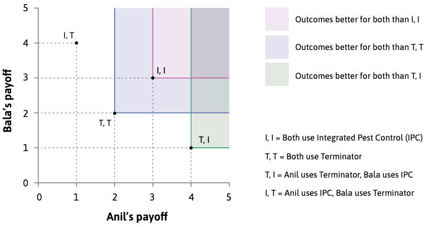
```

None of the other allocations lie to the north-east of (I, I), so it is not Pareto dominated.

---

.center[
**What can we say about (I, T) and (T, I)?**
]

```{r, out.width="90%"}
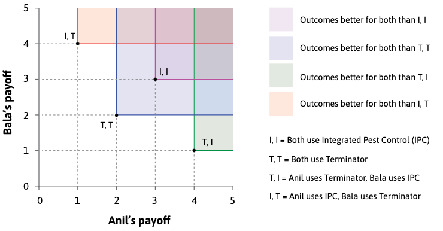
```

Neither of these allocations are Pareto dominated, but they do not dominate any other allocations either.

---

.center[
**Three of the four allocations are not Pareto dominated by any other**
]

```{r, out.width="75%"}

```

.center[
### Pareto efficiency
An allocation with the property that there is no alternative technically feasible allocation in which at least one person would be better off, and nobody worse off.

]

---

.center[
## Pareto efficiency: Another example
]

You find 100 euros on the street. You decide to share some of it with your friend.

--

```{r}
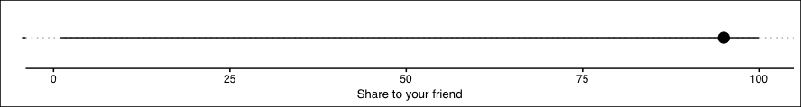
```

---

.center[
## Pareto efficiency: Another example
]

You find 100 euros on the street. You decide to share some of it with your friend.

```{r}
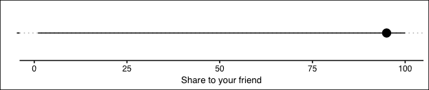
```

---
.center[
## Pareto efficiency: Another example
]

You find 100 euros on the street. You decide to share some of it with your friend.

```{r}
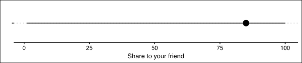
```

---
.center[
## Pareto efficiency: Another example
]

You find 100 euros on the street. You decide to share some of it with your friend.

```{r}
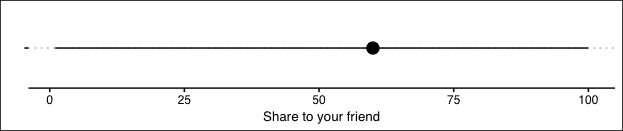
```

---
.center[
## Pareto efficiency: Another example
]

You find 100 euros on the street. You decide to share some of it with your friend.

```{r}
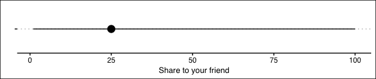
```

---
.center[
## Pareto efficiency: Another example
]

You find 100 euros on the street. You decide to share some of it with your friend.

```{r}
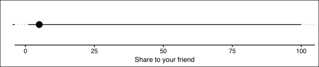
```

---
.center[
## Pareto efficiency: Another example
]

You find 100 euros on the street. You decide to share some of it with your friend.

Double the money.

```{r}
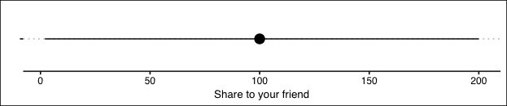
```

---
.center[
# Fairness
]

Evaluate the rules of the game as well as the outcome. Allocations can be considered unfair for two reasons:

--

.pull-left[

.center[
### Substantive judgement of fairness
]

.center[
**Inequality of final outcome**
]

- *Income*: The reward in money (or some equivalent measure) of the individual’s command over valued goods and services.

- *Happiness*: Economists have developed indicators by which subjective wellbeing can be measured.

- *Freedom*: The extent that one can do (or be) what one chooses without socially imposed limits.


]

--

.pull-right[

.center[
### Procedural judgement of fairness
]

.center[
**How they came about**
]

- *Voluntary exchange of private property acquired by legitimate means*: Were the actions resulting in the allocation the result of freely chosen actions by the individuals involved? 

- *Equal opportunity for economic advantage*: Did people have an equal opportunity to acquire a large share of the total to be divided up?

- *Deservingness*: Did the rules of the game that determined the allocation take account of the extent to which an individual worked hard, or otherwise upheld social norms?

]

---
.center[
## Evaluating fairness
]

--

.center[
### Rawls’ veil of ignorance
]

```{r, out.width="65%"}
knitr::include_graphics("https://www.thenation.com/wp-content/uploads/2019/10/Jones-Benhabib-rawls_ftr_img-680x430.jpg")
```

---
.center[
## Evaluating fairness
]

.center[
### Rawls’ veil of ignorance
]


1) **We adopt the principle that fairness applies to all people**

For example, if we swapped the positions of An and Bai, so that it was Bai instead of An who picked up $100, we would still apply exactly the same standard of justice to evaluate the outcome.

2) **Imagine a veil of ignorance**: 

Since fairness applies to everyone, including ourselves, Rawls asks us to imagine ourselves behind what he called a veil of ignorance, not knowing the position that we would occupy in the society we are considering. 

We could be male or female, healthy or ill, rich or poor (or with rich or poor parents), in a dominant or an ethnic minority group, and so on. In the $100 on the street game, we would not know if we would be the person picking up the money, or the person responding to the offer.

3) **From behind the veil of ignorance, we can make a judgement**:

For example, the choice of a set of institutions —imagining as we do so that we will then become part of the society we have endorsed, with an equal chance of having any of the positions occupied by individuals in that society.

---
.center[
# Fairness and Economics
]


Economics does not provide judgements about what is fair.
--
 But economics can clarify:

--

.pull-left[

- **How the dimensions of unfairness may be connected**: For example, how the rules of the game that give special advantages to one or another group may affect the degree of inequality.

- **The trade-offs between the dimensions of fairness**: For example, do we have to compromise on the equality of income if we also want equality of opportunity?

- **Public policies to address concerns about unfairness**: Also, whether these policies compromise other objectives.

]


.pull-right[
```{r, out.width="50%"}
knitr::include_graphics("https://products-images.di-static.com/image/marc-fleurbaey-manifeste-pour-le-progres-social/9782348041754-475x500-2.webp")
```
]

---
.center2[
# Determining allocations
]

---

.center[
### A model of choice and conflict
]

Angela the farmer.

```{r, out.width="65%"}
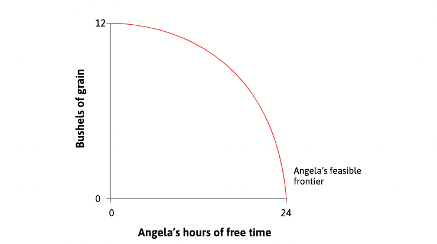
```

The diagram shows Angela’s feasible frontier, determined by her production function.

---

.center[
### A model of choice and conflict
]

Angela the farmer.

```{r, out.width="65%"}
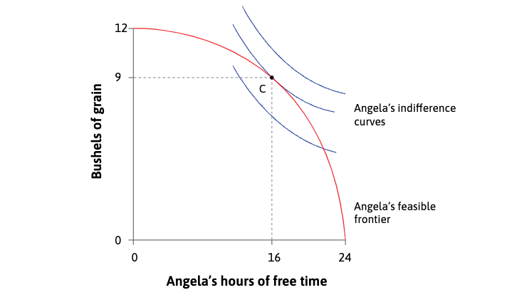
```

The best Angela can do, given the limits set by the feasible frontier, is to work for 8 hours, taking 16 hours of free time and producing 9 bushels of grain. At this point C, the marginal rate of substitution (MRS) is equal to the marginal rate of transformation (MRT).

---

.center[
### A model of choice and conflict
]

Angela the farmer.

```{r, out.width="65%"}
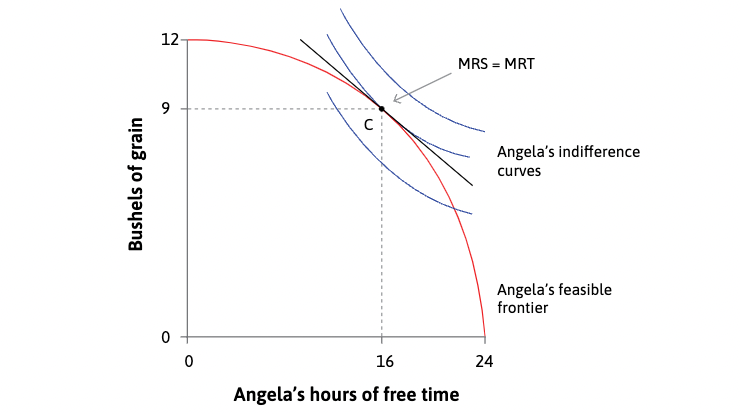
```

The MRS is the slope of the indifference curve. The trade-off she is willing to make between grain and free time. The MRT is the slope of the feasible frontier: the trade-off she is constrained to make. At point C, the two trade-offs balance.


---
.center[
### A model of choice and conflict
]

Angela has company. The other person is called Bruno; he is not a farmer but will claim some of Angela’s harvest.

--

```{r, out.width="60%"}
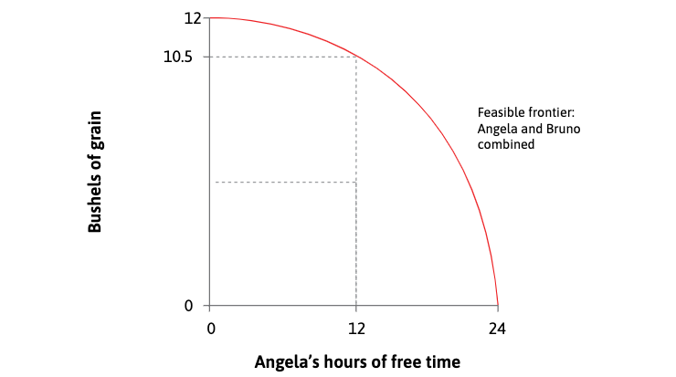
```

**The combined feasible frontier**: The feasible frontier shows the maximum amount of grain available to Angela and Bruno together, given Angela’s amount of free time. If Angela takes 12 hours of free time and works for 12 hours then she produces 10.5 bushels of grain.

---
.center[
### A model of choice and conflict
]

Angela has company. The other person is called Bruno; he is not a farmer but will claim some of Angela’s harvest.

```{r, out.width="60%"}
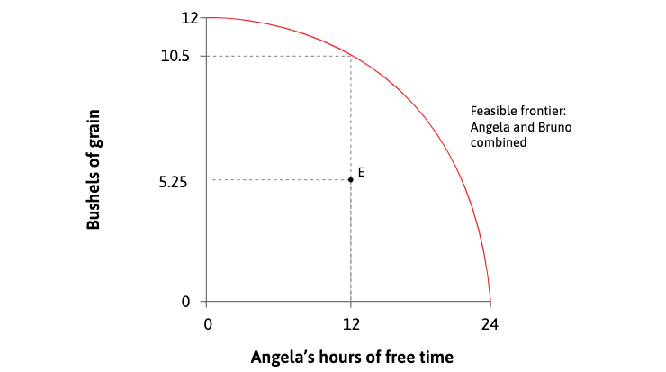
```

**A feasible allocation**: Point E is a possible outcome of the interaction between Angela and Bruno.

---
.center[
### A model of choice and conflict
]

Angela has company. The other person is called Bruno; he is not a farmer but will claim some of Angela’s harvest.

```{r, out.width="60%"}
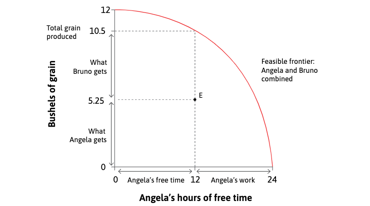
```

**The distribution at point E**: At point E, Angela works for 12 hours and produces 10.5 bushels of grain. The distribution of grain is such that 5.25 bushels go to Bruno and Angela retains the other 5.25 bushels for her own consumption.

---
.center[
### A model of choice and conflict
]

Angela has company. The other person is called Bruno; he is not a farmer but will claim some of Angela’s harvest.

```{r, out.width="60%"}

```

**Other feasible allocations**: Point F shows an allocation in which Angela works more than at point E and gets less grain, and point G shows the case in which she works more and gets more grain.

---
.center[
### A model of choice and conflict
]

Angela has company. The other person is called Bruno; he is not a farmer but will claim some of Angela’s harvest.

```{r, out.width="60%"}
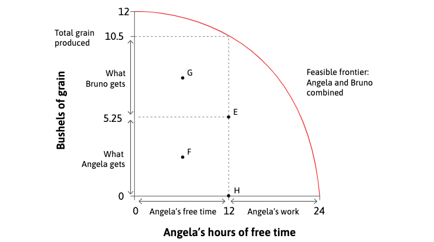
```

**An impossible allocation**: An outcome at H—in which Angela works 12 hours a day, Bruno consumes the entire amount produced and Angela consumes nothing—would not be possible: she would starve.

---
.center[
### Technically feasible allocations
]

If Angela does not work the land, Bruno gets nothing. Bruno has a gun: he has the power to implement any allocation that he chooses.

--

```{r, out.width="60%"}
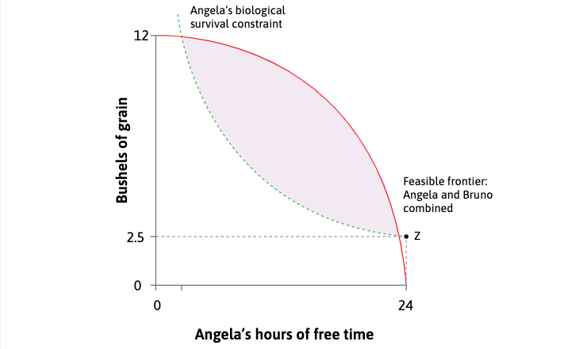
```

**The biological survival constraint**: If Angela does not work at all, she needs 2.5 bushels to survive (point Z). If she gives up some free time and expends energy working, she needs more food, so the curve is higher when she has less free time. This is the biological survival constraint.

---
.center[
### Technically feasible allocations
]

If Angela does not work the land, Bruno gets nothing. Bruno has a gun: he has the power to implement any allocation that he chooses.

```{r, out.width="60%"}
knitr::include_graphics("imgs/f5-4b.png")
```

**Biologically infeasible and technically infeasible points**: Points below the biological survival constraint are biologically infeasible, while points above the feasible frontier are technically infeasible.

---
.center[
### Technically feasible allocations
]

If Angela does not work the land, Bruno gets nothing. Bruno has a gun: he has the power to implement any allocation that he chooses.

```{r, out.width="60%"}
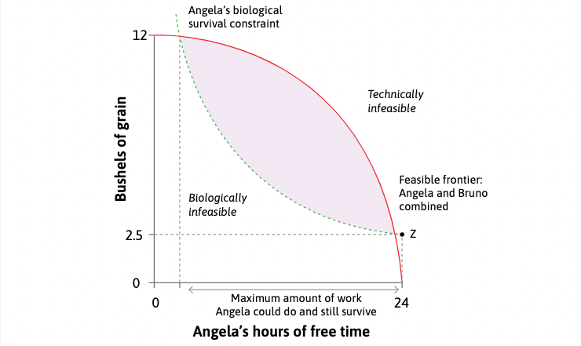
```

**Angela’s maximum working day**: Given the feasible frontier, there is a maximum amount of work above which Angela could not survive, even if she could consume everything she produced.

---
.center[
### Technically feasible allocations
]

If Angela does not work the land, Bruno gets nothing. Bruno has a gun: he has the power to implement any allocation that he chooses.

```{r, out.width="60%"}
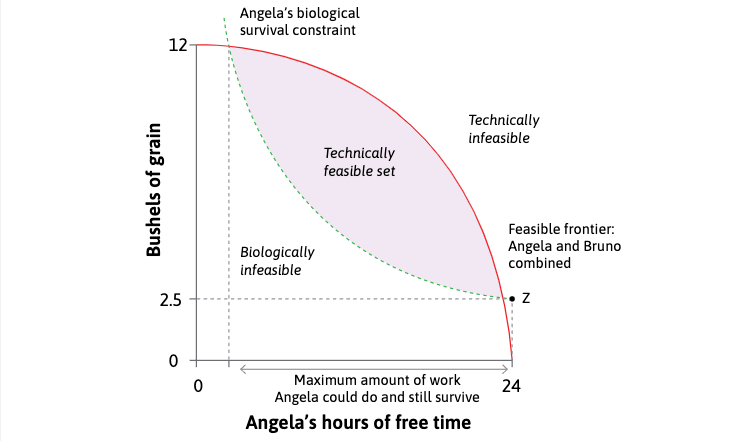
```

**The technically feasible set**: The technically feasible allocations are the points in the lens-shaped area bounded by the feasible frontier and the biological survival constraint (including points on the frontier).

---
.left-column[

### Coercion: Imposing Allocations by Force

Bruno can choose any allocation in the technically feasible set. He considers letting Angela continue working 8 hours a day, producing 9 bushels.

]

.right-column[
```{r, out.width="75%"}
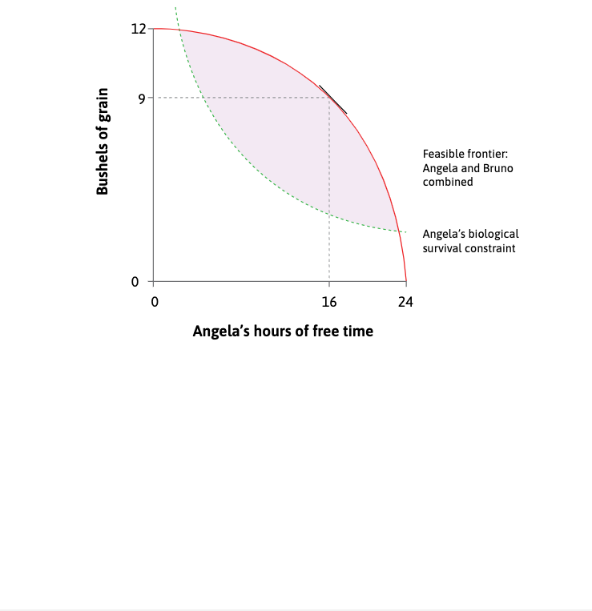
```
]

---
.left-column[

### Coercion: Imposing Allocations by Force

Bruno could take 5.5 bushels without jeopardizing his future benefit from Angela’s labour. This is shown by the vertical distance between the feasible frontier and the survival constraint.

]

.right-column[
```{r, out.width="75%"}
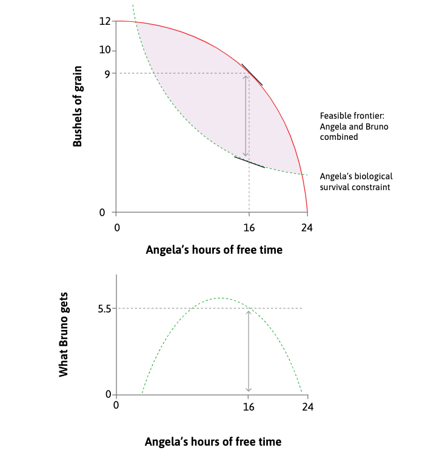
```
]

---
.left-column[

### Coercion: Imposing Allocations by Force

The vertical distance between the feasible frontier and the biological survival constraint is greatest when Angela works for 11 hours (13 hours of free time).

]

.right-column[
```{r, out.width="75%"}
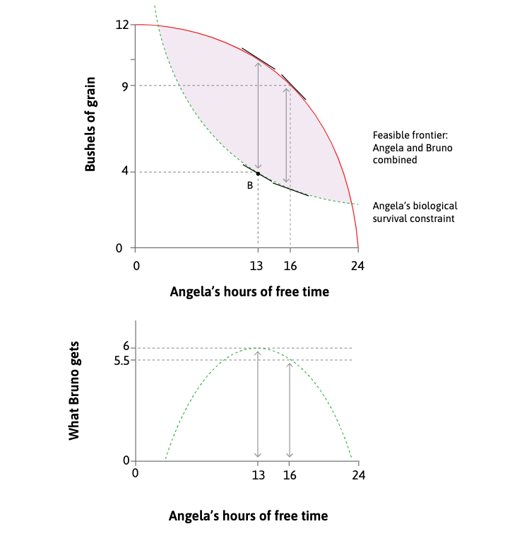
```
]

---
.left-column[

### Coercion: Imposing Allocations by Force

If Bruno commands Angela to work for 11 hours, she will produce 10 bushels, and needs 4 to survive. Bruno will get to keep 6 bushels for himself (the distance AB).

]

.right-column[
```{r, out.width="75%"}
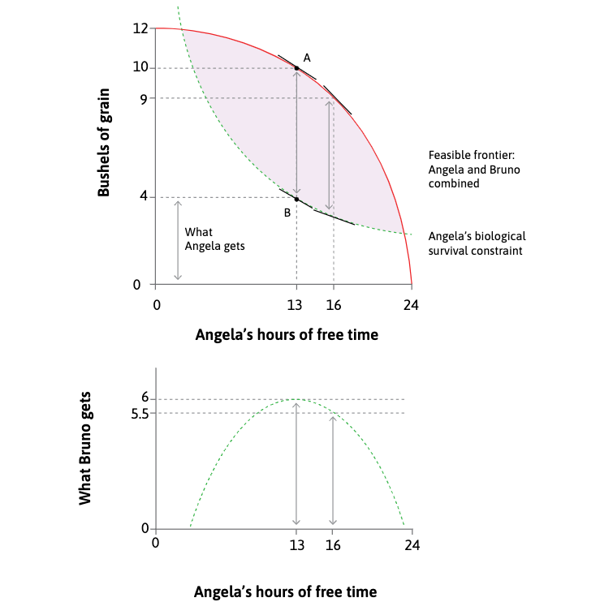
```
]

---
.left-column[

### Coercion: Imposing Allocations by Force

If Bruno makes Angela work for more than 11 hours, the amount he can take falls as working hours increase.

]

.right-column[
```{r, out.width="75%"}

```
]

---
.left-column[

### Coercion: Imposing Allocations by Force

Bruno gets the maximum amount of grain by choosing allocation B, where Angela’s working time is such that the slope of the feasible frontier is equal to the slope of the biological survival constraint: MRT = MRS.

]

.right-column[
```{r, out.width="75%"}

```
]

---
.left-column[

### Coercion: Imposing Allocations by Force

If we join up the points then we can see that the amount Bruno gets is hump-shaped, and peaks at 11 hours of work (13 hours of free time).

]

.right-column[
```{r, out.width="75%"}

```
]

---
.center[
### Voluntary exchange
]

There is now a government. Bruno now owns the land. He can offer Angela a contract allowing her to farm the land, and give him part of the harvest in return. But the law requires that exchange is voluntary.

--
 
```{r, out.width="60%"}
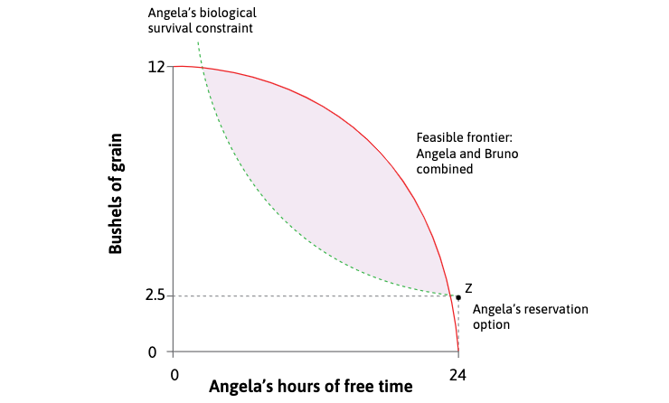
```

**Angela’s reservation option**: Point Z, the allocation in which Angela does not work and gets only survival rations from the government, is called her reservation option.

---
.center[
### Voluntary exchange
]

There is now a government. Bruno now owns the land. He can offer Angela a contract allowing her to farm the land, and give him part of the harvest in return. But the law requires that exchange is voluntary.

```{r, out.width="60%"}
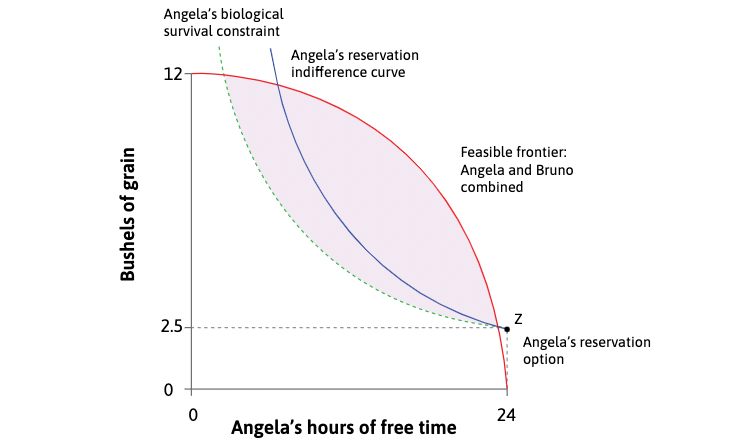
```

**Angela’s reservation indifference curve**: The curve showing all of the allocations that are just as highly valued by Angela as the reservation option is called her reservation indifference curve.


---
.center[
### Voluntary exchange: Bargaining
]

There is now a government. Bruno now owns the land. He can offer Angela a contract allowing her to farm the land, and give him part of the harvest in return. But the law requires that exchange is voluntary.

```{r, out.width="60%"}
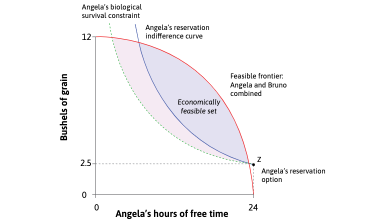
```

**The economically feasible set**: The points in the area bounded by the reservation indifference curve and the feasible frontier (including the points on the frontiers) define the set of all economically feasible allocations.

---
.center[
### Voluntary exchange: Bargaining
]

Both Angela and Bruno may benefit if a deal can be made. This does not mean that both parties will benefit equally.

--

```{r, out.width="60%"}
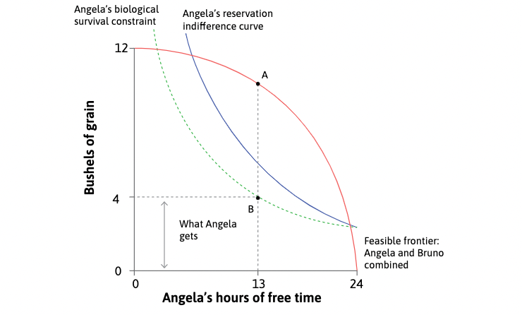
```

**Bruno’s best outcome using coercion**: Using coercion, Bruno chose allocation B. He forced Angela to work 11 hours and received grain equal to AB. The MRT at A is equal to the MRS at B on Angela’s biological survival constraint.

---
.center[
### Voluntary exchange: Bargaining
]

Both Angela and Bruno may benefit if a deal can be made. This does not mean that both parties will benefit equally.

```{r, out.width="60%"}
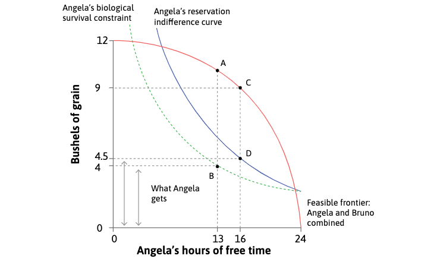
```

**When Angela can say no**: With voluntary exchange, allocation B is not available. The best that Bruno can do is allocation D, where Angela works for 8 hours, giving him grain equal to CD.

---
.center[
### Voluntary exchange: Bargaining
]

Both Angela and Bruno may benefit if a deal can be made. This does not mean that both parties will benefit equally.

```{r, out.width="60%"}
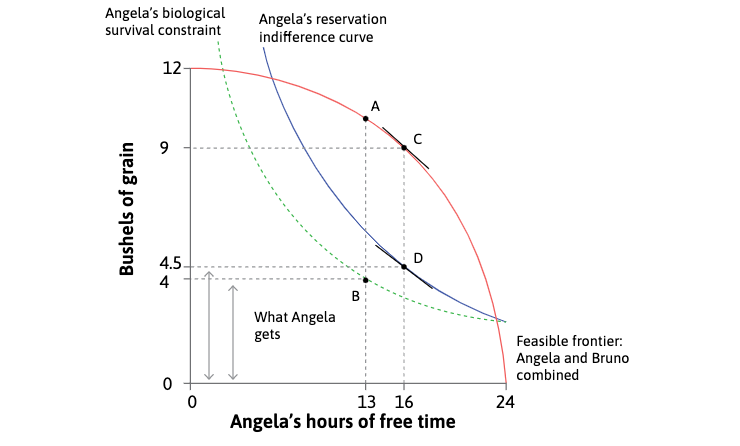
```

**MRS = MRT again**: When Angela works 8 hours, the MRT is equal to the MRS on Angela’s reservation indifference curve, as shown by the slopes.

---
.left-column[

### Coercion vs Bargaining

**Angela’s working hours when she was coerced**

Using coercion, Angela was forced to work 11 hours. The MRT was equal to the MRS on Angela’s biological survival constraint.

]

.right-column[
```{r, out.width="65%"}

```
]

---
.left-column[

### Coercion vs Bargaining

**Bruno’s best take-it-or-leave-it offer**

When Bruno cannot force Angela to work, he should offer a contract in which Angela pays him 4.5 bushels to rent the land. She works for 8 hours, where the MRT is equal to the MRS on her reservation indifference curve.

]

.right-column[
```{r, out.width="65%"}
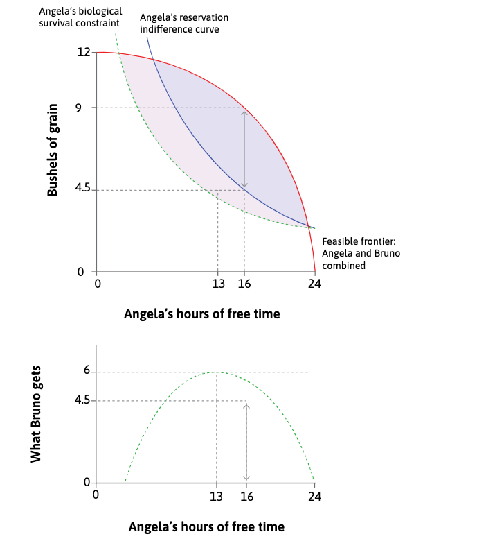
```
]

---
.left-column[

### Coercion vs Bargaining

**The maximum surplus**

If Angela works more or less than 8 hours, the joint surplus is less than 4.5 bushels.

]

.right-column[
```{r, out.width="65%"}
knitr::include_graphics("imgs/f5-7b-c.png")
```
]

---
.left-column[

### Coercion vs Bargaining

**Bruno’s grain**

Although Bruno cannot coerce Angela he can get the whole surplus.
]

.right-column[
```{r, out.width="65%"}
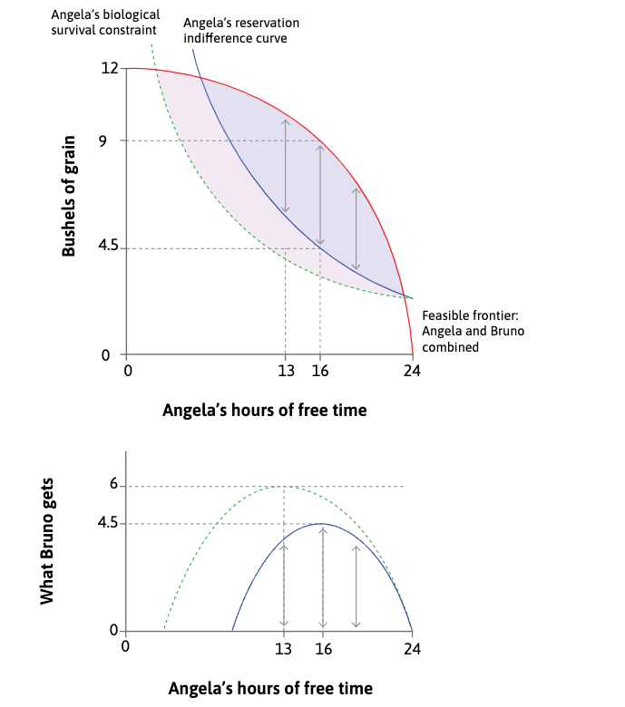
```
]

---
.left-column[

### Coercion vs Bargaining

**Technically and economically feasible peaks compared**

The peak of the hump is lower when Angela can refuse, compared to when Bruno could order her to work.

]

.right-column[
```{r, out.width="65%"}
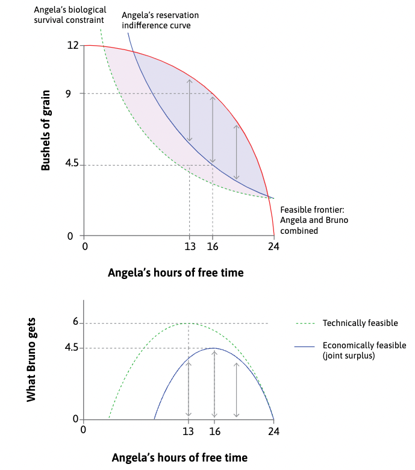
```
]

---
.center[
### Pareto Efficiency Curve
]

1) All the grain produced is shared between Angela and Bruno. 2) The MRT on the feasible frontier is equal to the MRS on Angela’s indifference curve. **This means that the allocations are Pareto efficient** (**Pareto efficiency** means that no **Pareto improvement** is possible).

--

```{r, out.width="55%"}
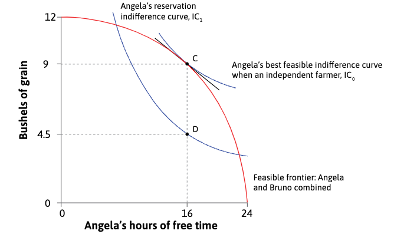
```

**The allocation at C**: As an independent farmer, Angela chose point C, where MRT = MRS. She consumed 9 bushels of grain: 4.5 bushels would have been enough to put her on her reservation indifference curve at D. But she obtained the whole surplus CD—an additional 4.5 bushels.

---
.center[
### Pareto Efficiency Curve
]

1) All the grain produced is shared between Angela and Bruno. 2) The MRT on the feasible frontier is equal to the MRS on Angela’s indifference curve. **This means that the allocations are Pareto efficient** (**Pareto efficiency** means that no **Pareto improvement** is possible).

```{r, out.width="55%"}
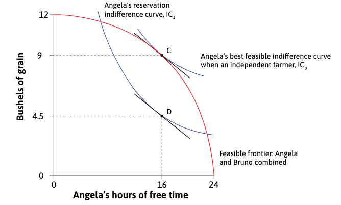
```

**The allocation at D**: When Bruno owned the land and made a take-it-or-leave-it offer, he chose a contract in which the land rent was CD (4.5 bushels). Angela accepted and worked 8 hours. The allocation was at D, and once again, MRT = MRS. The surplus was still CD, but Bruno got it all.

---
.center[
### Pareto Efficiency Curve
]

1) All the grain produced is shared between Angela and Bruno. 2) The MRT on the feasible frontier is equal to the MRS on Angela’s indifference curve. **This means that the allocations are Pareto efficient** (**Pareto efficiency** means that no **Pareto improvement** is possible).

```{r, out.width="55%"}
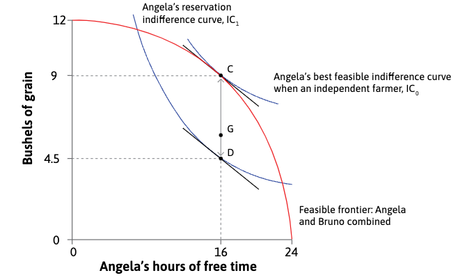
```

**Angela’s preferences**: Remember that Angela’s MRS doesn’t change as she consumes more grain. At any point along the line CD, such as G, there is an indifference curve with the same slope. So MRS = MRT at all of these points.


---
.center[
### Pareto Efficiency Curve
]

1) All the grain produced is shared between Angela and Bruno. 2) The MRT on the feasible frontier is equal to the MRS on Angela’s indifference curve. **This means that the allocations are Pareto efficient** (**Pareto efficiency** means that no **Pareto improvement** is possible).

```{r, out.width="55%"}

```

**A hypothetical allocation**: Point G is a hypothetical allocation, at which MRS = MRT. Angela works for 8 hours, and 9 bushels of grain are produced. Bruno gets grain CG, and Angela gets all the rest. Allocation G is Pareto efficient.

---
.center[
### Pareto Efficiency Curve
]

1) All the grain produced is shared between Angela and Bruno. 2) The MRT on the feasible frontier is equal to the MRS on Angela’s indifference curve. **This means that the allocations are Pareto efficient** (**Pareto efficiency** means that no **Pareto improvement** is possible).

```{r, out.width="55%"}

```

**The Pareto efficiency curve (contract curve)**: All the points making up the line between C and D are Pareto-efficient allocations, at which MRS = MRT. The surplus of 4.5 bushels (CD) is shared between Angela and Bruno.

---
.center[
### Pareto Efficiency Curve
]

.center[
**Pareto efficiency**:  An allocation with the property that there is no alternative technically feasible allocation in which at least one person would be better off, and nobody worse off.

]

```{r, out.width="60%"}

```

- At C, Angela gets all the surplus.
- At D, Bruno gets all the surplus.
- In any other point on the curve, Angela and Bruno split the surplus, and each receive a rent.

---
.center[
### Politics: Sharing the surplus
]

New law that limits working time to 4 hours a day, while requiring that total pay is at least 4.5 bushels.

--

```{r, out.width="55%"}
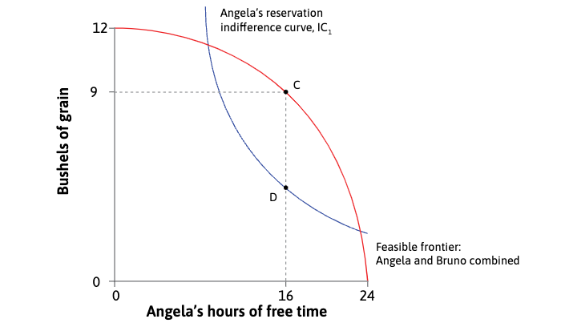
```

**Before the short hours law**: Bruno makes a take-it-or-leave-it offer, gets grain equal to CD, and Angela works 8 hours. Angela is on her reservation indifference curve at D and MRS = MRT.

---
.center[
### Politics: Sharing the surplus
]

New law that limits working time to 4 hours a day, while requiring that total pay is at least 4.5 bushels.

```{r, out.width="55%"}
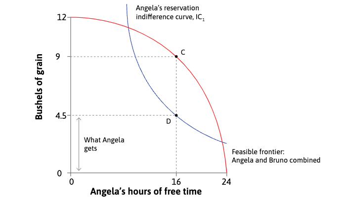
```

**What Angela receives before legislation**: Angela gets 4.5 bushels of grain: she is just indifferent between working for 8 hours and her reservation option.

---
.center[
### Politics: Sharing the surplus
]

New law that limits working time to 4 hours a day, while requiring that total pay is at least 4.5 bushels.

```{r, out.width="55%"}
knitr::include_graphics("imgs/f5-9c.png")
```

**The effect of legislation**: With legislation that reduces work to 4 hours and keeps Angela’s amount of grain unchanged, she is on a higher indifference curve at F. Bruno’s grain is reduced from CD to EF (2 bushels).

---
.center[
### Politics: Sharing the surplus
]

Is the new allocation efficient? Nope.

--

```{r, out.width="55%"}
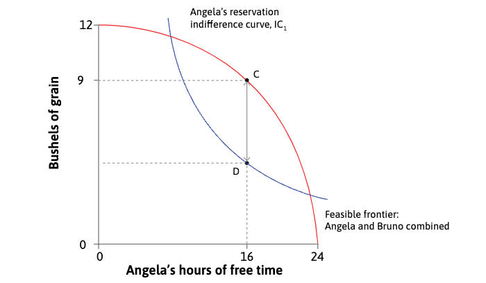
```

**The maximum joint surplus**: The surplus to be divided between Angela and Bruno is maximized where MRT = MRS, at 8 hours of work.

---
.center[
### Politics: Sharing the surplus
]

Is the new allocation efficient? Nope.

```{r, out.width="55%"}

```

**Angela prefers F to D**: But Angela prefers point F implemented by the legislation, because it gives her the same amount of grain but more free time than D.

---
.center[
### Politics: Sharing the surplus
]

Is the new allocation efficient? Nope.

```{r, out.width="55%"}
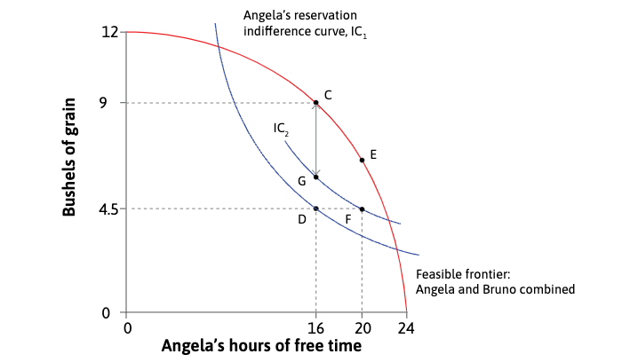
```

**Angela could also do better than F**: Compared to F, she would prefer any allocation on the Pareto efficiency curve between C and G.

---
.center[
### Politics: Sharing the surplus
]

Is the new allocation efficient? Nope.

```{r, out.width="55%"}
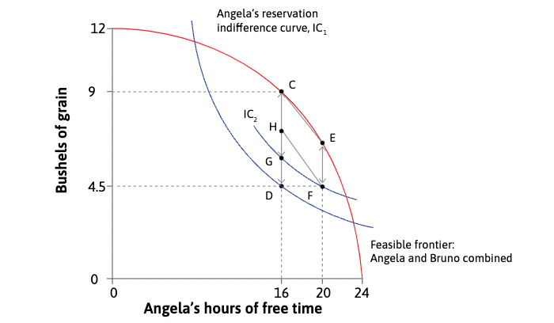
```

**Angela can propose H**: At allocation H, Bruno gets the same amount of grain: CH = EF. Angela is better off than she was at F. She works longer hours, but has more than enough grain to compensate her for the loss of free time.

---
.center[
### Politics: Sharing the surplus
]

Is the new allocation efficient? Nope.

```{r, out.width="55%"}
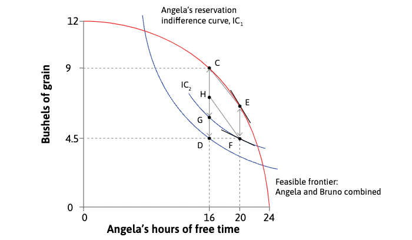
```


**A win-win agreement by moving to an allocation between G and H**: F is not Pareto efficient because MRT > MRS. If they move to a point on the Pareto efficiency curve between G and H, Angela and Bruno can both be better off.

---
.center[
### Politics: Sharing the surplus
]

.center[
### Institutions and policies affect the size of the surplus and its distribution.
]

```{r, out.width="55%"}

```


---

```{r, out.width="100%"}
knitr::include_graphics("imgs/f5-11.png")
```

---
.center2[
# Institutions and inequality
]
