<style>

.center2 {
  margin: 0;
  position: absolute;
  top: 50%;
  left: 50%;
  -ms-transform: translate(-50%, -50%);
  transform: translate(-50%, -50%);
}

</style>


```{r meta, echo=FALSE}
library(metathis)
meta() %>%
  meta_general(
    description = "An Introduction to xaringan for Presentations: The Basics",
    generator = "xaringan and remark.js"
  ) %>% 
  meta_name("github-repo" = "spcanelon/xaringan-basics-and-beyond")
  # meta_social(
  #   title = "Sharing Your Work with xaringan &#8212; Day 1",
  #   url = "https://spcanelon.github.io/xaringan-basics-and-beyond/slides/day-01-basics.html#1",
  #   image = "https://raw.githubusercontent.com/spcanelon/xaringan-basics-and-beyond/main/slides/day-01-cover-image.png",
  #   image_alt = "Title slide for the day 1 slides of the Sharing Your Work with xaringan workshop series",
  #   og_type = "website",
  #   og_author = "Silvia Canelon",
  #   twitter_card_type = "summary_large_image",
  #   twitter_creator = "@spcanelon"
  # )
```

```{r setup, include = FALSE}
knitr::opts_chunk$set(echo = FALSE)
knitr::opts_chunk$set(out.width = "85%")
knitr::opts_chunk$set(fig.align="center")

options(htmltools.dir.version = FALSE)
library(knitr)
library(tidyverse)
library(xaringanExtra)
# set default options
opts_chunk$set(echo=FALSE,
               collapse = TRUE,
               fig.width = 7.252,
               fig.height = 4,
               dpi = 300)
# set engines
knitr::knit_engines$set("markdown")
xaringanExtra::use_tile_view()
xaringanExtra::use_panelset()
xaringanExtra::use_clipboard()
xaringanExtra::use_webcam()
xaringanExtra::use_broadcast()
xaringanExtra::use_share_again()
xaringanExtra::style_share_again(
  share_buttons = c("twitter", "linkedin", "pocket")
)
# uncomment the following lines if you want to use the NHS-R theme colours by default
# scale_fill_continuous <- partial(scale_fill_nhs, discrete = FALSE)
# scale_fill_discrete <- partial(scale_fill_nhs, discrete = TRUE)
# scale_colour_continuous <- partial(scale_colour_nhs, discrete = FALSE)
# scale_colour_discrete <- partial(scale_colour_nhs, discrete = TRUE)
```

.center[
```{r out.width="90%"}
include_graphics("imgs/global_inequality.gif")
```
]

---

.center[
```{r out.width="70%"}
include_graphics("https://d3pc1xvrcw35tl.cloudfront.net/ln/images/1200x900/nobel-prize-in-economics_202410822885.jpg")
```
]

---

.center[
```{r out.width="90%"}
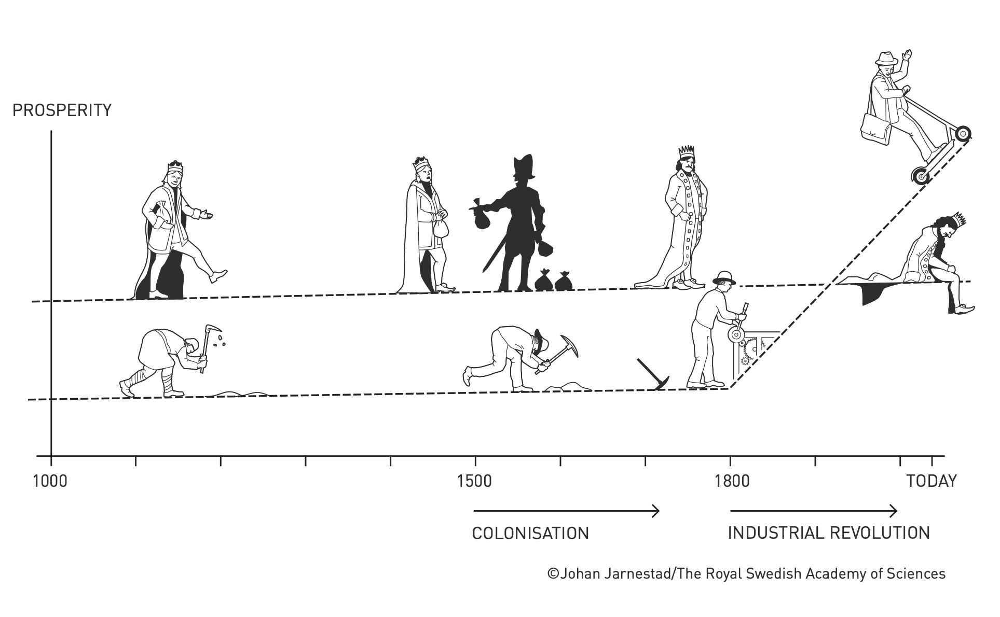
```
]

---
.center2[
# Institutions and power
]


---
## Institutions and power

**Institutions**: set of laws and informal rules that regulate social interactions among people, and between people and the biosphere 

*‘the rules of the game’* $\rightarrow$ constrains and incentives

--

.pull-left[
**Power**: The ability to do and get the things we want in opposition to the intentions of others.

- *Structural power*: each person’s outside options
- *Bargaining power*: how the value created in the interaction is divided based on each party’s ability to set terms or impose costs
]

--

.pull-right[
Example: **The ultimatum game**

```{r out.width="80%"}
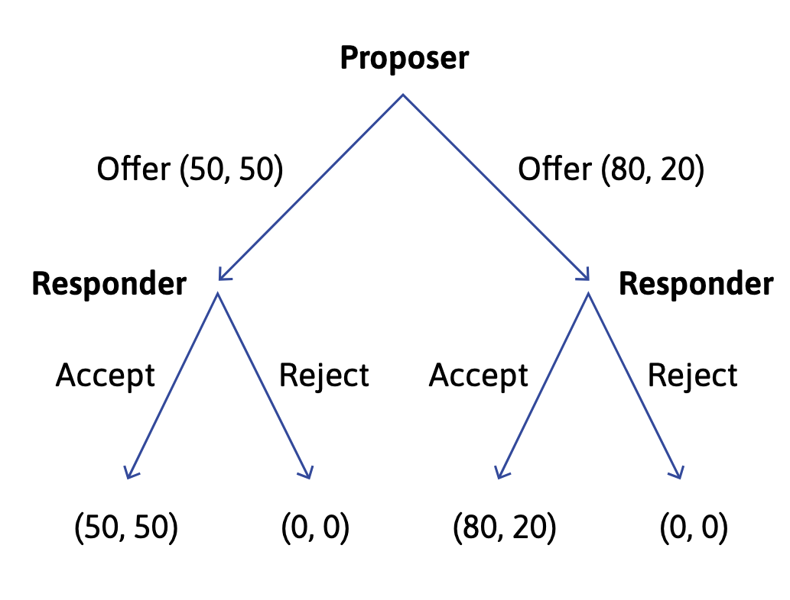
```

]


---
## Institutions and power

**Institutions**: set of laws and informal rules that regulate social interactions among people, and between people and the biosphere 

*‘the rules of the game’* $\rightarrow$ constrains and incentives

.pull-left[
**Power**: The ability to do and get the things we want in opposition to the intentions of others.

- *Structural power*: each person’s outside options
- *Bargaining power*: how the value created in the interaction is divided based on each party’s ability to set terms or impose costs
]

.pull-right[
Example: What happens when the Responder has no role? 

```{r out.width="80%"}

```

**Dictator game**
]

---
.center2[
# Evaluating institutions and outcomes: Fairness
]

---
## Evaluating institutions and outcomes: Pareto criterion and efficiency

### **Pareto criterion**

Allocation A is better than allocation B if **at least one party would be strictly better off with A than B, and nobody would be worse off**.

We say that A Pareto-dominates⁠ B, or that A would be a Pareto improvement⁠ over B.

When we say an allocation makes someone ‘better off’ we mean that they prefer it, which does not necessarily mean they get more money.

--

### **Pareto efficiency**:

An allocation is Pareto efficient if there is no feasible alternative allocation in which at least one person would be better off, and nobody worse off.


---
### Evaluating institutions and outcomes: Pareto criterion and efficiency

```{r out.width="80%"}
knitr::include_graphics("imgs/figure4-6.png")
```

---
### Evaluating institutions and outcomes: Pareto criterion and efficiency

**Pareto criterion**: Allocation A is better than allocation B if **at least one party would be strictly better off with A than B, and nobody would be worse off**.

We say that A Pareto-dominates⁠ B, or that A would be a Pareto improvement⁠ over B.

--

```{r out.width="65%"}
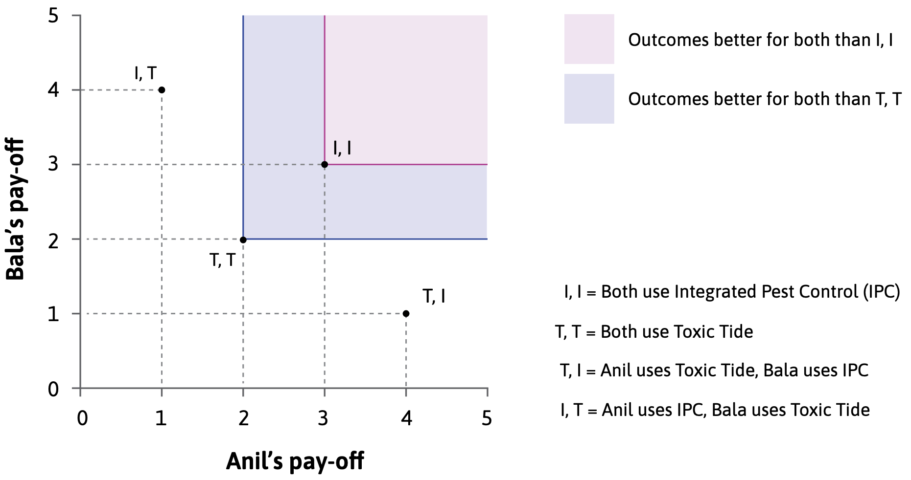
```

**Comparing (T, T) and (I, I)**: (I,I) Pareto-dominates (T,T)

---
### Evaluating institutions and outcomes: Pareto criterion and efficiency

**Pareto criterion**: Allocation A is better than allocation B if **at least one party would be strictly better off with A than B, and nobody would be worse off**.

We say that A Pareto-dominates⁠ B, or that A would be a Pareto improvement⁠ over B.

```{r out.width="65%"}
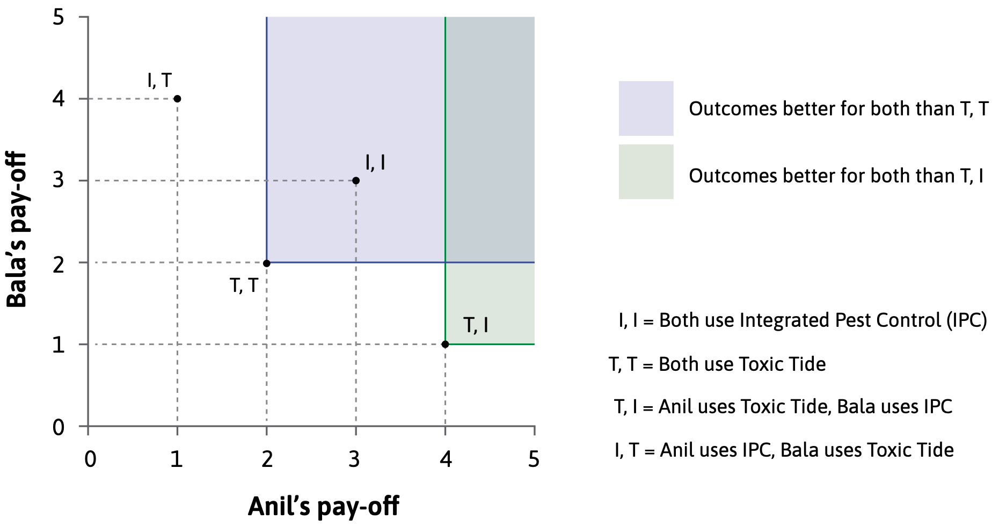
```

**Comparing (T, T) and (T, I)**: Nor (T, T) Pareto-dominates (T, I), nor (T,I) Pareto-dominates (T,T).

---
### Evaluating institutions and outcomes: Pareto criterion and efficiency

**Pareto criterion**: Allocation A is better than allocation B if **at least one party would be strictly better off with A than B, and nobody would be worse off**.

We say that A Pareto-dominates⁠ B, or that A would be a Pareto improvement⁠ over B.

```{r out.width="65%"}
knitr::include_graphics("imgs/figure4-7-c.png")
```

**No allocation Pareto-dominates (I, I)**: None of the other allocations lie to the north-east of (I, I), so it is not Pareto-dominated.

---
### Evaluating institutions and outcomes: Pareto criterion and efficiency

**Pareto criterion**: Allocation A is better than allocation B if **at least one party would be strictly better off with A than B, and nobody would be worse off**.

We say that A Pareto-dominates⁠ B, or that A would be a Pareto improvement⁠ over B.

```{r out.width="65%"}
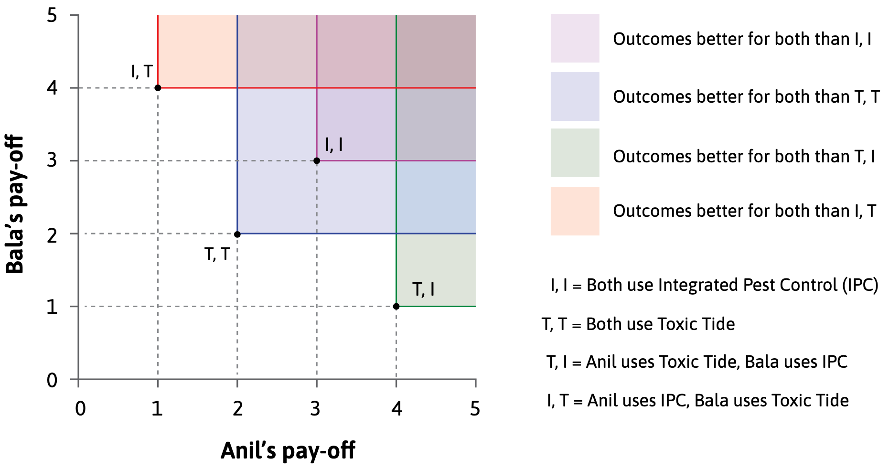
```

**What can we say about (I, T) and (T, I)?**: Neither of these allocations are Pareto-dominated, but they do not dominate any other allocations either.

---
### Evaluating institutions and outcomes: Pareto criterion and efficiency

**Pareto efficiency**: An allocation is Pareto efficient if there is no feasible alternative allocation in which at least one person would be better off, and nobody worse off.

--

```{r out.width="65%"}

```

.center[
### **(I, T)**, **(I, I)**, and **(T, I)** are **Pareto efficient**
]

---
### Evaluating institutions and outcomes: Pareto criterion and efficiency

**Pareto efficiency**: An allocation is Pareto efficient if there is **no feasible alternative allocation** in which at least one person would be better off, and nobody worse off.

```{r out.width="65%"}

```

.center[
### **(I, T)**, **(I, I)**, and **(T, I)** are **Pareto efficient**
]


---
## Pareto criterion and efficiency: Dictator game

You find 100 euros on the street. You decide to share some of it with your friend.

--

```{r}
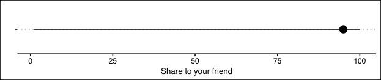
```

---
## Pareto criterion and efficiency: Dictator game

You find 100 euros on the street. You decide to share some of it with your friend.

```{r}
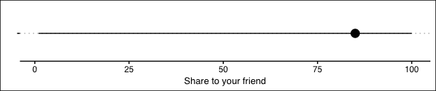
```

---
## Pareto criterion and efficiency: Dictator game

You find 100 euros on the street. You decide to share some of it with your friend.

```{r}
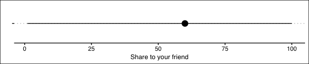
```

---
## Pareto criterion and efficiency: Dictator game

You find 100 euros on the street. You decide to share some of it with your friend.

```{r}
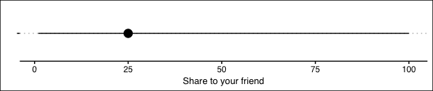
```

---
## Pareto criterion and efficiency: Dictator game

You find 100 euros on the street. You decide to share some of it with your friend.

```{r}
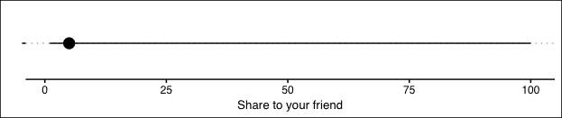
```


---
## Pareto criterion and efficiency: Dictator game

You find 100 euros on the street. You decide to share some of it with your friend.

```{r}

```

1) **Is each allocation in the dictator game a Pareto improvement?**

2) **Is each allocation in the dictator game Pareto efficient?**

---
## Pareto criterion and efficiency: Dictator game

You find 100 euros on the street. You decide to share some of it with your friend.

```{r}

```

1) **Is each allocation in the dictator game a Pareto improvement?**

$\rightarrow$ **NO**

When comparing two allocations, one allocation is a Pareto improvement over another only if at least one person is strictly better off and no one is worse off.

In the dictator game, any change in the distribution of the pie necessarily makes one person better off and the other worse off (since the total pie is fixed).

2) **Is each allocation in the dictator game Pareto efficient?**

---
## Pareto criterion and efficiency: Dictator game

You find 100 euros on the street. You decide to share some of it with your friend.

```{r}

```

1) **Is each allocation in the dictator game a Pareto improvement?**

2) **Is each allocation in the dictator game Pareto efficient?**

$\rightarrow$ **YES**

Because there is no way to make one person better off without making the other worse off, every allocation is Pareto efficient.


---
## Pareto criterion and efficiency: Dictator game

You find 100 euros on the street. You decide to share some of it with your friend.

```{r}

```

Counterintuitive:

- **Any change is a Pareto improvement**
- **Everything is Pareto efficient.**

--

The dictator game illustrates a key limitation of Pareto efficiency:
	
- The criterion cannot distinguish between extremely unfair and perfectly equal allocations, because it **only looks at whether someone can be made better off without hurting anyone else**.

- Since every feasible change hurts someone, even the allocation where the dictator keeps everything is Pareto efficient.
	
---
## Pareto criterion and efficiency: Dictator game

3) **Can we find an allocation that Pareto-dominates every feasible allocation and is Pareto efficient? What would it require?**

--

$\rightarrow$ **YES**: But only by **increasing the size of the pie**

```{r}
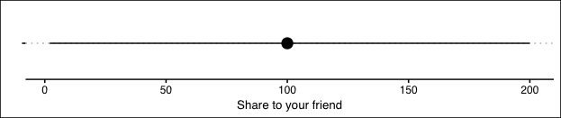
```

---
## Evaluating institutions and outcomes: Fairness

A second important criterion is **fairness**: a way to evaluate an allocation based on one’s conception of justice.

--

- **substantive judgement of fairness**: An evaluation of an outcome based on the characteristics of the allocation itself, not how it was determined

.center[
**Inequality of final outcome**
]

- **procedural judgement of fairness**: an evaluation of an outcome based on how the allocation came about, and not on the characteristics of the outcome itself.
 - Legitimacy of voluntary exchange / Equal opportunity / Deservingness
 
.center[
**How they came about**
]

```{r out.width="50%"}
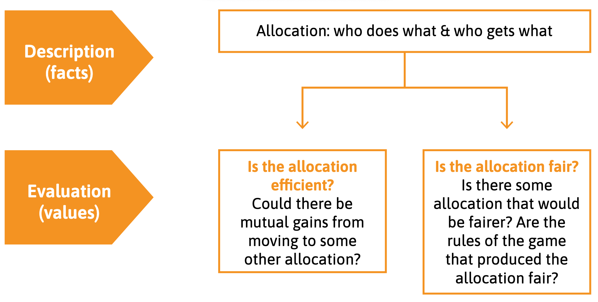
```

---
## Evaluating fairness: Rawls’ veil of ignorance

```{r, out.width="65%"}
knitr::include_graphics("https://www.thenation.com/wp-content/uploads/2019/10/Jones-Benhabib-rawls_ftr_img-680x430.jpg")
```

---
## Evaluating fairness: Rawls’ veil of ignorance

1) **We adopt the principle that fairness applies to all people**

- If we swapped the positions in the dictator game, we would still apply exactly the same standard of justice to evaluate the outcome.

--

2) **Imagine a veil of ignorance**: 

- Since fairness applies to everyone, including ourselves, Rawls asks us to imagine ourselves behind what he called a veil of ignorance, not knowing the position that we would occupy in the society we are considering. 

- We could be male or female, healthy or ill, rich or poor (or with rich or poor parents), in a dominant or an ethnic minority group, and so on.

- In the $100 on the street game, we would not know if we would be the person picking up the money, or the person responding to the offer.

--

3) **From behind the veil of ignorance, we can make a judgement**:

- The choice of a set of institutions —imagining as we do so that we will then become part of the society we have endorsed, with an equal chance of having any of the positions occupied by individuals in that society.

---
## Fairness and Economics

Economics does not provide judgements about what is fair.
--
 But economics can clarify:

--

.pull-left[

- **How the dimensions of unfairness may be connected**
  - How the rules of the game that give special advantages to one or another group may affect the degree of inequality.

- **The trade-offs between the dimensions of fairness** 
  - Do we have to compromise on the equality of income if we also want equality of opportunity?

- **Public policies to address concerns about unfairness** 
  - Whether these policies compromise other objectives.

]


.pull-right[
```{r, out.width="50%"}
knitr::include_graphics("https://products-images.di-static.com/image/marc-fleurbaey-manifeste-pour-le-progres-social/9782348041754-475x500-2.webp")
```
]

---
.center2[
# Setting up a model: Technology and preferences
]

---
## Setting up a model: Technology and preferences

Institutions (the rules of the game) affect the choices open to people (their feasible sets) and the power that members of some groups can exercise over others.

--

$\Rightarrow$ The institutions affect the efficiency and fairness of the resulting allocations of the game

--

- a farmer, Angela, who produces grain
- Bruno, who owns the land that Angela farms

-	Angela’s and Bruno’s payoffs and power depend on the rules governing their interaction and on Angela’s outside options (her ability to walk away).

- Different institutional rules lead to different divisions of the grain and different work incentives, representing broader relationships like landowners and renters.

---
## Setting up a model: Technology and preferences

While the institutions differ, the **preferences**⁠ of Bruno and Angela, and the **technology**⁠ that Angela uses to produce grain, are the same in each case:

- Angela wants: the best-for-her feasible combination of grain and free time, according to her preferences (and her resulting indifference curves).

- Bruno wants: as much grain as possible (he is not doing any work).

- The feasible set⁠ of hours of Angela’s work and the total amount of grain to be divided among the two, as given by the farming technology (the production function⁠).

---
## Preferences

Our two actors are entirely self-interested: their preferences concern only what they get for themselves.

.pull-left[
```{r}
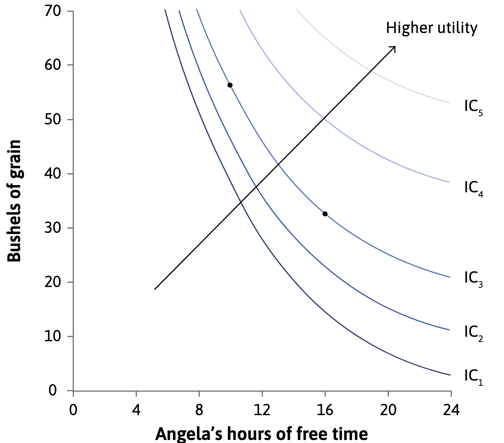
```

Angela’s indifference curves for free time and grain.
]

--

.pull-right[
```{r}
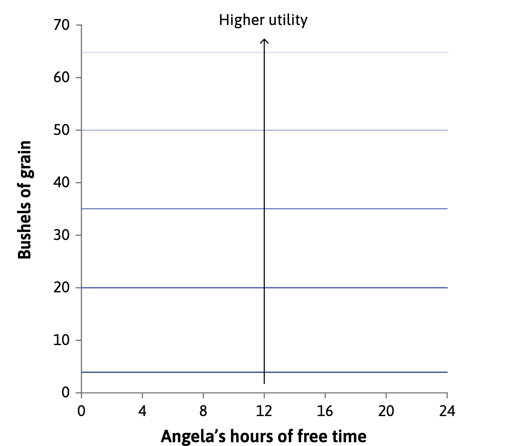
```
Bruno’s preferences for grain and Angela’s free time.
]

---
## Technology

The feasible combinations of grain, and free time for Angela, are determined by the farm’s technology for producing grain.


.pull-left[
```{r}
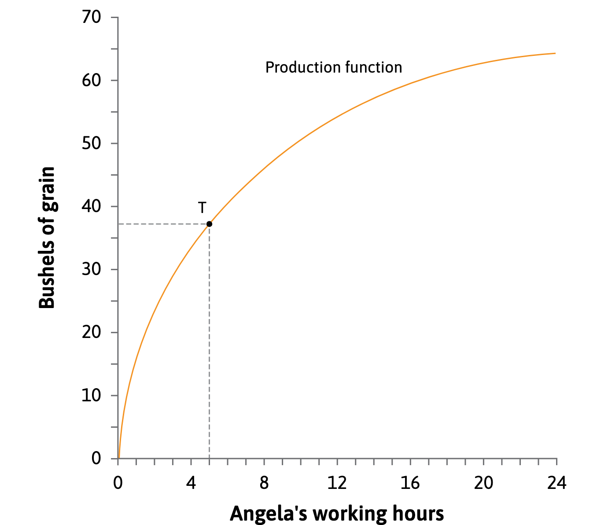
```

Angela’s production function.
]

--

.pull-right[
```{r}
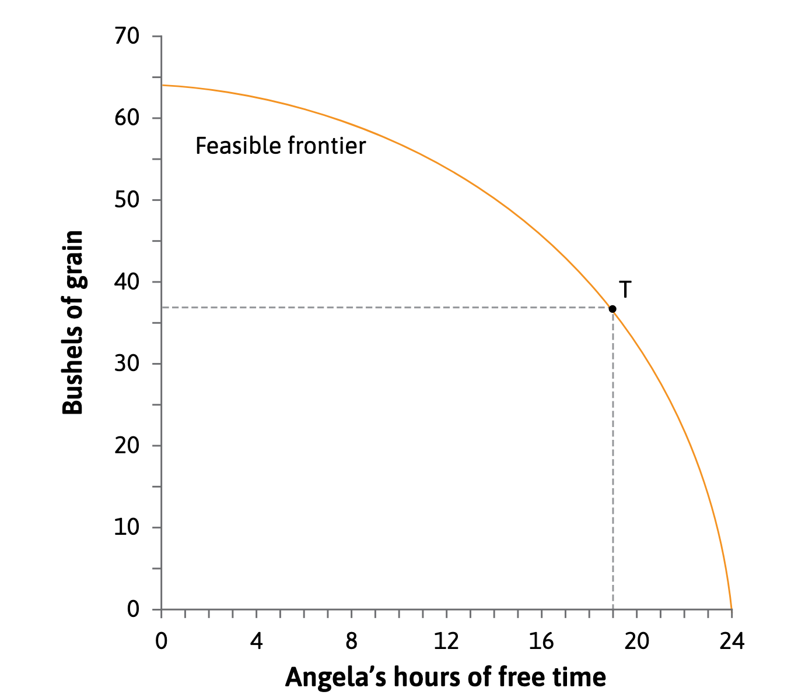
```
Angela’s feasible frontier.
]

---
.center2[
# Institutions, and the case of the independent farmer
]

---
## Institutions, and the case of the independent farmer

Baseline case: what Angela would choose to do if she owned the farm herself. How many hours would she work, and how much grain would she consume?

--

```{r out.width="45%"}
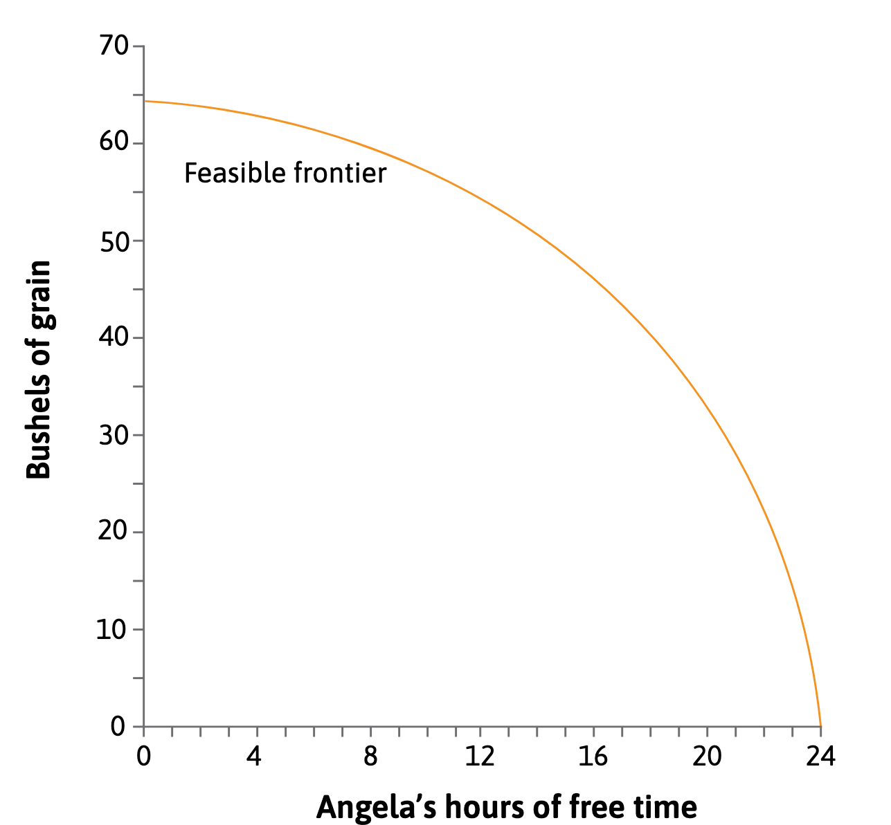
```

---
## Institutions, and the case of the independent farmer

Baseline case: what Angela would choose to do if she owned the farm herself. How many hours would she work, and how much grain would she consume?

```{r out.width="45%"}
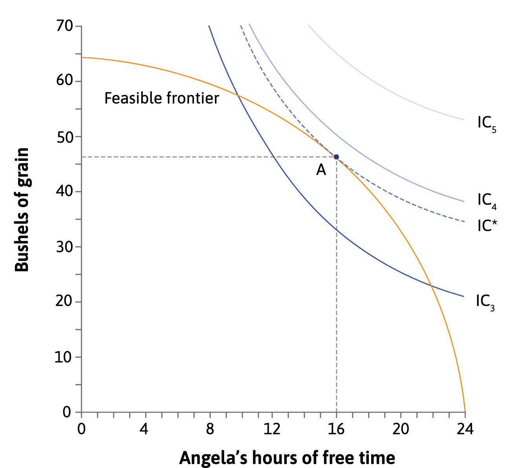
```

---
## Institutions, and the case of the independent farmer

Baseline case: what Angela would choose to do if she owned the farm herself. How many hours would she work, and how much grain would she consume?

```{r out.width="45%"}
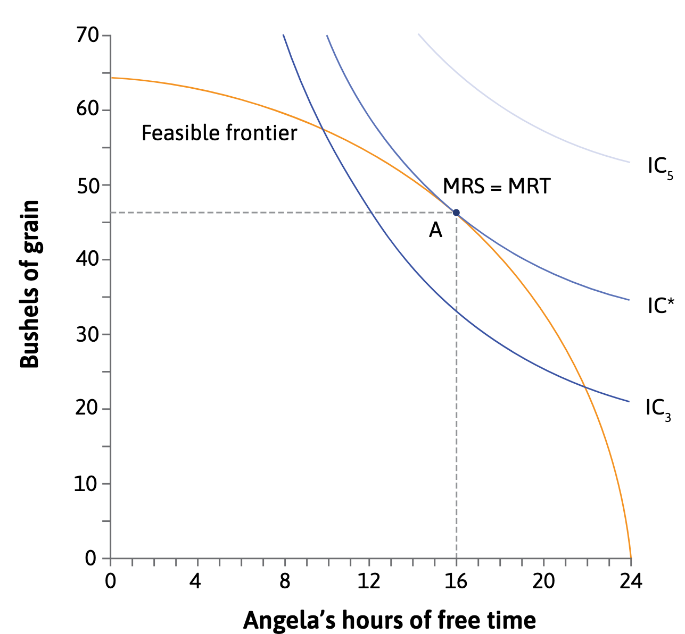
```

---
## Institutions, and the case of the independent farmer

Baseline case: Angela 16 hours of free time and 46 bushels of grain (Bruno is not a character in this scenario).

```{r out.width="45%"}

```

---
## Institutions, and the case of the landowner and the farmer

Bruno owns the land; Angela farms it. Outcomes depend on the institutional setting (**property rights**).

| **Institutional Setting** | **Case 1: Forced labour** | **Case 2: Take-it-or-leave-it contract** | **Case 3: Bargaining in a democracy** |
|---------------------------|----------------------------|-------------------------------------------|----------------------------------------|
| **The rules of the game** | Bruno can force Angela to work for him producing grain that he owns. | Bruno offers Angela a non-negotiable contract (employment or tenancy). She can accept or reject it; he cannot threaten her. The government enforces property rights. | Bruno offers a contract; Angela can accept, reject, or negotiate. Farmers vote to elect a government that regulates hours and guarantees a minimum wage equal to Case 2. |
| **Bruno decides:** | How many hours Angela must work and how much grain she can consume. | What contract to offer Angela. | Bruno and Angela negotiate contract terms. |
| **Angela decides:** | Obey, escape, or revolt (with risk of death). | Accept/reject the contract; if she accepts a tenancy, how many hours to work. | Vote to improve her options; then negotiate a contract with Bruno. |


---
.center2[
# Case 1: Forced labour
]

---
### Case 1: Forced labour

Bruno uses force to make Angela work on his land, owning all the grain she produces and deciding how much she may keep.

Angela has no real choice except to obey or risk death, so the interaction is determined entirely by Bruno’s power and the government’s enforcement of it.

---
### Case 1: Forced labour

The combined feasible frontier.

```{r out.width="40%"}
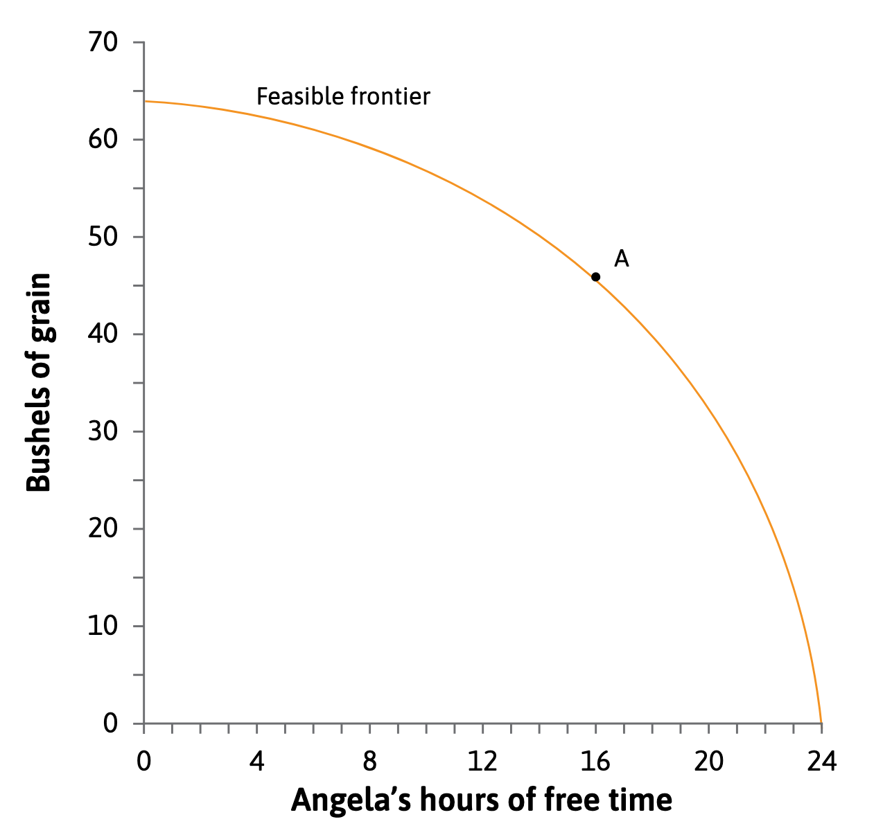
```

How much grain Angela can produce, depending on how much free time Bruno allows her. Bruno decides how it will be shared between them.


---
### Case 1: Forced labour

The combined feasible frontier.

```{r out.width="40%"}
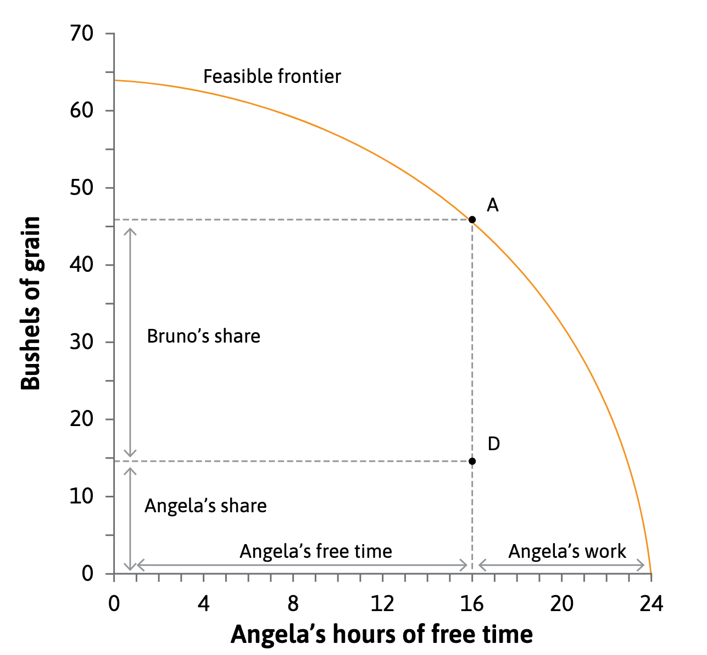
```

Each point on or within the frontier represents an allocation. At allocation D, Angela has 16 hours of free time. Of the 46 bushels of grain she produces, Bruno keeps 31 bushels and gives 15 to her.

---
### Case 1: Forced labour

The combined feasible frontier.

```{r out.width="40%"}

```

Point E shows an allocation in which Angela works more than at point D and gets more grain, and point F shows a case in which she works more and gets less grain.

---
### Case 1: Forced labour

The combined feasible frontier.

```{r out.width="40%"}
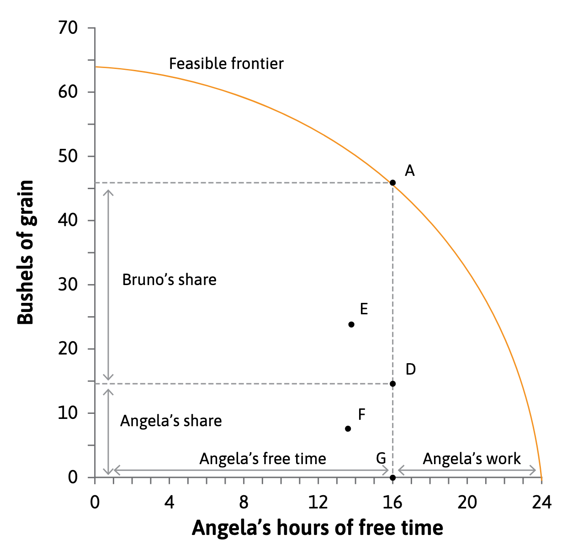
```

An allocation at point G—where Angela works eight hours, but Bruno consumes all the grain and Angela consumes nothing—would not be possible, as Angela would starve.

---
.pull-left[
### Case 1: Forced labour

Angela will comply only if Bruno gives her at least the utility of her reservation option.

So he must ensure she gets just enough to keep her alive and deter disobedience.

]

--

.pull-right[
```{r}
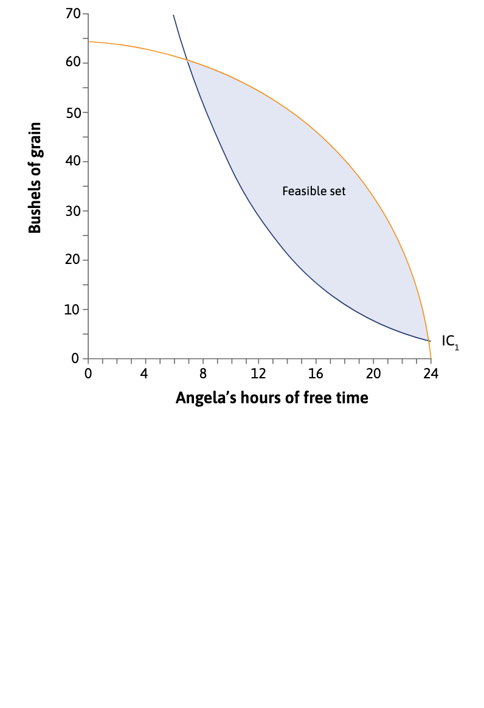
```
]

---
.pull-left[
### Case 1: Forced labour

Angela will comply only if Bruno gives her at least the utility of her reservation option.

So he must ensure she gets just enough to keep her alive and deter disobedience.

**Bruno’s feasible set**

Allocations above the feasible frontier aren’t feasible, given the production technology. 

Angela would not comply with allocations below her reservation indifference curve. 

Bruno can choose any allocation in the region between the feasible frontier and $IC_1$.

]

.pull-right[
```{r}

```
]

---
.pull-left[
### Case 1: Forced labour

**How the grain is shared**

However many hours he makes Angela work, Bruno gets as much as possible of the grain produced if he chooses the allocation on $IC_1$, giving Angela only just enough grain for her reservation utility. 

The arrows in the upper panel indicate how much grain each person will get. The lower panel shows how Bruno’s share varies with Angela’s free time.

]

.pull-right[
```{r}
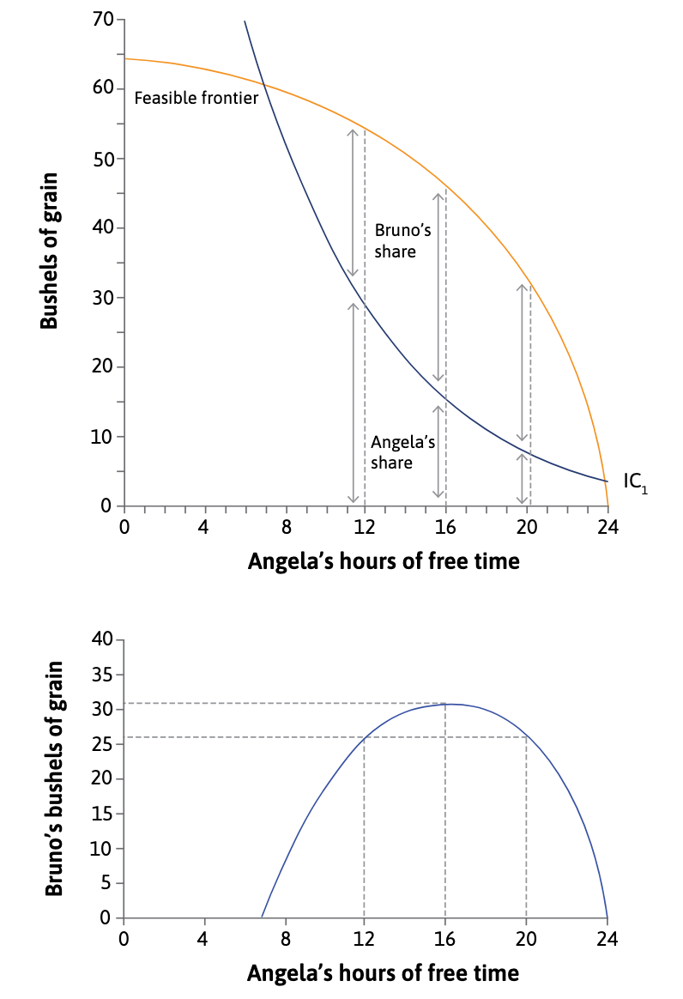
```
]

---
.pull-left[
### Case 1: Forced labour

If Bruno makes Angela work 12 hours, she will produce 54 bushels of grain (point H). He can take 26 bushels (allocation J). 

But the lower panel shows that he could do better by increasing her free time. 

The slope of the feasible frontier—$MRT$ at H—is less than the slope of $IC_1$—$MRS$ at J.

]

.pull-right[
```{r}

```
]

---
.pull-left[
### Case 1: Forced labour

If Angela works for four hours, she produces 33 bushels of grain and Bruno can take 26 bushels (allocation L). 


But the lower panel shows that he could do better by reducing her free time. The $MRT$ at K is higher than the $MRS$ at L.

]

.pull-right[
```{r}
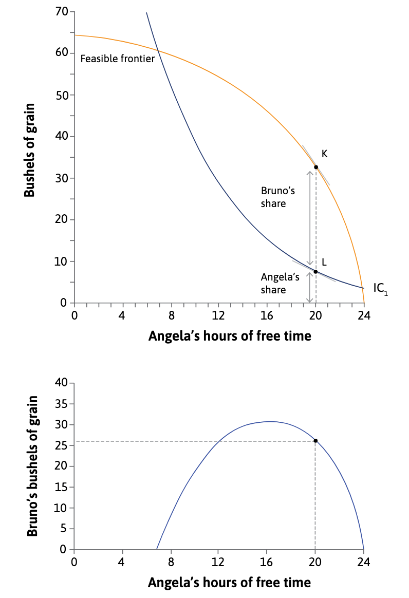
```
]

---
.pull-left[
### Case 1: Forced labour

Bruno will get the most grain at allocation D, where he commands Angela to work eight hours, producing 46 bushels of grain (point A). 

At 16 hours of free time, $MRS = MRT$. Bruno would keep 31 bushels of grain, and give Angela the remaining 15 bushels.

]

.pull-right[
```{r}
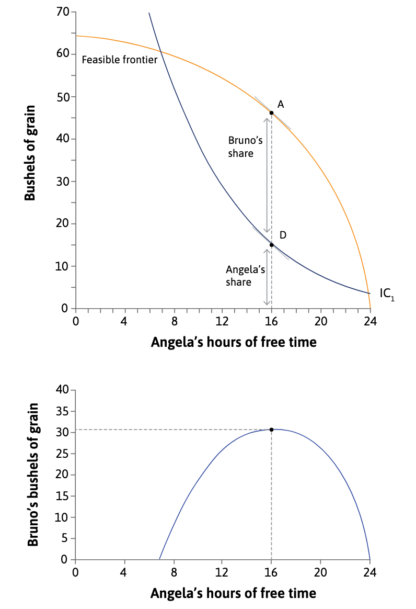
```
]


---
.pull-left[
### Case 1: Forced labour

**Economic rent**: the benefit someone gets compared to their next best alternative.

$\rightarrow$ Angela receives no rent: the outcome is on her reservation indifference curve

$\rightarrow$ Bruno receives economic rent if he receives any grain at all

Allocation D is **unfair**, but **Pareto efficient**.

]

.pull-right[
```{r}

```
]

---
### Case 1: Forced labour

Final outcomes

| | | |
|-------------------------------------|-------|-------|
| Angela’s hours of free time         | 16    |       |
| Angela’s bushels of grain           | 15    |       |
| | | |
| Bruno’s bushels of grain            | 31    |       |
| | | |
| Angela’s economic rent (bushels)    | 0     | She gets the same utility as in her best alternative (disobeying). |
| Bruno’s economic rent (bushels)     | 31    | His best alternative is 0 (if Angela disobeys). |

---
.center2[
# Case 2: A take-it-or-leave-it contract
]

---
### Case 2: A take-it-or-leave-it contract

Bruno owns the land that Angela works on to produce grain.

The government protects Angela from being forced to work, as well as Bruno’s property rights as a landowner.

The legal system will enforce contracts between Bruno and Angela

--

**Contracts**: written or spoken agreements that are intended to be enforced by law. For a contract to be valid, both parties have to agree voluntarily, and both are required to provide something.

---
### Case 2: A take-it-or-leave-it (employment) contract

**An employment contract**: Bruno can specify Angela’s hours of work, and the wage (in bushels of grain) that she will be paid.

Take-it-or-leave-it offer: she does not have the option to ask for different terms of employment. 

If she rejects, she would leave Bruno’s land and find other work. 

Her reservation option is the utility she would receive in this alternative.

---
.pull-left[
### Case 2: A take-it-or-leave-it (employment) contract

The feasible frontier is the same as in Case 1.

But Angela’s reservation indifference curve is higher: it is $IC_2$ rather than $IC_1$ Bruno’s feasible set of allocations is smaller.
]

.pull-right[
```{r}
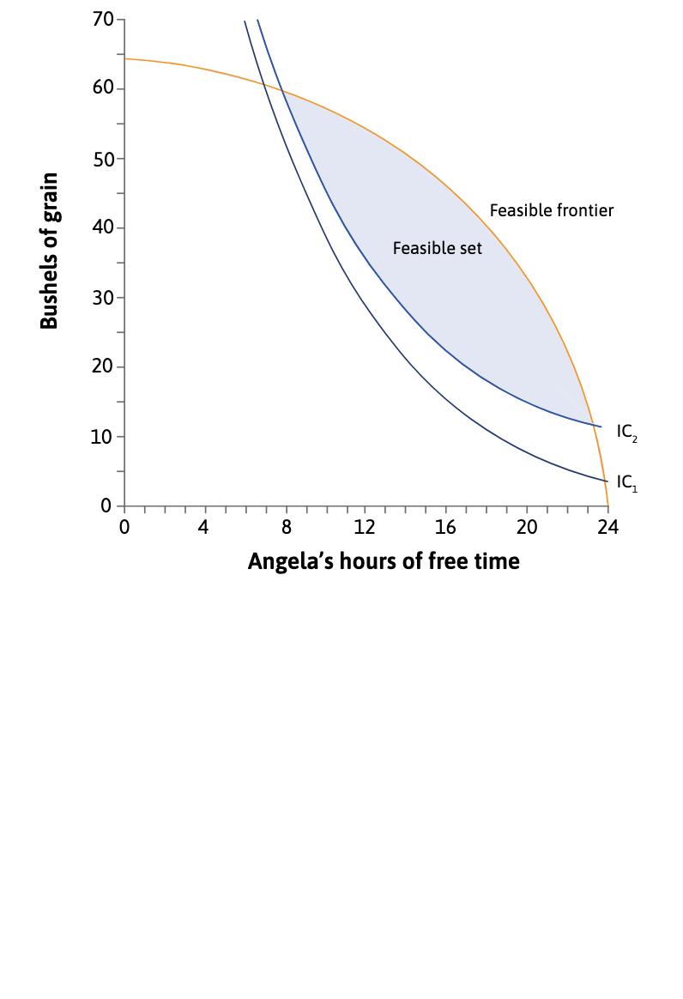
```
]

---
.pull-left[
### Case 2: A take-it-or-leave-it (employment) contract

Suppose that Bruno asks Angela to work for 12 hours, to produce 54 bushels of grain. 

To maximize his own amount of grain, he will choose the wage that gives her reservation utility. He will pay her 36 bushels, and make a profit of 18 bushels.
]

.pull-right[
```{r}
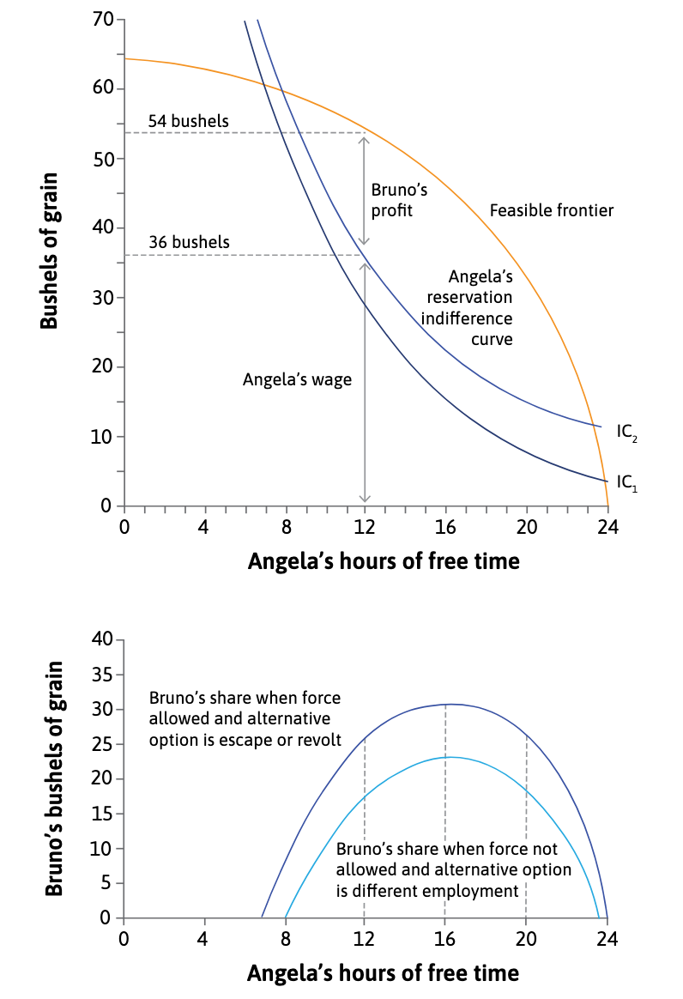
```
]

---
.pull-left[
### Case 2: A take-it-or-leave-it (employment) contract

Whatever the level of working hours, Bruno will choose the wage so that he gets the whole amount of grain between $IC_2$ and the feasible frontier.


]

.pull-right[
```{r}
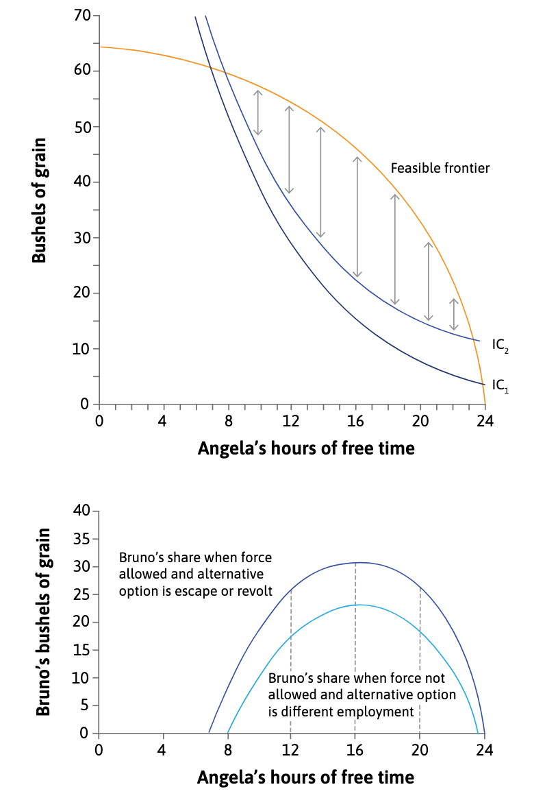
```
]

---
.pull-left[
### Case 2: A take-it-or-leave-it (employment) contract


Bruno gets the most grain where the slope of Angela’s reservation indifference curve is the same as the slope of the feasible frontier $MRS = MRT$.

He offers a contract specifying eight hours of work, and a wage of 23 bushels.

]

.pull-right[
```{r}
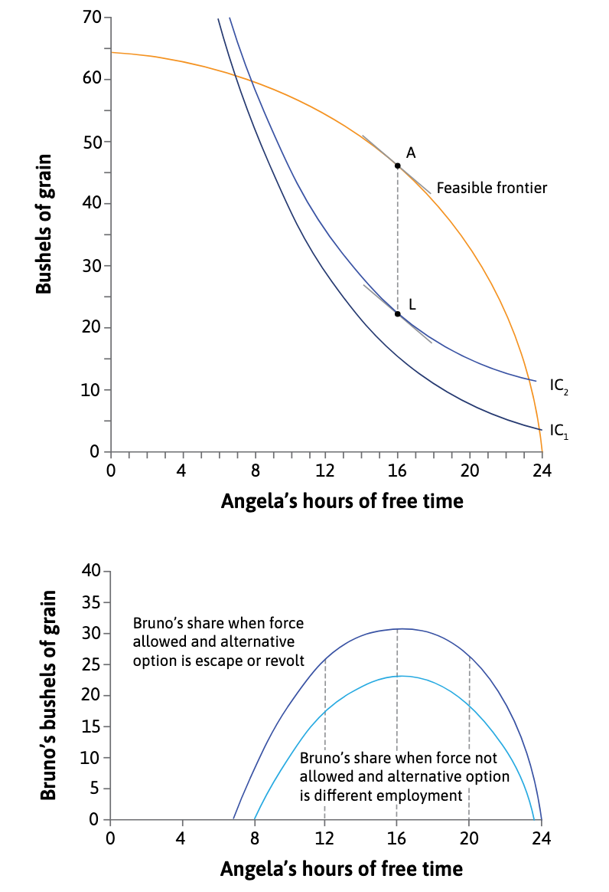
```
]

---
### Case 2: A take-it-or-leave-it (employment) contract

Final outcomes

| | | |
|-------------------------------------|-------|-------|
| Angela’s hours of free time         | 16    |       |
| Angela’s bushels of grain           | 23    |       |
| | | |
| Bruno’s bushels of grain            | 23    |       |
| | | |
| Angela’s economic rent (bushels)    | 0     | She gets the same utility as in her best alternative (disobeying). |
| Bruno’s economic rent (bushels)     | 23    | His best alternative is 0 (if Angela disobeys). |


---
.center2[
# Case 3: Bargaining in a democracy
]

---
### Case 3: Bargaining in a democracy

In the final situation, Bruno owns the farm and Angela is Bruno’s employee.

Bruno’s property rights and Angela’s right not to agree to a contract are protected by law.

Now, Angela is a voter and is free to seek change in the legal institutional arrangements, together with other farmworkers.

---
### Case 3: Bargaining in a democracy

Suppose that Angela and others who work on neighbouring farms lobby the government to improve their conditions.

They want:
 - working hours for farm labourers restricted to four and a half hours per day
 - to get at least 23 bushels of grain
 
Angela, and other workers, will vote for the political party that agrees to implement their demands. 

They use their ability as voters to make legislative demands on the government, thereby influencing their employment contracts.

---
### Case 3: Bargaining in a democracy

```{r out.width="40%"}
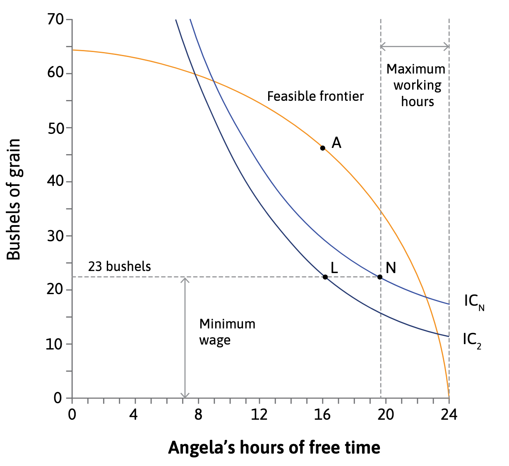
```

Under the new law, landowners must offer a wage of at least 23 bushels for no more than four and a half hours of work. 

Angela’s reservation utility has risen: her contract must be at least as good for her as N. $IC_N$ is her new reservation indifference curve.

---
### Case 3: Bargaining in a democracy

```{r out.width="40%"}
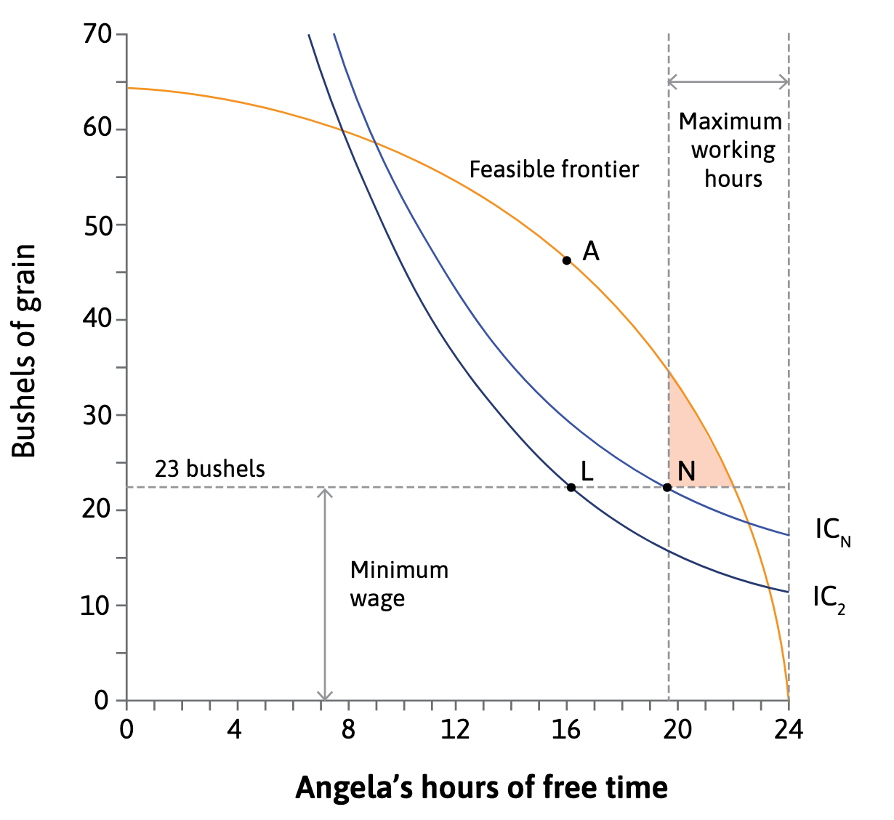
```

Bruno must offer a contract in the shaded area: 

on or below the feasible frontier, with no more than four and a half working hours and a wage of at least 23 bushels. He can no longer choose allocation L.

---
### Case 3: Bargaining in a democracy

```{r out.width="40%"}
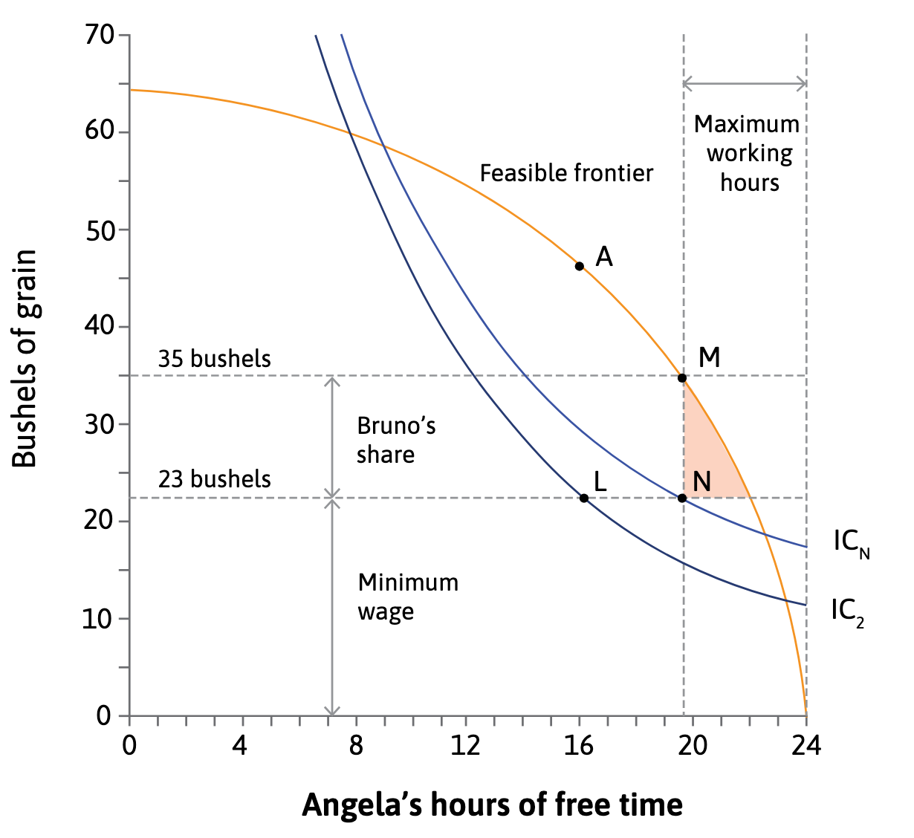
```

Within the shaded area, Bruno gets the most grain at allocation N. Angela produces 35 bushels (point M) and he gets 12.

---
### Case 3: Bargaining in a democracy

```{r out.width="40%"}
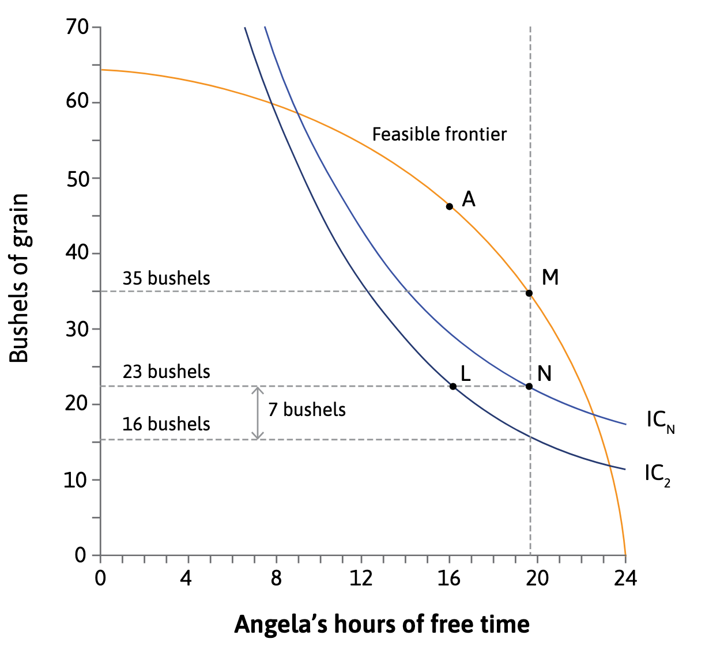
```

Under contract N, Angela gets the same wage as in contract L, but more free time. 

This contract puts her on her new reservation indifference curve $IC_N$, seven bushels above $IC_2$. Measured in terms of grain, her utility is seven bushels higher.


---
### Case 3: Bargaining in a democracy

Final outcomes

| | | |
|-------------------------------------|-------|-------|
| Angela’s hours of free time         | 19.5    |       |
| Angela’s bushels of grain           | 23    |       |
| | | |
| Bruno’s bushels of grain            | 12    |       |
| | | |
| Angela’s economic rent (bushels)    | 0     | She gets the same utility as in her best alternative (disobeying). |
| Bruno’s economic rent (bushels)     | 12    | His best alternative is 0 (if Angela disobeys). |

---
### Case 3: Bargaining in a democracy - Negotiating to a Pareto-efficient sharing of the surplus

Angela has an opportunity to do better still, because allocation N is not Pareto efficient: there are other allocations that both parties would prefer to N.

--

```{r out.width="40%"}
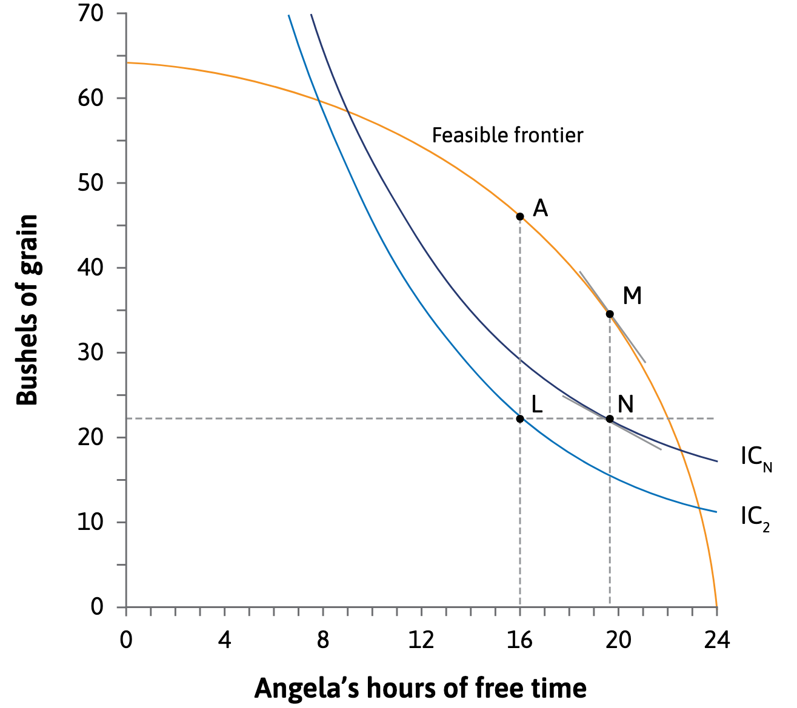
```

Because Angela’s $MRS < MRT$ at N, reducing her free time and giving her extra grain can create a Pareto improvement that makes both her and Bruno better off.

---
### Case 3: Bargaining in a democracy - Negotiating to a Pareto-efficient sharing of the surplus

```{r out.width="45%"}
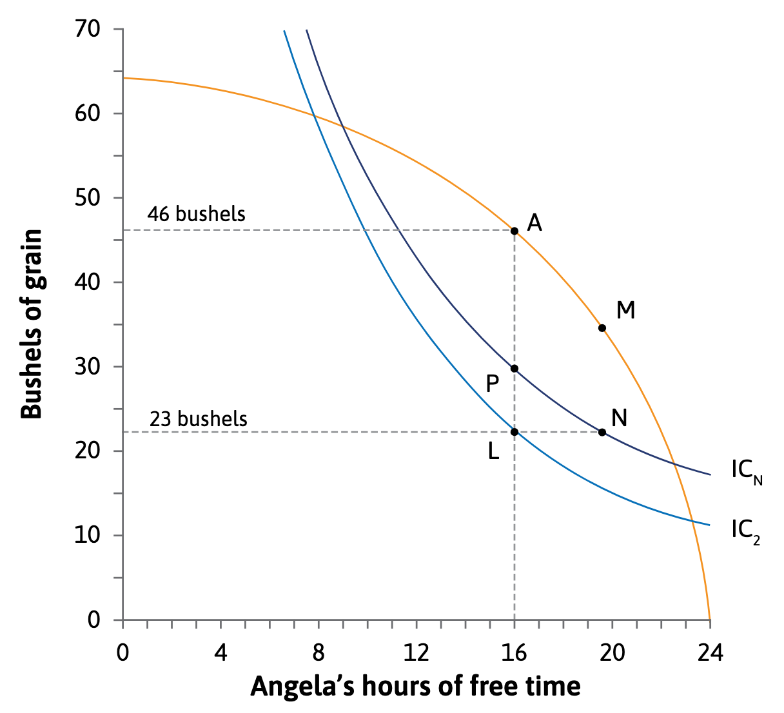
```

The total surplus is maximized when Angela has 16 hours of free time ($MRT = MRS$), generating 16 extra bushels compared to contract N.

---
### Case 3: Bargaining in a democracy - Negotiating to a Pareto-efficient sharing of the surplus

```{r out.width="45%"}
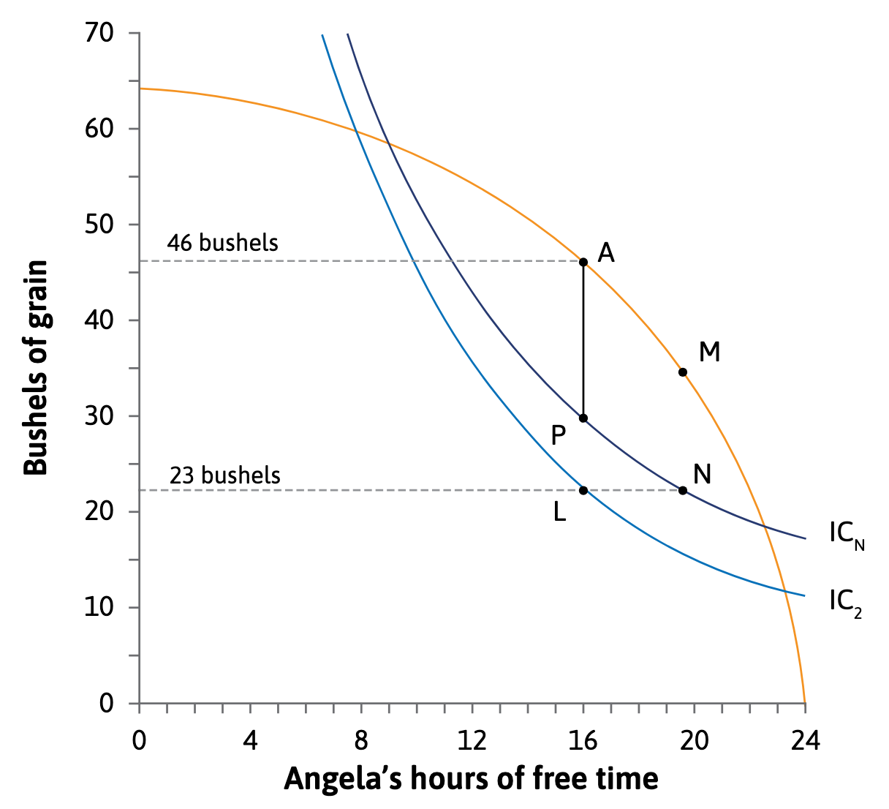
```

Allocations between P and A lie on higher indifference curves than N, so Angela is strictly better off along that segment.

---
### Case 3: Bargaining in a democracy - Negotiating to a Pareto-efficient sharing of the surplus

```{r out.width="45%"}
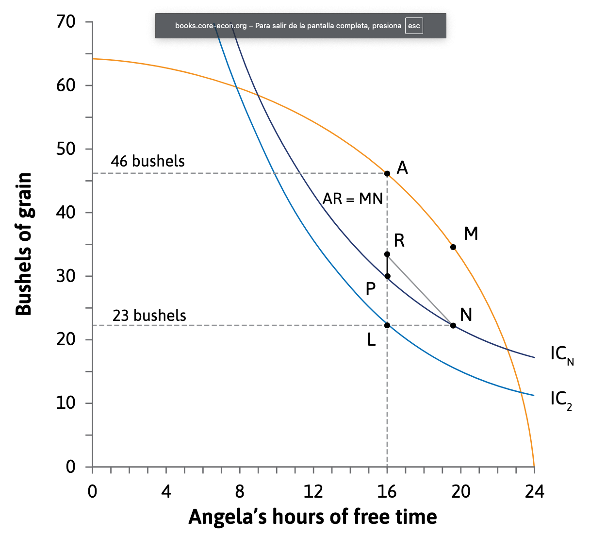
```

Bruno would accept any point between R and P that gives him at least the same rent as N, since these yield him a surplus equal to or greater than contract N.

---
### Case 3: Bargaining in a democracy - Negotiating to a Pareto-efficient sharing of the surplus

```{r out.width="45%"}
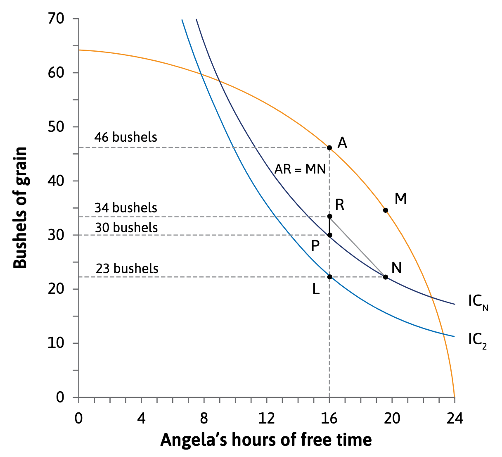
```

Angela proposes allocation R, which gives Bruno his N-level rent while giving her four extra bushels compared to P, improving her payoff.

---
### Case 3: Bargaining in a democracy - Negotiating to a Pareto-efficient sharing of the surplus

```{r out.width="45%"}
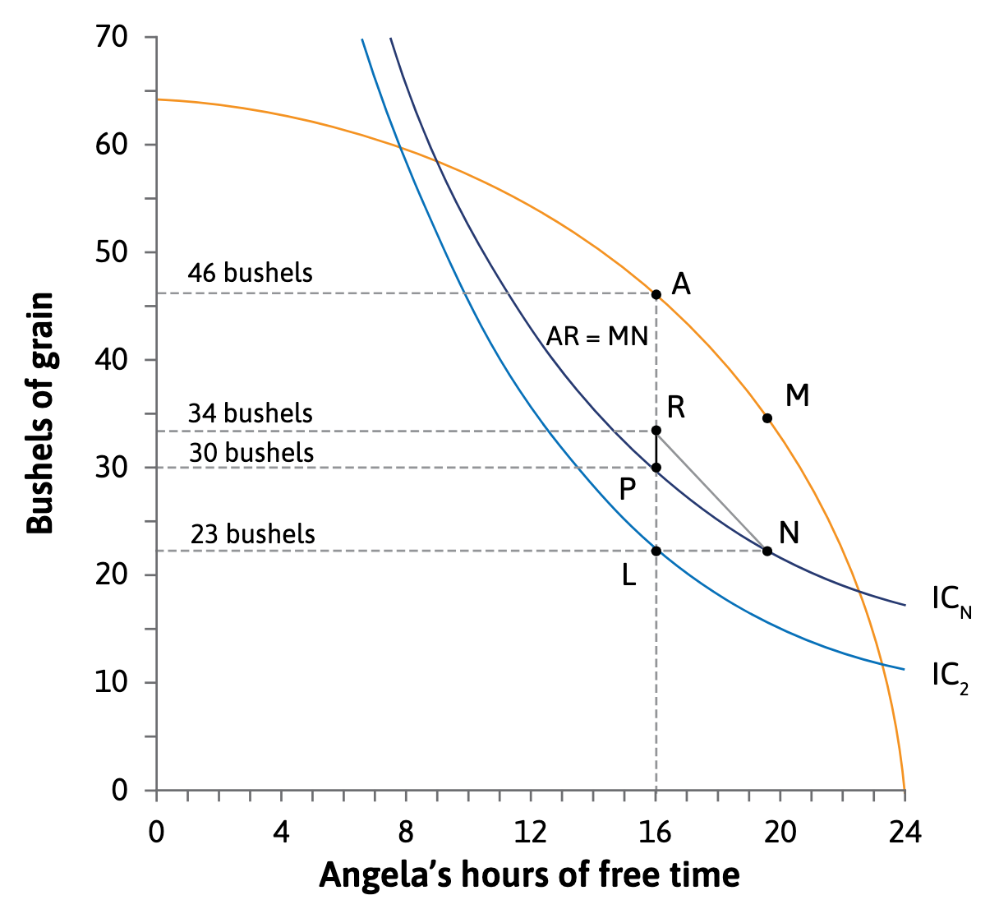
```

Angela and Bruno agree to split the gains from moving to 16 hours of free time, settling halfway between P and R so both benefit relative to N.


---
### Case 3: Bargaining in a democracy - Negotiating to a Pareto-efficient sharing of the surplus

|                                   | Case 2: Contract L | Case 3: Contract N | Case 3: Outcome |
|-----------------------------------|--------------------|---------------------|------------------|
| Angela’s free time                | 16 hours           | 19.5 hours          | 16 hours         |
| Angela’s income                   | 23 bushels         | 23 bushels          | 32 bushels       |
| Bruno’s income                    | 23 bushels         | 12 bushels          | 14 bushels       |
| Angela’s change in utility        | +7 bushels         | —                   | +2 bushels       |
| Bruno’s change in utility         | −11 bushels        | —                   | +2 bushels       |

---
### Pareto efficiency, and the Pareto efficiency curve

There are many **Pareto-efficient allocations** that could result from the interaction between Angela and Bruno.

- The MRT on the feasible frontier is equal to the MRS on Angela’s indifference curve.
- No grain is wasted: all the grain produced is consumed by Angela or Bruno.

--

```{r out.width="40%"}
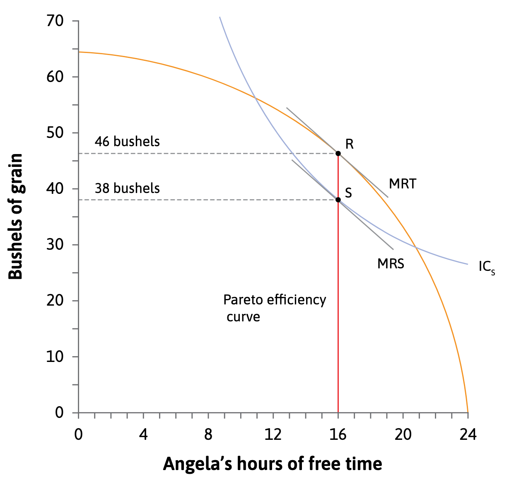
```

The set of all Pareto-efficient allocations is called the **Pareto efficiency curve**⁠.


---
.center2[
# The impact of institutions on efficiency and fairness
]

---
.pull-left[
## The impact of institutions on efficiency and fairness

]

.pull-right[
```{r out.width="95%"}
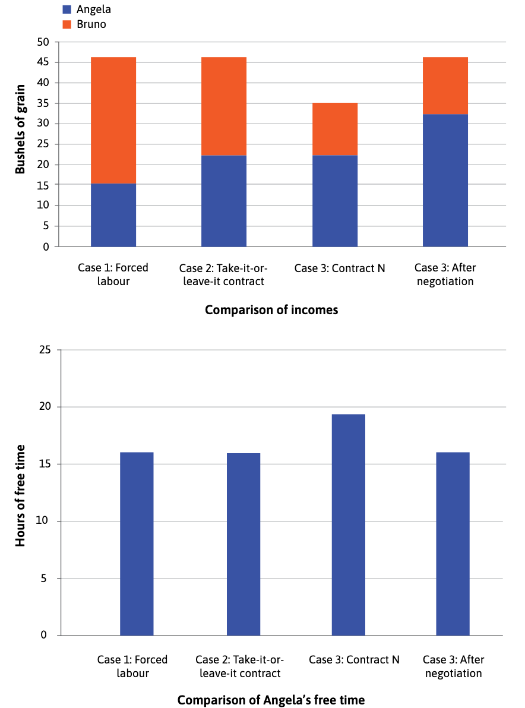
```
]

---
.pull-left[
## The impact of institutions on efficiency and fairness

- Power can produce Pareto-efficient but highly unfair outcomes when one side dictates the allocation and captures the entire surplus.

- Political influence can yield fairer distributions, but these may be Pareto-inefficient, creating a fairness–efficiency trade-off.

- Inclusive institutions that enable bargaining and enforce agreements can achieve outcomes that are both fair and Pareto-efficient.
]

.pull-right[
```{r out.width="95%"}

```
]

---
.center2[
# The distribution of income: Endowments, technology, and institutions
]

---
## The distribution of income: Endowments, technology, and institutions

```{r out.width="85%"}
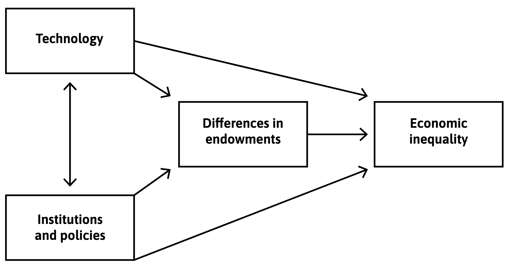
```

---
## The distribution of income: Endowments, technology, and institutions

```{r out.width="95%"}
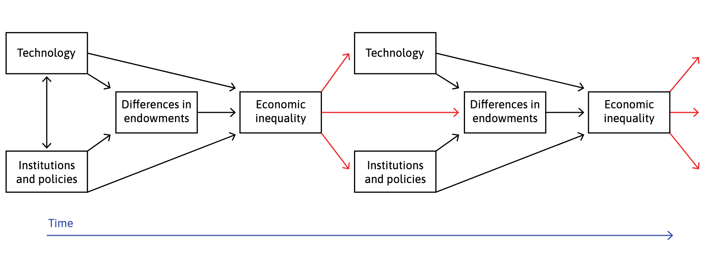
```

---
.center2[
# Measuring economic inequality: The Gini coefficient
]

---
.center2[
# Application: A policy to redistribute the surplus and raise efficiency
]

---
.center2[
# Application: Conflicts of interest and bargaining over wages, pollution, and jobs
]

---
.center2[
# Summary
]

