<style>

.center2 {
  margin: 0;
  position: absolute;
  top: 50%;
  left: 50%;
  -ms-transform: translate(-50%, -50%);
  transform: translate(-50%, -50%);
}

</style>

```{r meta, echo=FALSE}
library(metathis)
meta() %>%
  meta_general(
    description = "An Introduction to xaringan for Presentations: The Basics",
    generator = "xaringan and remark.js"
  ) %>% 
  meta_name("github-repo" = "spcanelon/xaringan-basics-and-beyond")
  # meta_social(
  #   title = "Sharing Your Work with xaringan &#8212; Day 1",
  #   url = "https://spcanelon.github.io/xaringan-basics-and-beyond/slides/day-01-basics.html#1",
  #   image = "https://raw.githubusercontent.com/spcanelon/xaringan-basics-and-beyond/main/slides/day-01-cover-image.png",
  #   image_alt = "Title slide for the day 1 slides of the Sharing Your Work with xaringan workshop series",
  #   og_type = "website",
  #   og_author = "Silvia Canelon",
  #   twitter_card_type = "summary_large_image",
  #   twitter_creator = "@spcanelon"
  # )
```

```{r setup, include = FALSE}
knitr::opts_chunk$set(echo = FALSE)
knitr::opts_chunk$set(out.width = "90%")
knitr::opts_chunk$set(fig.align="center")
options(htmltools.dir.version = FALSE)


options(htmltools.dir.version = FALSE)
library(knitr)
library(tidyverse)
library(fixest)
library(xaringanExtra)
# set default options
opts_chunk$set(echo=FALSE,
               collapse = TRUE,
               fig.width = 7.252,
               fig.height = 4,
               dpi = 300)
# set engines
knitr::knit_engines$set("markdown")
xaringanExtra::use_tile_view()
xaringanExtra::use_panelset()
xaringanExtra::use_clipboard()
xaringanExtra::use_webcam()
xaringanExtra::use_broadcast()
xaringanExtra::use_share_again()
xaringanExtra::style_share_again(
  share_buttons = c("twitter", "linkedin", "pocket")
)
# uncomment the following lines if you want to use the NHS-R theme colours by default
# scale_fill_continuous <- partial(scale_fill_nhs, discrete = FALSE)
# scale_fill_discrete <- partial(scale_fill_nhs, discrete = TRUE)
# scale_colour_continuous <- partial(scale_colour_nhs, discrete = FALSE)
# scale_colour_discrete <- partial(scale_colour_nhs, discrete = TRUE)
```

.center2[
# Introduction
]

---

.center[
### The majority of the economy runs through firms
]

```{r out.width="100%", fig.align='center'}
knitr::include_graphics("https://images.caradisiac.com/images/4/1/2/1/194121/S8-route-de-nuit-diego-rivera-murs-et-murmures-702505.jpg")
```

---
## Firms and Markets

The upcoming **four** classes we will study the interaction between firms, labour, and markets.

- **Unit 6.** The firm and its employees

- **Unit 7.** The firm and its customers

- **Unit 8.** Supply and Demand: Markets with many buyers and sellers

- **Unit 10.** Markets successes and failures: The societal effects of private decisions

**Going from each actor to the so-called 'market equilibrium'**

---
.center2[
# The structure of the firm: Owners, managers, and workers
]

---
## The structure of the firm: Owners, managers, and workers

**Firm:** Business rganizations with a decision-making process and ways of imposing decisions on the people in them.

--

- Employ people

- Purchase inputs to produce market goods and services

- Set prices greater than the cost of production

> “The firm in a capitalist economy is a miniature, privately owned, centrally planned economy.” R. Coase

---
## The structure of the firm: Owners, managers, and workers

```{r out.width="85%", fig.align='center'}
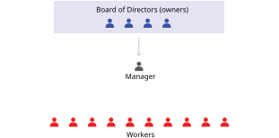
```

The owners, through their board of directors, decide the firm’s long-term strategies: how, what, and where to produce.

---
## The structure of the firm: Owners, managers, and workers

```{r out.width="85%", fig.align='center'}

```

The owners, through their board of directors, direct the manager(s) to implement these decisions.

---
## The structure of the firm: Owners, managers, and workers

```{r out.width="85%", fig.align='center'}
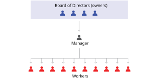
```

Each manager assigns workers to the tasks required for these decisions to be implemented.

---
## The structure of the firm: Owners, managers, and workers

```{r out.width="85%", fig.align='center'}
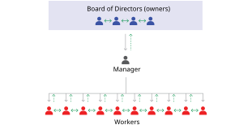
```

Workers often know things that managers do not, and managers know things that owners do not.

---
## The structure of the firm: Owners, managers, and workers

```{r out.width="85%", fig.align='center'}

```

**asymmetric information**: Information that is relevant to the parties in an economic interaction, but is known by some but not by others.

---
## Interactions in firms vs in markets

In a capitalist economy, the division of labour is coordinated in two ways: firms and markets.

--

Coordination within firm differs from coordination via markets (see Coase vs Marx 'debate'):

.pull-left[

Concentration of economic power in the hands of the owners/managers allows them to issue commands to workers

```{r out.width="80%", fig.align='center'}
knitr::include_graphics("https://i0.wp.com/diazvillanueva.com/wp-content/uploads/2017/01/primer-plan-quinquenal-urss.jpg?fit=800%2C558&ssl=1")
```

]

.pull-right[

Power is decentralized in (some) markets (structures), so decisions are autonomous and voluntary.

```{r out.width="100%", fig.align='center'}
knitr::include_graphics("https://d3h1lg3ksw6i6b.cloudfront.net/media/image/2024/02/09/24caa9788bfa491ea81ca2aae93f8a7f_marche-aligre.jpg")
```

]

---
## Contracts and relationships in firms vs in markets

Firms and markets differ in the contracts that form the basis of exchange.

**Contract:** a legal document or understanding that specifies a set of actions that parties to the contract must undertake.

--

.pull-left[

- Contracts for **products** sold in markets **permanently transfer ownership** of the good from the seller to the buyer.

- Contracts for **labour** temporarily **transfer authority over a person’s activities** from the employee to the manager or owner.
  - **employment contracts are incomplete**: they can’t specify or enforce all the behaviors and decisions that matter—like effort, work quality, quitting, or firing.
]

.pull-right[
```{r out.width="100%"}
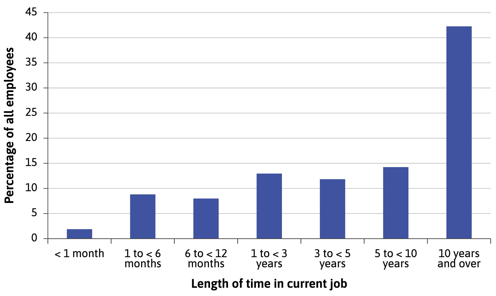
```
]

---
## Other people’s money: The separation of ownership and control

Owners, managers, and employees all benefit from the firm’s success.

But they differ over how its gains should be divided (working conditions, managerial privileges, and decision-making authority). 

--
.center[
$\text{profit} = \text{sales revenue} - \text{input costs}$
]

The firm’s profits legally belong to the people who own the **firm’s capital goods**⁠ and other **assets**.

--

.pull-left[
```{r}
knitr::include_graphics("https://img.centrefrance.com/mLEd5oePVvTFO_4GWY4-HRULyRKteMGKwlE3vfYxuZg/rs:fit:657:438:1:0/bG9jYWw6Ly8vMDAvMDAvMDcvMjMvMTgvMjAwMDAwNzIzMTgwMQ.webp")
```
]

.pull-right[
```{r}
knitr::include_graphics("https://lh3.googleusercontent.com/p/AF1QipMmjmN9Eyw0cKt4sEMWVsxuFRswsGit51wiYtGw=s1360-w1360-h1020-rw")
```
(Visit the best taco place in Paris: [Macario](https://maps.app.goo.gl/QzdLLBTJ7bW31bkRA))
]

---
.center2[
# Finding jobs and filling vacancies
]

---
## Finding jobs and filling vacancies

.center[
<iframe src="https://www.google.com/maps/embed?pb=!4v1764072944957!6m8!1m7!1sBjNNn4k7CyvlDNC04qn5qg!2m2!1d49.26829642597588!2d-123.1046590034025!3f232.97738493929305!4f-8.095681992037242!5f0.7820865974627469" width="800" height="470" style="border:0;" allowfullscreen="" loading="lazy" referrerpolicy="no-referrer-when-downgrade"></iframe>

*Cash Corner*, Vancouver, Canada
]

---
## Finding jobs and filling vacancies


Short-term, unstable jobs usually lead to poor matches and low productivity. Precarious work leaves both workers and firms worse off.

--

The labour market is a **matching market**⁠: people on either side of the market care about who they match with on the other side.

--

.pull-left[
```{r out.width="35%"}
knitr::include_graphics("https://filecache.mediaroom.com/mr5mr_tinder_es/180178/ItsAMatch_ESES-custom_500x500.png")
```
]

.pull-right[
```{r out.width="35%"}
knitr::include_graphics("https://is1-ssl.mzstatic.com/image/thumb/PurpleSource211/v4/1e/a8/3f/1ea83f11-e4a4-bdac-88c6-c146536d48fb/3_APP_IPHONE_65_3.jpg/1284x2778bb.png")
```
]

---
## Finding jobs and filling vacancies

The labour market is a **matching market**⁠: people on either side of the market care about who they match with on the other side.

--

.pull-left[
**Workers**

- Value wages, locations, hours worked, working conditions, and non-wage amenities.

- Workers differ widely in skills, experience, and job preferences.

- Bad matches give workers little incentive to invest effort or learn new skills.

]

.pull-right[
**Firms**

- Value skills and ability.

- Build relationships with colleagues (or customers).

- Firms also differ in the conditions and benefits they offer.

- Poor matches raise monitoring costs and reduce productivity.

]

--

.center[

Turnover is costly because both sides lose relationship-specific skills and knowledge.


Good matches encourage learning, cooperation, and stable expectations.

**Both sides benefit from forming long-term relationships.**
]

---
## Employment flows: Match creation and destruction

```{r out.width="80%"}
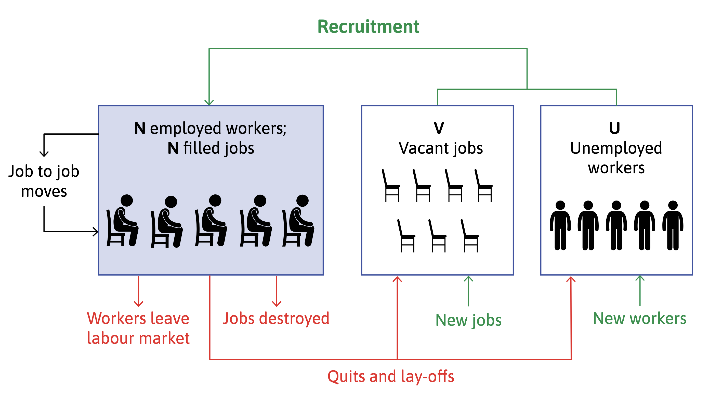
```


---
.center2[
# Managing hiring and quitting: The reservation wage curve
]

---
## Managing hiring and quitting: The reservation wage curve

How do firms and workers meet each other in the labour market? How do they decide whether to form a match?

--

An important factor in their decision is the **wage.**

--

Example: **Françoise’s Job Search Decision**

- Françoise expects to find a French-teaching job paying about **EUR 700/week**.  

--

- She compares any offer to her **reservation option**: staying unemployed and searching for something better.

--

- Her reservation option depends on:  
  - **Income while unemployed** (benefits + family support)  
  - **Non-monetary factors** (study time, family duties, boredom, anxiety, etc.)  
  - **Expected time** to find a better job  
  
--

- She sets a **reservation wage of EUR 600/week**, meaning unemployment is equivalent to a EUR 600 job.

- Therefore, **she rejects any offer below EUR 600**, such as a EUR 580 job, and chooses not to apply.

---
## Hiring and quitting

- A Paris language school employs many short-term tutors, like recent graduates, who typically remain only six to twelve months.  

- Because about **4% of tutors leave each week**, the school faces continuous turnover and must hire replacements regularly.  

- For a target staff of **50 tutors**, this means about **2 tutors leave—and must be replaced—each week** (N = 50 $\rightarrow$ 0.04 $\times$50 = 2).  

- How many new tutors the school can attract depends on how many job seekers see the vacancies and have **reservation wages low enough to accept the offered wage**.

---
## Hiring and quitting

```{r out.width="55%"}
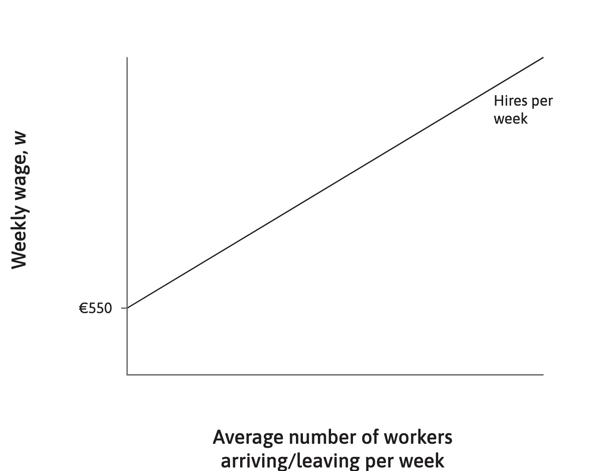
```

The **hiring line**: how many tutors the school can hire per week, depending on its wage.

---
## Hiring and quitting

```{r out.width="55%"}

```

The lowest reservation wage among all potential applicants is EUR 550. If the school offers little more than EUR 550, very few workers will accept a job offer.

---
## Hiring and quitting

```{r out.width="55%"}

```

If it raises the wage, workers with higher reservation wages will accept and it can hire more workers per week.

---
## Hiring and quitting

```{r out.width="55%"}

```

At any wage $w$, the hiring line tells us how many of the potential applicants each week have a reservation wage below $w$.

---
## Hiring and quitting

```{r out.width="55%"}
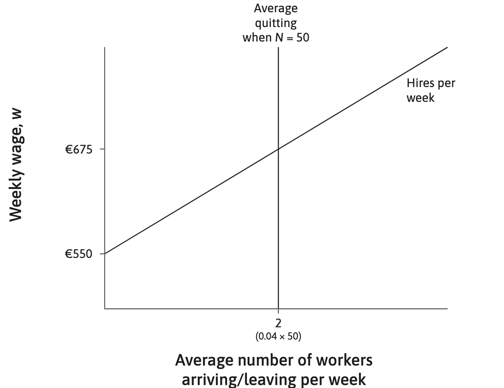
```

On average, 4% of employees quit per week. If the school employs 50 tutors, two will leave each week. The wage that enables it to hire two tutors per week is EUR 675.

---
## Hiring and quitting

```{r out.width="55%"}
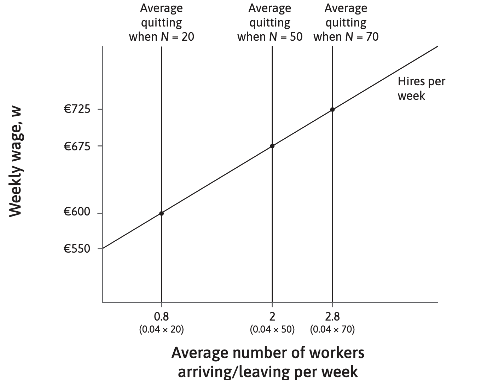
```

If 70 tutors were employed, average quits would be 2.8 per week. To maintain employment at this level, the school would need to raise the wage to EUR 725 to replace them. 

---
## Hiring and quitting

```{r out.width="55%"}

```

It could also employ 20 workers at a wage of EUR 600, because quits would be lower and it wouldn’t need as many hires per week. 


---

.pull-left[
**reservation wage curve**

If $N = 50$:
- an average of two workers per week will leave
- a wage of EUR 675 is required to replace them. 

We can plot such point ($N = 50$, $w = 675$).

$\Rightarrow$ $w$ required to employ $N$ workers

]

.pull-right[
```{r}
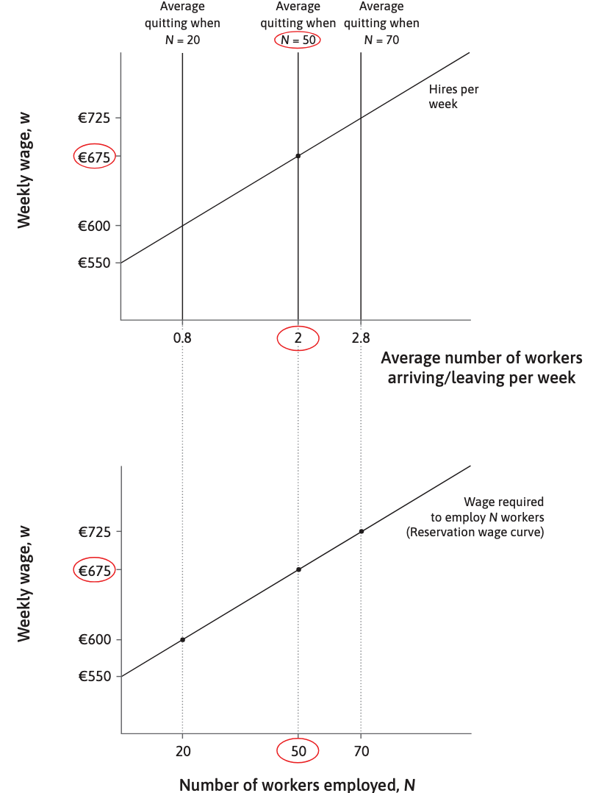
```
]

---
.center2[
# Getting the work done: Contracts, principals, and agents
]

---
## Getting the work done: Contracts, principals, and agents

Hiring is just the beginning of the story.

To make profits, owners must get the employees to work hard.

--

.pull-left[

Problem of **incomplete contracts** arises because:

- A contract cannot specify everything the employee should do in every situation.

- It is too costly or impractical for the firm to monitor all aspects of employee effort.  

- Even observable effort often cannot be written into an enforceable legal contract. 

- A contract also cannot prevent the worker from quitting.
]

.pull-right[

```{r out.width="80%", fig.align='center'}
knitr::include_graphics("https://media.giphy.com/media/xZuccZKErssvcyNDOc/giphy.gif")
```
]

As a result, **employment relationships always involve gaps that must be managed with incentives rather than complete instructions.**

---
## Principal–agent problem

A situation involving two players—the **principal** and the **agent**—whose interests do not fully align.  

--

.pull-left[
```{r out.width="100%", fig.align='center'}
knitr::include_graphics("https://media.giphy.com/media/tGO5aBtHgBWI2ukToC/giphy.gif")
```
]

.pull-right[
- In firms, the employer is the principal and the worker is the agent.  

- The principal wants the agent to work hard to maximize profit; the agent prefers less effort.  

- The challenge comes from limited information: the employer cannot perfectly observe or verify the worker’s effort.  

- This creates **asymmetric** or **non-verifiable** information, making it difficult to design a complete, enforceable contract.

]

---
## Solving the principal–agent problem

Because effort can’t be fully specified in a contract, firms must create **incentives** for employees to work hard.  

--

- One method is **piece-rate pay**, where wages depend directly on what the worker produces.  
- Piece rates are often impractical in modern knowledge and service jobs.  

A common alternative is to motivate effort by offering **employment rents**: wages above the worker’s reservation wage.

---
.center2[
# Employment rents: The cost of job loss
]

---
## Employment rents: The cost of job loss

Workers care about keeping their jobs because the value of the job (taking into account all the benefits and costs it entails) is greater than the value of the next-best option.

--

**Employment rent**: difference between the net benefit from the job, and the net benefit of being unemployed.

--

.pull-left[
**Costs of working:**

- The disutility of work

- The cost of travelling to work every day

- Childcare costs
]

.pull-right[
**Benefits of working:**

- Wage income

- Firm-specific assets

- Medical insurance

- Social status
]

---
.center2[
# Counting the cost of job loss: Rents and reservation wages
]

---
## Counting the cost of job loss: Rents and reservation wages

Let's calculate an employment rent.

--

Maria, an employee earning $12 an hour for a 35-hour working week. She evaluates two aspects:

- her pay
- her effort she puts into work

Thus, Maria's utility:

$$\text{net utility per hour} = \text{wage} - \text{disutility of effort per hour}$$
$$ = 12 - 2 = 10$$

--

To calculate her economic rent, we **compare the value of staying in her job with the value of her next best alternative option**:

Unemployed, and search for a new job

- unemployment benefit: 6
- expected weeks to find a new job: 44 weeks
- expected average net utility of next job: 9 (=11-2)
- planning horizon: 3 years (156 weeks)

---
## Counting the cost of job loss: Rents and reservation wages

```{r out.width="82%"}
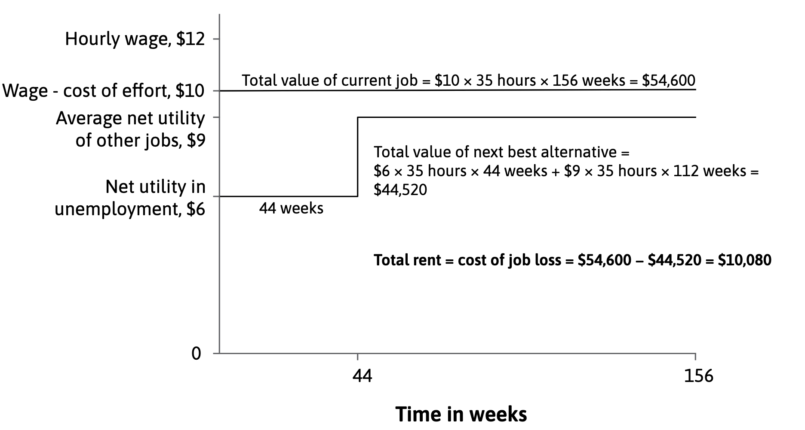
```

--

.center[
Average reservation option (per hour) $= \frac{44,520}{156 \times 35} = 8.15$ per hour = Reservation wage
]


---
## Counting the cost of job loss: Rents and reservation wages

```{r out.width="82%"}
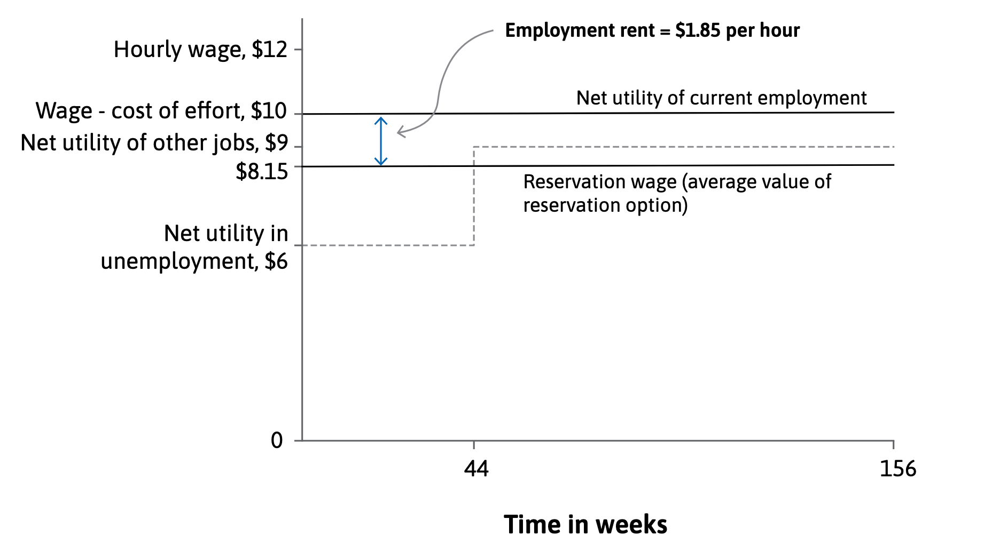
```

.center[
employment rent (per hour) $= 10.00−8.15=1.85$ per hour
]

---
## Reservation wage

- Her planning horizon is *h* weeks.  
- If unemployed, her weekly unemployment benefit is **b**.  
- Her additional net utility of being unemployed is **αᴹ** per week.  
- The average net utility in other jobs (wage minus effort cost) is **ν** per week.  
- She expects it will take **j** weeks to find another job.  

$$
w_r = \frac{j(b + \alpha^M) + (h - j)\nu}{h}
$$
--

- **τ = j/h** is the proportion of time she expects to remain unemployed.

$$
w_r = \tau(b + \alpha^M) + (1 - \tau)\nu
$$

---
.center2[
# Getting employees to work hard: The labour discipline model
]

---
## The labour discipline model

When losing a job is very costly for workers, they have a strong incentive to work hard to avoid being fired.

Employment rent increases with higher wages.

By paying higher wages, firms can motivate workers to put in more effort.

--

**Labour discipline model**: a game played by the owners and the employees

- Maria and employer
- Sequential game:
  - Stage 1: The employer sets a wage, promising continued employment at that wage if the required effort is met.
  -	Stage 2: The worker chooses how much effort to provide, balancing the effort cost against the risk of being fired if effort is too low.

---
## Maria chooses her effort

Weekly wage $w$. Maria’s reservation wage is $w_r$.

*If she exerts the required effort:* 
- Her cost of effort (the disutility of work) is $c$, and the net utility of working is $w – c$
- She keeps the job

*If she decides to exert no effort:*
- No disutility of work, so her net utility of working is $w$
- She is caught shirking (avoiding work) and she's fired

---
## Maria chooses her effort

```{r out.width="70%"}
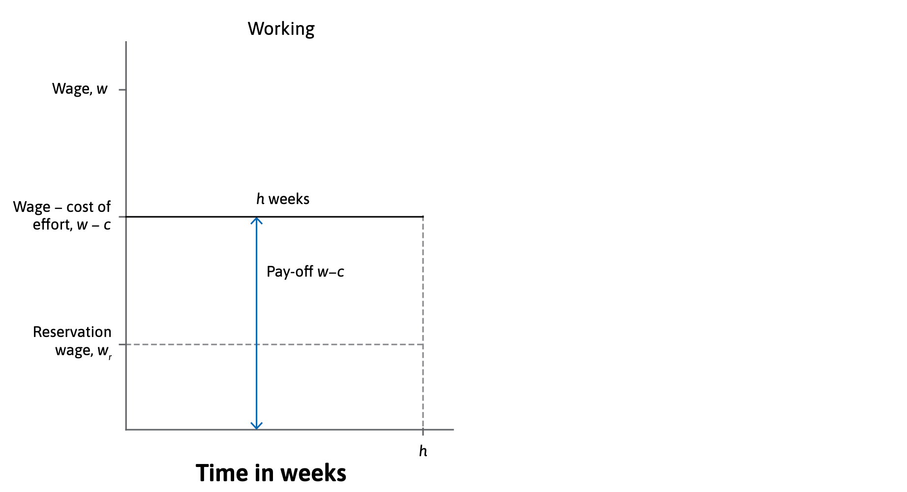
```

1) *Exert the required effort*: $w – c$ for the foreseeable future.

Total pay-off is $h(w – c)$.

---
## Maria chooses her effort

```{r out.width="70%"}
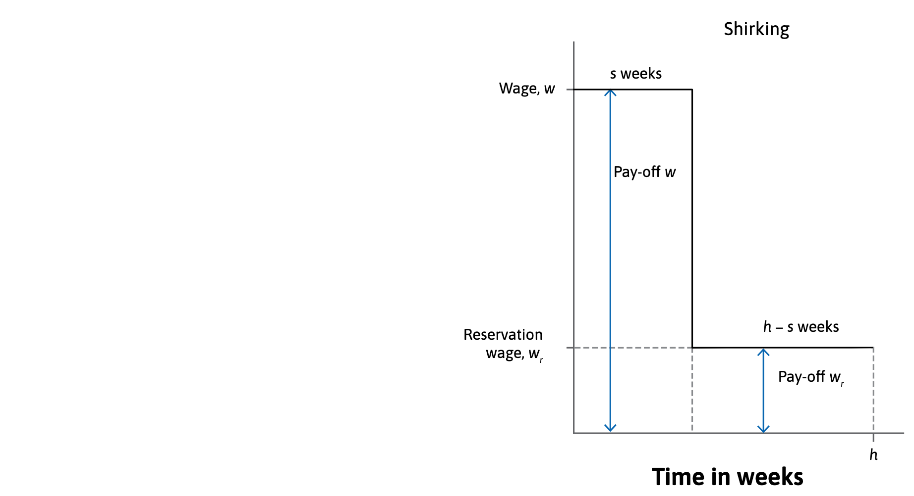
```

2) *Exert no effort*: $w$ for $s$ weeks, then become an unemployed job-searcher, with an average pay-off of $w_r$.

Total pay-off is $sw + (h – s)w_r$.

---
## Maria chooses her effort

```{r out.width="70%"}
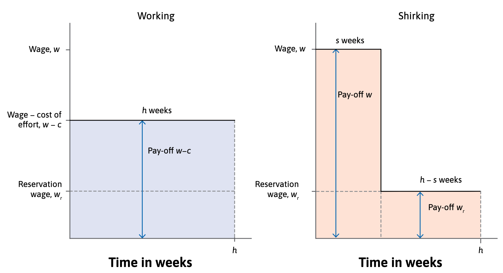
```

**no-shirking (avoiding work) condition**:
$$
\text{pay-off from working hard for } h \text{ weeks}
\;\;\ge\;\;
\text{pay-off from shirking for } s \text{ weeks until she is caught}
$$

$$
h(w - c) \;\ge\; sw \;+\; (h - s) w_r
$$

---
## The employer’s decision: what wage?

Suppose that Maria produces output of **y** per week if she works at the required level, but zero if she does not. 

The firm’s weekly profit is:

- $y − w$ if she works at the required level  
- $-w$ if she shirks and has not been caught  
- $−w$ if she is caught neglecting duties and fired (she must still be paid until the firing occurs)

--

So, the employer can only make a **positive profit** by setting the wage high enough to ensure that Maria does **not shirk**, but still **below her output y**.

---
## The employer’s decision: what wage?

To maximize profit the employer should choose the lowest wage that gives her an incentive to work hard.

--

From the no-shirking condition:

$$
h(w - c) \;\ge\; sw \;+\; (h - s) w_r \iff hw - hc \;\ge\; sw + (h - s) w_r
$$

--

$$
hw - sw \;\ge\; hc + (h - s) w_r \iff (h - s)w \;\ge\; hc + (h - s) w_r
$$

--

$$
w \;\ge\; \frac{hc}{h - s} \;+\; w_r
$$

Note: $\frac{hc}{h - s} = c \left( \frac{h}{h - s} \right) = c \left( 1 + \frac{s}{h - s} \right)$

--

So:

$$
w \;\ge\; w_r + c + \left( \frac{s}{h - s} \right)c
$$
--
**No-shirking wage**

$$
\Rightarrow  \quad w = w_r + c + \left( \frac{s}{h - s} \right)c
$$

---
.center2[
# Combining recruitment and labour discipline: The wage-setting model
]

---
## Combining recruitment and labour discipline: The wage-setting model

The wage affects:

1) the number of workers a firm can employ and
2) how hard its employees will work

---
## Combining recruitment and labour discipline: The wage-setting model

```{r out.width="60%"}
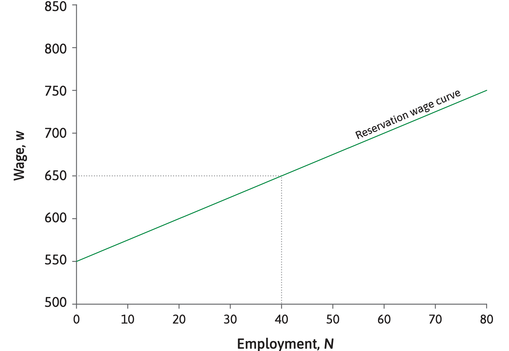
```

**Reservation wage curve**: the wage required to employ $N$ workers.

---
## Combining recruitment and labour discipline: The wage-setting model

```{r out.width="60%"}

```

To motivate effort, the wage must exceed the reservation wage—covering the cost of effort and making job loss costly $\rightarrow$ create an **employment rent**

---
## Combining recruitment and labour discipline: The wage-setting model

```{r out.width="60%"}
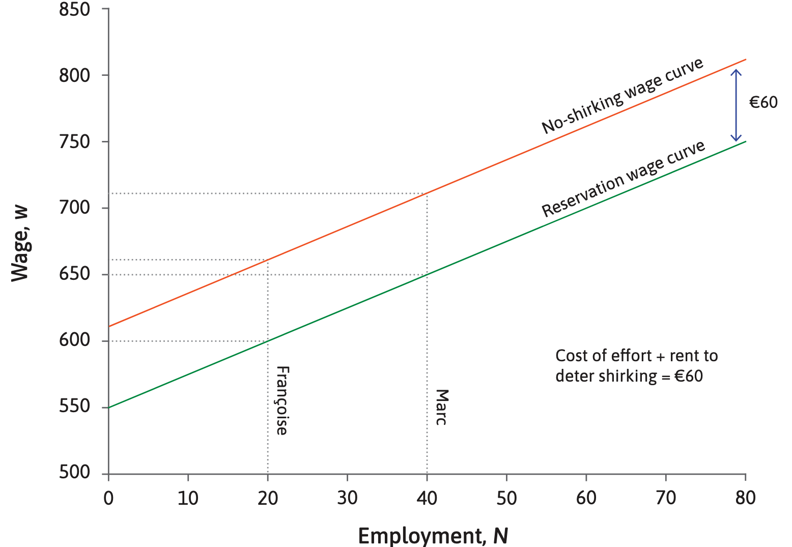
```

If the cost of effort amounts to 25 per week, and the required rent is equal to 35 per week:

$$w = w_r + 25 + 35 = w_r + 60$$

---
## Combining recruitment and labour discipline: The wage-setting model

```{r out.width="60%"}

```

**No-shirking wage curve**: lowest wage to employ $N$ workers and ensure that they work hard.

---
## Combining recruitment and labour discipline: The wage-setting model

```{r out.width="60%"}
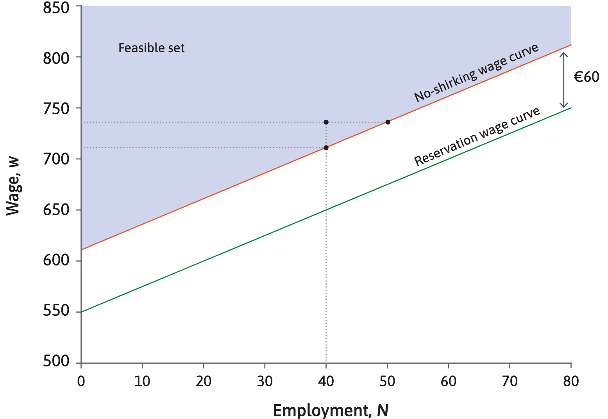
```

**Feasible set**: All points above the no-shirking wage curve allow the firm to both employ workers and elicit effort from them.

---
## Combining recruitment and labour discipline: The wage-setting model

```{r out.width="60%"}

```

If a firm wants to make profits, what wage should it set?

---
## Profit and isoprofit curves

Profits are equal to sales revenue minus input costs.

--

Assuming each tutor generates a 800 revenue per week: 

$$\text{profit per week} = (y-w)N = (800-w)N$$

Note: if $w < 800 \Rightarrow \text{profit per week} > 0$.

--

We will represent profit in a diagram by finding different combinations of w and N that give the same amount of profit.

--

**isoprofit curve**: a curve that joins together the combinations of prices and quantities of a good that provide equal profits to a firm.

---
## Profit and isoprofit curves

**isoprofit curve**: connect all combinations of wages and employment that give the firm the same profit (example = $\text{profit} = (800-w)N$)

```{r out.width="60%"}
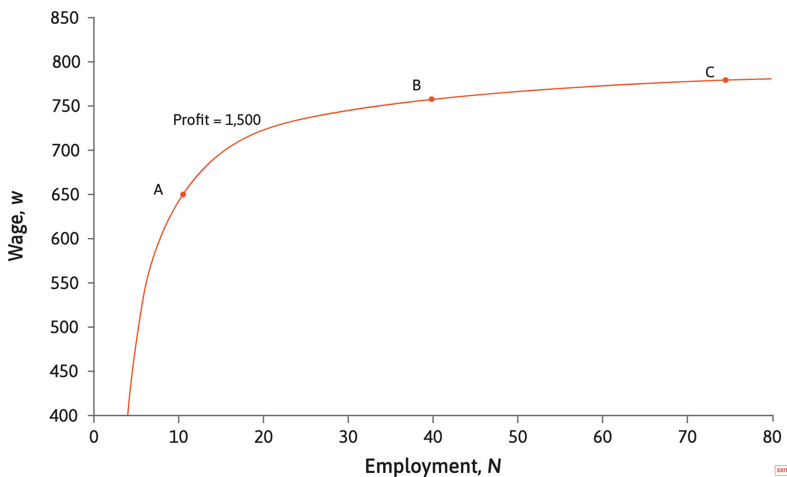
```

In the employment–wage space, an upward-sloping, concave curve connects points A (10, 650), B (40, 762.5), and C (75, 780). Every point on this curve yields a profit of 1,500.

---
## Profit and isoprofit curves

**isoprofit curve**: connect all combinations of wages and employment that give the firm the same profit (example = $\text{profit} = (800-w)N$)

```{r out.width="60%"}
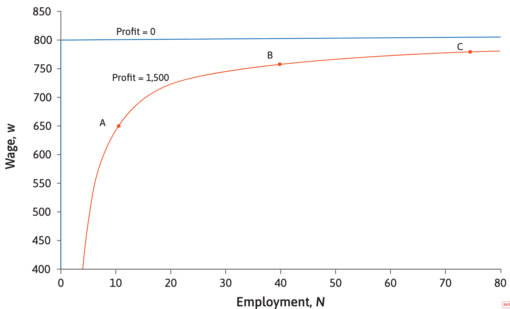
```

If the wage is 800, profit per tutor is zero, so for all values of N, total profit is zero. Also, profit is zero when $N = 0$. 

---
## Profit and isoprofit curves

**isoprofit curve**: connect all combinations of wages and employment that give the firm the same profit (example = $\text{profit} = (800-w)N$)

```{r out.width="60%"}
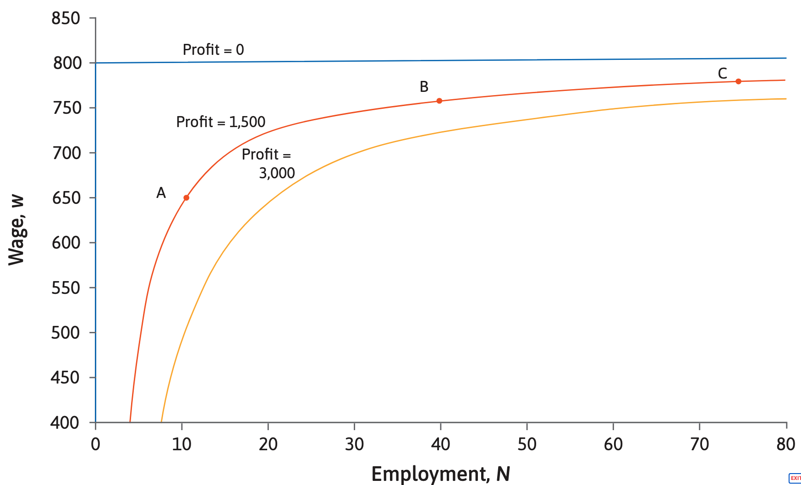
```

The yellow curve joins all the $(N, w)$ combinations where profit is 3,000.

---
## Profit and isoprofit curves

**isoprofit curve**: connect all combinations of wages and employment that give the firm the same profit (example = $\text{profit} = (800-w)N$)

```{r out.width="60%"}
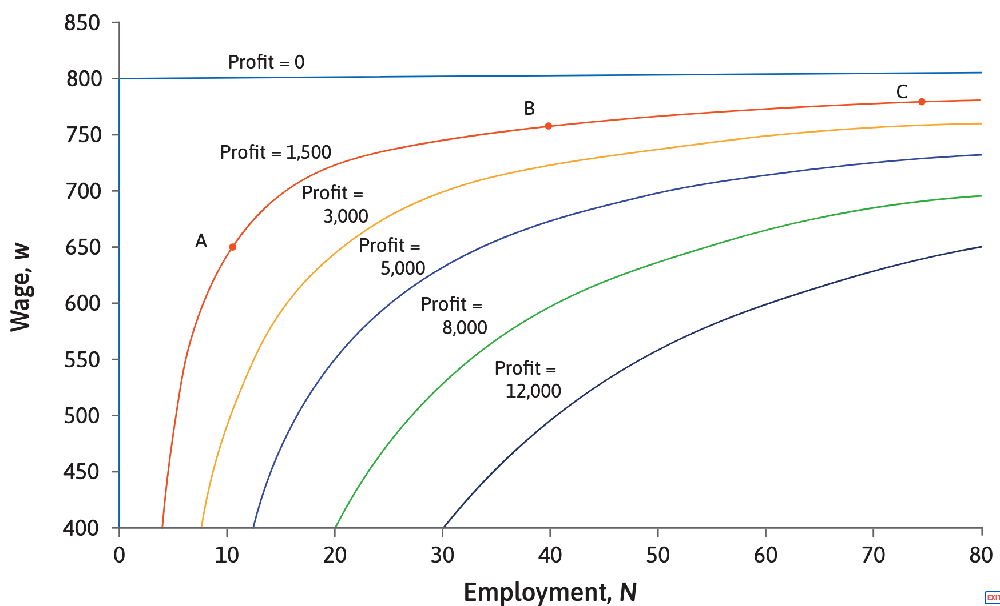
```

Isoprofit curves with higher levels of profit are closer to the bottom right of the diagram, where $N$ is higher, and $w$ is lower.

---
## Profit and isoprofit curves

**isoprofit curve**: connect all combinations of wages and employment that give the firm the same profit (example = $\text{profit} = (800-w)N$)

```{r out.width="60%"}

```

Firm’s 'indifference curves'⁠: the firm is indifferent between combinations of w and N giving the same level of profit.

---
## Maximizing profit

Profit is high when $N$ is high and $w$ is low. 

But not all combinations of $N$ and $w$ are feasible. 

Which is the best?

--

```{r out.width="60%"}
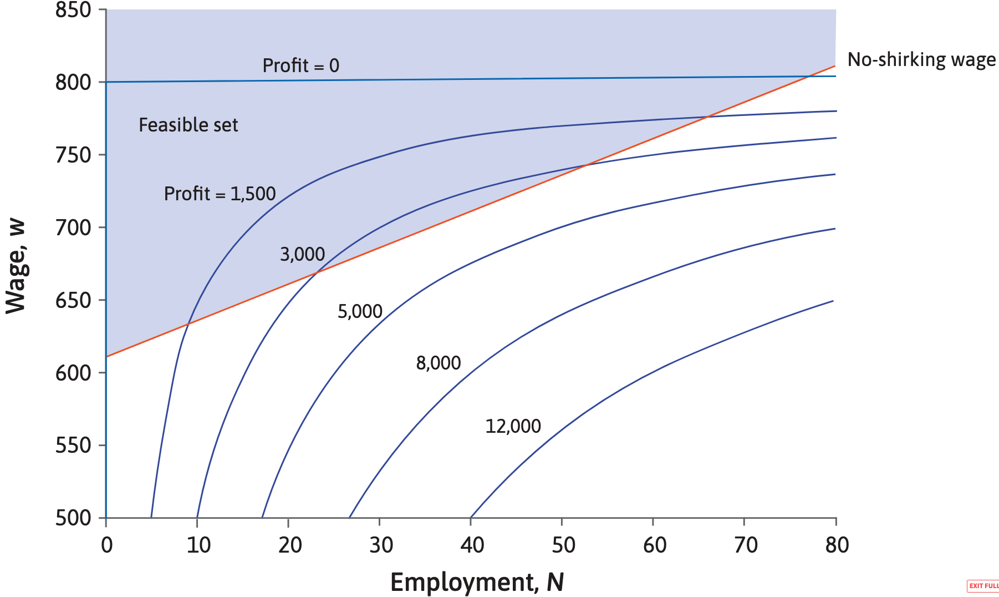
```

---
## Maximizing profit

Profit is high when $N$ is high and $w$ is low. 

But not all combinations of $N$ and $w$ are feasible. 

Which is the best? $\Rightarrow$ point E, where $w = 705$ and $N = 38$ such that total profit is 3,610

```{r out.width="60%"}
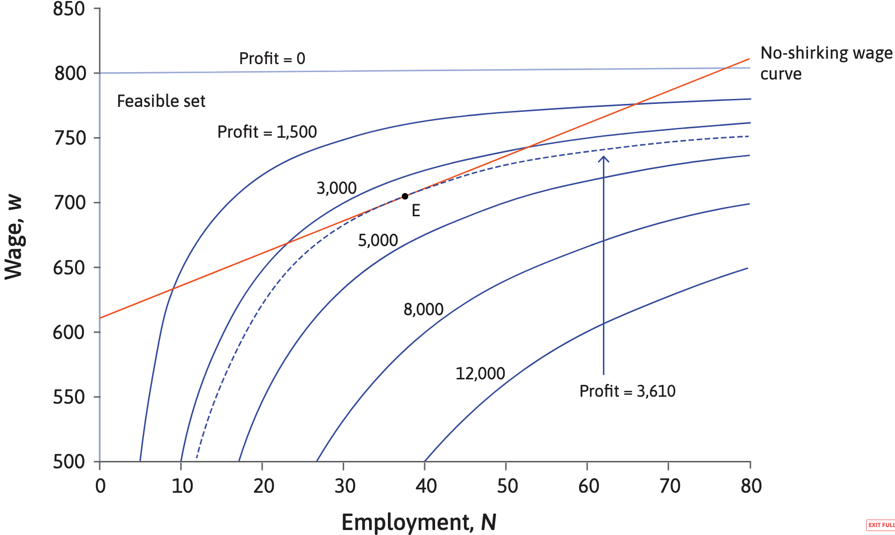
```

---
## Maximizing profit

**Check Extension 6.10**

See in particular:  
[*Solving the firm’s constrained choice problem*](https://books.core-econ.org/the-economy/microeconomics/06-firm-and-employees-10-wage-setting-model.html#solving-the-firms-constrained-choice-problem)

We will work through this type of exercise in the TD to prepare for the final exam.


---
.center2[
# Wages, employment, and the rate of unemployment
]

---
## Wages, employment, and the rate of unemployment

Can this model help us explain: Why is there always unemployment, even when the economy is booming? 

.center[
<iframe src="https://ourworldindata.org/grapher/unemployment-rates-in-selected-oecd-countries-?time=1980..latest&tab=line" loading="lazy" style="width: 80%; height: 450px; border: 0px none;" allow="web-share; clipboard-write"></iframe>
]

---
## Wages, employment, and the rate of unemployment

Distinguish two types of unemployment:

1) Unemployment resulting from search and matching costs is known as **frictional unemployment** or **search unemployment**. 

2) When firms set wages to provide incentives for effort, there must always be **involuntary unemployment**.

---
## Wages, employment, and the rate of unemployment

Involuntarily unemployed: not having a job, although you would be willing to work at the wage that other workers like you are receiving

.pull-left[
- The firm sets a wage $w_1$ high enough to prevent shirking and hires only the $N_1$ workers whose reservation wages are below $r_1$.  
- Workers with reservation wages between $r_1$ and $w_1$ would accept the job but are not hired, so they remain **involuntarily unemployed**.
]

.pull-right[
```{r out.width="100%"}
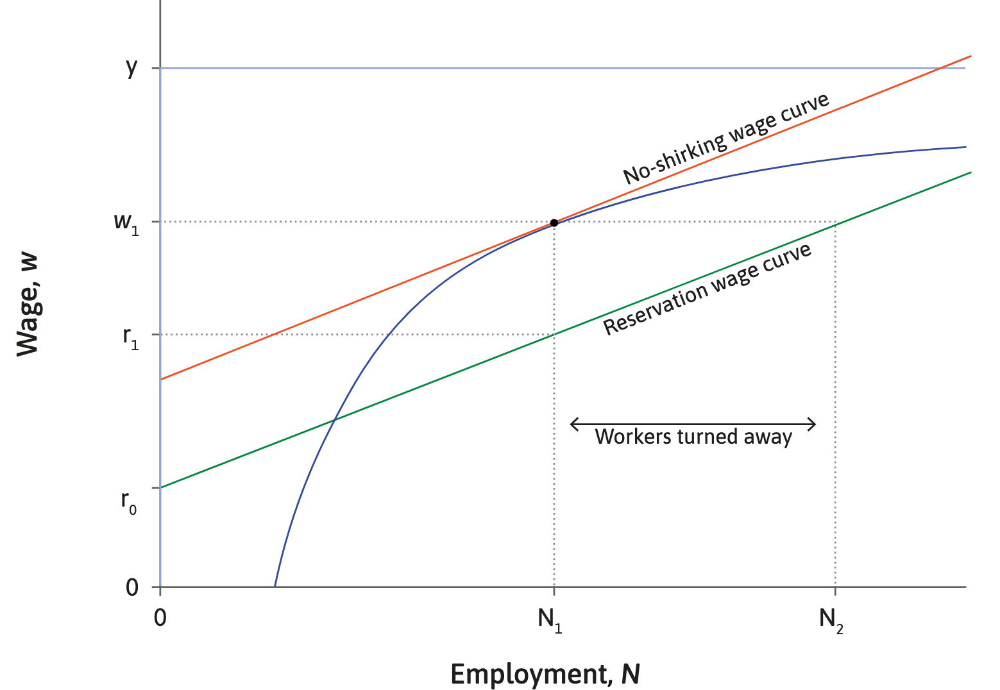
```
]

---
## What happens when economic conditions change?

Changes in economic conditions can shift the no-shirking wage curve.

--

**Reservation wage curve** $w_r$: reflects the utility a worker expects while unemployed versus the utility they expect once re-employed.  

- While unemployed, they receive $b$ plus their own utility of being unemployed, $a^N$, which varies across individuals.  
- $\nu$ is the average utility they would get in a job.  
- $\tau$ is the fraction of their planning horizon they expect to spend unemployed.  

$$w_r = \tau(b + a^N) + (1 - \tau)\nu$$

The more time they expect to be unemployed (higher $\tau$), the more the reservation wage reflects the value of unemployment rather than job utility.

--

**No-shirking wage curve:** $w$ must lie above the reservation wage to cover both the cost of effort ($c$) and the employment rent needed to deter shirking.

$$w = w_r + c + rent(c,s)$$

--

$$
w = \tau(b + a^N) + (1 - \tau)\nu + c + \text{rent}(s, c)
$$


---
## What happens when economic conditions change?

$$
w = \tau(b + a^N) + (1 - \tau)\nu + c + \text{rent}(s, c)
$$

.pull-left[
```{r out.width="100%"}
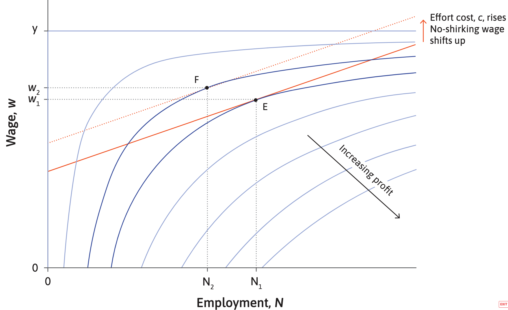
```
]

.pull-right[
**What shifts the no-shirking wage curve?**

- **Better monitoring** (lower $s$): workers are caught shirking more quickly, reducing the rent needed; the curve shifts **down**.

- **Lower morale / higher effort cost** (higher $c$): workers need stronger incentives; the curve shifts **up**.  

- **Stronger outside labour demand** (higher $\nu$): reservation wages rise, so the firm must pay more to deter shirking; the curve shifts **up**.
]

---
## How employers exercise power

In Unit 5 we analyzed power. Economic actors might:

1. Set the terms of an exchange (**market power**)
2. Inflict large penalties on others who don’t comply with their wishes (**‘power over others’**)

--

Employers in our model of wage setting exercise both kinds of power:

- *The power to control wages*: By hiring fewer workers, they can pay lower wages.
- *Power over others*: They can get workers to work hard by threatening to terminate their employment if they do not.

The firm’s power to hold down wages by restricting employment is called **labour market power**⁠, or sometimes **monopsony power**⁠.


```{r out.width="30%"}
include_graphics("https://s30311.pcdn.co/wp-content/uploads/2024/12/walmart-employees-1024x576.png")
```


---
## Application: The minimum wage

Governments in many countries set a legal minimum hourly wage, in order to protect the living standards of low-paid workers.

--
.pull-left[
A heated political (and economics) debate.

```{r}

```

```{r}

```

]

.pull-right[
```{r out.width="70%"}
include_graphics("https://www.liberation.fr/resizer/v2/O62B4DYYVFCHPOIU7ABXHZWITI.png?smart=true&auth=f1ed0ebff75d1bd62e808787fc7780f76cae08e1613591614ab5c565ada37ce0&quality=100&width=1024")
```
]


---
## Application: The minimum wage

.center[
<iframe width="800" height="455" src="https://www.youtube.com/embed/99ZTpN5R3mk?si=Hg4jgMB04GdATCfM" title="YouTube video player" frameborder="0" allow="accelerometer; autoplay; clipboard-write; encrypted-media; gyroscope; picture-in-picture; web-share" referrerpolicy="strict-origin-when-cross-origin" allowfullscreen></iframe>
]

---
## Application: The minimum wage

The firm maximizes profit within its feasible set at point E. It employs 50 workers, at a wage $w_0$. 

```{r out.width="55%"}
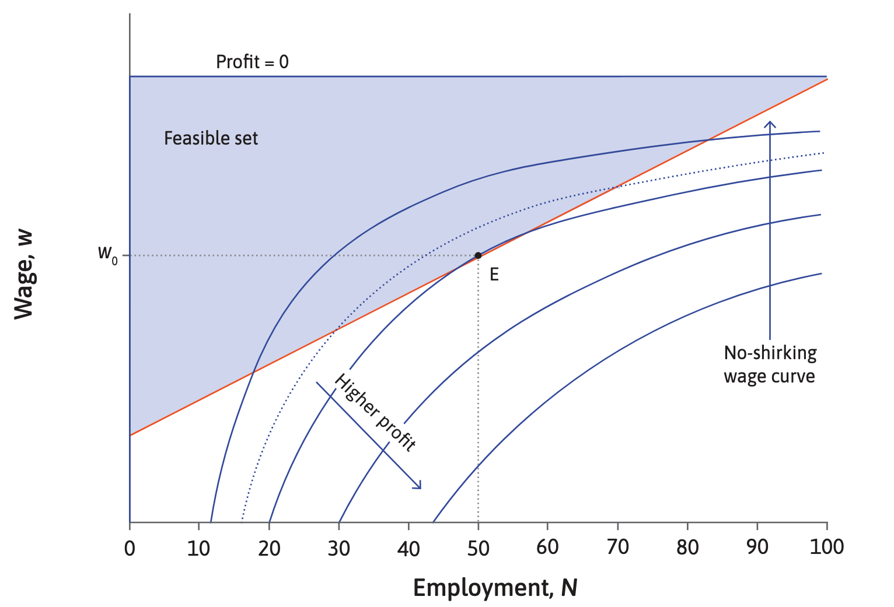
```

What happens if the government introduces a minimum wage?

---
## Application: The minimum wage

The firm maximizes profit within its feasible set at point E. It employs 50 workers, at a wage $w_0$. 

```{r out.width="55%"}
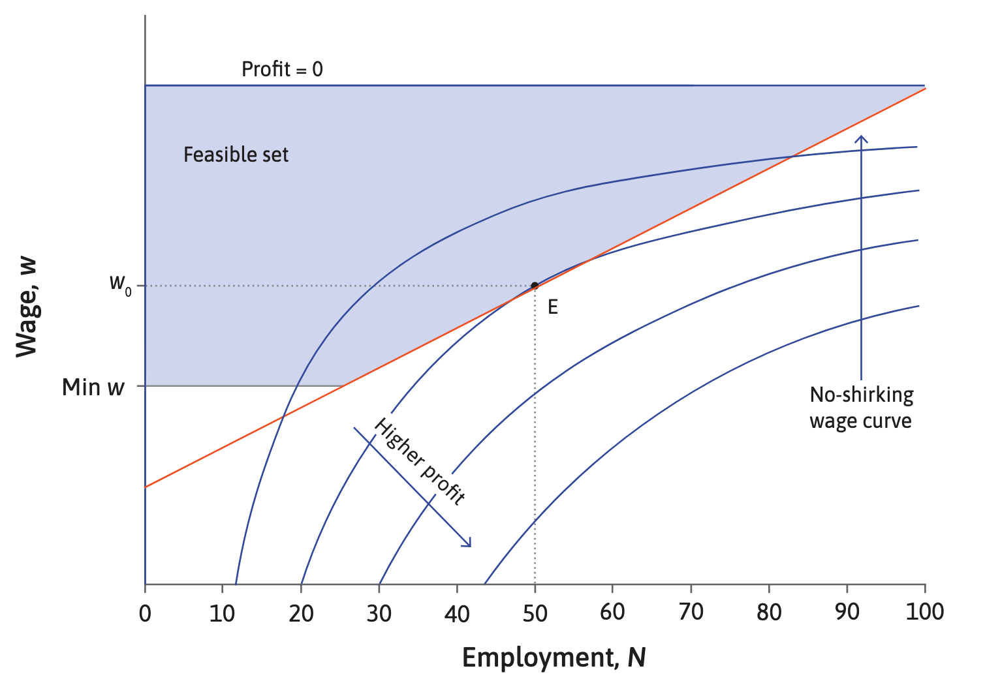
```

The minimum wage shrinks the firm’s feasible set: it can no longer set very low wages. But if the minimum wage is below $w_0$, it has no effect on this firm. 

---
## Application: The minimum wage

The firm maximizes profit within its feasible set at point E. It employs 50 workers, at a wage $w_0$. 

```{r out.width="55%"}
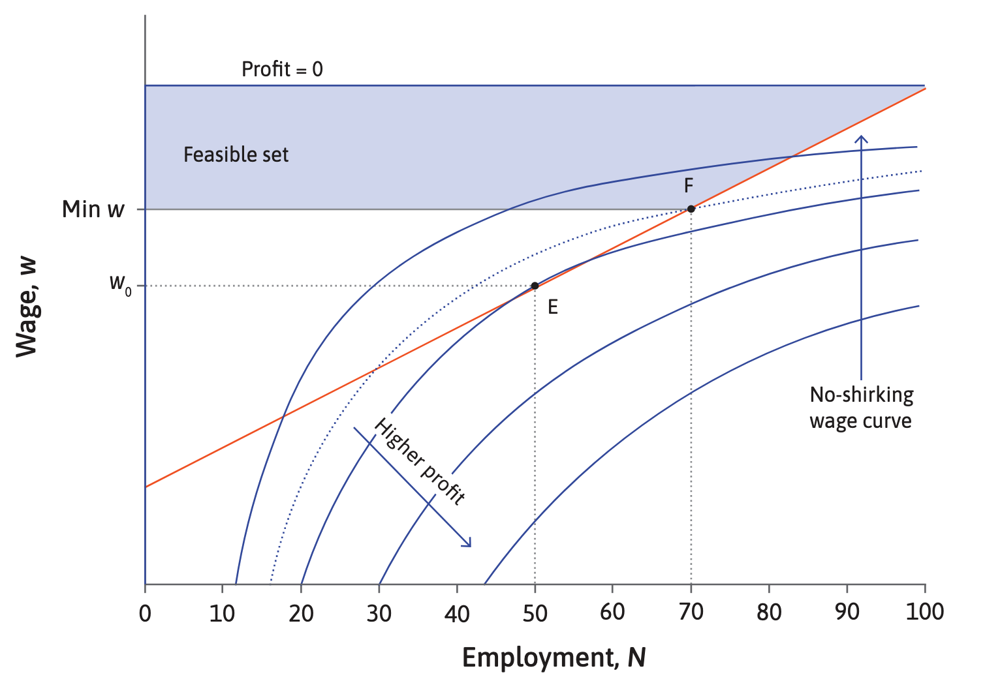
```

If the minimum wage is above $w_0$, point E is no longer feasible. The highest profit the firm can achieve is at point F. It employs 70 workers at the minimum wage.

---
## Application: Another kind of business organization

Firms with hierarchical structures make it hard to align the incentives of owners, managers, and employees. 

They also create incentives to relocate production to lower-wage areas, often harming workers’ well-being.

--

> The relation of masters and work-people will be gradually superseded by partnership … perhaps finally in all, association of labourers among themselves. J.S. Mill (The Principles of Political Economy, 1848)

**Cooperative firm**: Workers are the owners of the capital goods and other assets of the company, and they select managers who run the company on a day-to-day basis.

---
## Application: Another kind of business organization

```{r out.width="70%"}
include_graphics("https://raw.githubusercontent.com/woomora/woomora.github.io/refs/heads/main/images/co-ops_locdev.png")
```

**Cooperative firm**: Workers are the owners of the capital goods and other assets of the company, and they select managers who run the company on a day-to-day basis.

---
## Application: Another kind of business organization

```{r out.width="70%"}
include_graphics("https://raw.githubusercontent.com/woomora/woomora.github.io/refs/heads/main/images/co-ops_locdev2.png")
```

Co-ops increase economic development in marginalized areas. 


---
.center2[
# Summary
]

---
## Summary

- **Distinctive features of employment:** wage–labour contract; long-term relationships; firm-specific assets; incomplete contracts  

- **Hiring and quitting:** reservation wages and the firm’s reservation-wage curve  

- **Employment rent:** determining the reservation wage of an unemployed worker; the labour-discipline model; the no-shirking wage  
- **Wage-setting model:** isoprofit curves and the no-shirking wage curve

