<style>

.center2 {
  margin: 0;
  position: absolute;
  top: 50%;
  left: 50%;
  -ms-transform: translate(-50%, -50%);
  transform: translate(-50%, -50%);
}

</style>


```{r setup, include = FALSE}
knitr::opts_chunk$set(echo = FALSE)
knitr::opts_chunk$set(out.width = "90%")
knitr::opts_chunk$set(fig.align="center")
options(htmltools.dir.version = FALSE)


options(htmltools.dir.version = FALSE)
library(knitr)
library(tidyverse)
library(fixest)
library(xaringanExtra)
# set default options
opts_chunk$set(echo=FALSE,
               collapse = TRUE,
               fig.width = 7.252,
               fig.height = 4,
               dpi = 300)
# set engines
knitr::knit_engines$set("markdown")
xaringanExtra::use_tile_view()
xaringanExtra::use_panelset()
xaringanExtra::use_clipboard()
xaringanExtra::use_webcam()
xaringanExtra::use_broadcast()
xaringanExtra::use_share_again()
xaringanExtra::style_share_again(
  share_buttons = c("twitter", "linkedin", "pocket")
)
# uncomment the following lines if you want to use the NHS-R theme colours by default
# scale_fill_continuous <- partial(scale_fill_nhs, discrete = FALSE)
# scale_fill_discrete <- partial(scale_fill_nhs, discrete = TRUE)
# scale_colour_continuous <- partial(scale_colour_nhs, discrete = FALSE)
# scale_colour_discrete <- partial(scale_colour_nhs, discrete = TRUE)
```

.center2[
# Intro
]

---

.center[
```{r out.width="80%", fig.align='center'}

```
]

---

.center[
```{r out.width="85%", fig.align='center'}
knitr::include_graphics("https://rtlimages.apple.com/cmc/dieter/store/16_9/R470.png?resize=2880:1612&output-format=jpg&output-quality=85&interpolation=progressive-bicubic")
```
]

---

.center[
```{r out.width="85%", fig.align='center'}
knitr::include_graphics("https://i.ytimg.com/vi/ceGZQZ8dW80/maxresdefault.jpg
")
```
]

---

.center[
```{r out.width="60%", fig.align='center'}
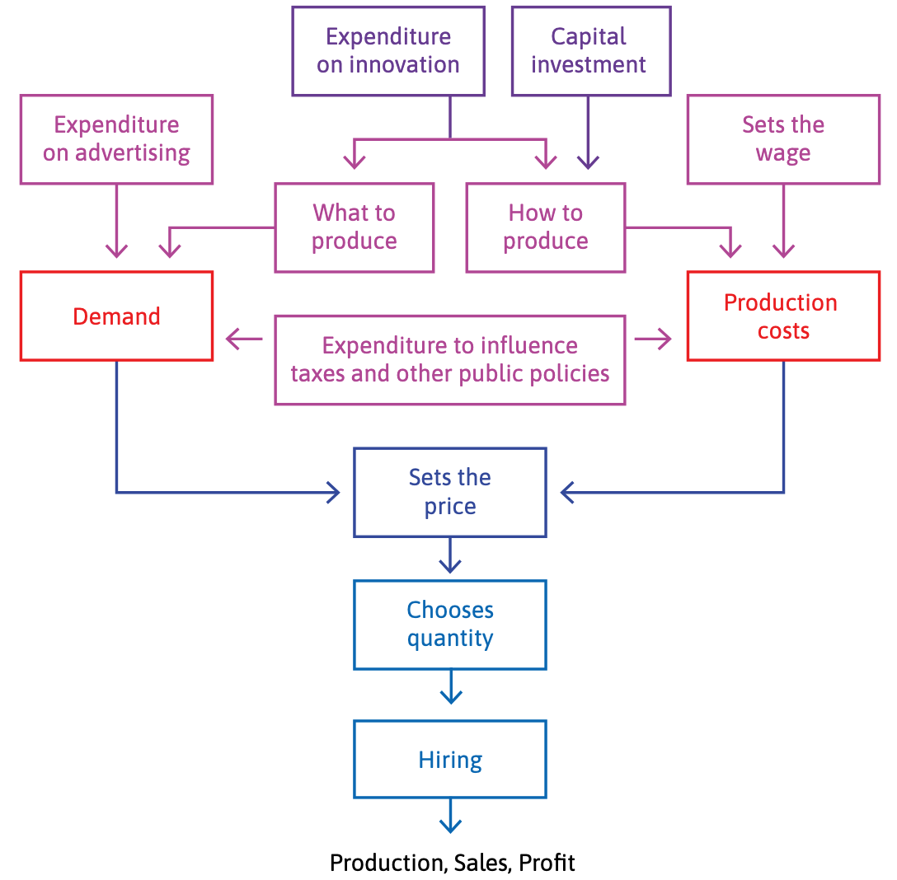
```
]

---
.center2[
# Choosing a price
]

---
## Revenue, costs, and profit

How does a firm decide what price to charge for its product?

--

**total costs**: The sum of all the costs a firm incurs to produce its total output.

$$
\text{total costs} = \text{unit cost} \times \text{quantity} = C \times Q
$$

--

**total revenue**: the number of units sold times the price per unit.

$$
\text{total revenue} = \text{price} \times \text{quantity} = P \times Q
$$

--

**profit**: the difference between the revenue received from selling a product, and the costs of producing it


$$
\text{profit} = \text{total revenue} - \text{total costs} = (P \times Q) - (C \times Q) = (P-C) \times Q
$$

---
## Revenue, costs, and profit

A firm produces and sells a brand of breakfast cereal. Suppose that the unit cost is 2. $\rightarrow \text{profit} = (P-2) \cdot Q$

--

```{r out.width="65%"}
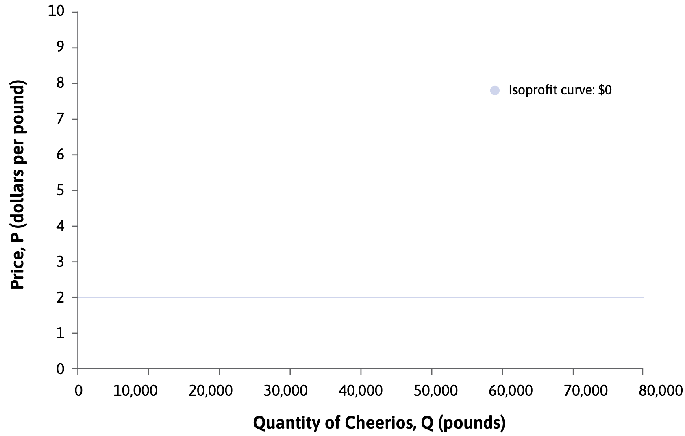
```

--

If $P=2$, each pound of cereal is sold for exactly what it cost to make. There would be no profit, whatever $Q$

---
## Revenue, costs, and profit

A firm produces and sells a brand of breakfast cereal. Suppose that the unit cost is 2. $\rightarrow \text{profit} = (P-2) \cdot Q$

```{r out.width="65%"}
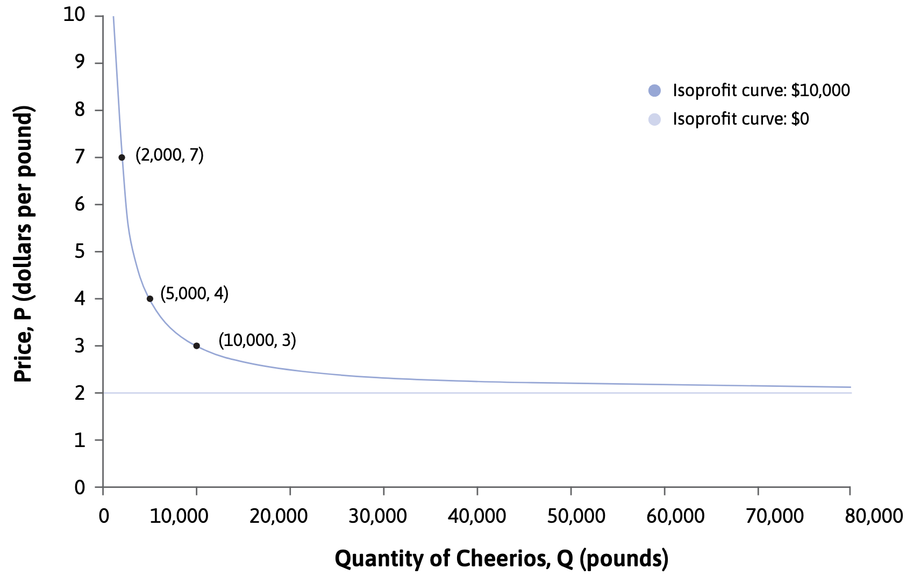
```

The curve shows all the possible ways of making $10,000 profit.

---
## Revenue, costs, and profit

A firm produces and sells a brand of breakfast cereal. Suppose that the unit cost is 2. $\rightarrow \text{profit} = (P-2) \cdot Q$

```{r out.width="65%"}
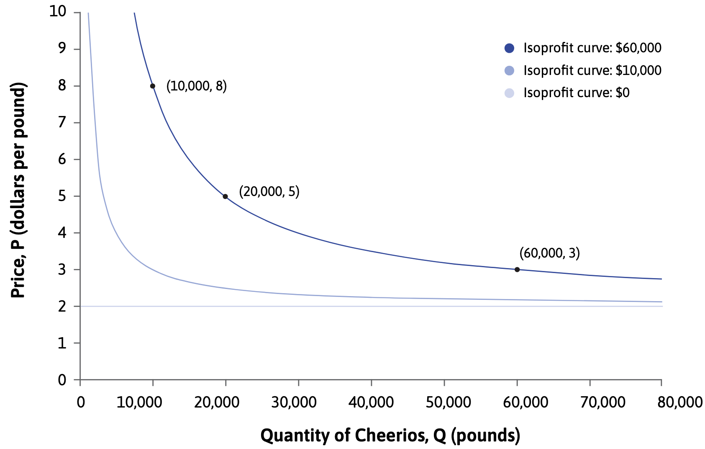
```

The new curve shows all the combinations of P and Q that give $60,000 profit.

---
## Revenue, costs, and profit

A firm produces and sells a brand of breakfast cereal. Suppose that the unit cost is 2. $\rightarrow \text{profit} = (P-2) \cdot Q$

```{r out.width="65%"}
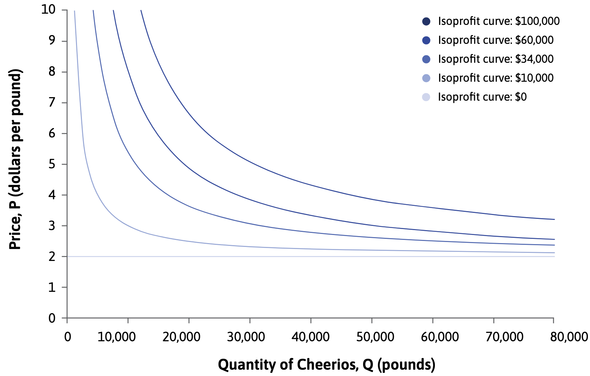
```

**isoprofit curve**: curve joinin the combinations of prices and quantities of a good that provide equal profits.

---
## Revenue, costs, and profit

A firm produces and sells a brand of breakfast cereal. Suppose that the unit cost is 2. $\rightarrow \text{profit} = (P-2) \cdot Q$

```{r out.width="80%"}
knitr::include_graphics("https://d18y50suo8qxjg.cloudfront.net/the-economy/microeconomics/images/web/figure-07-02-a.jpg")
```

Three-dimensional images show how profit varies with Q and P, with each grid point representing a (Q, P) pair and the height of the surface showing the corresponding profit.

---
## Demand

The firm wants both price and quantity to be high, but setting the price too high drives customers away.

It needs information about how much consumers are willing to pay.

--

```{r out.width="65%"}
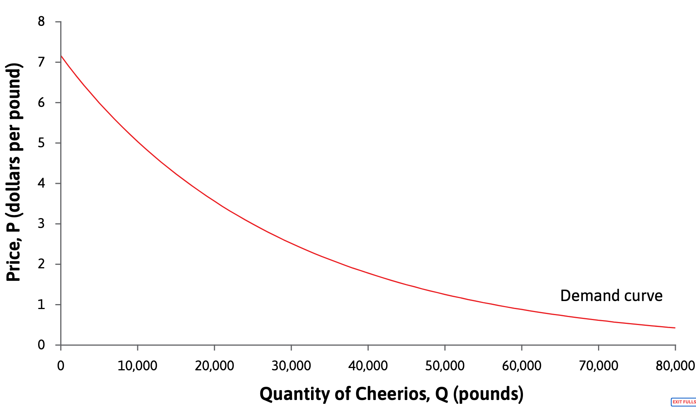
```

**demand curve**: number of units of a good that buyers would wish to buy at any given price

---
## Maximizing profit

How to choose the price? How many pounds of cereal one shold you produce?

--

```{r out.width="62.5%"}
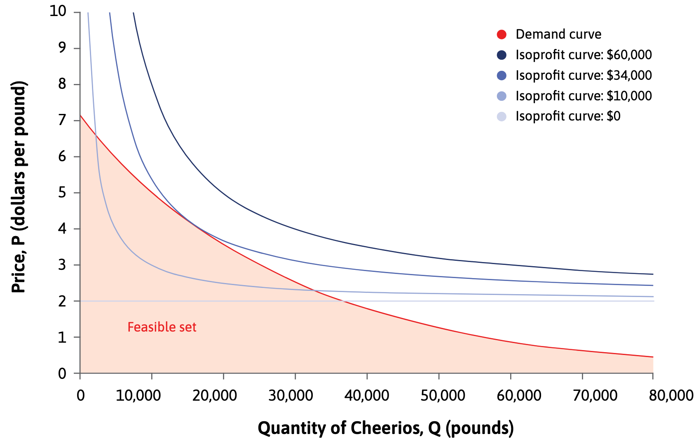
```

Find a combination of P and Q on the highest possible isoprofit curve in the feasible set.

---
## Maximizing profit

How to choose the price? How many pounds of cereal one shold you produce?

```{r out.width="62.5%"}
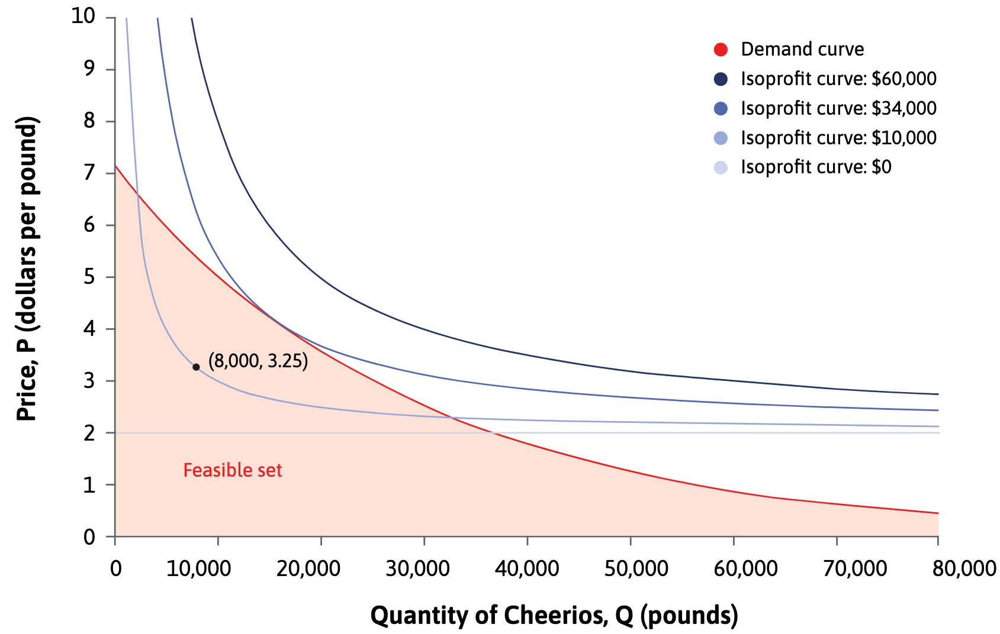
```

Any point below the demand curve is feasible, but raising the price to the curve increases profit.

---
## Maximizing profit

How to choose the price? How many pounds of cereal one shold you produce?

```{r out.width="62.5%"}
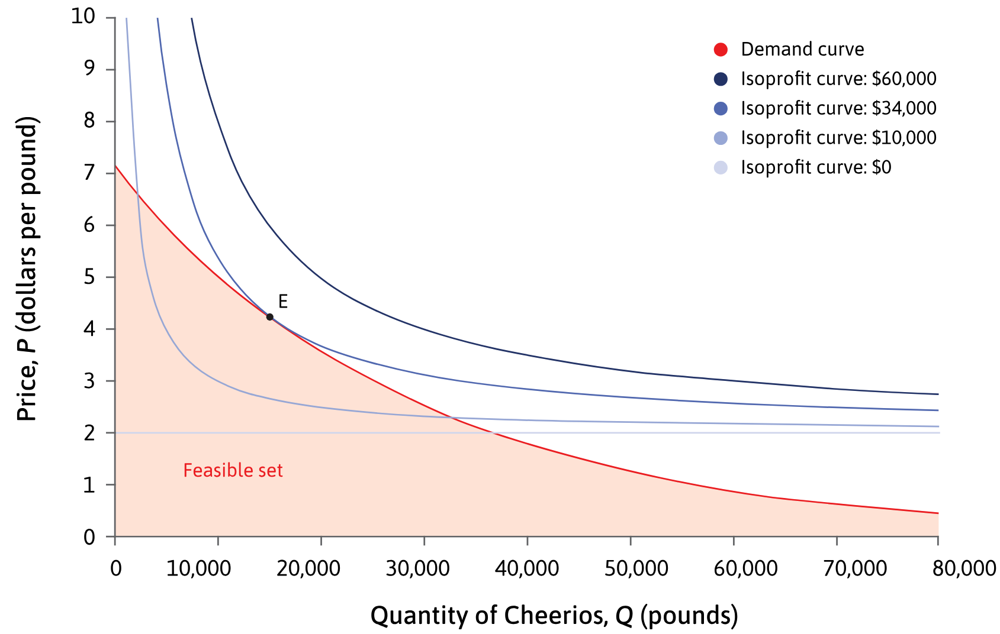
```

Maximized profit at point E: the demand curve is tangent to the highest isoprofit curve, giving P = $4.23 and Q = 15,000 pounds.

---
## Maximizing profit

The profit maximization problem is also a **constrained choice problem**⁠

```{r out.width="60%"}

```

---

.pull-left[
## Maximizing profit

Firm managers likely don’t think about the decision this way; the price is probably set through trial and error, guided by experience and market research.

But we expect that a firm will find its way, somehow, to a profit-maximizing price and quantity. 
]


---

.pull-left[
## Maximizing profit

Firm managers likely don’t think about the decision this way; the price is probably set through trial and error, guided by experience and market research.

But we expect that a firm will find its way, somehow, to a profit-maximizing price and quantity. 

- For instance: calculate profit at each point on the demand curve. Plotted in the lower panel.
]

.pull-right[
```{r out.width="100%"}
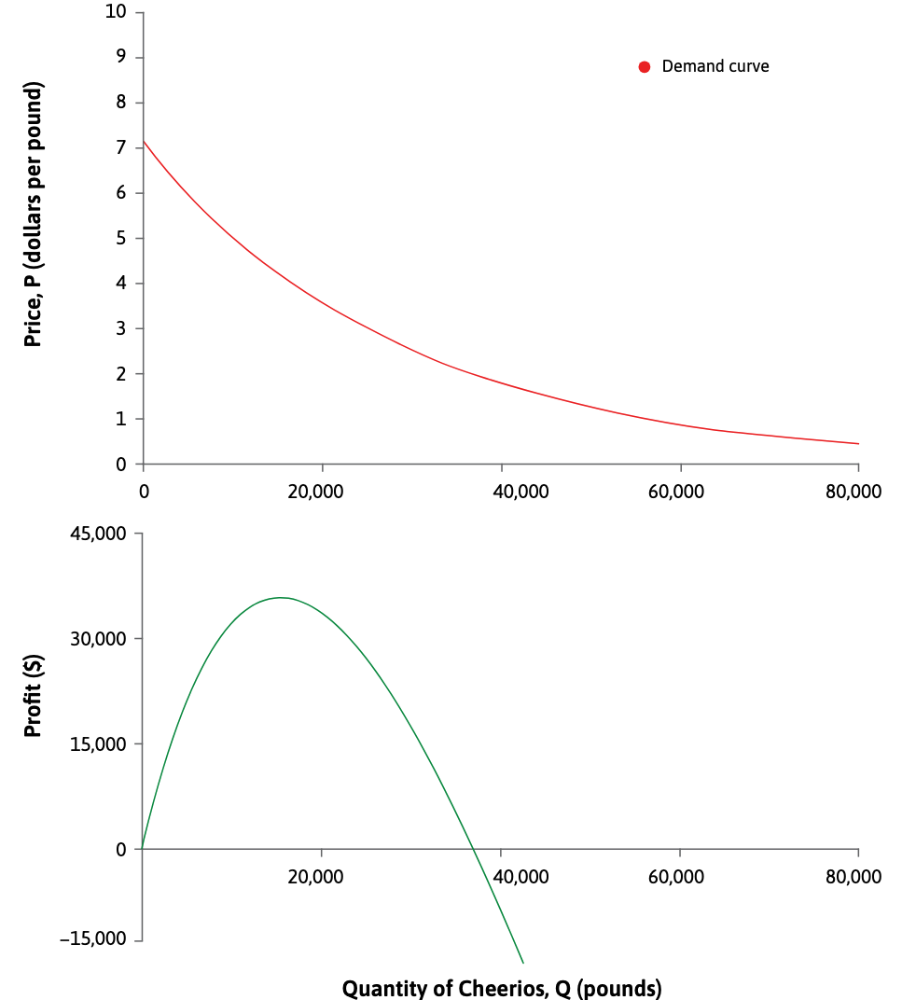
```
]

---

.pull-left[
## Maximizing profit

Firm managers likely don’t think about the decision this way; the price is probably set through trial and error, guided by experience and market research.

But we expect that a firm will find its way, somehow, to a profit-maximizing price and quantity. 

- For instance: calculate profit at each point on the demand curve. Plotted in the lower panel.

- When Q = 2,160, P = $6.63. Profit is $2,160 × 4.63 = $10,000. Since the quantity is low, so is the profit.
]

.pull-right[
```{r out.width="100%"}
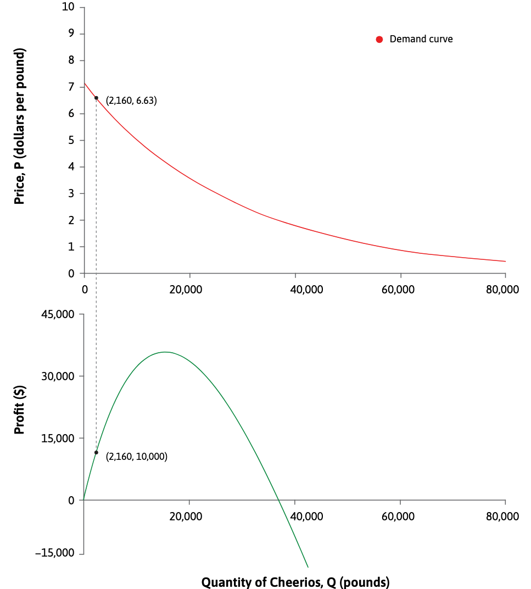
```
]

---

.pull-left[
## Maximizing profit

Firm managers likely don’t think about the decision this way; the price is probably set through trial and error, guided by experience and market research.

But we expect that a firm will find its way, somehow, to a profit-maximizing price and quantity. 

- For instance: calculate profit at each point on the demand curve. Plotted in the lower panel.

- As quantity increases, profit rises until...
]

.pull-right[
```{r out.width="100%"}

```
]


---
.pull-left[
## Maximizing profit

Firm managers likely don’t think about the decision this way; the price is probably set through trial and error, guided by experience and market research.

But we expect that a firm will find its way, somehow, to a profit-maximizing price and quantity. 

- For instance: calculate profit at each point on the demand curve. Plotted in the lower panel.

- As quantity increases, profit rises until **profit reaches a maximum of $33,450 at E, where Q = 15,000 and P = 4.23.**

]

.pull-right[
```{r out.width="100%"}

```
]

---
.pull-left[
## Maximizing profit

Firm managers likely don’t think about the decision this way; the price is probably set through trial and error, guided by experience and market research.

But we expect that a firm will find its way, somehow, to a profit-maximizing price and quantity. 

- For instance: calculate profit at each point on the demand curve. Plotted in the lower panel.

- Beyond E, the profit falls. More cereal is sold, but there is less profit on each unit. Profit is zero when the price is equal to the unit cost, $2.

]

.pull-right[
```{r out.width="100%"}
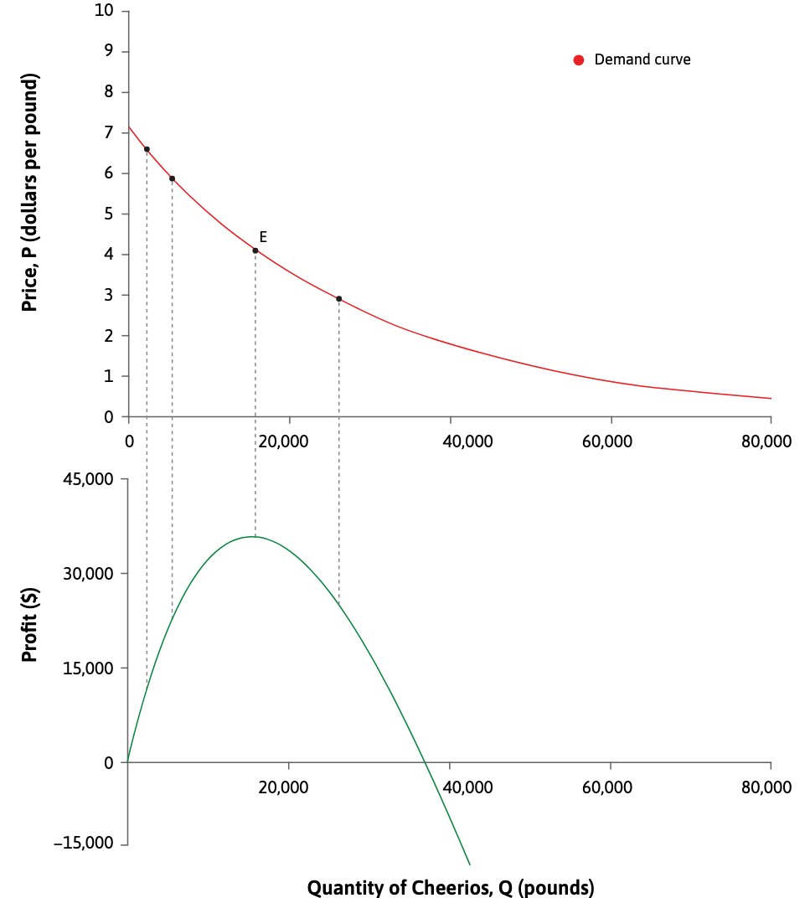
```
]

---
.pull-left[
## Maximizing profit

Firm managers likely don’t think about the decision this way; the price is probably set through trial and error, guided by experience and market research.

But we expect that a firm will find its way, somehow, to a profit-maximizing price and quantity. 

- For instance: calculate profit at each point on the demand curve. Plotted in the lower panel.

- To sell a very high quantity, the price has to be lower than the unit cost, so profit is negative.

]

.pull-right[
```{r out.width="100%"}

```
]

---
.pull-left[
## Maximizing profit

Firm managers likely don’t think about the decision this way; the price is probably set through trial and error, guided by experience and market research.

But we expect that a firm will find its way, somehow, to a profit-maximizing price and quantity. 

- For instance: calculate profit at each point on the demand curve. Plotted in the lower panel.

- The lower panel shows that profit is maximized at E. As indicated on the isoprofit curves, this is the tangency point we found before.

]

.pull-right[
```{r out.width="100%"}
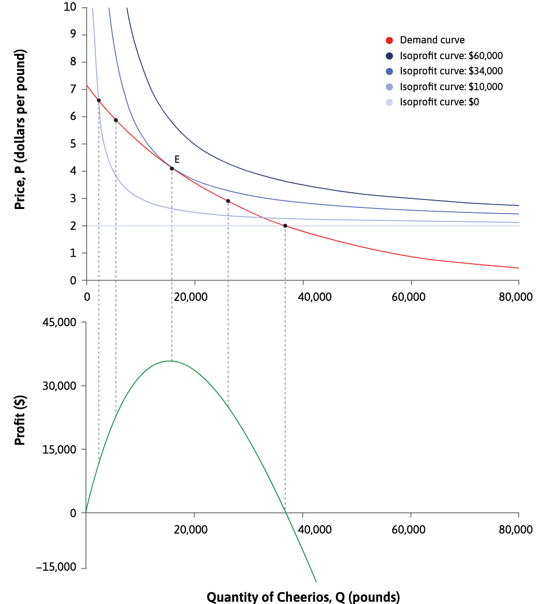
```
]


---
.pull-left[
## Maximizing profit

Firm managers likely don’t think about the decision this way; the price is probably set through trial and error, guided by experience and market research.

But we expect that a firm will find its way, somehow, to a profit-maximizing price and quantity. 

$\rightarrow$ **The purpose of our economic analysis is not to model the manager’s thought process, but to understand the outcome, and how it depends on the firm’s cost and consumer demand.**

]

.pull-right[
```{r out.width="100%"}

```
]


---
.center2[
# Economies of scale and the cost advantages of large-scale production
]


---
## Economies of scale in production

A firm’s costs depend on its production scale and technology, and larger firms may be more profitable due to technological or cost advantages.

--

Production function (technology): $Y = f(X) = X^{\alpha}$.
--
 Inputs increase in a given proportion: $\lambda > 0$

--

$$ \Rightarrow f(\lambda X) = (\lambda X)^{\alpha} = \lambda^{\alpha} X^{\alpha} = \lambda^{\alpha} f(X) $$

--

| Production | Technology | Homogeneity |
| -----------------------------------------|
| Increases more than proportionally | **Increasing returns to scale** | $f(\lambda X) > \lambda f(X) \quad \forall \alpha > 1$ |
| Increases proportionally | **Constant returns to scale** | $f(\lambda X) = \lambda f(X) \quad \alpha = 1$ |
| Increases less than proportionally | **Decreasing returns to scale** | $f(\lambda X) < \lambda f(X) \quad \forall \alpha < 1$ |

--

.pull-left[
**Economies of Scale: Examples**

- **Cost advantages**: Large firms can purchase inputs on more favourable terms.
- **Demand advantages**: Network effects (value of output rises with number of users e.g. software application)
]

.pull-right[
**Diseconomies of Scale: Examples**

- Additional layers of bureaucracy due to too many employees.
]

---
.center2[
# Production and costs
]

---
## Production and costs

Costs per unit of output may vary with the level of production. How does this affect the firm’s price and quantity decision?

--

**cost function**: The relationship between a firm’s total costs and its quantity of output. The cost function $C(Q)$ tells you the total cost of producing $Q$ units of output (including the opportunity cost of capital).

---
## Production and costs

Beautiful Cars: small firm producinga differentiated product (specialty cars).

--

$$C(Q) = F + cQ$$

- $F$: fixed costs
- $c$: the cost per car

---
.pull-left[
## Production and costs

Suppose:
- $F = 80,000$ per day
- $c = 14,400$ per car


The top panel shows the cost function, $C(Q)$. It shows the total cost for each level of output, $Q$.
]

.pull-right[
```{r out.width="100%"}
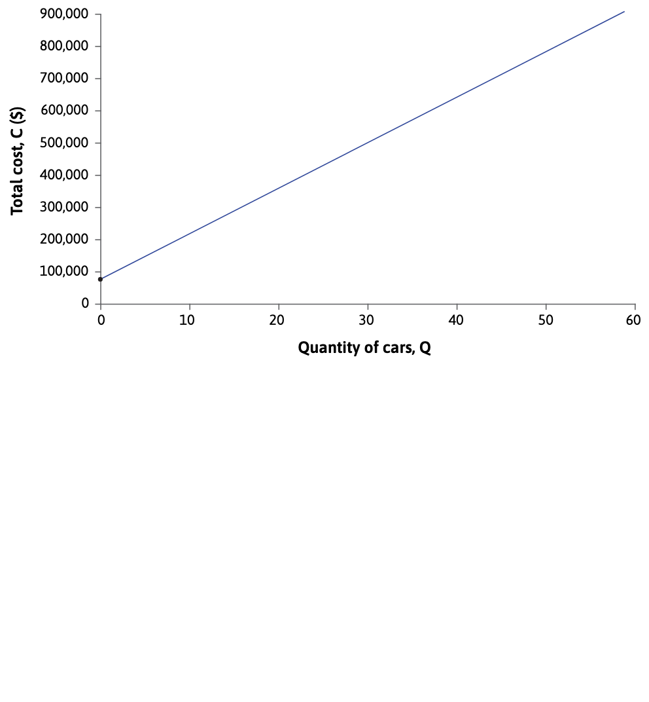
```
]

---
.pull-left[
## Production and costs

Suppose:
- $F = 80,000$ per day
- $c = 14,400$ per car


The top panel shows the cost function, $C(Q)$. It shows the total cost for each level of output, $Q$.

- The firm incurs in $F$ irrespective of output. When $Q = 0$, the only costs are the fixed costs: $C(0) = 80,000.$
]

.pull-right[
```{r out.width="100%"}
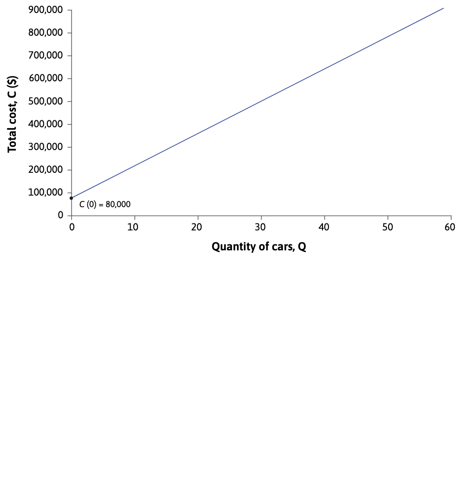
```
]

---
.pull-left[
## Production and costs

Suppose:
- $F = 80,000$ per day
- $c = 14,400$ per car


The top panel shows the cost function, $C(Q)$. It shows the total cost for each level of output, $Q$.

- As $Q$ increases, the firm needs to employ more production workers and purchase more raw materials

- At point A, 10 cars are produced at a cost of 224,000.
]

.pull-right[
```{r out.width="100%"}
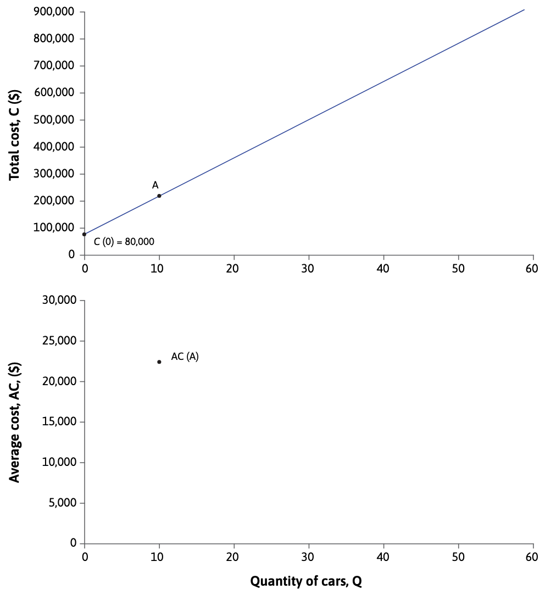
```
]

---
.pull-left[
## Production and costs

Suppose:
- $F = 80,000$ per day
- $c = 14,400$ per car


The top panel shows the cost function, $C(Q)$. It shows the total cost for each level of output, $Q$.

- The **average cost** of a car is the total cost divided by the number of cars: 

$$AC = \frac{C(Q)}{Q} = \frac{F + cQ}{Q} = c + \frac{F}{Q}$$

- As output rises above A, AC falls. 

- At point B, the total cost is 512,000, and AC is 17,067. 

- At point D, AC is lower still: 16,000.
]

.pull-right[
```{r out.width="100%"}
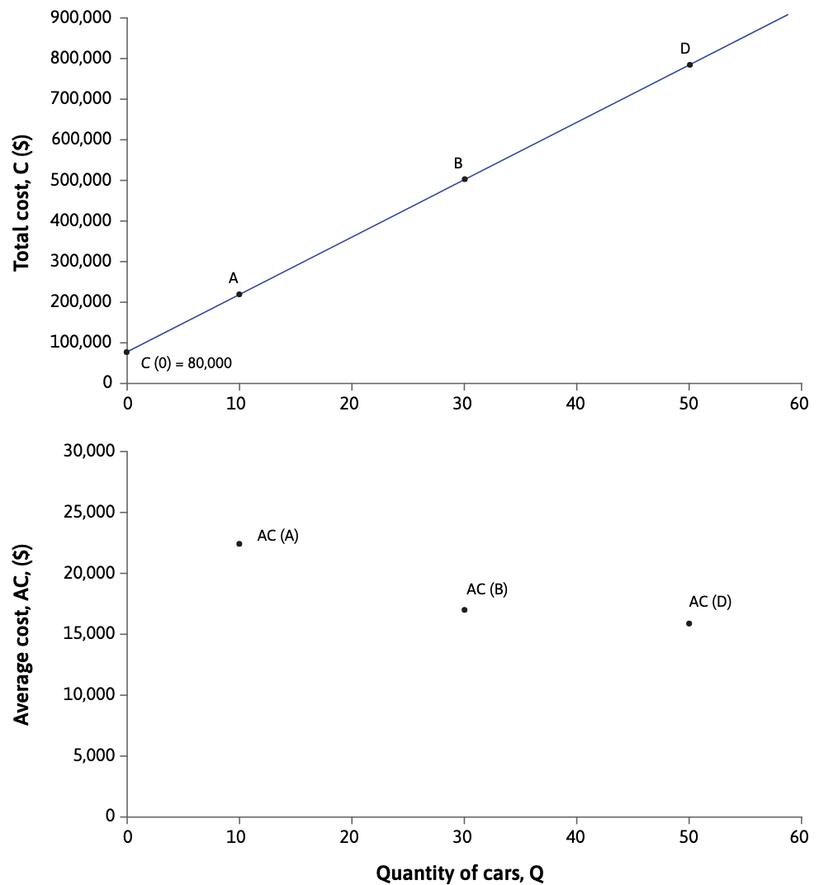
```
]

---
.pull-left[
## Production and costs

Suppose:
- $F = 80,000$ per day
- $c = 14,400$ per car


The top panel shows the cost function, $C(Q)$. It shows the total cost for each level of output, $Q$.

- The **average cost** of a car is the total cost divided by the number of cars: 

$$AC = \frac{C(Q)}{Q} = \frac{F + cQ}{Q} = c + \frac{F}{Q}$$

- We can calculate the AC at every value of $Q$ to draw the **average cost function** in the lower panel.

]

.pull-right[
```{r out.width="100%"}
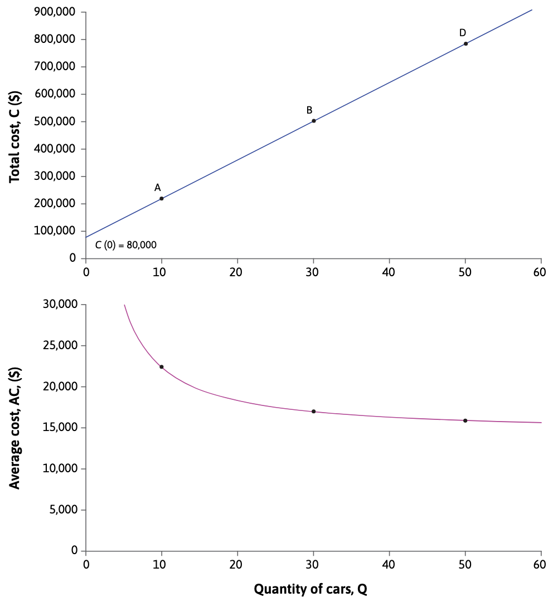
```
]


---
## Production and costs

**marginal cost** (MC): the additional cost of producing one more unit of output, which corresponds to the slope of the cost function. 

$$MC = \frac{\Delta C}{\Delta Q}$$

```{r out.width="60%"}
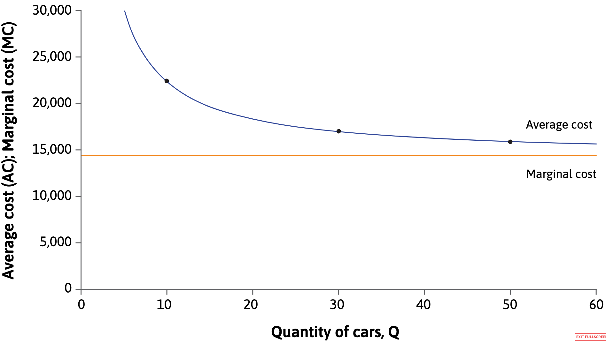
```


---
.center2[
# Demand, elasticity, and revenue
]

---
### Demand

**willingness to pay (WTP)**: An indicator of how much a person values a good, measured by the maximum amount they would pay to acquire a unit of the good.

--

A consumer buys a car if the price is less than or equal to her WTP; the demand curve shows how many consumers (the quantity) are willing to buy at each possible price.

--

```{r out.width="50%"}
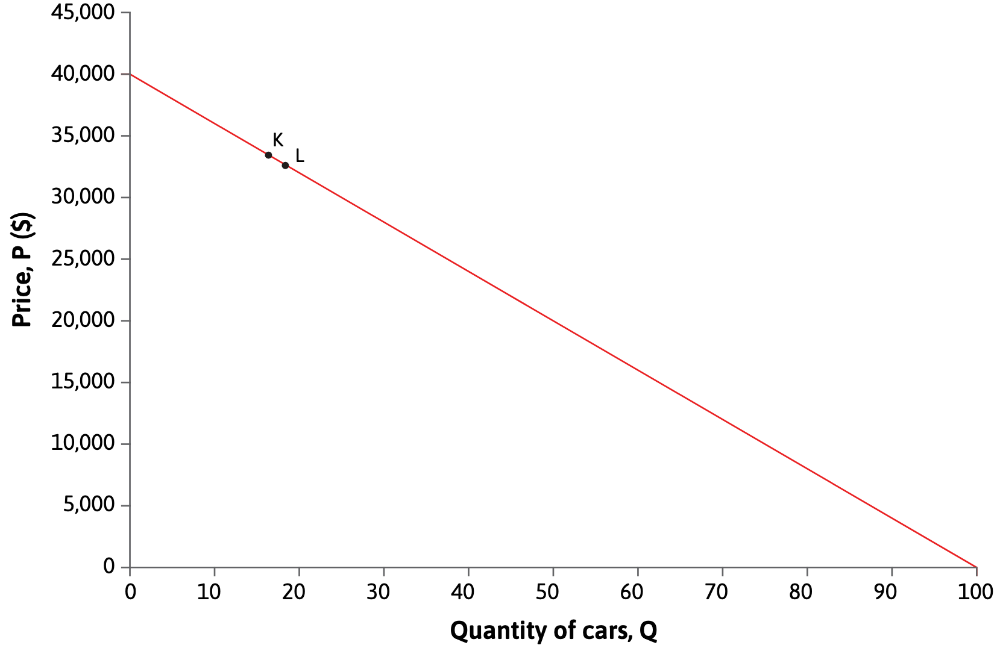
```

--

The demand curve shows the trade-off between price and quantity: firms want both high prices and high sales, but raising the price reduces demand.

---
## The elasticity of demand

How much demand falls when price rises depends on the slope of the demand curve. A steep curve means demand doesn’t drop much when price increases.

--

**price elasticity of demand**⁠ is a measure of the responsiveness of consumers to a price change

--

$$
\varepsilon = - \frac{\% \text{ change in Q}}{\% \text{ change in P}}
$$

---
## The elasticity of demand

How much demand falls when price rises depends on the slope of the demand curve. A steep curve means demand doesn’t drop much when price increases.

**price elasticity of demand**⁠ is a measure of the responsiveness of consumers to a price change

Price changes by $\Delta P$, change demand by $\Delta Q$.


$$
\varepsilon = - \frac{\% \text{ change in Q}}{\% \text{ change in P}} \iff \varepsilon = - \frac{100 \Delta Q}{Q} / \frac{100 \Delta P}{P}
$$

--

$$
\varepsilon = - \frac{\text{proportional change in Q}}{\text{proportional change in P}} \iff
\varepsilon = - \frac{\Delta Q}{Q} / \frac{\Delta P}{P}
$$

--

$$
\iff
\varepsilon = - \frac{P}{Q} \cdot \frac{\Delta Q}{\Delta P}
$$
--

Since $\frac{\Delta P}{\Delta Q}$ is the demand curve's slope: 

$$\iff \varepsilon = - \frac{P}{Q} \cdot \frac{1}{D_{slope}}$$


---

```{r out.width="60%"}

```


---

```{r out.width="60%"}

```

|        | Point K | Point L | 
|--------|---------|---------|---------------|
| $Q$  | 18      | 19      |
| $P$  | 32,800  | 32,400  |


---

```{r out.width="60%"}

```

|        | Point K | Point L | change        |
|--------|---------|---------|---------------|
| $Q$  | 18      | 19      | $\Delta Q = 1$ |
| $P$  | 32,800  | 32,400  | $\Delta P = -400$    |


---

```{r out.width="60%"}

```

|        | Point K | Point L | change        | % change                                   |
|--------|---------|---------|---------------|---------------------------------------------|
| $Q$  | 18      | 19      | $\Delta Q = 1$        | $\frac{100 \times \Delta Q}{18} = 5.56\%$ |
| $P$  | 32,800  | 32,400  | $\Delta P = -400$    | $\frac{100 \times \Delta P}{32{,}800} = -1.22\%$ |

---

```{r out.width="60%"}

```

.pull-left[
|        | Point K | Point L | change        | % change                                   |
|--------|---------|---------|---------------|---------------------------------------------|
| $Q$  | 18      | 19      | $\Delta Q = 1$        | $\frac{100 \times \Delta Q}{18} = 5.56\%$ |
| $P$  | 32,800  | 32,400  | $\Delta P = -400$    | $\frac{100 \times \Delta P}{32{,}800} = -1.22\%$ |
]

.pull-right[
.center[
$$\varepsilon = - \frac{100 \Delta Q}{Q} / \frac{100 \Delta P}{P} \; \Rightarrow \varepsilon  = - \frac{5.56}{-1.22} = 4.56$$
]
]


---

```{r out.width="60%"}
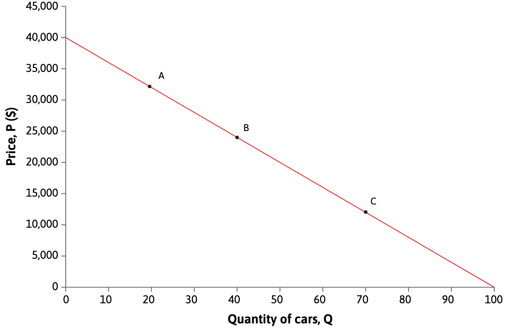
```


.pull-left[
.center[
$$\varepsilon = - \frac{P}{Q} \cdot \frac{1}{D_{slope}}$$
]
]

.pull-right[
|              | A     | B     | C     |
|--------------|-------|-------|-------|
| $Q$        | 20    | 40    | 70    |
| $P$          | 32,000 | 24,000 | 12,000 |
| slope of demand    | -400  | -400  | -400  
| $\varepsilon$ |  |  |  |
]


---

```{r out.width="60%"}

```


.pull-left[
.center[
$$\varepsilon = - \frac{P}{Q} \cdot \frac{1}{D_{slope}}$$
]
]

.pull-right[
|              | A     | B     | C     |
|--------------|-------|-------|-------|
| $Q$        | 20    | 40    | 70    |
| $P$          | 32,000 | 24,000 | 12,000 |
| slope of demand    | -400  | -400  | -400  |
| $\varepsilon$ | 4.00 | 1.50 | 0.43 |
]

---

```{r out.width="60%"}

```


.pull-left[

- **Elastic demand** if $\varepsilon > 1$

- **Unitary elastic demand** if $\varepsilon = 1$

- **Inelastic demand** if $\varepsilon < 1$

]

.pull-right[
|              | A     | B     | C     |
|--------------|-------|-------|-------|
| $Q$        | 20    | 40    | 70    |
| $P$          | 32,000 | 24,000 | 12,000 |
| slope of demand    | -400  | -400  | -400  |
| $\varepsilon$ | 4.00 | 1.50 | 0.43 |
]

---

```{r out.width="60%"}

```


.pull-left[

- **Elastic demand** if $\varepsilon > 1$

- **Unitary elastic demand** if $\varepsilon = 1$

- **Inelastic demand** if $\varepsilon < 1$

**Note how within a same demand curve we have the three types of elasticity**

]

.pull-right[
|              | A     | B     | C     |
|--------------|-------|-------|-------|
| $Q$        | 20    | 40    | 70    |
| $P$          | 32,000 | 24,000 | 12,000 |
| slope of demand    | -400  | -400  | -400  |
| $\varepsilon$ | 4.00 | 1.50 | 0.43 |
]

---
## The elasticity of demand

- **Inverse demand function**: $P=f(Q)$
--

- **Direct demand function**: $Q=g(P)$

--

$g$ is the inverse function of $f$: $g(P)=f^{-1}(P)$
 
--
Remember:

$$\varepsilon = - \frac{P}{Q} \cdot \frac{dQ}{dP}$$

Note: $\frac{dP}{dQ}= 1 / \frac{dQ}{dP} \iff \frac{dQ}{dP} = 1 / \frac{dP}{dQ}$

--

$$\Rightarrow \; \varepsilon = - \frac{P}{Q} / \frac{dP}{dQ} = \frac{f(Q)}{Q} \cdot \frac{1}{f'(Q)}$$

You can calculate the elasticity for every demand function. [Try the two examples in the book](https://books.core-econ.org/the-economy/microeconomics/07-firm-and-customers-05-demand-elasticity-revenue.html#two-ways-of-writing-the-elasticity)


---
## Elasticity and revenue

The firm’s price elasticity of demand will depend on how much competition it faces from other firms.

```{r out.width="80%"}
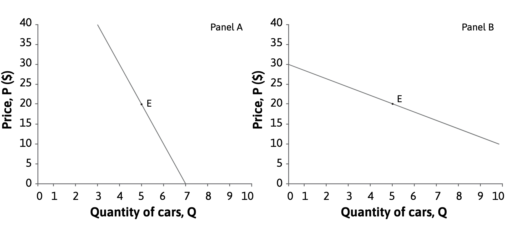
```

In panel A, limited competition makes demand steep and inelastic at point E (elasticity = 0.4). 

In panel B, greater competition makes demand flatter and elastic at E (elasticity = 2).

---
## Elasticity and revenue

The firm’s price elasticity of demand will depend on how much competition it faces from other firms.

```{r out.width="80%"}
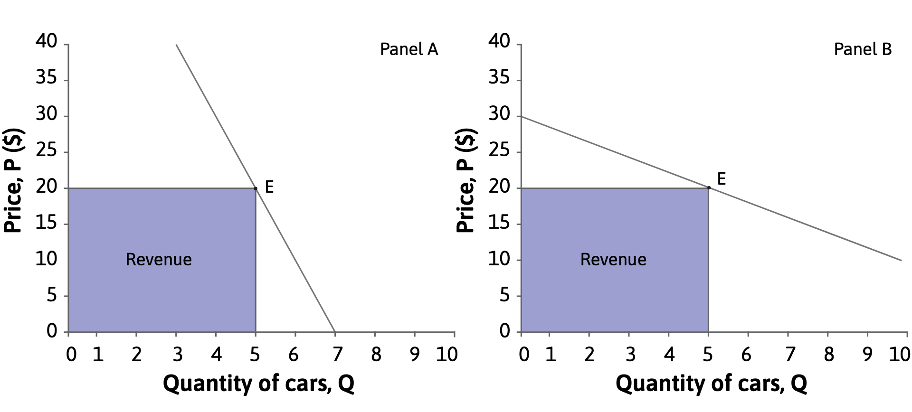
```

If the firm operates at point E, where $P = 20$ and $Q = 5$, its revenue is equal to the area of the rectangle under the curve: $revenue = P × Q = 100$, in both cases.

---
## Elasticity and revenue

The firm’s price elasticity of demand will depend on how much competition it faces from other firms.

```{r out.width="80%"}
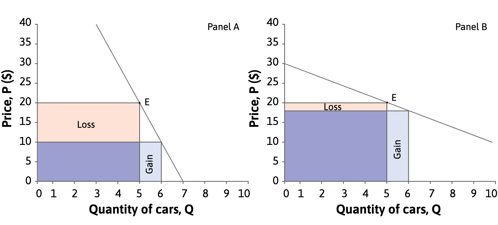
```

If output increases to $Q = 6$, the firm gains revenue on the extra unit in both cases. 

---
## Elasticity and revenue

The firm’s price elasticity of demand will depend on how much competition it faces from other firms.

```{r out.width="80%"}

```

But lowering the price reduces revenue on the original five units. With inelastic demand (Panel A), raising output by one unit requires a bigger price cut than with elastic demand (Panel B).

---
## Elasticity and revenue

The firm’s price elasticity of demand will depend on how much competition it faces from other firms.

```{r out.width="80%"}

```

If demand is inelastic, the loss outweighs the gain: revenue falls. If demand is elastic, the gain is bigger than the loss and revenue rises.

---
## Elasticity and revenue

The change in revenue when output is increased by one unit is called the **marginal revenue⁠** (MR).

```{r out.width="80%"}

```

- $\varepsilon > 1 \Rightarrow MR > 0$: the firm can increase revenue by raising output because prices fall only a little.

- $\varepsilon < 1 \Rightarrow MR < 0$: the firm can increase revenue by decreasing output because prices rise a lot.

---
## Elasticity and revenue

The change in revenue when output is increased by one unit is called the **marginal revenue⁠** (MR).

- A firm’s revenue is given by price $\times$ quantity ($R=PQ$)
- The inverse demand function, $P=f(Q)$, tells us the maximum price, $P$, at which $Q$ cars can be sold

--

$$\Rightarrow R=f(Q) \cdot Q$$

--

$$\Rightarrow MR= \frac{dR}{dQ} = f(Q) + f'(Q)  \cdot Q$$
--

Recall

$$\varepsilon = - \frac{f(Q)}{Q} \cdot \frac{1}{f'(Q)} \iff Q \cdot f'(Q) = - \frac{f(Q)}{\varepsilon} $$

--

$$\Rightarrow MR= f(Q) - \frac{f(Q)}{\varepsilon} = f(Q) (1 - \frac{1}{\varepsilon})= P (1 - \frac{1}{\varepsilon})$$

--

- $\varepsilon > 1 \Rightarrow MR > 0$: the firm can increase revenue by raising output because prices fall only a little.

- $\varepsilon < 1 \Rightarrow MR < 0$: the firm can increase revenue by decreasing output because prices rise a lot.

---
.center2[
# Setting price and quantity to maximize profit
]

---
## Setting price and quantity to maximize profit

A firm chooses its price $P$ and quantity $Q$ based on its demand curve and production costs.

The demand curve defines the feasible combinations of $P$ and $Q$.

To find the profit-maximizing point, we draw the isoprofit curves and locate the tangency point.

--

$$
\Pi(P,Q) = P \cdot Q - C(Q)
$$

--

$$\Pi(P,Q) = Q (P - \frac{C(Q)}{Q}) = Q (P - AC)$$

--

**Example**

$C(Q)= F + cQ$, with $c = 14,400$ and $F = 80,000$

--

$$\Rightarrow \frac{C(Q)}{Q} = \frac{F}{Q} + c$$ 

--

$$\Rightarrow  \Pi(P,Q) = Q (P - \frac{F}{Q} - c) = Q (P - c) - F = Q(P-14,400) - 80,000$$ 

---

$$\Pi(P,Q) = Q(P-14,400) - 80,000$$ 
--

```{r out.width="75%"}
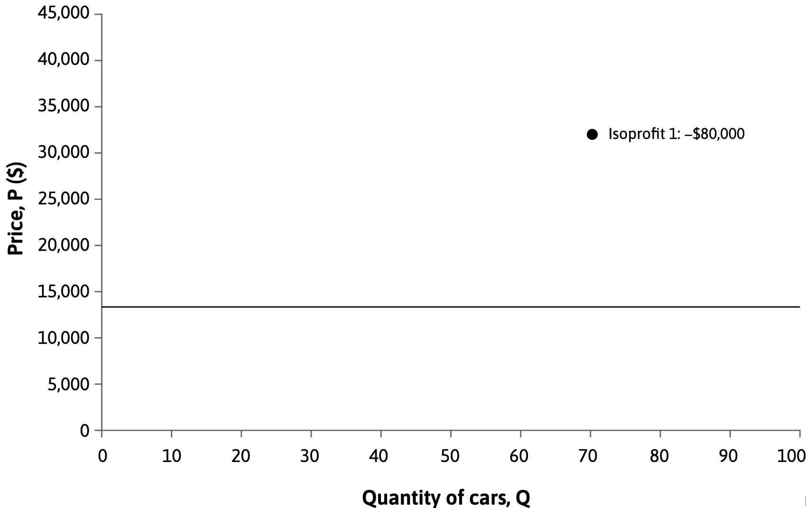
```

If the price is equal to the marginal cost of a car and the firm makes a loss equal to its fixed cost.

---

$$\Pi(P,Q) = Q(P-14,400) - 80,000$$ 

```{r out.width="75%"}
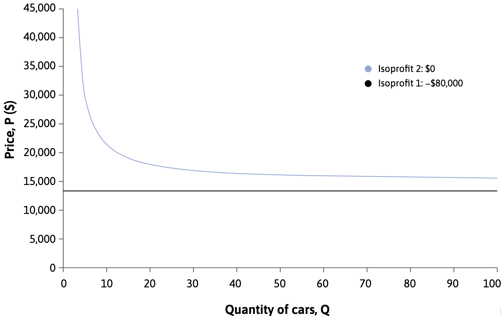
```

If $P = AC$, the firm’s economic profit is zero. So the AC curve is also the zero-profit curve: it shows all the combinations of P and Q that give zero economic profit.

---
### How we derive the isoprofit curves?

For a general profit function: $\Pi(P,Q) =  P \cdot Q - C(Q)$

--

If we set a given level of profit $\Pi_0 \Rightarrow \quad \Pi_0 =  P \cdot Q - C(Q)$

--

We can rearrange P such that 

$$P = \frac{\Pi_0 + C(Q)}{Q}$$ 

--

$$\Pi_0 = 0 \Rightarrow \quad P = \frac{0 + C(Q)}{Q} = \frac{C(Q)}{Q} = AC$$ 
--

**Slope of an isoprofit curve** at any point:

$$
\frac{dP}{dQ}
= -\,\frac{Q C'(Q) - \big(C(Q) + \Pi_0\big)}{Q^2}
$$

--

And since $C(Q) + \Pi_0 = PQ$, we have:

$$
\frac{dP}{dQ}
= \frac{C'(Q) - P}{Q}
= \frac{\text{MC} - P}{Q}
$$


---

$$\Pi(P,Q) = Q(P-14,400) - 80,000$$ 

```{r out.width="75%"}
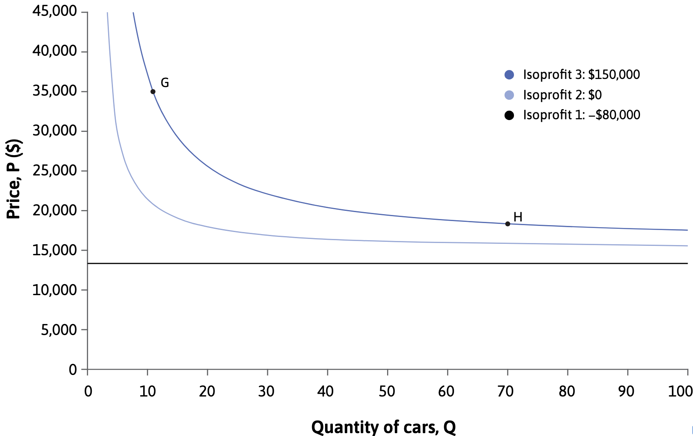
```

The Isoprofit 3 downward-sloping curve shows the combinations of P and Q giving higher levels of profit. Profit is $150,000 at points G and H.

---

$$\Pi(P,Q) = Q(P-14,400) - 80,000$$ 

```{r out.width="75%"}
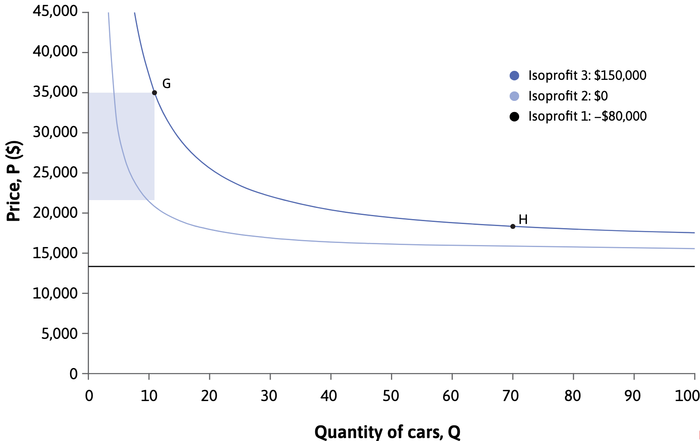
```

Profit $= Q(P − AC)$: At point G, producing 11 cars yields a price of 35,309 and an average cost of 21,673, giving 13,636 profit per car and total profit of 150,000.

---

$$\Pi(P,Q) = Q(P-14,400) - 80,000$$ 

```{r out.width="75%"}
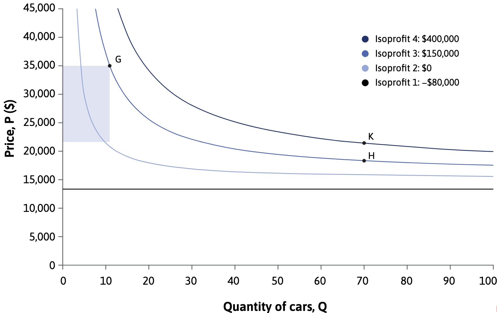
```

Higher profit occurs on curves nearer the top-right of the diagram. Points H and K involve the same quantity and average cost, but K earns more because its price is higher.


---
### Profit maximization: MRT = MRS

```{r out.width="60%"}
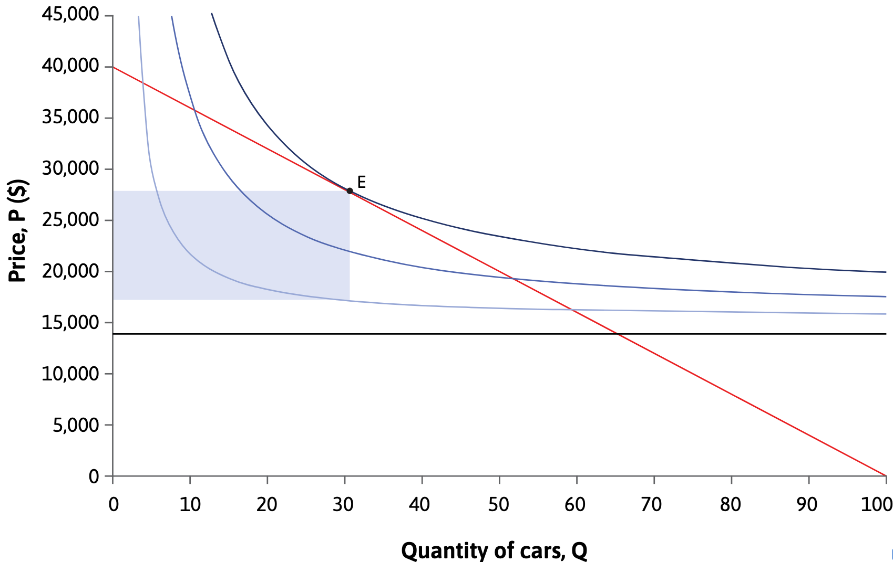
```

- The isoprofit curve is the indifference curve, with its slope showing the **MRS** between selling more and charging more.

- The demand curve is the feasible frontier, with its slope showing the **MRT** between lower prices and higher sales.

---
### Profit maximization: MRT = MRS

.pull-left[
**Slope of isoprofit curve**

$$MRS = -\frac{(P - c)}{Q}$$
]

.pull-right[
**Slope of demand curve**

$$MRT = -\frac{P}{\varepsilon Q}$$
]

--

$$MRS = MRT$$

--

$$
\iff \frac{P - c}{Q} = \frac{P}{\varepsilon Q}
$$

--

$$
\iff \frac{P - c}{P} = \frac{1}{\varepsilon}
$$

--

- $\text{Profit margin} = P – MC$

--

- $\text{Price markup} = (P – MC)/P$

$\rightarrow$ price markup is equal to the inverse of the demand elasticity


---
### Profit maximization: Alternative approach

$$
\text{profit} = \text{total revenue} - \text{total costs}
$$

--

$$
\Rightarrow \; \text{marginal profit} = MR - MC
$$

---
### Profit maximization: Alternative approach

$$
\Rightarrow \; \text{marginal profit} = MR - MC
$$

```{r out.width="55%"}
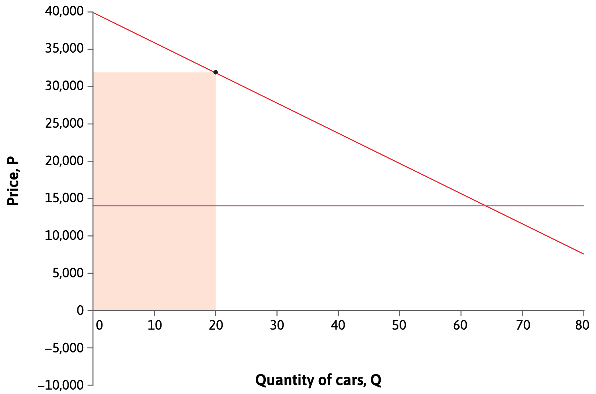
```

Demand curve and marginal costs. 

At point B on the demand curve, Q = 20, P = 32,000, and revenue is 640,000 (the area of the rectangle).

---
### Profit maximization: Alternative approach

$$
\Rightarrow \; \text{marginal profit} = MR - MC
$$

```{r out.width="55%"}
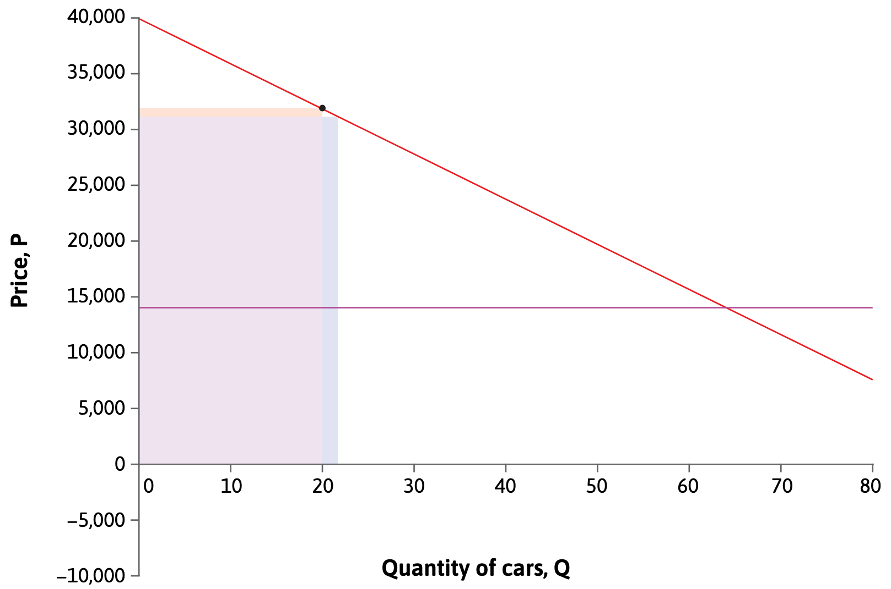
```

The marginal revenue is the change in revenue when Q increases by 1 unit. If Q increases from 20 to 21, P falls by 400.

---
### Profit maximization: Alternative approach

$$
\Rightarrow \; \text{marginal profit} = MR - MC
$$

Calculating MR when $Q = 20$

| Q    | P        | R        |
|------|----------|----------|
| 20   | 32,000  | 640,000 |
| 21   | 31,600  | 663,600 |
| $\Delta Q = 1$ | $\Delta P = -400$ | $MR = 23,600$ |

---
### Profit maximization: Alternative approach

$$
\Rightarrow \; \text{marginal profit} = MR - MC
$$

```{r out.width="55%"}
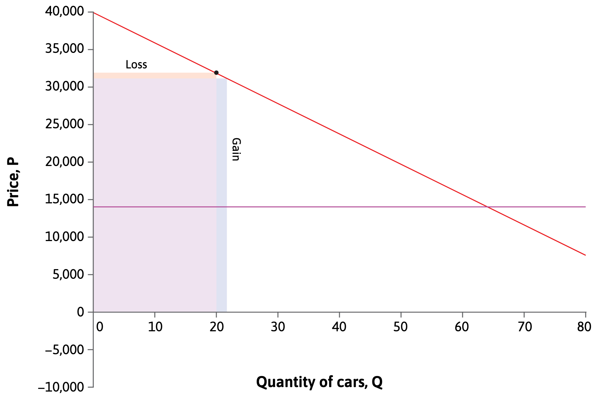
```

The gain in revenue on the 21st car outweighs the loss due to the fall in price for the other 20 cars. $MR > 0$.

---
### Profit maximization: Alternative approach

$$
\Rightarrow \; \text{marginal profit} = MR - MC
$$

```{r out.width="55%"}
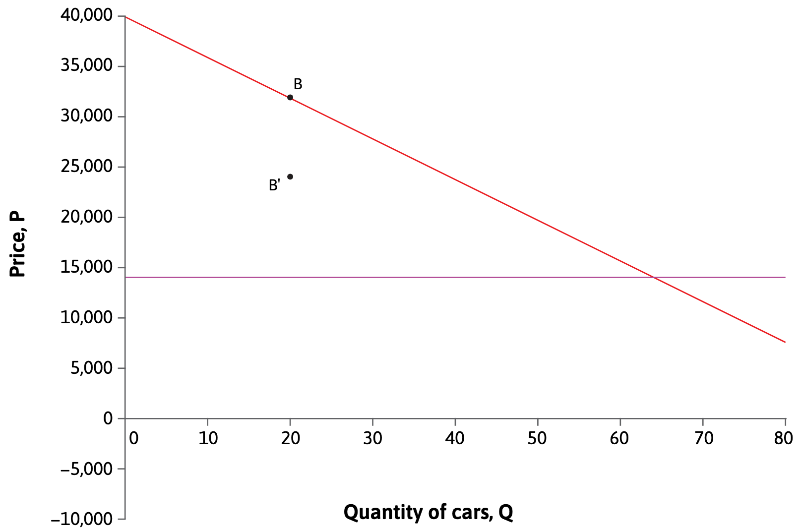
```

MR when Q = 20 is 23,600. Point B′ on the same diagram. 

$MR < P$, always. The firm gains P when it sells an extra car, but it loses revenue on the other cars because their price is lower than before.

---
### Profit maximization: Alternative approach

$$
\Rightarrow \; \text{marginal profit} = MR - MC
$$

```{r out.width="55%"}
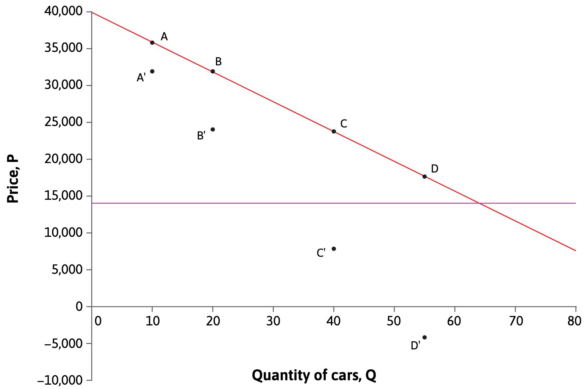
```

We can calculate $MR$ at other points on the demand curve in the same way and plot them.

---
### Profit maximization: Alternative approach

$$
\Rightarrow \; \text{marginal profit} = MR - MC
$$

```{r out.width="55%"}

```

As we move down the demand curve, $P$ drops and $MR$ falls even more. The extra unit adds less revenue, while the price cut reduces revenue on all previous units. By point D, $MR$ is negative because the loss exceeds the gain.

---
### Profit maximization: Alternative approach

$$
\Rightarrow \; \text{marginal profit} = MR - MC
$$

```{r out.width="55%"}
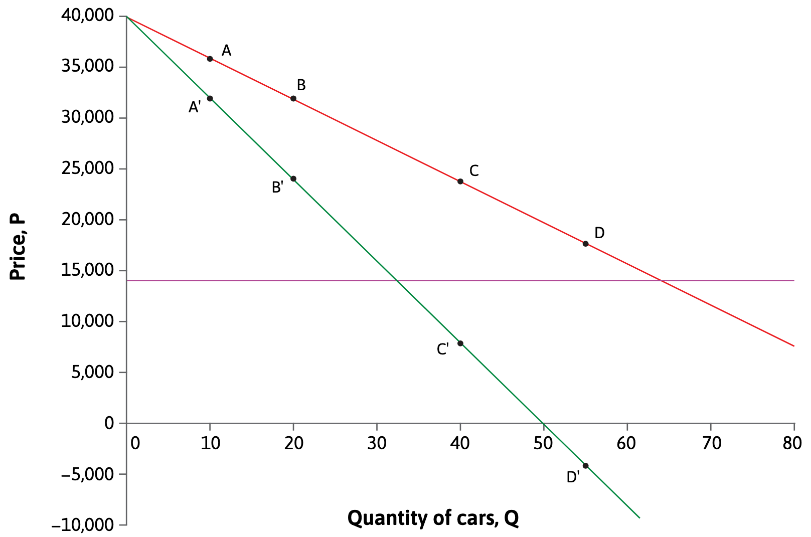
```

Joining the MR points gives the **MR curve**. It is below the demand curve (because $MR < P$) and slopes downward.

---
### Profit maximization: Alternative approach

$$
\Rightarrow \; \text{marginal profit} = MR - MC
$$

```{r out.width="55%"}
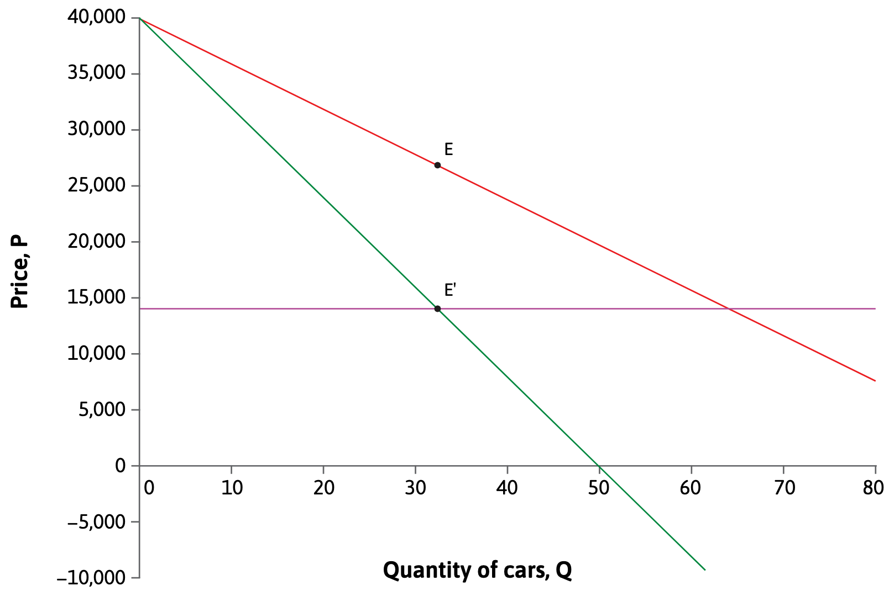
```

Note that $MR = MC$ at point E′, when $Q = 32$. 

At this point, marginal profit is zero, and profit is maximized. The firm should make 32 cars, and sell them at the price on the demand curve, at point E.

---
### Profit maximization: Alternative approach

$$
\Rightarrow \; \text{marginal profit} = MR - MC
$$

```{r out.width="55%"}

```

Note that $MR = MC$ at point E′, when $Q = 32$. 

- If $MR > MC$, the firm could increase profit by raising Q.

- If $MR < MC$, the marginal profit is negative. It would be better to decrease Q.

---
### Profit maximization: Alternative approach

$$\Pi(P, Q) = \underbrace{P \cdot Q}_{\text{revenue}} \;-\; \underbrace{C(Q)}_{\text{cost}}$$

--

Using the inverse demand function, $P = f(Q)$:

$$\Pi(Q) = f(Q)Q - C(Q)$$

--

We maximize wrt Q: 

$$max \; \Pi(Q) = \frac{d \Pi}{d Q} = f(Q) + f'(Q)Q - C'(Q) = 0$$
--

$$\iff \underbrace{f(Q) + f'(Q)Q}_{\text{marginal revenue}} \; = \; \underbrace{C'(Q)}_{\text{marginal cost}}$$

---
### Profit maximization: MRS = MRT, same result as MR = MC

```{r out.width="70%"}
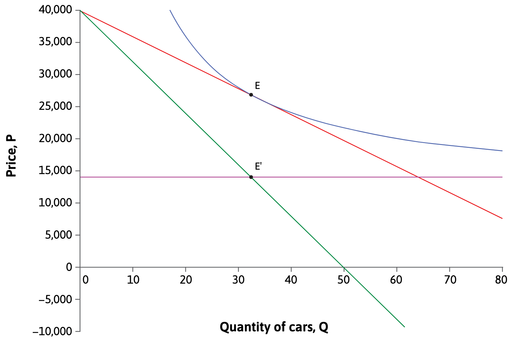
```

The profit-maximizing point can be found from MR and MC, or from isoprofit curves.

---
.center2[
# Gains from trade: The surplus and how it is divided
]

---
## Gains from trade: The surplus and how it is divided

When people engage voluntarily in an economic interaction, they do so because it makes them better off.

They obtain a surplus called an **economic rent**. 

--

The **joint surplus** is a measure of the **gains from exchange** or **gains from trade**.

---
## Gains from trade: The surplus and how it is divided

```{r out.width="67.5%"}
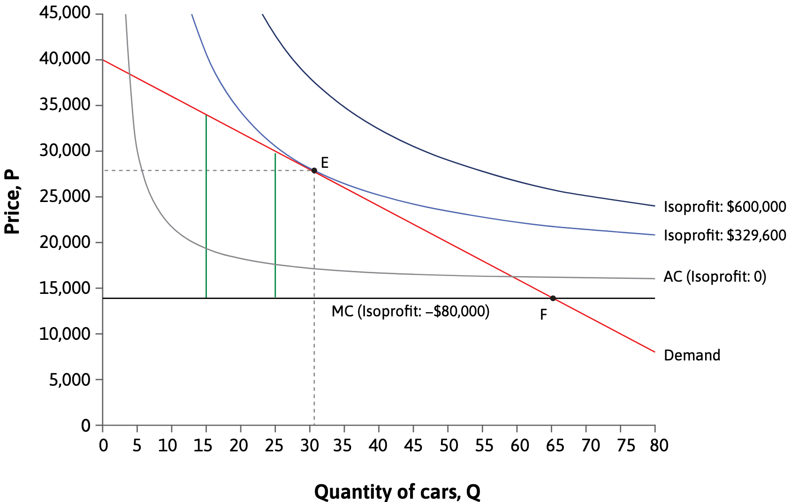
```

There is a surplus on each car equal to the difference between the consumer’s WTP and the producer’s marginal cost. 

---
## Gains from trade: The surplus and how it is divided

```{r out.width="67.5%"}

```

The vertical lines in the figure show the surpluses for the transactions with two of the consumers.

---
## Gains from trade: The surplus and how it is divided

```{r out.width="67.5%"}
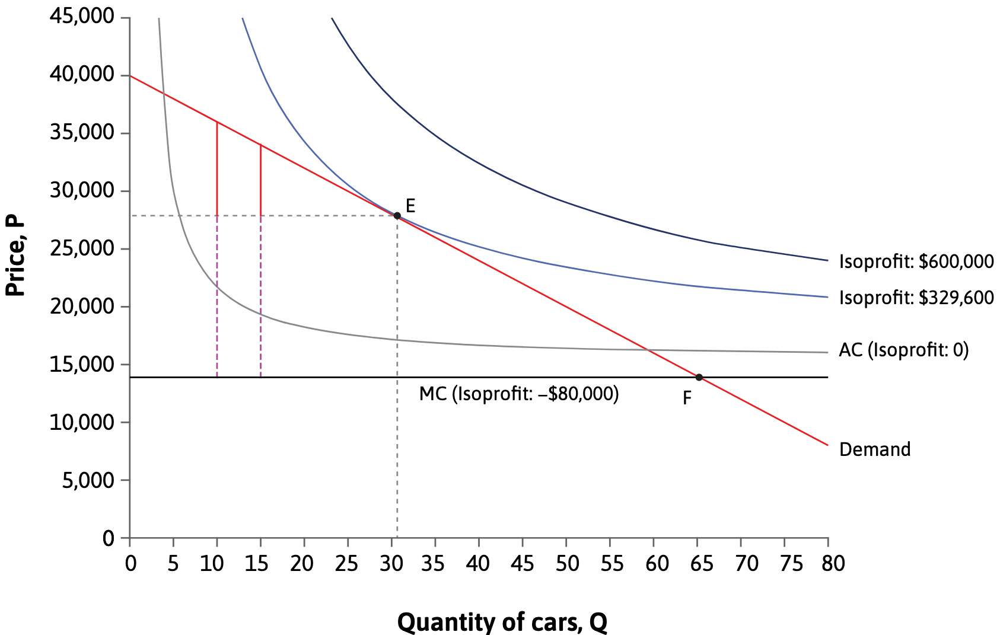
```

Firm sets a price $P^*$ (point E). 

---
## Gains from trade: The surplus and how it is divided

```{r out.width="67.5%"}

```

The buyer’s surplus (in red) is the difference between the WTP and the price, $WTP – P^*$, and the producer receives $P^* – MC$ (purple).

---
## Gains from trade: The surplus and how it is divided

| Consumer        | WTP    | MC     | Surplus (WTP − MC) | Price $P$ | Consumer’s share (WTP − P) | Producer’s share (P − MC) |
|-----------------|--------|--------|----------------------|-----------|------------------------------|-----------------------------|
| 15th consumer   | 34,000 | 14,400 | 19,600               | 27,200    | 6,800                        | 12,800                      |
| 24th consumer   | 30,400 | 14,400 | 16,000               | 27,200    | 3,400                        | 12,800                      |

---
## Gains from trade: The surplus and how it is divided

```{r out.width="67.5%"}
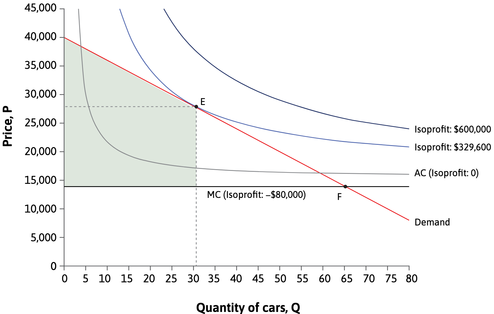
```

The shaded area between the demand curve and the marginal cost curve from 0 to 32 cars shows the total joint surplus generated by all 32 cars sold at this price.

---
## Gains from trade: The surplus and how it is divided

```{r out.width="67.5%"}
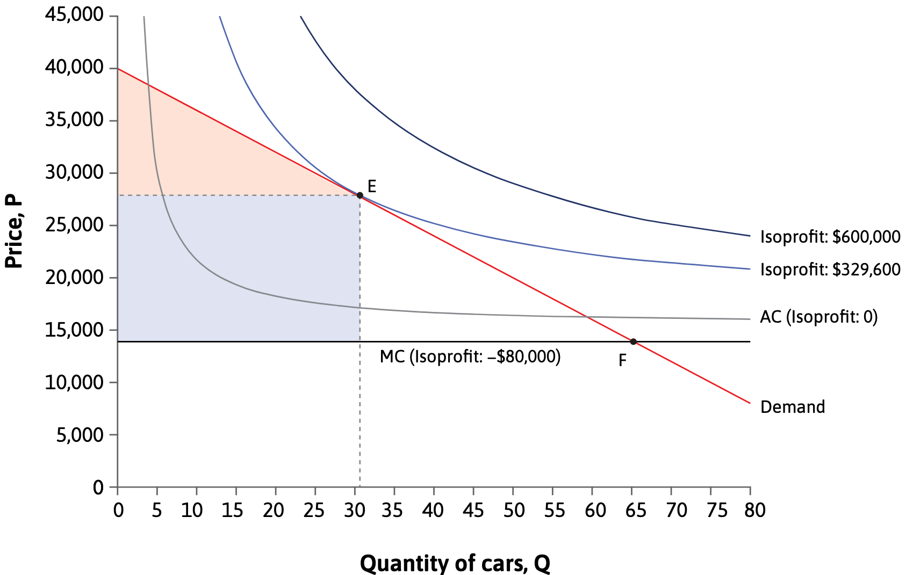
```

The sum of the surpluses received by all the consumers is known as **consumer surplus**. 

---
## Gains from trade: The surplus and how it is divided

```{r out.width="67.5%"}

```

The rectangle between the price and MC curve is the sum of the producer’s surpluses on each car, which is equal to $(P – MC)Q^*$ (**producer surplus**)

---
## Gains from trade: The surplus and how it is divided

```{r out.width="67.5%"}
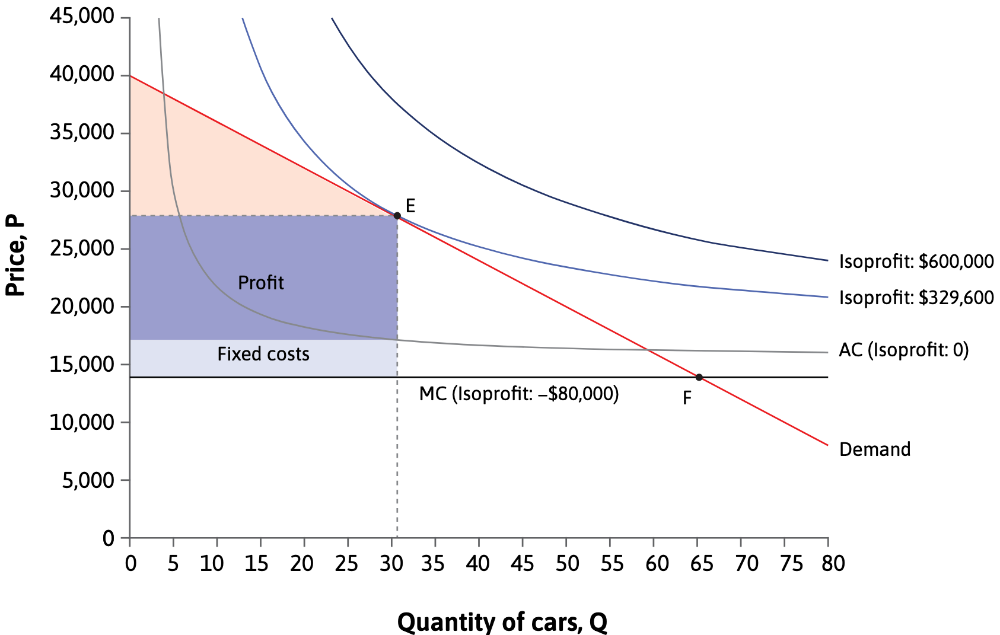
```

The firm’s profit is $(P – AC)Q^*$. The remaining part of the producer’s surplus covers the fixed costs.

---
## Pareto inefficiency and deadweight loss

```{r out.width="67.5%"}
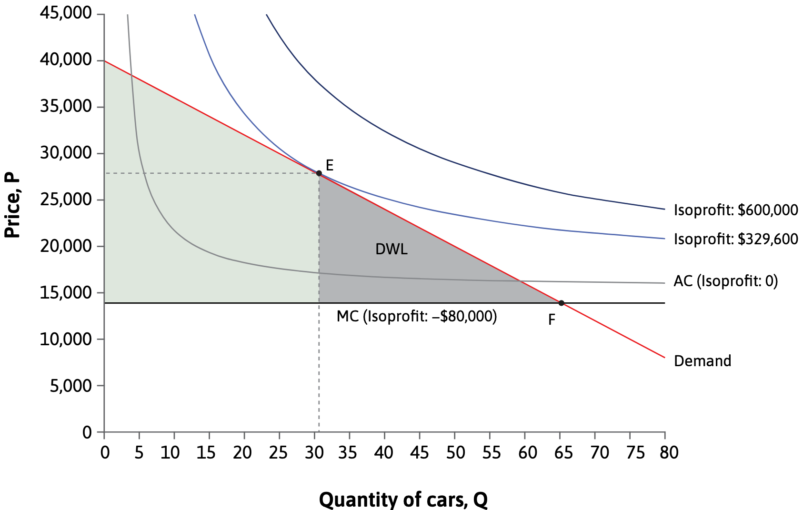
```

Note there are potential gains from trade, positive surpluses, on 64 cars.

---
## Pareto inefficiency and deadweight loss

```{r out.width="67.5%"}

```

The grey-shaded area represents the total loss of surplus from the firm’s decision to sell 32 cars, at point E.

---
## Pareto inefficiency and deadweight loss

```{r out.width="67.5%"}

```

Now compare it with point F where all the gains from trade would be realised. 

---
## Pareto inefficiency and deadweight loss

```{r out.width="67.5%"}

```

This measure of **lost surplus** is called the **deadweight loss**.

---
## Pareto inefficiency and deadweight loss

Some notes about surplus:

- The division of surplus depends on participants’ bargaining power—their ability to influence price in their favour.  
  - Firm in example has bargaining (**market**) **power** as the sole seller of this car.  
  
- Producer surplus can be misleading because it ignores fixed costs.  

- Consumer surplus adds monetary gains that mean different things to different consumers, so it is a weak measure of total consumer benefit.  

---
.center2[
# Competition, differentiation, and market power 
]

---
### Market power and monopoly

- A firm is stronger when few competitors offer close **substitutes**, facing less competition and lower demand elasticity.  
- Such a firm has **market power**—the ability to set a high price without losing customers.  
- A **monopoly** occurs when there is a single seller of a good.  
- Economists use the term broadly for situations where a good or service is somewhat unique.  
- A **natural monopoly** arises when one firm can produce at lower average cost than multiple firms, as in electricity or water.  

---
### Gaining market power

.pull-left[

Firms can increase their market power by:

1) **Innovating**

- Technological innovation lets firms differentiate their products (e.g., hybrid cars).  
- Creating a completely new product can block competition through **patents** or **copyright laws**.

2) **Advertising**

- Firms can pull consumers away from rivals and build brand loyalty.  
- Advertising can raise demand more effectively than discounts.
]

.pull-right[

<iframe src="https://ourworldindata.org/grapher/advertising-expenditure-and-market-share-of-breakfast-cereals-in-chicago?tab=chart" loading="lazy" style="width: 120%; height: 500px; border: 0px none;" allow="web-share; clipboard-write"></iframe>
]

---
### Markets with few firms: Strategic price setting

We’ve treated the firm’s demand curve as fixed, but in reality its elasticity depends on how easily consumers can find substitutes. 

This, in turn, is shaped by competitors’ decisions.

--

**Example**

- Imagine a beach where tourists can hire a windsurfing board or a kitesurfing board for the day.

- The owner of the windsurfers (Wanda) and the owner of the kiteboards (Kit) both face the same costs, of $c = 10$ per board per day. 

- They can choose either a high or low price: $H = 36$ or $L = 20$ per day.

- There are 60 daily customers: 
 - 22 are loyal and stick to their preferred activity
 - 18 switch based on relative prices
 - 20 are price-driven and buy only at the low price
 
---
### Markets with few firms: Strategic price setting

```{r}
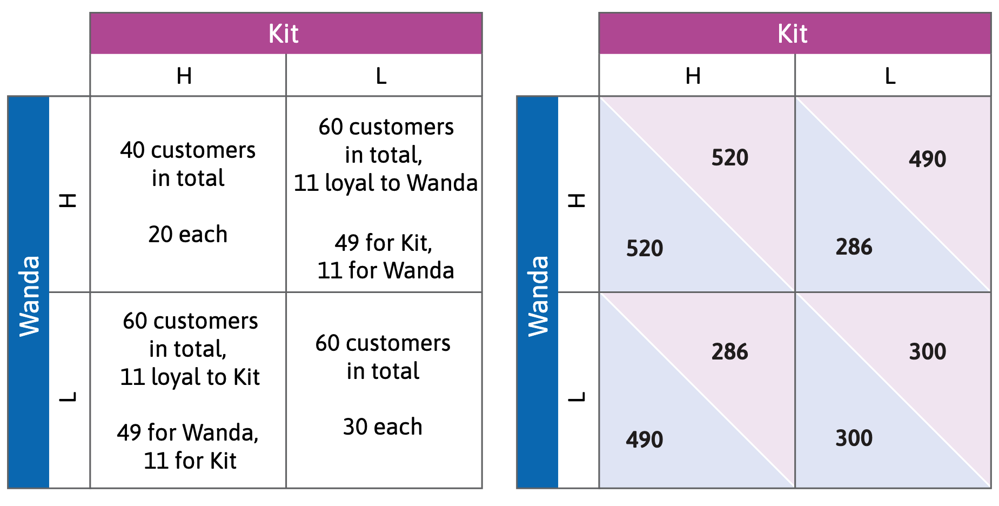
```

Dominant strategies? NE?

---
### Markets with few firms: Strategic price setting

```{r out.width="80%"}
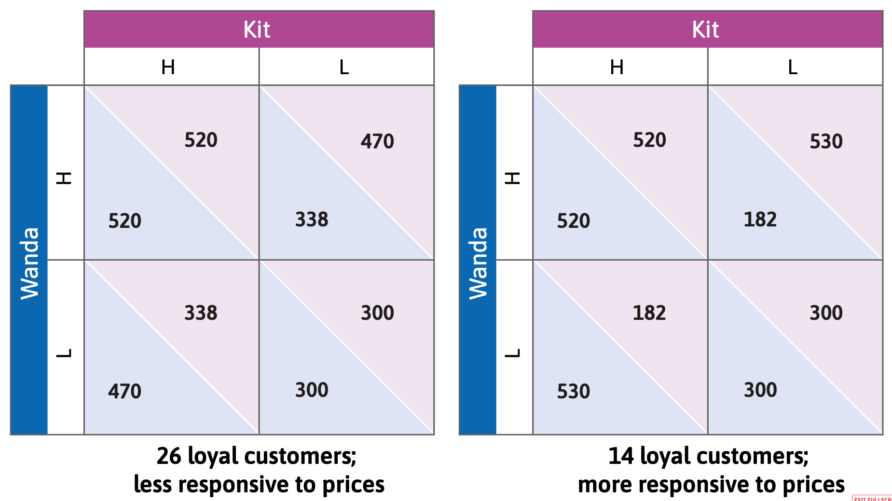
```

Dominant strategies? NE?

---
.center2[
# Summary
]

---
## Summary

1) Model of a firm with **market power** (price setter)
- Price and output depend on the firm’s demand curve and cost function.  
- Profit is maximized where **MRS = MRT**.  
- Equivalently, in revenue–cost terms, where **MR = MC**.  

--

2) Surplus measures the gains from trade
- **Total surplus = Producer surplus + Consumer surplus**  
- **Deadweight loss** occurs when the allocation is not Pareto efficient.  
- **Price elasticity of demand** influences both surplus and profits.  

---
.center[
## Excercise 
]

.pull-left[
**Total cost function:** $C(Q) = 50 + \frac{1}{2} Q^2$
]

.pull-right[
**Demand:** $Q(P) = 120 - P$
]

**G**: Graphical solution. **M**: Mathematical solution.

a. What is the fixed cost? What is the variable cost? What is the marginal cost? What is the **average cost**? **G**, **M**

b. Graph the demand curve. What is the feasible set for the firm's profit maximization? **G**

c. Graph the AC and MC. At what quantity is AC at its minimum? Where AC and MC are equal? What would be the shape of the firms isoprofit curves? **G**

d. What is the condition to obtain the quantity and price equilibrium? Obtain the equilibrium quantity. Obtain the price quantity. **G**, **M**

e. How we could find the equilibrium graphically? **G**

f. What is the price elasticity at the equilibrium? **M**


