<style>

.center2 {
  margin: 0;
  position: absolute;
  top: 50%;
  left: 50%;
  -ms-transform: translate(-50%, -50%);
  transform: translate(-50%, -50%);
}

</style>

```{r meta, echo=FALSE}
library(metathis)
meta() %>%
  meta_general(
    description = "An Introduction to xaringan for Presentations: The Basics",
    generator = "xaringan and remark.js"
  ) %>% 
  meta_name("github-repo" = "spcanelon/xaringan-basics-and-beyond")
  # meta_social(
  #   title = "Sharing Your Work with xaringan &#8212; Day 1",
  #   url = "https://spcanelon.github.io/xaringan-basics-and-beyond/slides/day-01-basics.html#1",
  #   image = "https://raw.githubusercontent.com/spcanelon/xaringan-basics-and-beyond/main/slides/day-01-cover-image.png",
  #   image_alt = "Title slide for the day 1 slides of the Sharing Your Work with xaringan workshop series",
  #   og_type = "website",
  #   og_author = "Silvia Canelon",
  #   twitter_card_type = "summary_large_image",
  #   twitter_creator = "@spcanelon"
  # )
```

```{r setup, include = FALSE}
knitr::opts_chunk$set(echo = FALSE)
knitr::opts_chunk$set(out.width = "90%")
knitr::opts_chunk$set(fig.align="center")
options(htmltools.dir.version = FALSE)


options(htmltools.dir.version = FALSE)
library(knitr)
library(tidyverse)
library(xaringanExtra)
# set default options
opts_chunk$set(echo=FALSE,
               collapse = TRUE,
               fig.width = 7.252,
               fig.height = 4,
               dpi = 300)
# set engines
knitr::knit_engines$set("markdown")
xaringanExtra::use_tile_view()
xaringanExtra::use_panelset()
xaringanExtra::use_clipboard()
xaringanExtra::use_webcam()
xaringanExtra::use_broadcast()
xaringanExtra::use_share_again()
xaringanExtra::style_share_again(
  share_buttons = c("twitter", "linkedin", "pocket")
)
# uncomment the following lines if you want to use the NHS-R theme colours by default
# scale_fill_continuous <- partial(scale_fill_nhs, discrete = FALSE)
# scale_fill_discrete <- partial(scale_fill_nhs, discrete = TRUE)
# scale_colour_continuous <- partial(scale_colour_nhs, discrete = FALSE)
# scale_colour_discrete <- partial(scale_colour_nhs, discrete = TRUE)
```


```{r, echo=FALSE}
library(tidyverse)
library(readxl)
library(ggthemes)

theme_set(ggthemes::theme_clean() +
            theme(legend.position = "bottom",
                  plot.background=element_blank(),
                  legend.background = element_rect(color = NA)))

```


.center2[
```{r out.width="100%", fig.align='center', fig.pos='center'}
knitr::include_graphics("https://imagesvc.meredithcorp.io/v3/mm/image?url=https%3A%2F%2Fimg1.cookinglight.timeinc.net%2Fsites%2Fdefault%2Ffiles%2Fstyles%2Fmedium_2x%2Fpublic%2Fimage%2F2018%2F07%2Fmain%2F1807w-avocado-toast-recipe.jpg%3Fitok%3D_dDi7ZQQ")
```
]

---

```{r out.width="100%", fig.align='center',, echo=F, message=F, warning=F}
avocado_toast <- 
  read_csv("avocado_toast_googletrends.csv") %>% 
  janitor::clean_names() %>% 
  mutate(
    value = as.double(value),
    date = lubridate::ymd(str_c(date, "-01"))
  )
  
avocado_toast %>% 
  ggplot(aes(date, value)) +
  geom_line(color = "#568203") +
  labs(
    x = "", y = "Google searches"
  )

```

---

```{r out.width="100%", fig.align='center',, echo=F, message=F, warning=F}

avocados_d <- 
  read_csv("avocado_demand.csv") %>% 
  janitor::clean_names()

countries_d <- 
  avocados_d %>%
  filter(element == "Import Quantity") %>% 
  filter(year == 2019) %>% 
  arrange(-value) %>% 
  select(area) %>% 
  slice_head(n = 15)

avocados_d_q <- 
  avocados_d %>% 
  filter(element == "Import Quantity") %>% 
  filter(area %in% countries_d$area)

avocados_d_q %>% 
  filter(year >= 1990) %>% 
  mutate(
    value = value/1000
  ) %>% 
  ggplot(aes(year, (value), color = area)) +
  # geom_vline(xintercept = 2006) +
  geom_line() +
  labs(
    x = "", y = "Tonnes (in thousands)", color = ""
  ) +
  scale_x_continuous(breaks = seq(1990, 2022, 5)) +
  theme(
    legend.text=element_text(size=6)
  )
  

```

---

```{r out.width="100%", fig.align='center',, echo=F, message=F, warning=F}
countries <- 
  c(
    "Argentina",
    "Bolivia (Plurinational State of)",
    "Brazil",
    "Chile",
    "Colombia",
    "Costa Rica",
    "Ecuador",
    "El Salvador",
    "Guatemala",
    "Honduras",
    "Mexico",
    "Paraguay",
    "Peru",
    "United States of America",
    "Venezuela (Bolivarian Republic of)"
  )

avocados_s <- 
  read_csv("avocado_production.csv") %>% 
  janitor::clean_names() %>% 
  filter(area %in% countries)

avocados_s_q <- 
  avocados_s %>% 
  filter(element == "Production") %>% 
  filter(flag_description == "Official figure")

avocados_s_p <- 
  avocados_s %>% 
  filter(element == "Yield") %>% 
  filter(flag_description == "Official figure")

# Production in the Americas
avocados_s_q %>% 
  mutate(
    value = value/1000
  ) %>% 
  ggplot(aes(year, (value), color = area)) +
  geom_line() +
  labs(
    x = "", y = "Production (in thousands)", color = ""
  ) +
  scale_x_continuous(breaks = seq(1960, 2022, 5)) +
  theme(
    legend.text=element_text(size=6)
  )

```

---

.center[
### Mexico: Avocado production
]

```{r out.width="90%", fig.align='center',, echo=F, message=F, warning=F}
# Production in Mexico
avocados_s_q %>% 
  filter(area == "Mexico") %>% 
  mutate(
    value = value/1000
  ) %>% 
  ggplot(aes(year, (value))) +
  geom_vline(xintercept = 2006) +
  geom_line(color = "#568203") +
  labs(
    x = "", y = "Production (in thousands)", color = ""
  ) +
  scale_x_continuous(breaks = seq(1960, 2022, 5)) +
  theme(
    legend.text=element_text(size=10)
  )

```

---

.center[
### Mexico: Avocado production value
]

```{r out.width="90%", fig.align='center',, echo=F, message=F, warning=F}

# Production value in Mexico
avocados_s_p %>% 
  mutate(
    value = value/1000
  ) %>% 
  filter(area == "Mexico") %>% 
  ggplot(aes(year, (value))) +
  geom_vline(xintercept = 2006) +
  geom_line(color = "#568203") +
  labs(
    x = "", y = "Production value (in thousands)", color = ""
  ) +
  scale_x_continuous(breaks = seq(1990, 2022, 5)) +
  theme(
    legend.text=element_text(size=10)
  )

```

---

.center[
### Mexico: Homicide rate
]

```{r out.width="90%", fig.align='center',, echo=F, message=F, warning=F}
homrate <- 
  read_csv("homicide-rate.csv") %>% 
  janitor::clean_names() %>% 
  mutate(
    homrate = deaths_interpersonal_violence_sex_both_age_all_ages_rate
  )

homrate %>% 
  filter(entity == "Mexico") %>% 
  ggplot(aes(year, homrate)) +
  geom_vline(xintercept = 2006) +
  geom_line(color = "#568203") +
  labs(
    x = "", y = "Homicide rate"
  )

```

---

.center[
### Mexico: War on Drugs
]

```{r out.width="90%", fig.align='center',, echo=F, message=F, warning=F}
knitr::include_graphics("https://cloudfront-us-east-1.images.arcpublishing.com/infobae/GUQFCOISXRAD5OR2ZFNCAIXIPY.jpg")
```

---

```{r out.width="100%", fig.align='center',, echo=F, message=F, warning=F}
knitr::include_graphics("https://sfractus-images.cleo.media/unsafe/0x0:1600x900/1600x0/biz_dev/1636133728806_widget_netflix_narcos_mexico_png.jpg")
```


---

.center[
### Narcos (or DTO) shift to avocado
]

```{r out.width="60%", fig.align='center',, echo=F, message=F, warning=F}
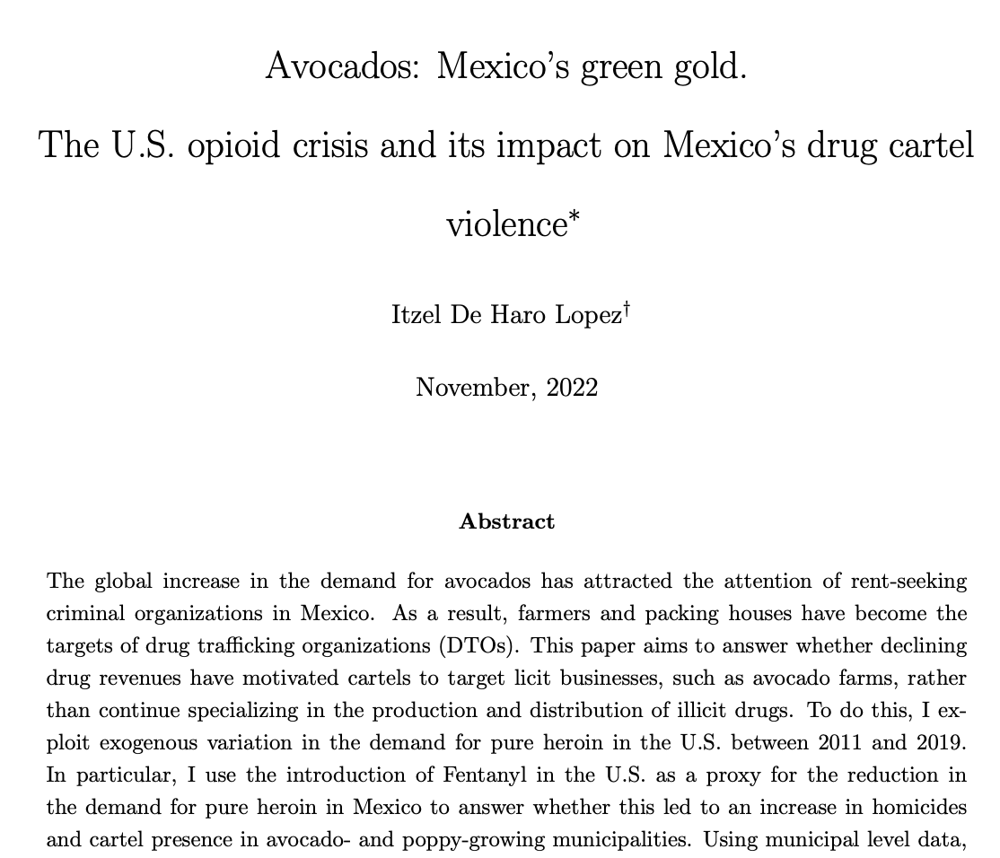
```

---

.center[
### Boycotting doesn't seem to solve it
]

```{r out.width="80%", fig.align='center',, echo=F, message=F, warning=F}
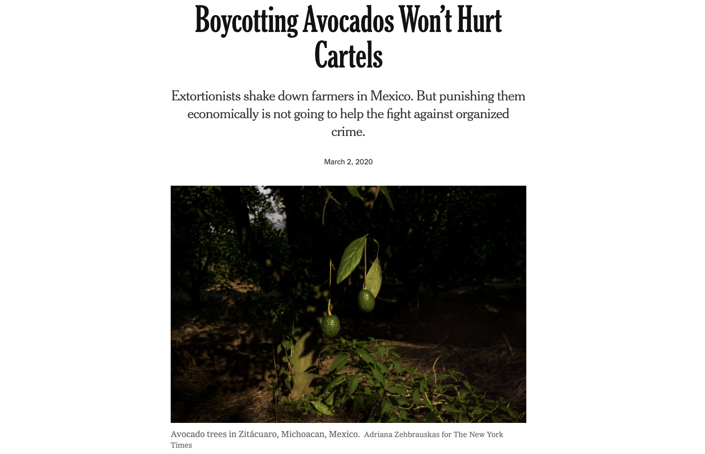
```

---

.pull-left[

### The Context for This Unit

- Firms with **market power** can set their own price.
- Market outcomes are generally **not Pareto-efficient**.
- In reality, many firms are price-takers:
  1. How does their behaviour differ from price-setting firms?
  2. Can competition improve market outcomes?

]

--

.pull-right[
### This Unit

- Model of interactions between price-taking firms and customers
- **Perfect competition** = special case of the model
- Similarities and differences between price-taking and price-setting firms

]

--

```{r out.width="45%", fig.align='center', fig.pos='center'}
knitr::include_graphics("imgs/f7-15e.png")
```

---

.center2[
# Competitive equilibrium: Key Concepts
]

---

.center[
### Example: Second-hand Econ 101 textbooks
]

```{r out.width="40%", fig.align='center'}
knitr::include_graphics("https://m.media-amazon.com/images/I/81UPJjLHp8L.jpg")
```

---

.center[
### Econ 101 textbooks (parenthesis)
]

```{r out.width="80%", fig.align='center'}
knitr::include_graphics("https://cdn.vox-cdn.com/thumbor/ikZAG7js3wyxMZ6CSL2KbwkZcNY=/0x0:775x416/1720x0/filters:focal(0x0:775x416):format(webp):no_upscale()/cdn.vox-cdn.com/uploads/chorus_asset/file/16204569/Screenshot_2019_05_01_11.56.59.png")
```

---

.center[
### Econ 101 textbooks (parenthesis)
]

- [Core Econ](https://cepr.org/voxeu/columns/new-paradigm-introductory-course-economics)
- [Raj Chetty's intro course at Harvard](https://www.vox.com/the-highlight/2019/5/14/18520783/harvard-economics-chetty)

```{r out.width="40%", fig.align='center'}
knitr::include_graphics("https://cepr.org/sites/default/files/styles/flexible_wysiwyg/public/image/FromMay2014/COREtable1.png?itok=W_OYRPGq")
```


---

.center[
### Example: Second-hand Econ 101 textbooks
]

```{r out.width="40%", fig.align='center'}
knitr::include_graphics("https://m.media-amazon.com/images/I/81UPJjLHp8L.jpg")
```

---
.center[
## Demand curve
]

```{r out.width="70%", fig.align='center'}
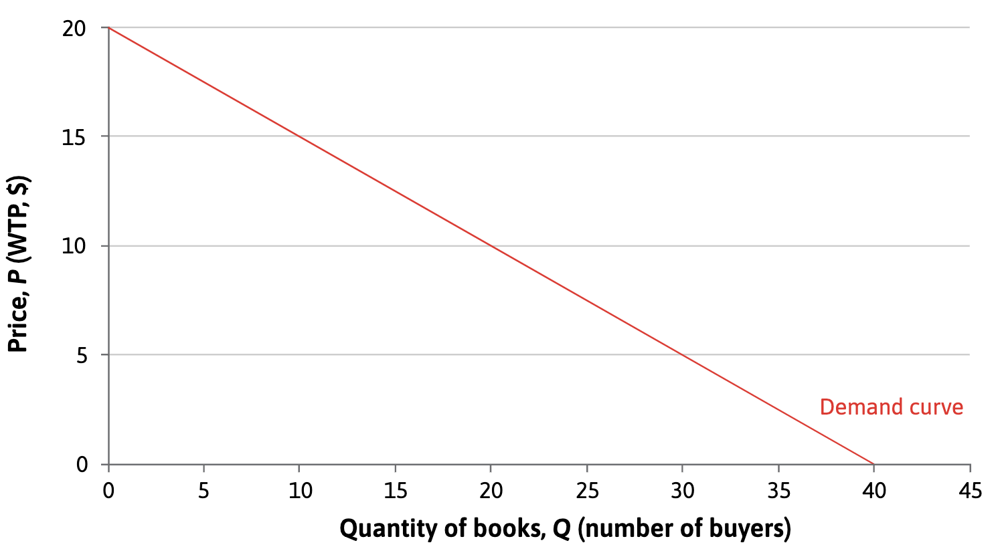
```

--

**Demand curve** = total quantity that all consumers together want to buy at any given price.

Represents the **willingness to pay (WTP)** of buyers.

---
.center[
## Supply curve
]

**Supply curve** = total quantity that all firms together would produce at any given price.

--

```{r out.width="70%", fig.align='center'}
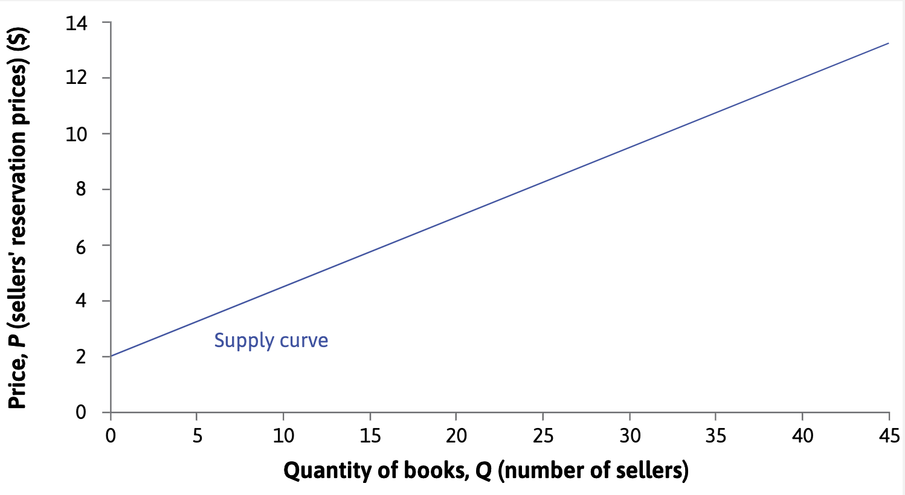
```

The first seller has a *reservation price* (lowest price at which someone is willing to sell a good) of 2, and will sell at any price above that.

---
.center[
## Supply curve
]

**Supply curve** = total quantity that all firms together would produce at any given price.

```{r out.width="70%", fig.align='center'}
knitr::include_graphics("imgs/f8-2b.png")
```

The 20th seller will accept 7

---
.center[
## Supply curve
]

**Supply curve** = total quantity that all firms together would produce at any given price.

```{r out.width="70%", fig.align='center'}
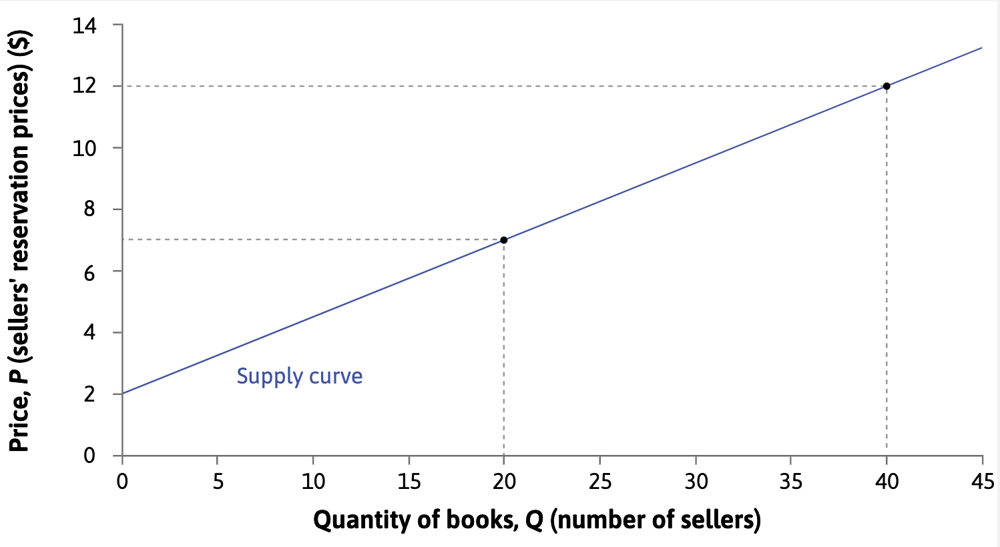
```

The 40th seller’s reservation price is 12

---
.center[
## Supply curve
]

**Supply curve** = total quantity that all firms together would produce at any given price.

```{r out.width="70%", fig.align='center'}
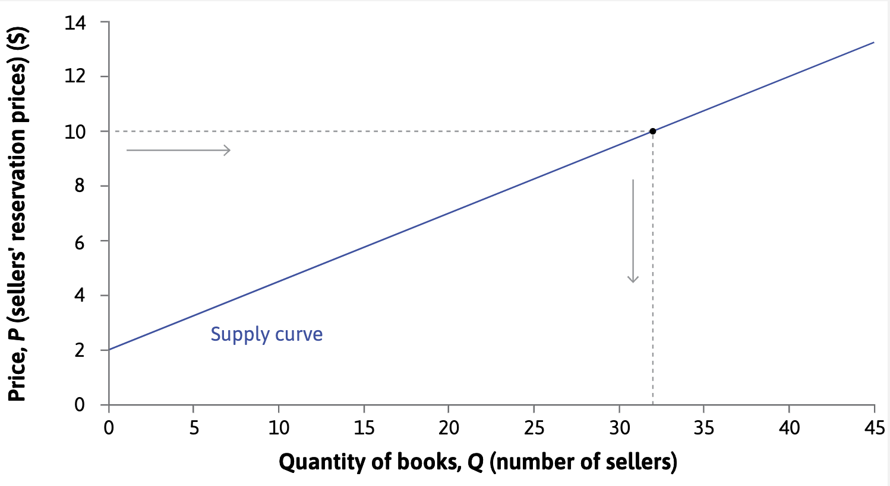
```

If you choose a particular price, the graph shows how many books would be supplied (Q) at that price.
The supply curve slopes upward: the higher the price, the more students will be **willing to sell**.

---
.center[
## Equilibrium price
]

At the **equilibrium (market-clearing) price**, supply equals demand.

```{r out.width="70%", fig.align='center'}
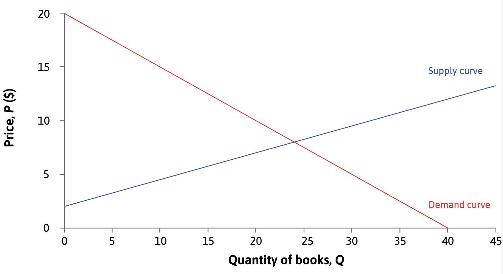
```

---
.center[
## Equilibrium price
]

At the **equilibrium (market-clearing) price**, supply equals demand.

```{r out.width="70%", fig.align='center'}
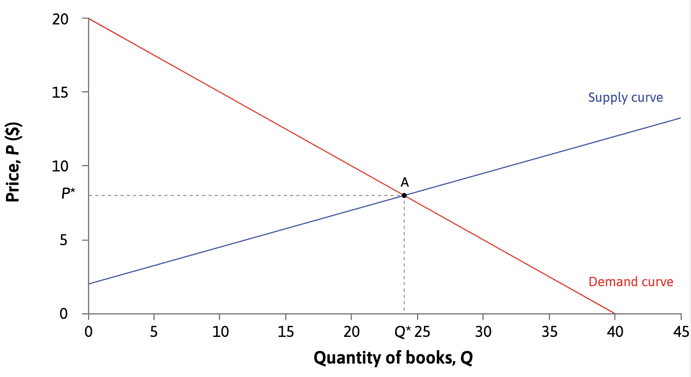
```

At a price P* = 8, the quantity supplied is equal to the quantity demanded: Q* = 24. The market is in equilibrium. We say that the market clears at a price of 8.

---
.center[
## Equilibrium price
]

At the **equilibrium (market-clearing) price**, supply equals demand.

```{r out.width="70%", fig.align='center'}
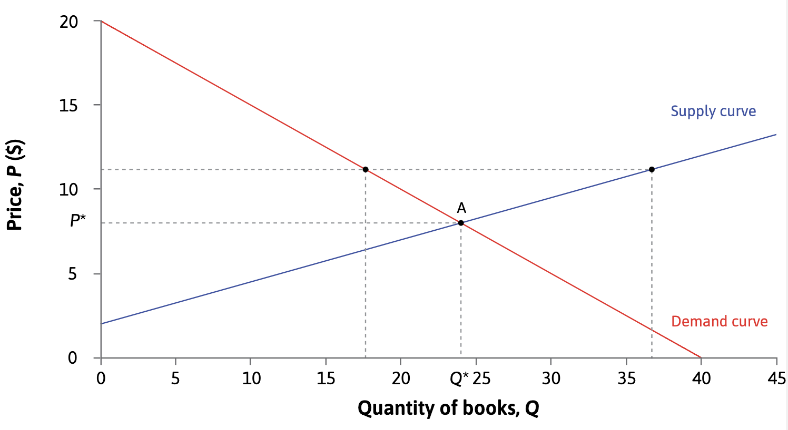
```

At a price greater than 8 more students would wish to sell, but not all of them would find buyers. There would be excess supply, so these sellers would want to lower their price.

---
.center[
## Equilibrium price
]

At the **equilibrium (market-clearing) price**, supply equals demand.

```{r out.width="70%", fig.align='center'}
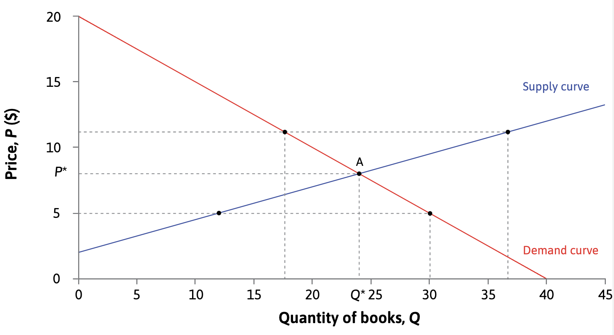
```

At a price less than 8, there would be more buyers than sellers—excess demand—so sellers could raise their prices. Only at 8 is there no tendency for change.

---
.center[
## Equilibrium price
]

At the **equilibrium (market-clearing) price**, supply equals demand.

```{r out.width="70%", fig.align='center'}

```

Any other price is **not a Nash equilibrium**.


---
.center[
## Equilibrium price
]

At the **equilibrium (market-clearing) price**, supply equals demand.

```{r out.width="70%", fig.align='center'}

```

Assumes the products are identical, so buyers would be willing to buy from any seller.

---

.center[
### Example: Small *boulangeries*
]

```{r out.width="70%", fig.align='center'}
knitr::include_graphics("https://vivreparis.fr/wp-content/uploads/2018/12/Capture-de%CC%81cran-2018-12-14-a%CC%80-11.22.34.png")
```

---

.center[
### Example: Small *boulangeries*
]

```{r out.width="85%", fig.align='center'}
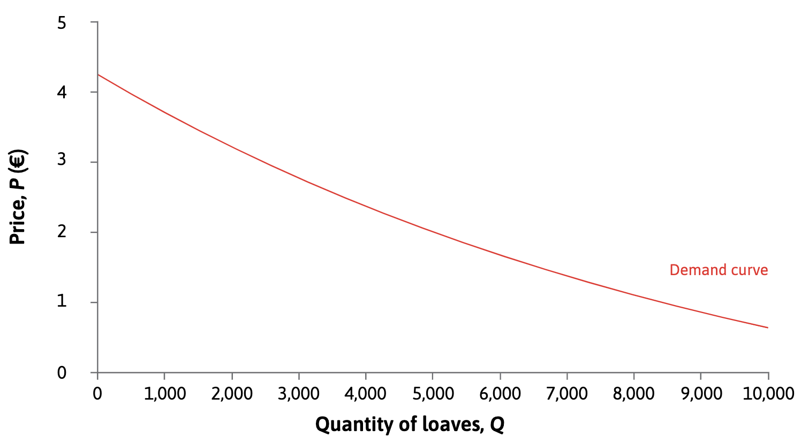
```

---
.center[
## Price-taking firms
]

**Price-taking firms** cannot benefit from choosing a different price from the market price, and cannot influence the market price.

--

```{r out.width="50%", fig.align='center'}
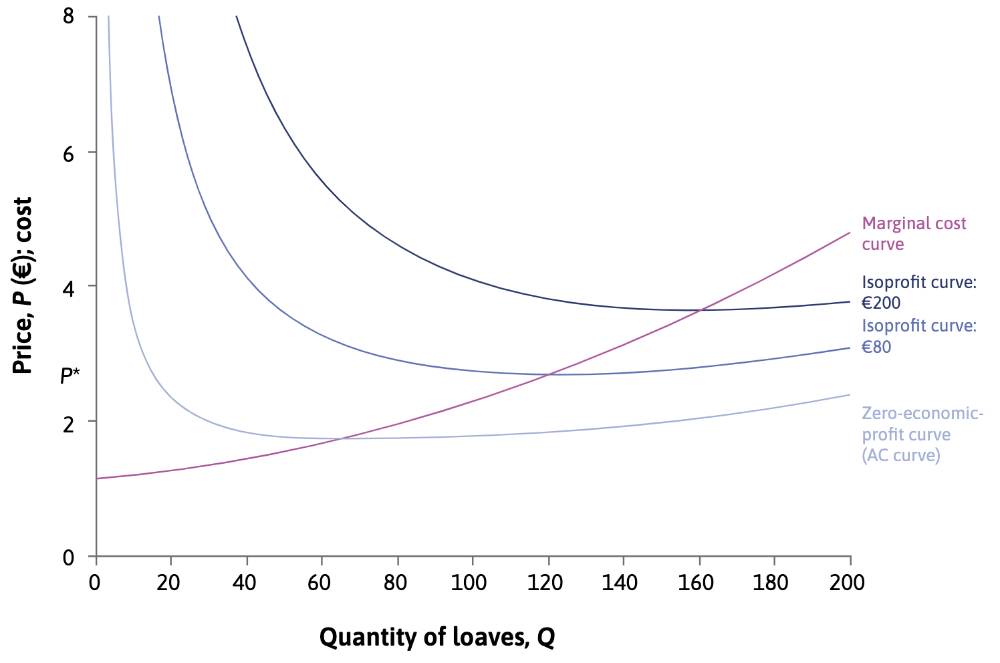
```

The bakery has an increasing MC curve. On the AC curve, profit is zero. When MC > AC, the AC curve slopes upward. The other isoprofit curves represent higher levels of profit, and MC passes through the lowest points of all the isoprofit curves.

---
.center[
## Price-taking firms
]

**Price-taking firms** cannot benefit from choosing a different price from the market price, and cannot influence the market price.

```{r out.width="50%", fig.align='center'}
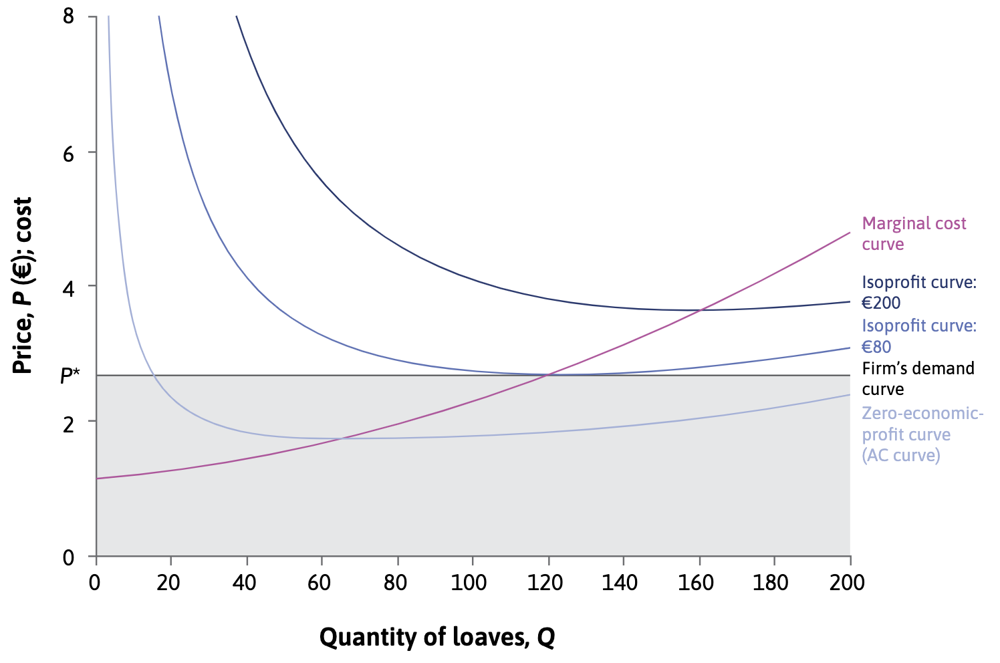
```

The bakery is a price-taker. The market price is $P^*$ = 2.35. If you choose a higher price, customers will go to other bakeries. Your feasible set of prices and quantities is the area below the horizontal line at $P^*$.

---
.center[
## Price-taking firms
]

**Price-taking firms** cannot benefit from choosing a different price from the market price, and cannot influence the market price.

```{r out.width="50%", fig.align='center'}
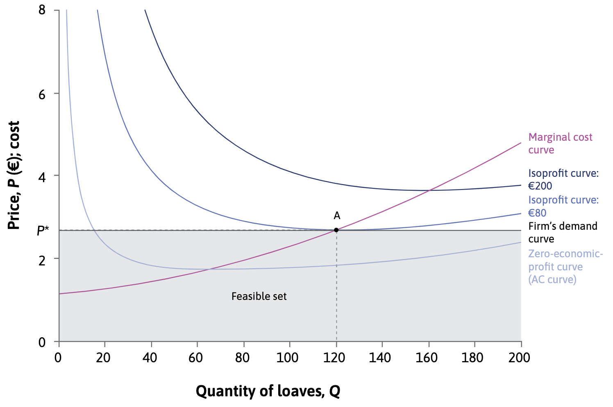
```

The point of highest profit in the feasible set is point A, where the 80 isoprofit curve is tangent to the feasible set. You should make 120 loaves per day, and sell them at the market price, 2.35 each. 

---
.center[
## Price-taking firms
]

**Price-taking firms** cannot benefit from choosing a different price from the market price, and cannot influence the market price.

```{r out.width="50%", fig.align='center'}

```

Your profit-maximizing quantity, $Q^*$ = 120, is found at the point where $P^*$ = MC: the marginal cost of the 120th loaf is equal to the market price.

$$MC=P \iff (\textit{slope of isoprofit} = 0)$$
---
.center[
### Firm’s supply curve
]

```{r out.width="65%", fig.align='center'}
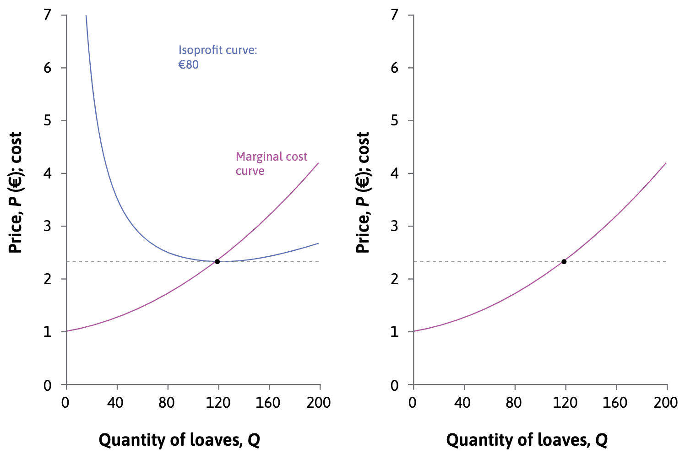
```

When the market price is 2.35, you supply 120 loaves. **Note**: Firm chooses quantity, not price.

What would you do if the price changed? 

---
.center[
### Firm’s supply curve
]

```{r out.width="65%", fig.align='center'}
knitr::include_graphics("imgs/f8-6b.png")
```

If $P^*$ were to rise to 3.20, you could reach a higher isoprofit curve. To maximize profit you should produce 163 loaves per day.

---
.center[
### Firm’s supply curve
]

```{r out.width="65%", fig.align='center'}
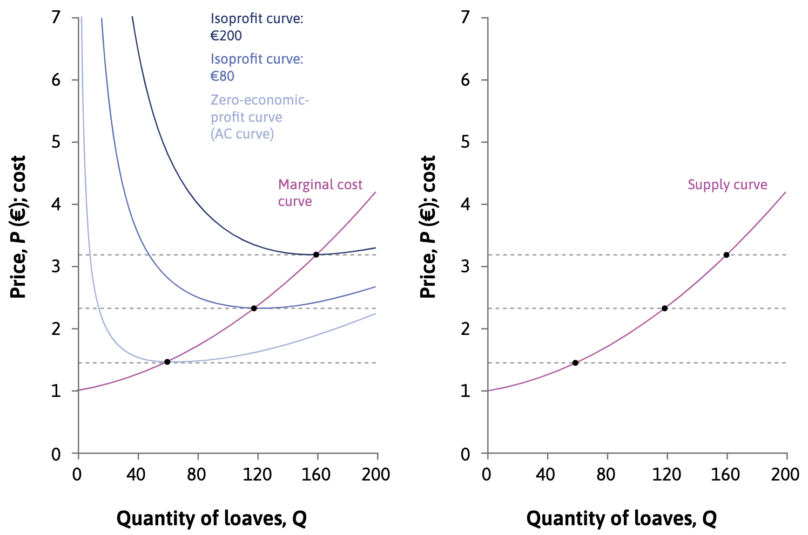
```

If the price falls to 1.52 you could reach only the lightest blue curve. Your best choice would be 66 loaves, and your economic profit would be zero. 

---
.center[
### Firm’s supply curve
]

```{r out.width="65%", fig.align='center'}

```

In each case, you choose the point on your marginal cost curve where **MC = market price**. Your **marginal cost curve** is your **supply curve**.

---
.center[
### Market supply curve
]

```{r out.width="65%", fig.align='center'}
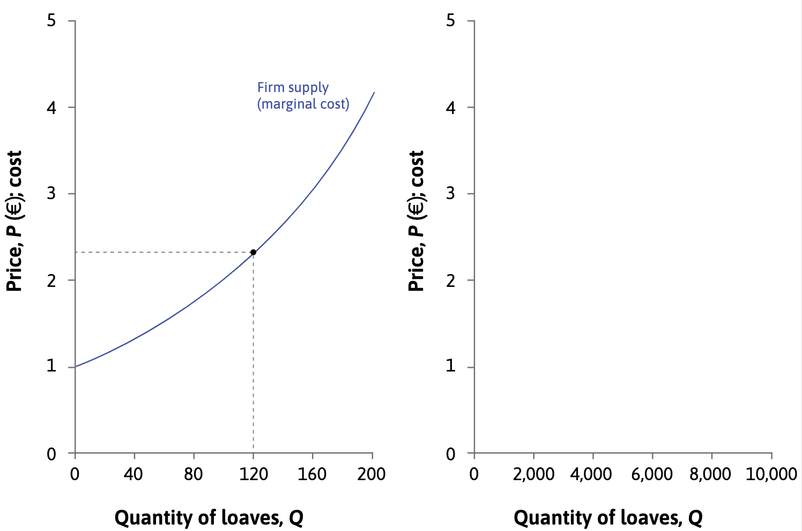
```

There are 50 bakeries, all with the same cost functions. If the market price is €2.35, each bakery will produce 120 loaves.

---
.center[
### Market supply curve
]

```{r out.width="65%", fig.align='center'}

```

When P = 2.35, each bakery supplies 120 loaves, and the market supply is 50 × 120 = 6,000 loaves.

---
.center[
### Market supply curve
]

```{r out.width="65%", fig.align='center'}
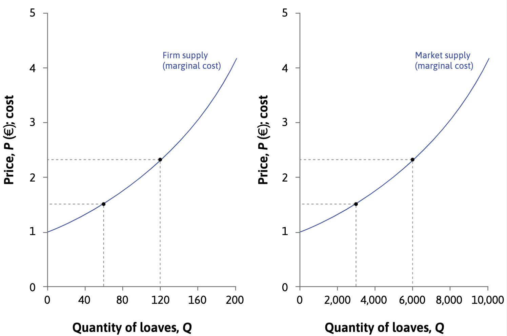
```

At a price of 1.52 they each supply 66 loaves, and market supply is 3,300. The market supply curve looks like the firm’s supply curve, but the scale on the horizontal axis is different.

---
.center[
### Market supply curve
]

```{r out.width="65%", fig.align='center'}

```

If the bakeries had different cost functions, then at a price of 2.35 some bakeries would produce more loaves than others, but we could still add them together to find market supply.

---
.center2[
# Competitive Equilibrium
]

---
.center[
## Competitive Equilibrium
]

```{r out.width="65%", fig.align='center'}
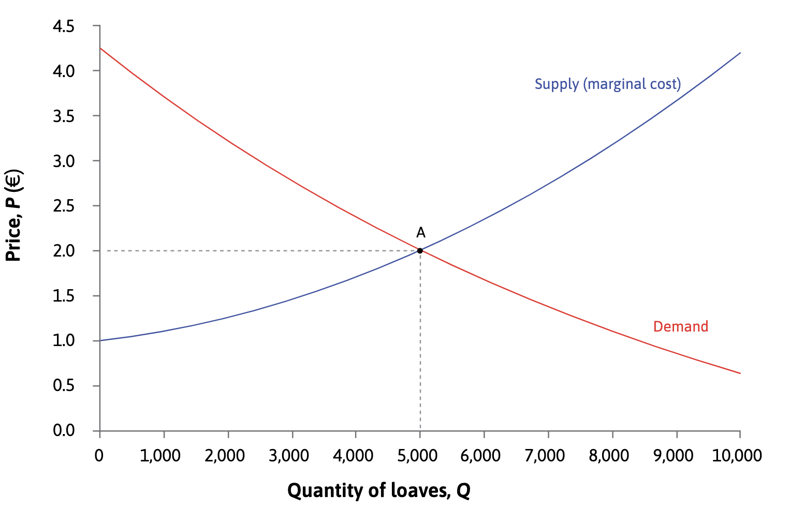
```

.center[
If all buyers and sellers are price-takers $\Rightarrow$ At the prevailing market price, supply = demand
]

---
.center[
### Competitive Equilibrium: Characteristics
]

- Participants are **price-takers**
- **Contracts are complete**
- Transaction only affects buyers and sellers (**no external effects**)

--

.center[
Equilibrium allocation is **Pareto efficient**
]

--

```{r out.width="50%", fig.align='center'}
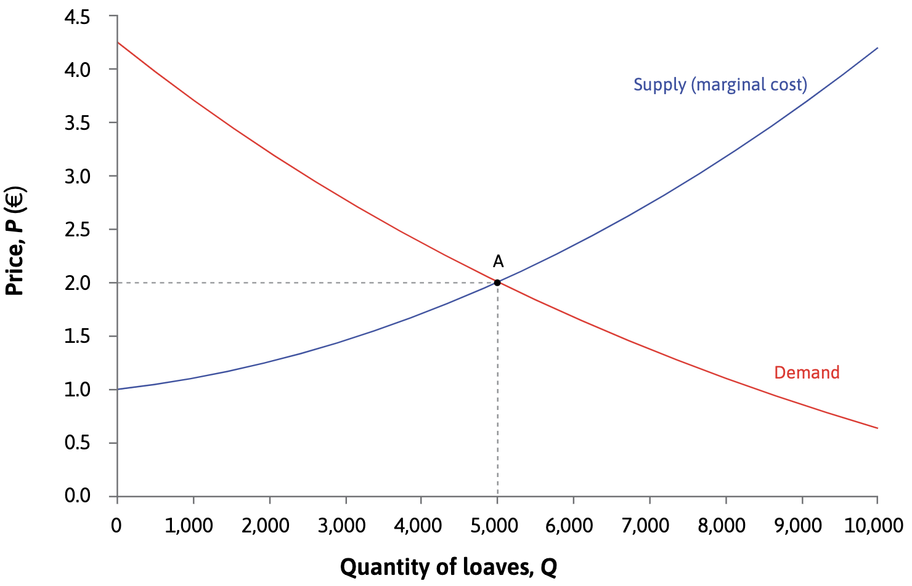
```

At the equilibrium price of €2 in the bread market, a consumer who is willing to pay €3.50 obtains a surplus of €1.50.

---
.center[
### Competitive Equilibrium: Characteristics
]

- Participants are **price-takers**
- **Contracts are complete**
- Transaction only affects buyers and sellers (**no external effects**)

.center[
Equilibrium allocation is **Pareto efficient**
]

```{r out.width="50%", fig.align='center'}
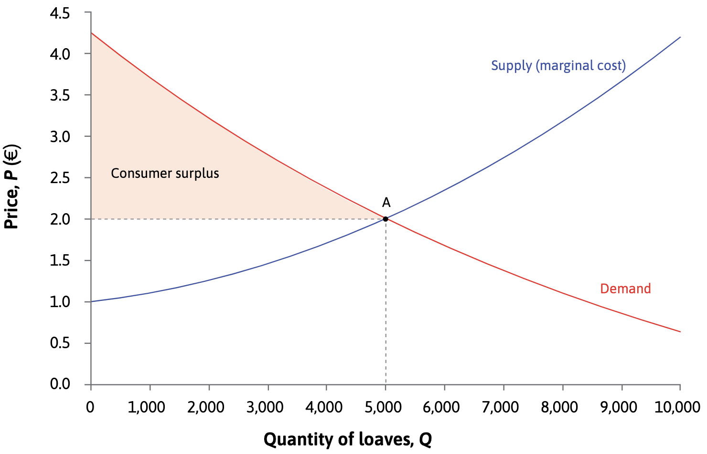
```

The shaded area above 2 shows total **consumer surplus** —the sum of all the buyers’ gains from trade.

---
.center[
### Competitive Equilibrium: Characteristics
]

- Participants are **price-takers**
- **Contracts are complete**
- Transaction only affects buyers and sellers (**no external effects**)

.center[
Equilibrium allocation is **Pareto efficient**
]

```{r out.width="50%", fig.align='center'}
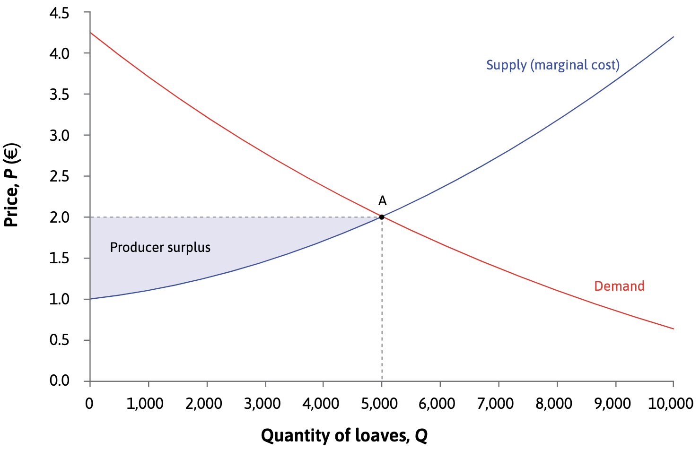
```

The **producer’s surplus** on a unit of output is the difference between the price at which it is sold, and the MC of producing it. The MC of the 2,000th loaf is 1.25; since it is sold for 2, the producer obtains a surplus of 0.75.

---
.center[
### Competitive Equilibrium: Characteristics
]

- Participants are **price-takers**
- **Contracts are complete**
- Transaction only affects buyers and sellers (**no external effects**)

.center[
Equilibrium allocation is **Pareto efficient**
]

```{r out.width="50%", fig.align='center'}
knitr::include_graphics("imgs/f8-9d.png")
```

The shaded area below 2 is the sum of the bakeries’ surpluses on every loaf that they produce. The whole shaded area shows the sum of all gains from trade in this market, known as the **total surplus**.

---
.center[
### Competitive Equilibrium: Characteristics
]

- Participants are **price-takers**
- **Contracts are complete**
- Transaction only affects buyers and sellers (**no external effects**)

.center[
Equilibrium allocation is **Pareto efficient**
]

```{r out.width="50%", fig.align='center'}
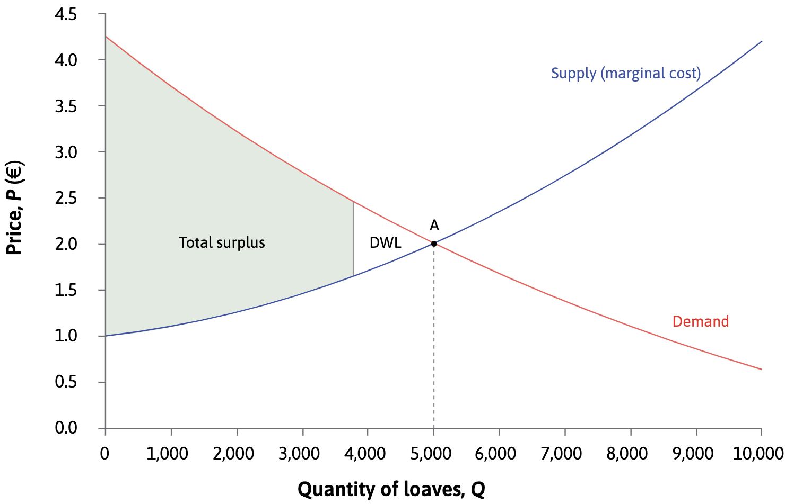
```

Total surplus would be smaller if fewer than 5,000 loaves were produced.

---

.center2[
# Factors that affect the equilibrium
]

---

Sustained increase in Quinoa **prices**

```{r, out.width="80%"}
knitr::include_graphics("imgs/f8-10b.png")
```

---

Sustained increase in Quinoa **imports**

```{r, out.width="80%"}
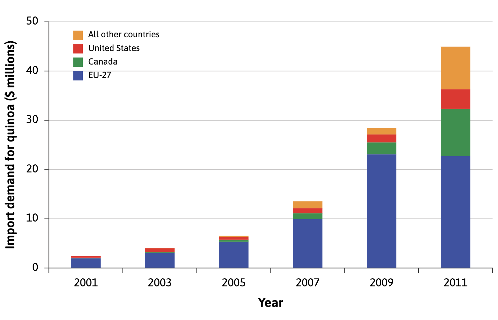
```

---
.center[
### Changes in demand
]

The entire demand curve can shift due to **exogenous shocks** e.g. popularity

```{r, out.width="65%"}
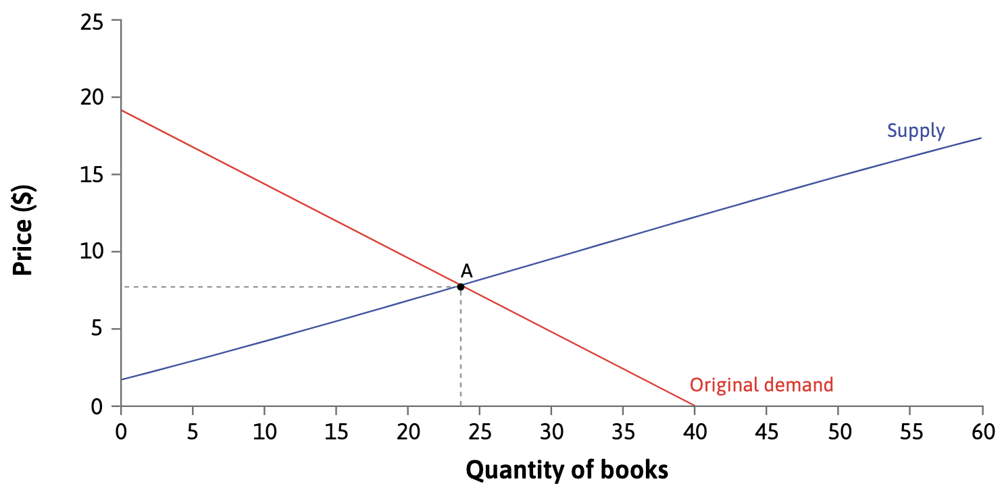
```

Back to Books:

At the original levels of demand and supply, the equilibrium is at point A. The price is 8, and 24 books are sold.

---
.center[
### Changes in demand
]

The entire demand curve can shift due to **exogenous shocks** e.g. popularity

```{r, out.width="65%"}
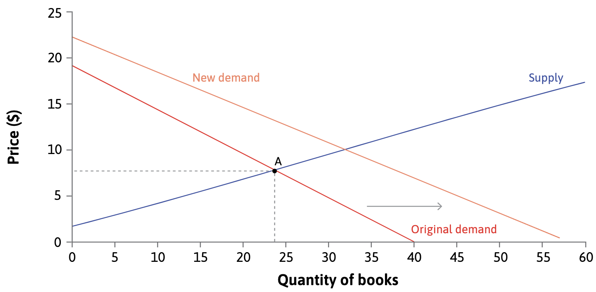
```

Back to Books:

If there were more students enrolling in one year, there would be more students wanting to buy the book at each possible price. The demand curve shifts to the right.

---
.center[
### Changes in demand
]

The entire demand curve can shift due to **exogenous shocks** e.g. popularity

```{r, out.width="65%"}
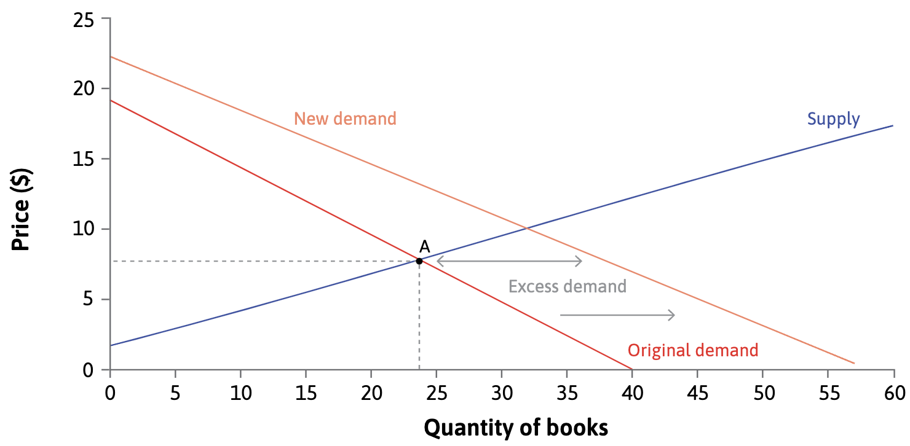
```

Back to Books:

If the price remained at 8, there would be excess demand for books, that is, more buyers than sellers.


---
.center[
### Changes in demand
]

The entire demand curve can shift due to **exogenous shocks** e.g. popularity

```{r, out.width="65%"}
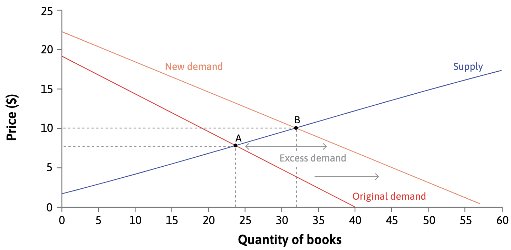
```

Back to Books:

There is a new equilibrium at point B with a price of 10, at which 32 books are sold. The increase in demand has led to a rise in the equilibrium quantity and price.

---
.center[
### Changes in supply
]

The entire supply curve can shift due to **exogenous shocks** e.g. technological change

```{r, out.width="50%"}
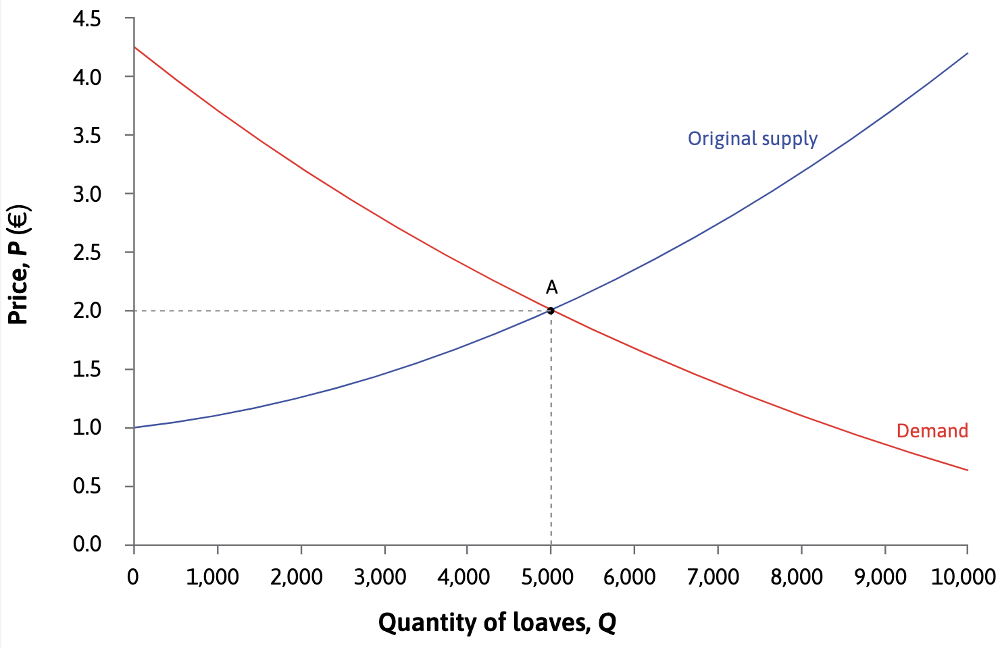
```

Back to *boulangeries*:

The city’s bakeries start out at point A, producing 5,000 loaves and selling them for 2 each.

---
.center[
### Changes in supply
]

The entire supply curve can shift due to **exogenous shocks** e.g. technological change

```{r, out.width="50%"}
knitr::include_graphics("imgs/f8-12b.png")
```

Back to *boulangeries*:

The market supply curve then shifts because of the fall in the bakeries’ marginal costs. The supply curve shifts down, because at each level of output, the marginal cost and therefore the price at which they are willing to supply bread is lower.

---
.center[
### Changes in supply
]

The entire supply curve can shift due to **exogenous shocks** e.g. technological change

```{r, out.width="50%"}
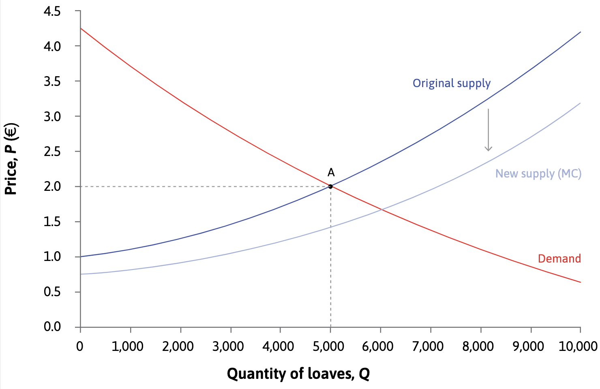
```

Back to *boulangeries*:

The supply curve has shifted down. But another way to think of this change in supply is to say that the supply curve has shifted to the right. Since costs have fallen, the amount that bakeries will supply at each price is greater—an increase in supply.

---
.center[
### Changes in supply
]

The entire supply curve can shift due to **exogenous shocks** e.g. technological change

```{r, out.width="50%"}
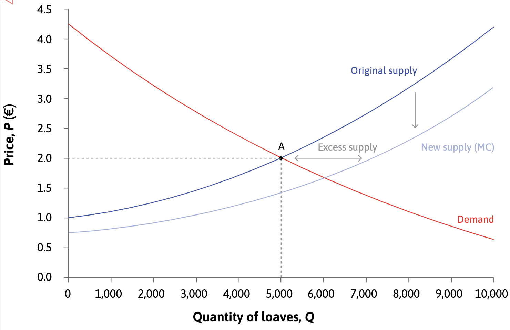
```

Back to *boulangeries*:

The effect of the fall in marginal cost is an increase in market supply. At the original price, there is more bread than buyers want (excess supply). The bakeries would want to lower their prices.

---
.center[
### Changes in supply
]

The entire supply curve can shift due to **exogenous shocks** e.g. technological change

```{r, out.width="50%"}
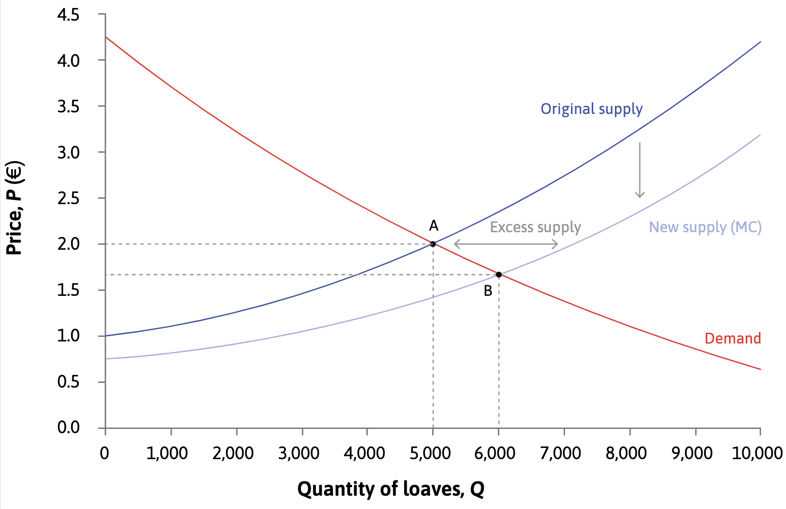
```

Back to *boulangeries*:

The new market equilibrium is at point B, where more bread is sold and the price is lower. The demand curve has not shifted, but the fall in price has led to an increase in the quantity of bread demanded, along the demand curve.

---
.center[
### Changes in supply
]

The supply curve can also shift due to **market entry/exit**.

```{r, out.width="50%"}

```

If existing firms are earning **economic rents** and **costs of entry** are not too high, other firms may enter the market.

---
.center2[
## Taxes
]

---
.center[
## Taxes
]

Governments can use taxation to raise revenue (to finance government spending, or redistribute resources) or to affect the allocation of goods and services in other ways.

```{r, out.width="100%"}
knitr::include_graphics("https://upload.wikimedia.org/wikipedia/commons/thumb/4/41/Barri%C3%A8re_d%27Enfer%2C_place_Denfert-Rochereau%2C_Paris_05.jpg/2880px-Barri%C3%A8re_d%27Enfer%2C_place_Denfert-Rochereau%2C_Paris_05.jpg")
```

.center[
*Barrière d’Enfer* in Paris
]

---
.center[
## Taxes
]

Governments can use taxation to raise revenue (to finance government spending, or redistribute resources) or to affect the allocation of goods and services in other ways.

```{r, out.width="45%"}
knitr::include_graphics("https://upload.wikimedia.org/wikipedia/commons/7/7f/Paris_PC_1859_jms.jpg")
```

.center[
*Mur des Fermiers généraux*
]

---
.center[
## Taxes
]

```{r, out.width="70%"}
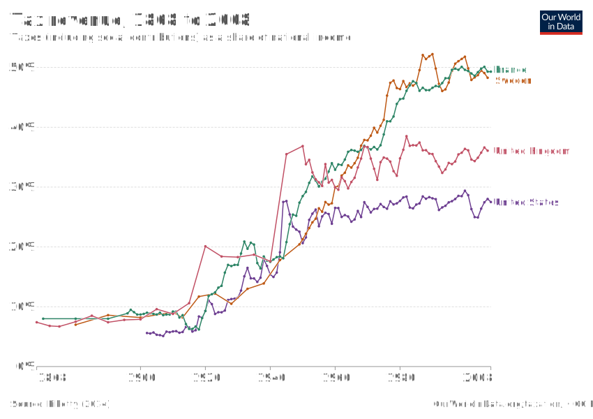
```

---
.center[
## Taxes
]

```{r, out.width="70%"}
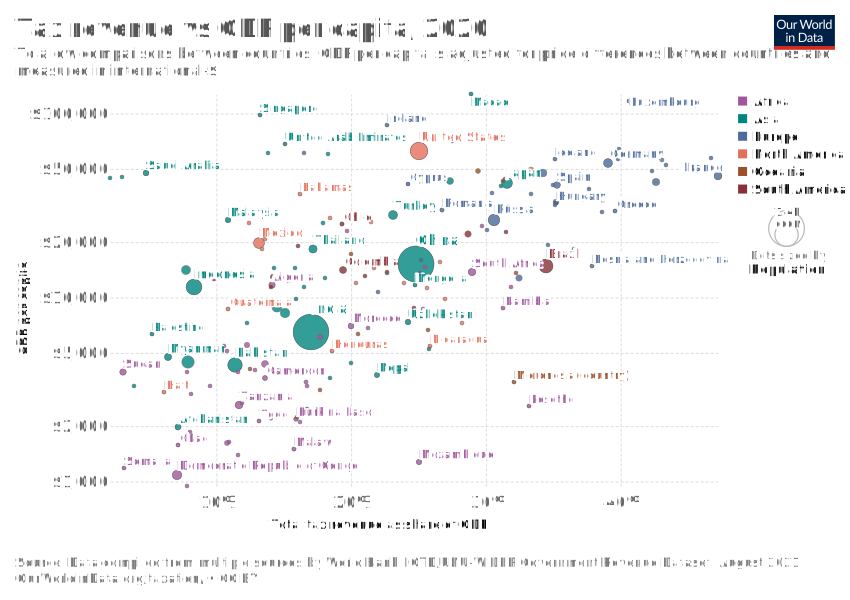
```


---
.center[
## Taxes
]

Example: Tax on salt.
```{r, out.width="50%"}
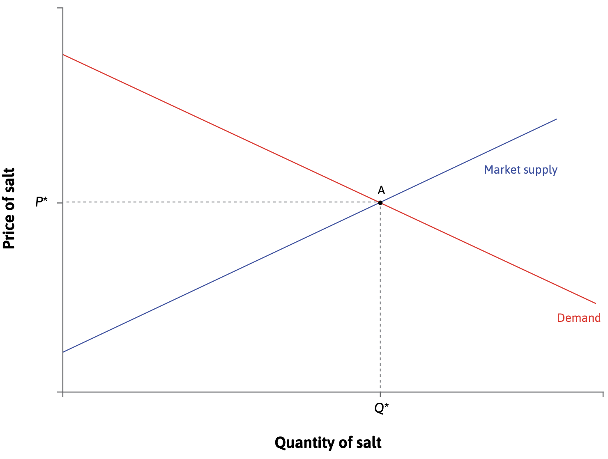
```

Initially the market equilibrium is at point A. The price is $P^*$ and the quantity of salt sold is $Q^*$.

---
.center[
## Taxes
]

Example: Tax on salt.
```{r, out.width="50%"}
knitr::include_graphics("imgs/f8-14b.png")
```

A 30% tax is imposed on suppliers. Their marginal costs are effectively 30% higher at each quantity. The supply curve shifts.

---
.center[
## Taxes
]

Example: Tax on salt.
```{r, out.width="50%"}
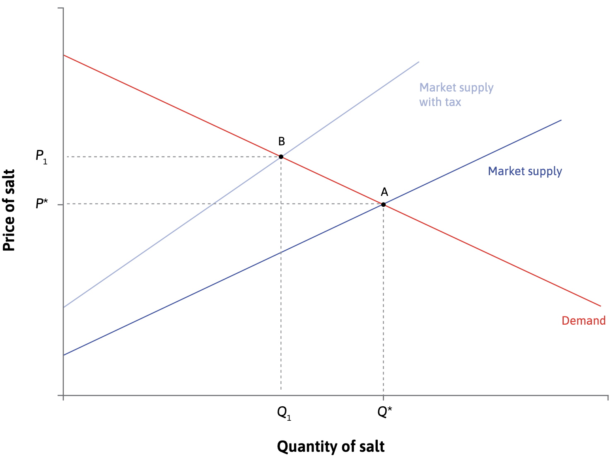
```

The new equilibrium is at B. The price paid by consumers has risen to $P_1$ and the quantity has fallen to $Q_1$.

---
.center[
## Taxes
]

Example: Tax on salt.
```{r, out.width="50%"}

```

The price received by suppliers (after they have paid the tax) is $P_0$. The double-headed arrow shows the tax paid to the government on each unit of salt sold.

---
.center[
## Taxes
]

Example: Tax on salt.
```{r, out.width="50%"}

```

Taxes on suppliers/consumers shift the supply/demand curve because the price is higher at each quantity.

---
.center[
## Taxes: Welfare effects
]

Example: Tax on salt.
```{r, out.width="50%"}
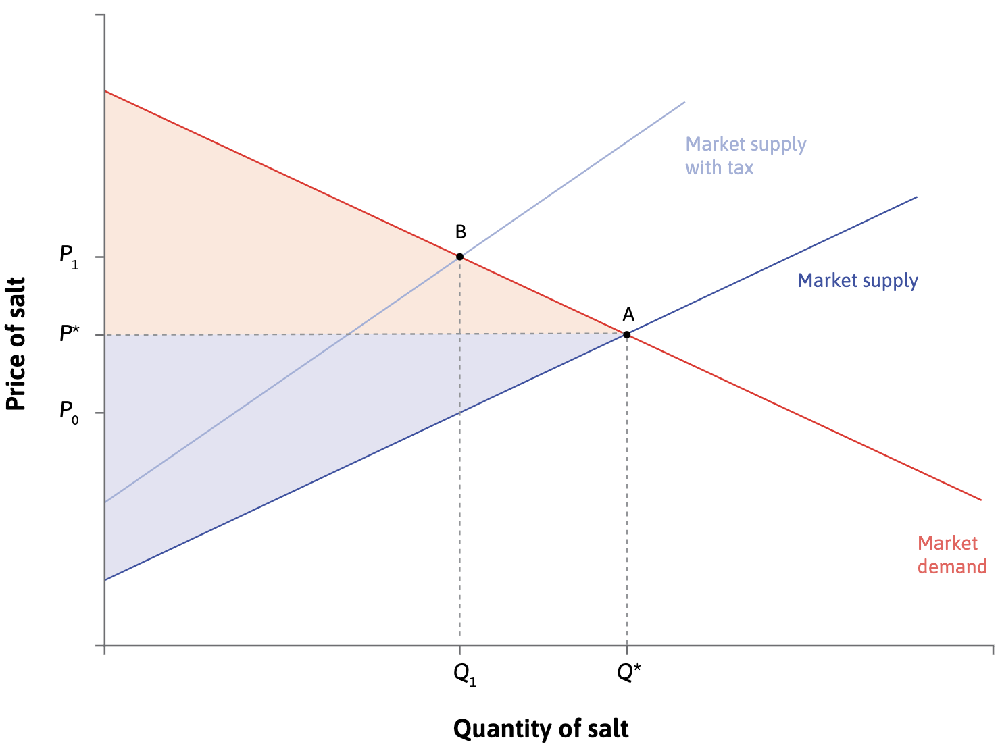
```

Before the tax is imposed, the equilibrium allocation at A maximizes the gains from trade. In the upper panel the red triangle is the consumer surplus and the blue triangle is the producer surplus.

---
.center[
## Taxes: Welfare effects
]

Example: Tax on salt.
```{r, out.width="50%"}
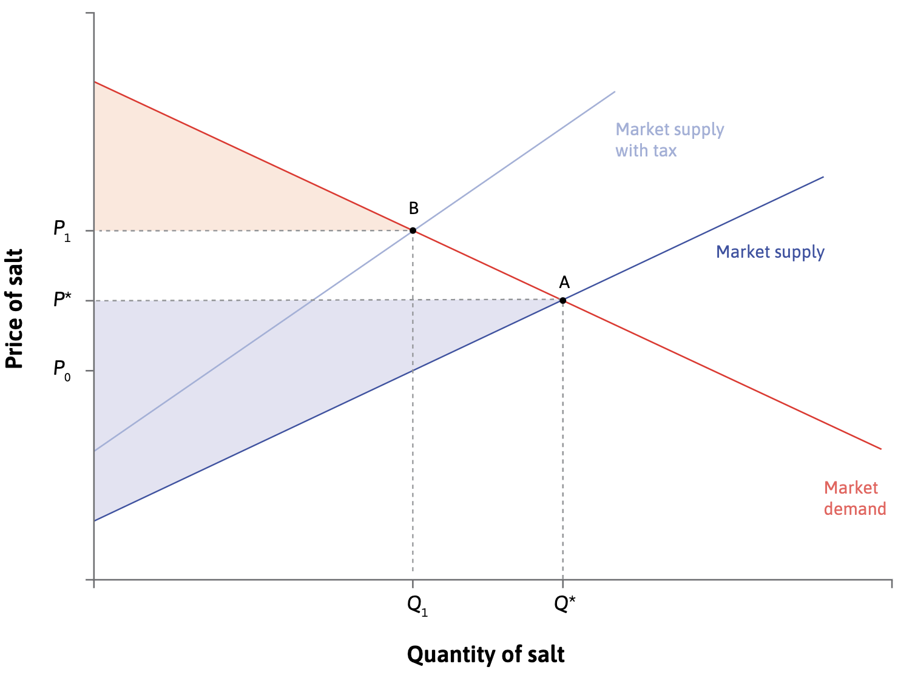
```

The tax reduces the quantity traded to $Q_1$, and raises the consumer price from $P^*$ to $P_1$. The consumer surplus falls.

---
.center[
## Taxes: Welfare effects
]

Example: Tax on salt.
```{r, out.width="50%"}
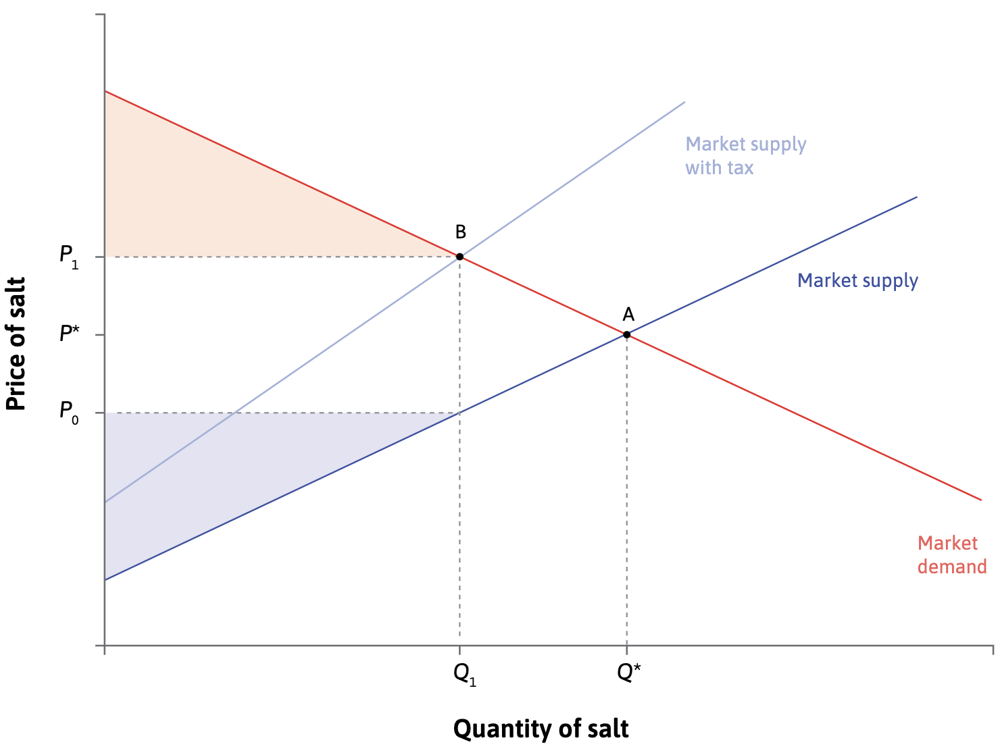
```

The suppliers sell a lower quantity, and the price they receive falls from $P^*$ to $P_0$. The producer surplus falls.

---
.center[
## Taxes: Welfare effects
]

Example: Tax on salt.
```{r, out.width="50%"}
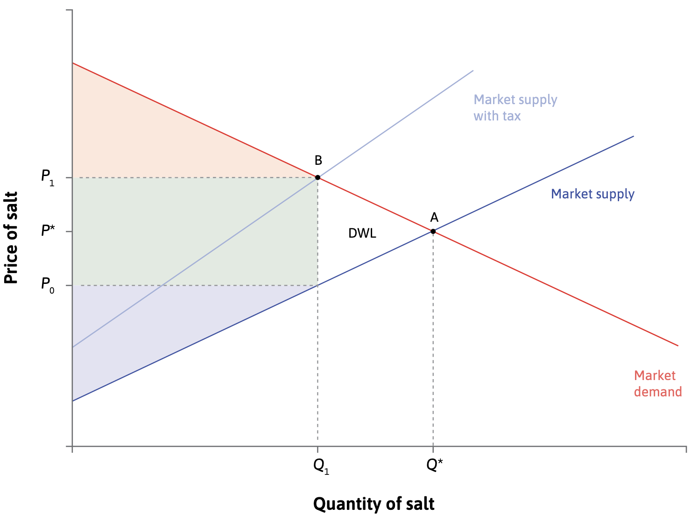
```

A tax equal to $(P_1 – P_0)$ is paid on each of the $Q_1$ units of salt that are sold. The green rectangular area is the total tax revenue. There is a deadweight loss equal to the area of the white triangle.

---
.center[
## Taxes: Welfare effects
]

.center[
Taxes lower surplus
]

.pull-left[

- **Tax incidence**, the effect of a tax on the welfare of buyers and sellers, depends on relative elasticity of consumers and producers. 
  - The less elastic group bears more of the tax burden. 
  - Taxing depending on the context

- Taxes can still raise welfare if governments use tax revenue to provide beneficial goods/services. 

]

.pull-right[
```{r, out.width="80%"}
knitr::include_graphics("https://qph.cf2.quoracdn.net/main-qimg-297ccc3580c7868a90d23511afe506b8")
```
]


---
.center[
### Example: Denmark’s butter tax 
]

In 2011, Denmark introduced a tax (per kg) on saturated fat, which was equivalent to 22% of the average butter price.

```{r, out.width="55%"}
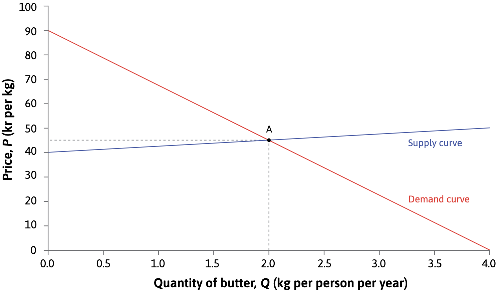
```

Initially the market for butter is in equilibrium. The price of butter is 45 kr per kg, and consumption of butter in Denmark is 2 kg per person per year.

---
.center[
### Example: Denmark’s butter tax 
]

In 2011, Denmark introduced a tax (per kg) on saturated fat, which was equivalent to 22% of the average butter price.

```{r, out.width="55%"}
knitr::include_graphics("imgs/f8-16b.png")
```

A tax of 10 kr per kg levied on suppliers raises their marginal costs by 10 kr at every quantity. The supply curve shifts upwards by 10 kr.


---
.center[
### Example: Denmark’s butter tax 
]

In 2011, Denmark introduced a tax (per kg) on saturated fat, which was equivalent to 22% of the average butter price.

```{r, out.width="55%"}
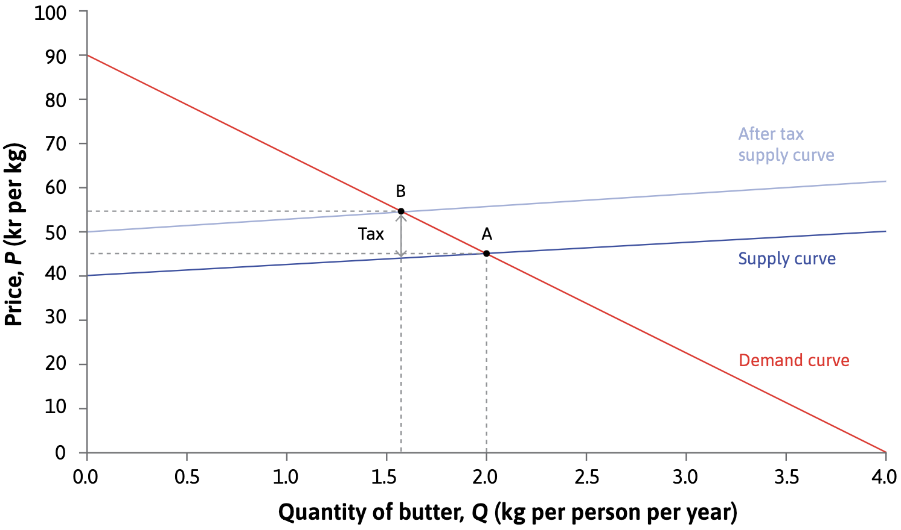
```

The new equilibrium is at point B. The price has risen to 54 kr. Each person’s annual consumption of butter has fallen to 1.6 kg: 20% of the initial consumption. In this respect, the policy was successful.

---
.center[
### Example: Denmark’s butter tax 
]

In 2011, Denmark introduced a tax (per kg) on saturated fat, which was equivalent to 22% of the average butter price.

```{r, out.width="55%"}
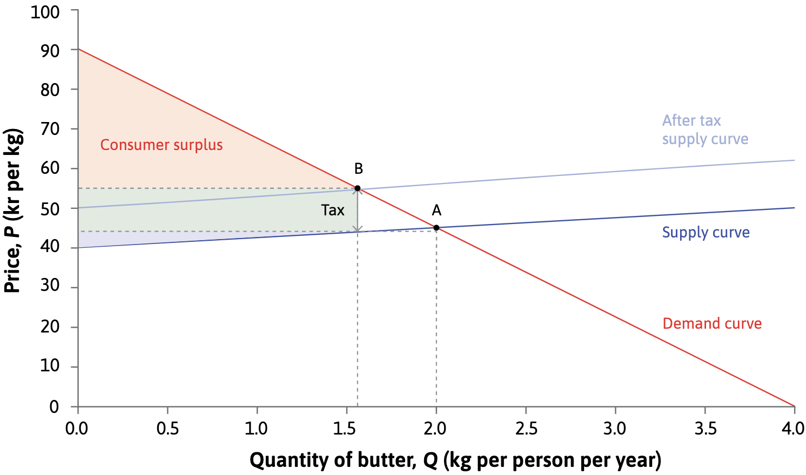
```

The government’s aim when it implemented the fat tax policy was not to raise revenue, but rather to reduce quantity. So the fall in consumer surplus was inevitable.

---
.center[
#### Example: Football markets
]

```{r, out.width="70%"}
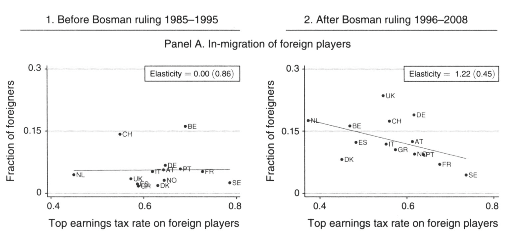
```

- Between 1985-1995 there was no correlation between migration and tax rates
- In the period 1996-2008, after the Bosman ruling on free mobility was enacted, the correlation became strongly negative
 - countries with higher top earnings tax rates became less likely to have foreign players
- The mobility of players had a negative impact on the performance of football clubs of countries with high tax rates
- *‘Superstars’* are very responsive to taxation, contrasts with the available evidence for typical individuals

---
.center[
### Taxes and politics
]

```{r, out.width="80%"}
knitr::include_graphics("https://static.lpnt.fr/images/2018/12/05/17706501lpw-17706503-article-gilets-jaunes-taxes-jpg_5784649_1250x625.jpg")
```

.center[
[*Gilet Jaune* and carbon taxes](https://open.spotify.com/episode/2o5ihePEXKxyfFtvr54JUn?si=8f4228a1c5104ab0)
]

---
.center2[
# Perfect competition
]

---
.center[
## Perfectly competitive markets 
]

.pull-left[

A hypothetical market in which:

1. The good or service being exchanged is homogeneous
2. Very large number of potential buyers and sellers
3. Buyers and sellers all act independently of one another
4. Price information easily available to buyers and sellers

]

--

.pull-right[

Some characteristics:

- **Law of One Price**: All transactions take place at a **single price**.
- At that price, **the market clears (supply = demand)**.
- Buyers and sellers are all **price-takers**.
- All potential **gains from trade** are realized.

]


--

.center[
### Is there perfect competition?

Perfect competition may not hold completely in reality, 
but can be a good approximation to actual firm behaviour.
]

--

See how you behaved in a perfectly competitive setting:

---

See how you behaved in a perfectly competitive setting:

```{r, echo=F, warning=F, out.width="90%"}
# Data
mrkt_pit <- 
  read_xlsx("market pit experiment.xlsx") %>% 
  janitor::clean_names()

# Aggregate the demand
demand <- 
mrkt_pit %>% 
  select(budget) %>% 
  group_by(budget) %>% 
  summarise(
    q = n()
  ) %>% 
  ungroup() %>% 
  rename(
    price = budget
  ) %>% 
  bind_rows(
    tibble(
      price = c(1,2,4),
      q = rep(0,3),
    )
  ) %>% 
  arrange(price)

# Aggregate the supply
supply <- 
  mrkt_pit %>% 
  select(cost) %>% 
  group_by(cost) %>% 
  summarise(
    q = n()
  ) %>% 
  ungroup() %>% 
  rename(
    price = cost
  ) %>% 
  bind_rows(
    tibble(
      price = c(9,10),
      q = rep(0,2),
    )
  ) %>% 
  arrange(price)

# Market equilibrium
mkt_eq <- 
  demand %>% 
  mutate(
    type = "WTP"
  ) %>% 
  bind_rows(
    supply %>% 
      mutate(
        type = "WTS"
      ) 
  ) %>% 
  mutate(
    prince = as.integer(price)
  )

# Plot of supply and demand
mkt_eq %>% 
  ggplot(aes(q, price, color = type)) +
  geom_point(size = 2.5) +
  labs(
    x = "Quantity",
    y = "Price (P)",
    color = ""
  ) +
  scale_y_continuous(breaks = seq(1,10)) +
  geom_smooth(method = "lm", formula = 'y ~ x', se = F, alpha = .5) +
  facet_wrap(~type)

```

---

See how you behaved in a perfectly competitive setting:

```{r, echo=F, warning=F, out.width="90%"}
# Plot of supply and demand
mkt_eq %>% 
  ggplot(aes(q, price, color = type)) +
  geom_point(size = 2.5) +
  labs(
    x = "Quantity (Q)",
    y = "Price (P)",
    color = ""
  ) +
  scale_y_continuous(breaks = seq(1,10)) +
  geom_smooth(method = "lm", formula = 'y ~ x', se = F, alpha = .5) 

```

Which would be the price in competitive equilibrium?

---

See how you behaved in a perfectly competitive setting:

```{r, echo=F, warning=F, out.width="80%", message=F}
# Plot of supply and demand
mrkt_pit %>% 
  ggplot(aes(price)) +
  geom_histogram() +
  labs(
    x = "Price (P)",
    y = "Number of transactions (Q)",
  )
```

Around 7 transactions are near the predicted price in competitive equilibrium.

--

Congrats **Yann**, you got 0.25 extra points in the final grade!

---
.center[
## Perfectly competitive markets: Caveats
]

.pull-left[

- Allocation may not be Pareto efficient **if assumptions do not hold**: We might not have taken everything into account

- **Fairness**: The distribution of total surplus depends on the **elasticities of demand and supply** (share of total surplus inversely related to elasticity)

- Hard to find price-takers in real life
  - Even when consumers can easily check the price of products (online shopping sites), prices of the same product differ
  
  - [Fulton Fish Market](https://www.youtube.com/watch?v=5hJF8zNJg5I)

]

--

.pull-right[

### Beware of *Market fundamentalist* ! (Basu, 2010)

```{r, out.width="70%"}
knitr::include_graphics("imgs/economix.png")
```

]

---

.center[
## Price-setters vs. Price-takers
]

.center[
Two different models of how firms behave:
]

| Price-setter (Monopoly) | Price-takers (Perfect competition) |
| ----------- | ----------- |
| None or few substitutes      | Almost homogeneous good |
| $MC < P$   |  $MC = P$  |
| Deadweight losses (Pareto inefficient) | No deadweight losses (can be Pareto efficient) |
| Owners receive economic rents in both long- and short-run | No economic rents in the long-run |
| Firms advertise their unique product | Little advertising expenditure |
| Firms invest in R&D, seek to prevent copying | Little incentive for innovation |

---
.center[
## Summary
]

1) Model of price-taking firms

- **Competitive equilibrium** where demand = supply
- Firms maximize profits where **MC = Price**
- **Perfect competition** is a special case
- Comparison with price-setting firms

2) Used model to show how equilibrium can change

- **Exogenous shocks** to demand/supply or market entry
- Effect of **taxation** on surplus

--

.center[
### Next class
]

- Read both articles:
  - [Core Econ](https://cepr.org/voxeu/columns/new-paradigm-introductory-course-economics)
  - [Raj Chetty's intro course at Harvard](https://www.vox.com/the-highlight/2019/5/14/18520783/harvard-economics-chetty)

